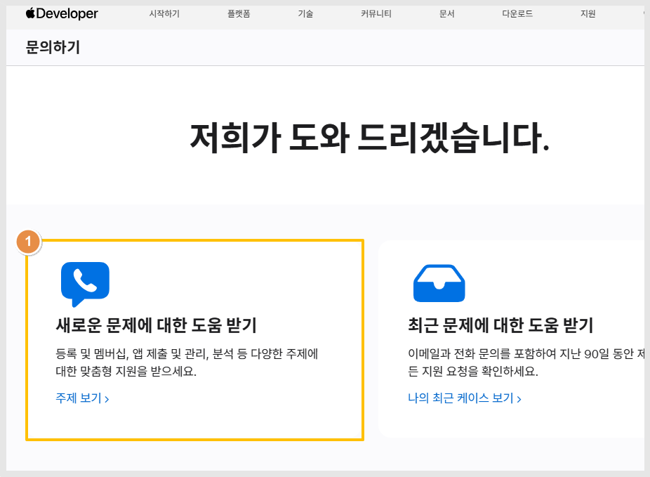
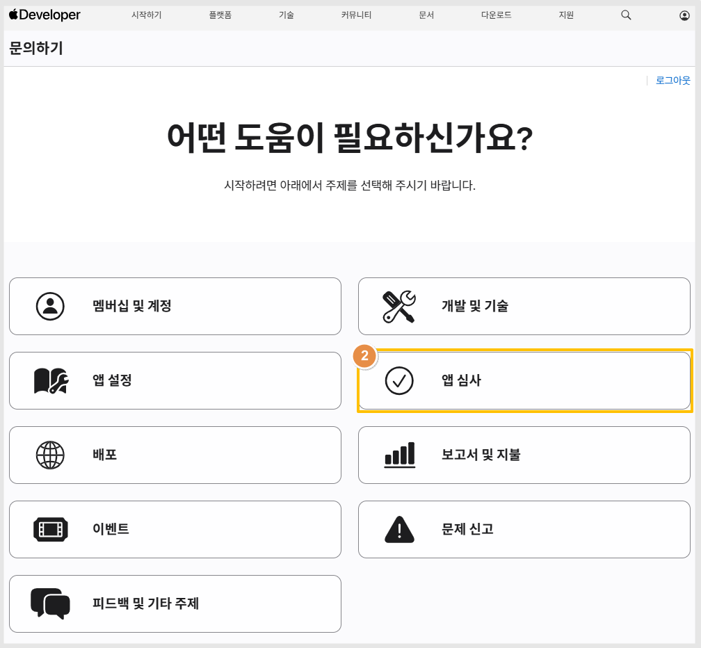
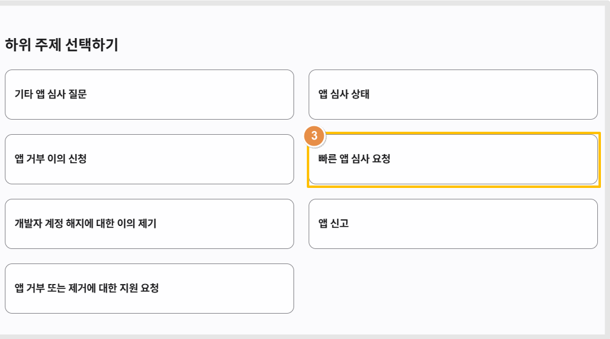
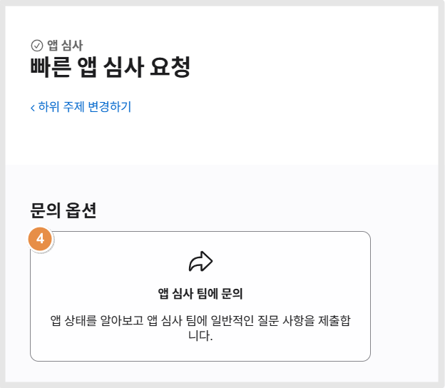
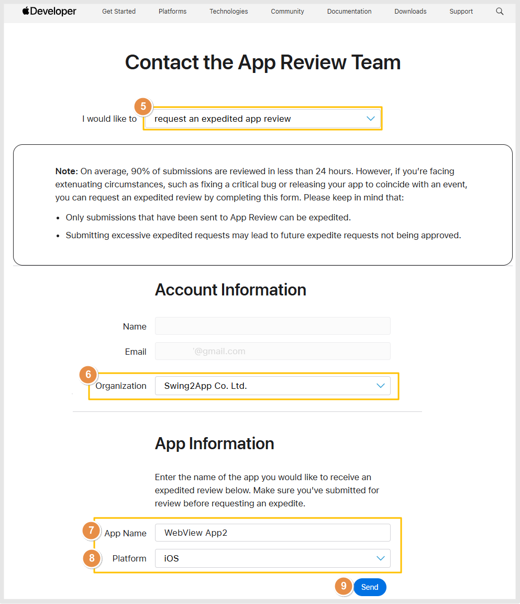
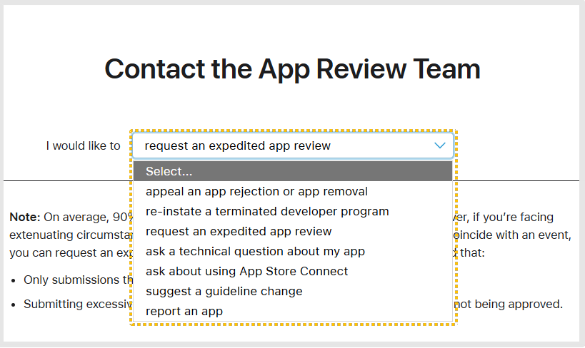

# 앱스토어 앱 빠른 심사 요청

앱스토어는 문의하기(고객센터)를통해서, 빠른 앱 심사를 요청할 수 있습니다.

빠른심사요청은,

심사를 제출했으나 검토가 오래 걸리거나 or 일정상 보다 빠르게 출시가 되어야 하는 이슈가 있다면 신청할 수 있습니다.&#x20;

**단, 앱은 심사중(심사 대기중도 가능) 상태만 빠른 심사 제출이 가능합니다.**&#x20;

**심사 거절되었거나, 아직 바이너리 등록을 안한 앱은 빠른 심사 요청이 불가합니다.**&#x20;

***

애플 멤버십 고객센터 접속

[**https://developer.apple.com/contact/**](https://developer.apple.com/contact/)

<figure><figcaption></figcaption></figure>

1)새로운 문제에 대한 도움 받기 선택

<figure><figcaption></figcaption></figure>

어떤 도움이 필요하신가요?

2\)앱 심사 선택

**하위 주제 선택하기**

<figure><figcaption></figcaption></figure>

3\)빠른 앱 심사 요청

<figure><figcaption></figcaption></figure>

4\)문의 옵션: 앱 심사 팀에 문의 선택

<figure><figcaption></figcaption></figure>

5\)I would like to "request an expedited app riview" 선택

\[계정 정보]

6\)조직 이름 선택 \*계정에 하나의 멤버십만 있다면, 선택없이 바로 넘어갑니다

\[앱 정보]

7\)앱 이름 선택&#x20;

\*계정에 앱이 하나만 있다면 선택 없이 바로 체크 되며, 여러 앱이 있다면 콘솔 박스 눌러서 앱을 선택해주세요.

8\)플랫폼: 콘솔 박스 눌러서 \*ios 선택해주세요.&#x20;

9\)Send 누르면 완료&#x20;


참고: 평균적으로 90%의 제출물이 24시간 이내에 검토됩니다.&#x20;

하지만 중요한 버그를 수정하거나 이벤트와 맞춰 앱을 출시하는 등 특별한 상황이 있다면, 이 양식을 작성하여 신속 검토를 요청할 수 있습니다.&#x20;

다음 점을 기억해 주세요:

* App Review로 제출된 제출물만 신속 처리가 가능합니다.
* 과도한 신속 요청을 제출하면 향후 신속 요청이 승인되지 않을 수 있습니다.


***

💡빠른 앱 심사요청 외에도 앱 리뷰팀에 아래와 같은 내용도 신청할 수 있습니다.&#x20;

<figure><figcaption></figcaption></figure>

-앱거부 또는 앱 삭제에 대한 이의제기 신청

-종료된 개발자 프로그램 복원

-앱에 대한 기술적 질문 요청

-앱스토어 커넥트 사용에 대한 질문

-가이드라인 변경 제안

-앱 신고&#x20;

앱스토어는 문의하기를 통해 다양한 도움을 받을 수 있으니, 앱스토어 이용 개발자분들은 참고하여 이용해주세요.
