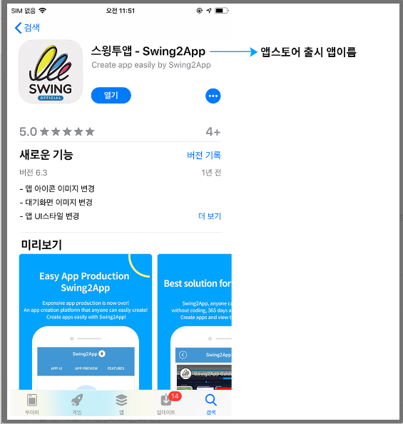
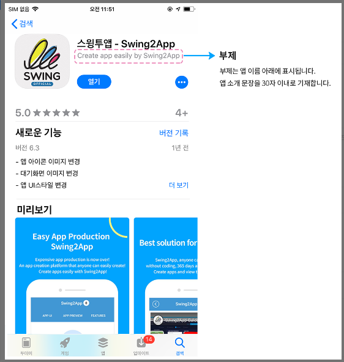
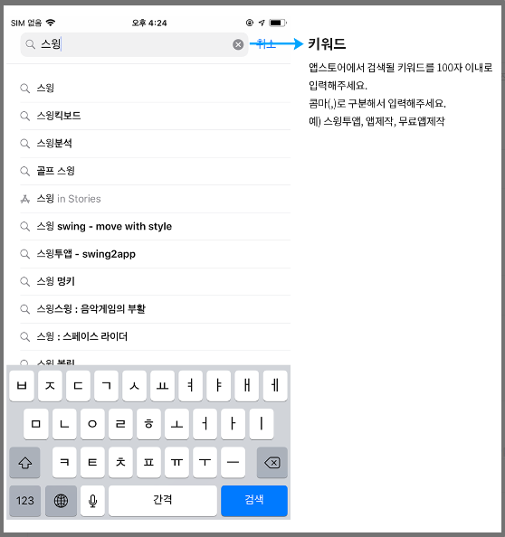
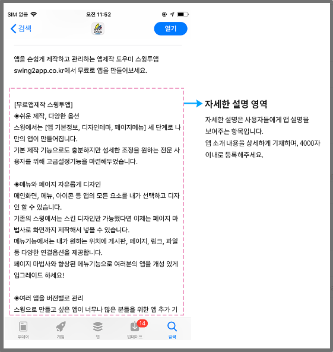
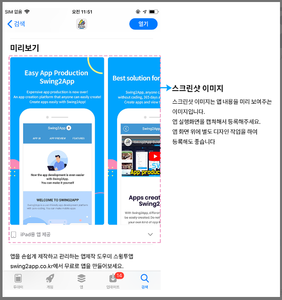
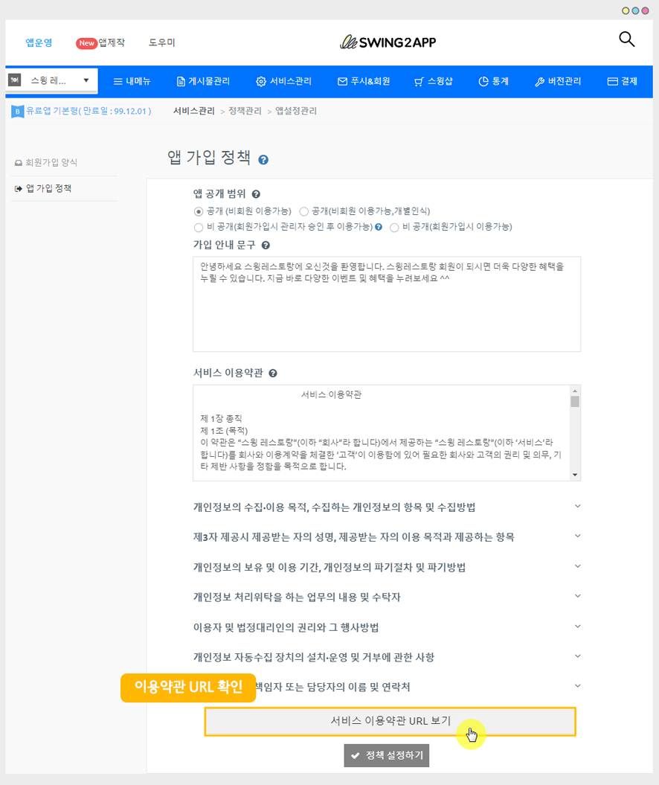
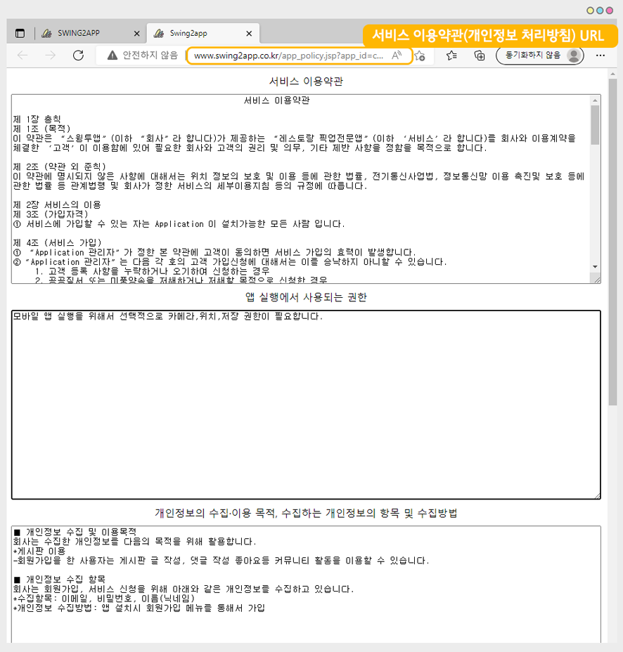

# 앱스토어 앱 등록 준비사항

***

앱스토어 커넥트에서 앱을 등록하기 전 미리 준비해야 하는 항목을 알려드립니다.

시간이 소요되는 작업도 있기 때문에 미리 준비해놓으시면 빠른 등록 가능합니다!


<mark style="color:green;">**준비사항 간단 정리!!**</mark>

1.애플 개발자 계정

2.앱이름

3.부제

4.키워드

5.앱 설명

6.스크린샷 이미지 - 아이폰 3종(필수), 아이패드1종(선택) <mark style="color:red;">★중요</mark>

7.로그인 계정

8.개인정보 처리방침 링크


***

​

## 1.애플 개발자 계정 (개인 or 비즈니스)만들기

앱스토어 앱을 등록하기 위해서는 애플 개발자 계정이 있어야 합니다.&#x20;

단, 단, 스윙투앱을 이용하는 고객사는 애플 개발자 계정 대행이 가능하기 때문에 계정이 없어도 앱 출시를 진행하실 수 있습니다.

스윙투앱의 애플 개발자 계정으로 대리 등록이 가능합니다.&#x20;

따라서 계정 대리 등록을 하실 경우 애플 개발자 계정을 만들지 않아도 되구요.&#x20;

사용자(고객사)분의 개발자 계정으로 진행하길 원하시면 아래 가이드를 보시고 애플 개발자 계정을 만들어주세요.

**👉애플 '개인' 개발자 계정 만들기**&#x20;



**👉애플 '조직(비즈니스)'계정 만들기**





✔ 개인 / 프리랜서 / 개인사업자 → 개인 계정

✔ 법인 / 기관 / 학교 → 조직(비즈니스) 계정

<mark style="color:$primary;">\*개인사업자 분들은 개인으로 가입하셔야 합니다.</mark>&#x20;

&#x20;스윙투앱으로 개발자 계정 대행시, 아래 대행 주의사항을 확인해주세요.



***

## 2.앱 이름

앱스토어에 출시되는 이름, 검색시 나오는 이름을 생각해주세요.

이름 글자수는 30자 이내입니다.

\*앱스토어는 시중에 출시되어 있는 앱 이름과 동일하게 쓰실 수 없어요.

따라서 만약 앱 이름을 생각했는데 중복되어 사용이 불가하다면 이름을 변경해야 합니다.

<figure><figcaption></figcaption></figure>

***

​

## 3.부제

앱 이름 밑에 표시되는 내용이며, 앱을 간단히 한줄로 소개할 수 있는 멘트면 좋습니다.

글자수는 30자 이내입니다.

<figure><figcaption></figcaption></figure>



* 최대 30자 (공백 포함)
* 앱 핵심 기능을 한 줄로 요약

👉 예시) “쇼핑부터 배송까지 한번에”, “간편한 예약과 실시간 관리”



***

​

## 4.키워드

앱 성격 및 카테고리와 관련된 키워드를 입력할 수 있습니다.

앱을 설명하는 하나 이상의 키워드를 입력해야 하며, 키워드를 사용하면 App Store 검색 결과의 정확도를 높일 수 있습니다.

키워드 글자 수는 100자 이내입니다.

<figure><figcaption></figcaption></figure>

쉼표를 사용하여 구분합니다.

예시) 앱제작, 앱만들기, 어플제작, 어플개발, 앱개발, 앱제작도구

✔ 핵심 키워드를 잘 설정하면 검색 노출과 다운로드 증가에 큰 도움이 됩니다.

***

## 5.앱 설명

앱의 특징과 기능에 대한 자세한 설명을 기재하는 항목이에요.

4,000자 이내로 작성해야 하구요.

최대한 자세히 준비해주세요. 앱 설명이 부족해도 심사가 거절됩니다 ^^

<figure><figcaption></figcaption></figure>

<mark style="color:red;">**\*주의\***</mark>

사업이나 업체에 대해 소개하는 것 보다, 앱에 대해 소개해주세요.

해당 앱에 어떤 기능이 제공되고 있는지, 그래서 어떠한 편의성을 주는지 등등 어플을 설치했을 때 오는 이점을 알려주는 것이 좋습니다.

***

## 6.아이폰 스크린샷 이미지

앱스토어 앱 검색시 앱 이름 밑에 보여지는 미리보기 이미지에요.

앱 실제 화면을 캡쳐하여 권장 사이즈에 맞게 디자인한 것을 스크린샷 이미지라고 보시면 됩니다.

앱 실제 실행화면이 들어가야 하며, 앱 다운을 유도하는 홍보 사진이 됩니다.

✔ 반드시 실제 앱 화면 포함

✔ 최소 3장 \~ 최대 10장 등록 가능

<figure><figcaption></figcaption></figure>

<mark style="color:blue;">**\[이미지사이즈 확인해주세요]**</mark>

1\)아이폰 X 기준 (6.5 디스플레이), 사이즈:1242 x 2688px 또는 2688 x 1242px <mark style="color:$success;">**\*필수**</mark>

2\)아이폰 14 Pro Max (6.7 디스플레이), 사이즈:1290 x 2796px 또는 2796 x 1290px <mark style="color:$success;">**\*필수**</mark>

3\)아이패드 이미지 (선택사항), 사이즈:2048x2732px 또는 2732x2048px <mark style="color:purple;">**\*선택**</mark>


-아이폰은 종류별 총 2개 사이즈 이미지를 준비해주셔야 합니다. 모두 필수 항목입니다.

-아이패드 이미지는 선택사항이에요. 등록하지 않아도 문제는 없습니다.

단, **아이패드 호환이 아니기 때문에 아이패드에서는 화면이 최적화되지 않을 수 있습니다.**

(아이패드 화면에 맞게 앱이 노출되지 않는 문제)

그리고아이패드에서는 스크린샷 이미지 정보가 아이폰으로 대체되어 보여집니다.

아이패드에도 최적화된 사용을 원하면 아이패드용 스크린샷 이미지도 등록하시는 것을 추천드려요.

-이미지는 모두 최소 3장\~최대 10장까지 등록 가능합니다.



<mark style="color:red;">**스크린샷 image 준비 유의사항**</mark>

앱스토어에 제출하는 스크린샷 이미지는 반드시!! 앱 실제 실행화면이 들어가야 하구요.

**\*아이폰에서 촬영된 캡쳐 화면이 제공되어야 합니다.**&#x20;

**\*아이패드 스크린샷은 반드시 아이패드에서 실행화면 화면을 제출해야 합니다.**&#x20;

만약 모든 아이폰 기기에서 촬영이 어렵다면, 하나의 기기에서 앱 화면을 캡쳐한 뒤 편집도구(포토샵, 일러스트 등)을 이용하여 사이즈를 수정하여 편집할 수 있습니다.

웹앱의 경우 아이폰 미리보기로 확인할 수 있고, 혹은 안드로이드폰으로 앱 화면 촬영한 다음 안드로이드 상단, 하단 상태 표시줄을 모두 제거해도 됩니다.

앱과 관련이 없는 이미지는 등록 불가 및 심사가 들어가도 100% 거절됩니다.&#x20;


***

## 7.로그인 계정

앱에 회원가입, 로그인 기능이 있을 경우 테스트용 계정도 제출해야 합니다.

이때 애플은 실제 로그인을 하여 모든 앱 메뉴들을 꼼꼼히 확인하기 때문에 계정은 테스트(데모용)으로 만들어서 주는 것이 좋구요.

모든 메뉴에 접근 가능한 계정을 제출해야 합니다.

\*로그인 기능이 없는 앱은 계정을 제출하지 않아도 됩니다.

<figure><figcaption></figcaption></figure>


<mark style="color:red;">**\*주의\***</mark>

1\)관리자 계정이 아닌, 일반 사용자용 계정을 주셔야 합니다.

2\)로그인을 하지 않아도 앱 이용을 할 수 있으니, 계정 제출을 안해도 되는 것 아닌가요?

\= No, 그렇지 않습니다. 기능 사용 관계 없이 필수로 계정을 제출해야 합니다.

3\)웹앱(웹뷰, 푸시앱) 사용자분들은 웹사이트 내에 기본 로그인 기능이 있는지 확인해주세요.

카카오톡, 구글, 네이버 등의 소셜 간편 로그인만 사용할 경우 애플에서는 이용이 불가합니다.

(해당 방법 모두 본인 인증을 통해 로그가 되는 방법이기 때문에, 타 사용자는 접속이 불가합니다.)

따라서 일반적으로 웹 기본 로그인 기능이 함께 제공되어야 합니다.

그리고 소셜 , 간편 login을 제공한다면 Apple login 기능도 함께 셋팅해야 합니다.

앱스토어 심사 거절사유 사례를 참고해주세요.




***

## 8.개인정보 처리방침 링크

​

개인정보 취급 및 처리방침이란 홈페이지나 앱에서 필수 제공해야 하는 정책이에요.

해당 서비스를 이용하는 이용자에게 수집되는 개인정보가 무엇인지 해당 정보를 어떻게 사용하고, 어떻게 철회하는지 등에 대한 정보를 알려주는 약관입니다.

모바일 정책상 입력해야 하는 필수 항목이기 때문에 앱스토어 앱 등록 에도 해당 링크를 제출 해야 해요.

\*구글 플레이스토어, 원스토어, 갤럭시 스토어 등도 모두 동일하게 제출됩니다.

​

**-웹앱(푸시, 웹뷰앱) 사용자분들은 앱에 연결한 웹사이트에 있는 개인정보 처리방침 링크를 제출하시면 됩니다.**

사이트에 개인정보 취급 혹은 처리방침 내용이 없다면 추가해주셔야 합니다.

​

**-일반 프로토타입 제작 앱은 스윙투앱에서 자체적으로 링크를 제공해드립니다.**

업로드 신청서에 자동으로 링크 URL이 들어가 있구요.

약관 등 수집되는 정보 내용만 수정해서 사용해주세요. (샘플 항목이라 내용은 해당 앱에 맞게 수정해서 쓰셔야 해요)

일반프로토타입 앱 이용약관 화면)

<figure><figcaption></figcaption></figure>

<figure><figcaption></figcaption></figure>

이용약관 내용이 담긴 새 웹페이지 창이 뜹니다.

인터넷 주소 창에 URL 주소를 복사하여 제출해주면 됩니다.

***

\
이상으로 앱스토어 앱 등록 전 준비해야 하는 8가지 항목을 알려드렸습니다.

스윙투앱에서는 앱 제작뿐만 아니라 앱스토어 등록 전체 과정을 대행해드립니다.

✔ 앱 등록 대행

✔ 심사 대응 및 수정 안내

✔ 거절 사유 분석 및 해결 지원

✔ 재심사 추가 비용 없음

👉 복잡한 과정 없이 앱 출시를 빠르게 진행하실 수 있습니다.

어려운 등록 작업 없이 모든 과정을 다 대행하여 스토어 심사 거절시에도 거절 사유 및 조치사항을 안내하여 대응해드리고 있습니다.

(재심사시 별도 추가 요금 없습니다)

위 8가지 항목만 미리 준비하시면 앱 등록 속도와 심사 통과율을 크게 높일 수 있습니다.

👉 스윙투앱과 함께라면 앱 제작부터 앱스토어 출시까지 한 번에 해결할 수 있습니다.

