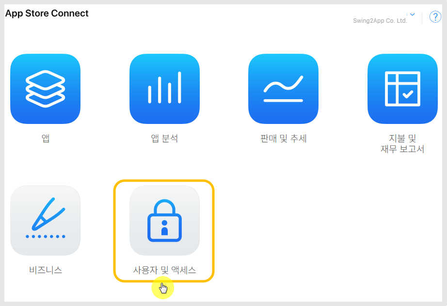
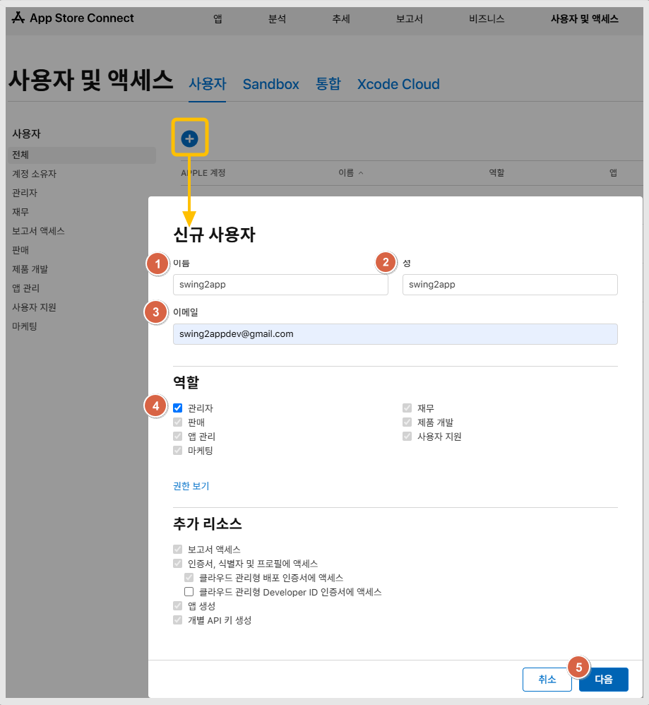

# 애플 계정 사용자 초대

***

&#x20;

## **📲애플 개발자 계정 초대하기 (관리자 초대)**

<figure><figcaption></figcaption></figure>

앱스토어 커넥트 사이트 접속 및 로그인

[https://appstoreconnect.apple.com/](https://appstoreconnect.apple.com/)

커넥트 메인 화면에서 <mark style="color:blue;">**\[사용자 및 액세스]**</mark>  메뉴 선택합니다.

<figure><figcaption></figcaption></figure>

**\[+]아이콘 선택 신규 사용자팝업창이 열립니다.**

1\)이름 'swing2app' 입력

2\)성: 'swing2app' 입력

3\)Email(이메일): '<mark style="color:blue;">**swing2appdev@gmail.com**</mark>' 입력(스윙투앱 애플 개발자 이메일주소입니다)

4\)역할: '**관리자'** 선택

관리자선택시 밑의 항목은 모두 자동으로 셋팅되어 입력됩니다.

5\)\[다음] 버튼 선택하면 완료됩니다.

초대를 하시면 스윙투앱 개발자 이메일로 초대 메일이 발송되며, 저희가 초대를 수락하면 완료됩니다.

✅**애플커넥트사이트영문버전으로 확인시에는 아래 첨부된 이미지처럼 진행해주세요.**&#x20;

<figure><figcaption></figcaption></figure>

### **✔발송된 초대 메일**&#x20;

<figure><figcaption></figcaption></figure>

&#x20;초대 메일이 전송되며, 초대 승인을 완료하면 관리자로 초대된 계정에서 앱 등록을 진행할 수 있습니다.&#x20;

