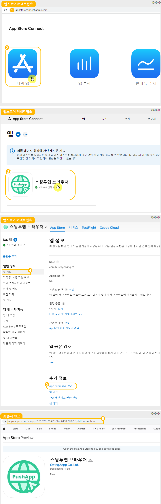

# 앱스토어 출시 후 관리 페이지

***

## 1.앱 출시 링크 확인하기

<figure><figcaption></figcaption></figure>

1\)[앱스토어 커넥트](https://appstoreconnect.apple.com/) 접속 및 로그인

2\)나의 앱 선택

3\)앱 선택(링크를 확인하고자 하는 앱 선택)

4\)왼쪽 카테고리에서 **일반정보:앱 정보** 선택

5\)화면에서 스크롤해서 아래로 내리면 ‘App Store에서 보기’를 확인할 수 있습니다.

6\)해당 메뉴 선택시 출시 화면으로 이동하며, 상단 사이트 주소란에 보여지는 주소가 해당 앱의 출시 링크입니다.

***

## 2.앱 설치 수(통계) 확인 페이지

앱을 설치(다운로드)한 수를 확인할 수 있는 페이지입니다.

[앱스토어 커넥트 사이트 ](https://appstoreconnect.apple.com/)접속 - \[판매 및 추세] 선택

상세 이용방법은 아래 가이드로 확인 부탁드립니다.



***

## 3.앱 리뷰/평가 확인 페이지

[앱스토어 커넥트 사이트](https://appstoreconnect.apple.com/) 접속 - 앱 선택 후, 왼쪽 카테고리 일반정보: 평가 및 리뷰 선택 해서 들어오면&#x20;

앱에 작성된 리뷰, 앱에 매겨진 평점을 확인할 수 있습니다.

상세 이용방법은 아래 가이드로 확인 부탁드립니다.



***

## 4.애플 멤버십 연장하기

앱스토어 애플 개발자 계정은 1년 이용기간입니다.

계속 앱스토어를 이용하신다면, 1년 마다 애플 멤버십 기간을 연장해주셔야 하구요.

만약 연장하지 않을 경우 출시된 앱은 삭제 됩니다.

따라서 애플 개발자 계정 멤버십을 연장하는 방법도 함께 확인해주세요.



