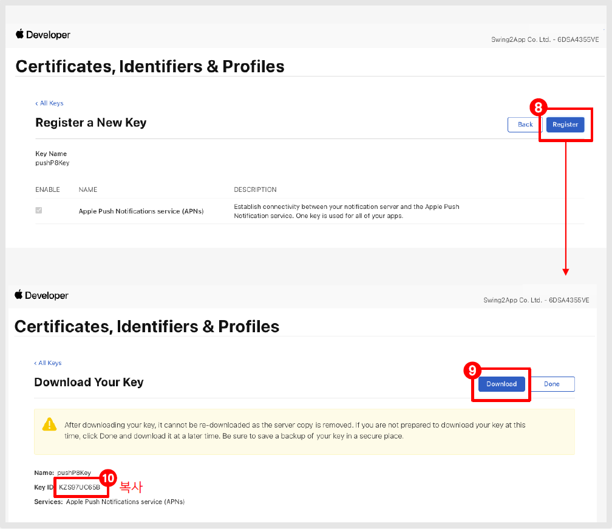

# 아이폰 푸시 인증서 연장

<figure><figcaption></figcaption></figure>

**애플 푸시 인증서 연장이란?**

아이폰은 애플에서 제공하는 푸시 시스템을 사용하고 있습니다.

따라서 아이폰에서 푸시를 이용할 경우 애플에서 제공하는 푸시 시스템에서 인증서를 연장해줘야 합니다.

\*애플 개발자 멤버십 기간 처럼 1년 마다 인증 필요

인증서 연장은  스윙투앱에서 앱제작 후, **사용자의 애플 개발자 계정으로 앱스토어 앱을 출시하여 이용하고 있을 경우 해당됩니다.**

스윙투앱 계정으로 대리 등록하신 분들은 당사에서 처리해드리오니, 별도 작업을 하지 않아도 됩니다.&#x20;


<mark style="color:blue;">**안내사항**</mark>

1\)푸시 인증은 푸시앱, 일반 프로토타입 앱 등 푸시 기능을 이용할 수 있는 앱만 해당 됩니다.&#x20;

\*웹뷰앱 해당 없음

2\)사용자의 애플 개발자 계정으로 앱스토어 앱 운영하는 분들에만 해당됩니다.

3\)안드로이드폰은 해당 없습니다. 아이폰만 해당됩니다.

4\)인증기간 전에 연장해주셔야 하며, 연장이 안될 경우 아이폰에서 푸시 발송이 되지 않습니다.



<mark style="color:green;">**가이드업데이트 안내**</mark>

해당 매뉴얼은 애플에서 제공하는 푸시 연장 신규 매뉴얼입니다.

해당 방법으로 연장 진행시, 푸시 인증서가 영구 등록됩니다.&#x20;

\*1년마다 재등록 할 필요 없이, 한번 등록 해놓으면 기간 제한 없이 푸시 발송이 가능합니다.&#x20;


<figure><figcaption></figcaption></figure>

<figure><figcaption></figcaption></figure>

1.[애플 개발자 사이트 ](https://developer.apple.com/account/)접속 로그인해주세요. (애플 개발자 계정 로그인)

2.Team ID 복사

애플 개발자 메인 화면에서 Membership Details  선택

Team ID 값 복사해주세요.

<mark style="color:red;">\*중요\*</mark>

Team ID는 마지막 고급관리에서 입력해야 하는 정보입니다.

복사한 ID는 메모장 등에 붙여넣기 해주세요.

<figure><figcaption></figcaption></figure>

3.Certificates, Identifiers & Profiles 항목

\[Keys] 선택합니다.

<figure><figcaption></figcaption></figure>

4.Keys 옆의 \[+] 버튼을 선택합니다.

5.Key name : Key 이름을 입력해주세요.

(key 값은 아무 이름이나 입력해도 됩니다)

6.Apple Push Notification Service 체크

체크박스에 체크해주세요.

7.\[Continue] 클릭

<figure><figcaption></figcaption></figure>

8.\[Register] 클릭

9.\[Download] 버튼 클릭 후 파일 저장

(파일 열지 말고 저장만 해주세요.마지막에 해당 파일 다시 업로드 해야 합니다.)

10.Key ID 복사

<mark style="color:red;">**\*중요\***</mark>

Key ID는 마지막 고급관리에서 입력해야 하는 정보입니다.

복사한 ID는 메모장 등에 붙여넣기 해주세요.

<figure><figcaption></figcaption></figure>

[스윙투앱  앱운영 →서비스관리 →앱 고급관리](http://www.swing2app.co.kr/view/app\_advanced\_management)

스윙투앱 앱 고급관리로 화면으로 이동합니다.

11.푸시 인증서 ‘p8’ 선택

12.인증서 업로드 버튼을 눌러 다운받은 파일을 업로드 합니다. (순서 9에서 다운받은 파일)

13\. Key id 값을 입력합니다. (순서 10에서 복사한 값 )

14\. Team id 값을 입력합니다.(순서 2에서 복사한 값 )

15\. \[저장] 클릭하면 완료입니다.


<mark style="color:orange;">**안내사항**</mark>

사용자 본인의 애플 개발자 계정으로 앱스토어에 앱이 등록된 분들은 아래 매뉴얼을 보시고 인증기간 만료 전 연장 조치를 해주셔야 합니다.

스윙투앱 계정으로 앱스토어에 앱을 출시한 분들은 신경쓰지 않으셔도 되요\~

스윙투앱 계정으로 등록된 앱은 스윙투앱 자체적으로 모두 연장 조치해드립니다.

