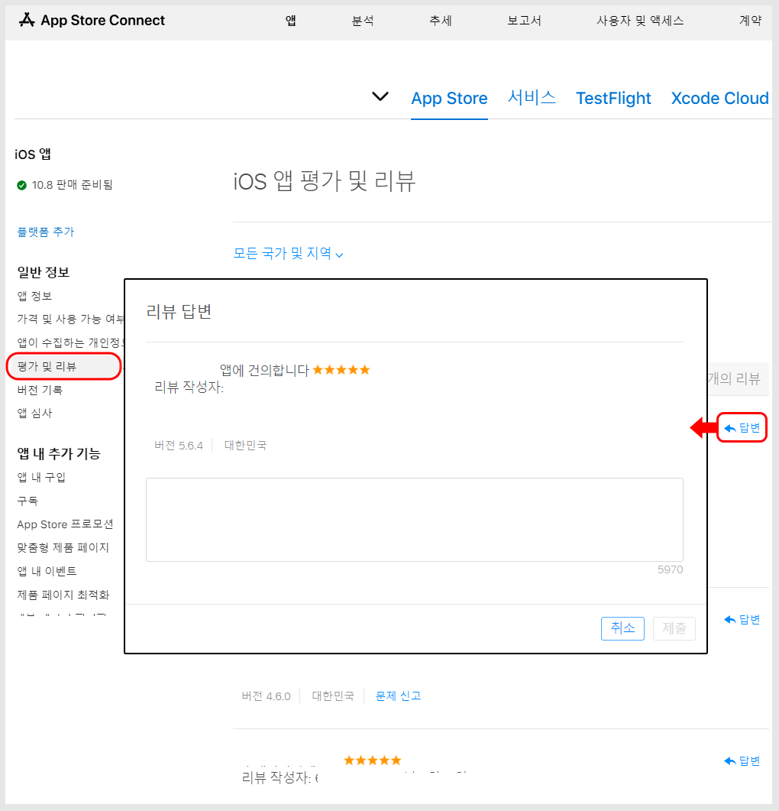
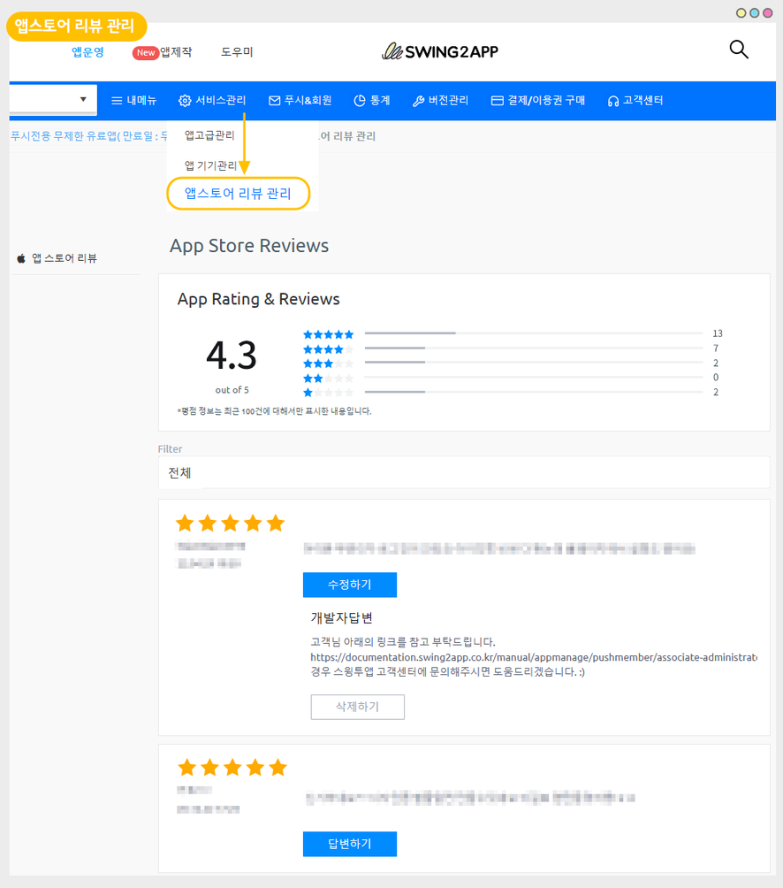
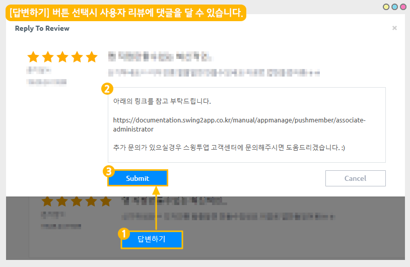
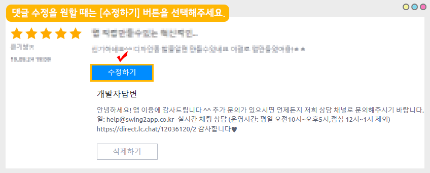

# 앱스토어 리뷰/ 평점 관리

***

앱스토어 앱 출시 후, 리뷰 및 평점이 달리는데요.

앱 관리자는 해당 평점과 리뷰를 확인할 수 있고, 리뷰에는 답글을 입력할 수도 있습니다.

가이드를 통해서, 앱스토어 리뷰/평가 확인 및 리뷰에 답변을 입력하는 방법을 확인해주세요.&#x20;


<mark style="color:orange;">**안내사항**</mark>

1\)앱스토어에 본인의 개발자 계정으로 앱이 출시된 경우 이용이 가능합니다.&#x20;

무료버전앱 혹은 유료앱이지만 앱스토어에 출시 하지 않았다면, 해당 기능 접근이 불가합니다.

2\)스윙투앱으로 앱등록을 대행한 경우는 몇가지 조건에 해당되면, 스윙투앱에서 제공하는 앱스토어 리뷰 관리 페이지를 이용할 수 있습니다.&#x20;

3\)사용자가 작성한 리뷰 및 평가는 관리자가 삭제할 수 없습니다.&#x20;


***

## 1.앱 평가, 리뷰 페이지

<figure><figcaption></figcaption></figure>

[앱스토어 커넥트](https://appstoreconnect.apple.com/) 사이트 접속

앱 선택 후, 왼쪽 카테고리 <mark style="color:blue;">**일반정보: 평가 및 리뷰**</mark> 선택 해서 들어오면 앱에 작성된 리뷰, 앱에 매겨진 평점을 확인할 수 있습니다.

\*리뷰: 앱을 설치한 사용자가 댓글을 입력하는 항목

\*평가: 별점으로 평가하는 항목(5개 만점)

한 사용자가 2개 항목 모두 체크할 수 있고, 별점만 체크할 수도 있습니다.

리뷰만 작성하는 것은 불가 합니다.

아직 앱에 달린 리뷰가 없을 경우, 화면처럼 아무런 내용이 표시되지 않습니다.

<figure><figcaption></figcaption></figure>

***

## 2.리뷰에 답글 달기

<figure><figcaption></figcaption></figure>

리뷰 항목에 있는 '답변' 선택시, 앱 관리자가 답글을 입력할 수 있습니다.

***

## 3.스윙투앱에서 리뷰 확인하기

위의 방법(앱스토어 커넥트플사이트 접속)은 애플개발자 계정 소유주 분들만 이용이 가능합니다.&#x20;

즉, 본인의 계정으로 앱을 출시했을때만 이용 가능합니다.

애플 개발자 계정이 없거나, 스윙투앱 계정으로 앱 등록 대행을 하신 분들은 이용이 불가한데요.&#x20;

<mark style="color:red;">다만, 스윙투앱 계정 대리 등록을 한 경우라도 아래의 조건에 해당되면 스윙투앱 사이트에서 리뷰 및 평가 관리가 가능합니다.</mark>


\*앱스토어 리뷰 관리 페이지는 먼저 앱스토어에 앱이 출시 되어있어야 이용 가능하며, 아래 조건에 해당하는 분들만 이용 가능합니다.

1\)일반 프로토타입 앱 이용

**확장형 이용권, 프리미엄 이용권**을 구매하신 분들에게만 제공됩니다.(기본형, 알뜰형 등의 상품은 이용 불가)

2\)푸시앱 이용

**푸시 무제한 유료앱 이용**시에만 이용 가능합니다. (기본형 이용권은 이용 불가)


\*스윙투앱 앱운영 – 서비스관리 – 앱스토어 리뷰 관리 메뉴 이동하면 확인 가능합니다.

<figure><figcaption></figcaption></figure>

1\)앱스토어 리뷰 페이지에서는 해당 앱에 매겨진 평균 평점과 별점 표시

2\)해당 앱에 작성된 리뷰 글을 모두 모두 볼 수 있습니다.

3\)리뷰글에 댓글을 달면(답변하기 버튼), 바로 앱스토어 및 아이폰으로 연동이 되어 보여집니다.

4\)필터 기능을 이용하여 별점 별 5점, 4점, 3점 .... 등을 선택해서 볼 수 있습니다.

​\*평점 정보는 모든 히스토리를 다 불러오지는 못하고 최근 100건에 대해서만 표시됩니다.

\*5점 만점이며 해당 앱에 매겨진 평점이 표시됩니다.

### 1)답변 작성하기

<figure><figcaption></figcaption></figure>

1\)답변하기 버튼 선택

2\)댓글(내용) 입력

3\)Submit(제출) 버튼을 누르면 작성 완료!

<mark style="color:red;">\*중요 \*</mark>

리뷰에 작성된 댓글이 앱스토어에서 보여지기 까지는 최대 24시간이 걸릴 수 있어요.

### 2)답변 수정하기

<figure><figcaption></figcaption></figure>

작성된 댓글을 수정할 때는 \[수정하기] 버튼을 선택해서 내용을 수정 입력할 수 있습니다.

