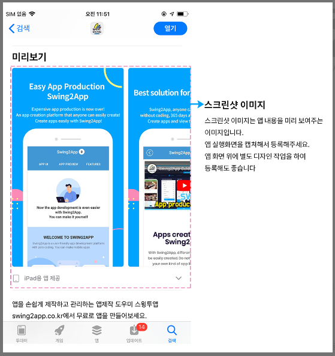
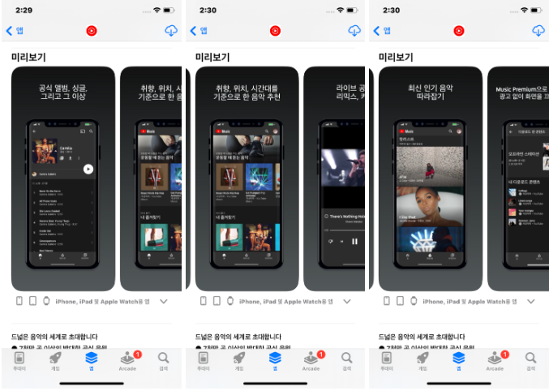
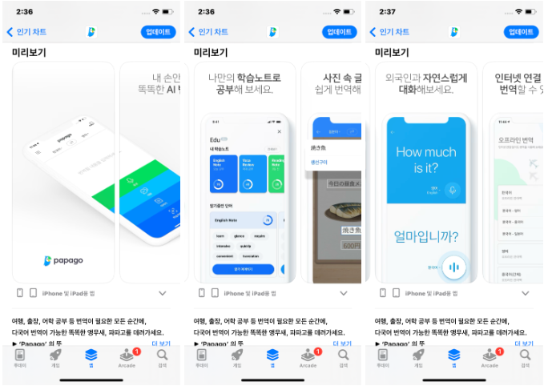

# 앱스토어 스크린샷 이미지

***

## 1.스크린샷 이미지란?

앱스토어 앱 검색시, 앱 미리보기에 화면에 보여지는 이미지가 스크린샷 이미지 입니다.

​사용자에게 앱의 첫인상을 심어주고, 다운로드를 유도하는 가장 강력한 수단 중 하나입니다.

앱스토어(Apple App Store 또는 Google Play Store)에 앱을 등록할 때, 앱의 기능, UI/UX, 사용 흐름 등을 시각적으로 보여주는 이미지입니다.

일반적으로는 실제 앱 사용 화면을 기반으로 하되, 설명 문구나 시각적 보완 요소(예: 배경, 강조 표시 등)를 추가해서 더 직관적이고 매력적으로 표현합니다.

<figure><figcaption></figcaption></figure>

<figure><figcaption>
유튜브 앱 스크린샷 이미지
</figcaption></figure>

<figure><figcaption>
네이버 파파고 앱 스크린샷 이미지
</figcaption></figure>

앱 실제 화면을 캡쳐하여 권장 사이즈에 맞게 디자인한 것을 스크린샷 이미지라고 보시면 됩니다.

구글 플레이스토어와 스크린샷 이미지 개념은 동일합니다.

***

## 2. 스크린샷이미지가왜 중요한가요?

​

#### **1. 다운로드 전환율(Conversion Rate)에 직접적인 영향**

사용자는 앱 상세 페이지에 진입 후 7초 이내에 다운로드 여부를 판단합니다.

이때 가장 많이 보는 것이 바로 앱 아이콘과 스크린샷입니다.

→ 스크린샷의 완성도가 다운로드를 유도하는 핵심 포인트

​

#### **2. 경쟁 앱과 차별화**

유사한 기능을 가진 앱이 많을 경우, 스크린샷 디자인, 구성, 설명 문구 등을 통해 차별화된 UX와 신뢰감을 줄 수 있습니다.

​

#### **3.ASO(App Store Optimization)의 요소**

스크린샷은 앱스토, 플레이스토어 최적화 전략 중 하나입니다.

특히 설명 문구에 핵심 키워드를 잘 조합하면 검색 결과 노출률 및 유입률 향상에 도움이 됩니다.

​

#### **4. 글로벌 사용자 대응**

다국어 지원 스크린샷을 제공하면, 국가별 맞춤 UX 제공이 가능해지고, 해외 유입률을 높이는 데 효과적입니다.

***

​

## **3.스크린샷 이미지 가이드라인**

**IOS 스크린샷 이미지 등록 화면**

<mark style="background-color:blue;">\*23년 10월 27일자로 아이폰 14 pro max 스샷 이미지가 추가되었습니다.​</mark>

<figure><figcaption></figcaption></figure>

**아이폰 아이폰 6.9디스플레이, 6.5 디스플레이 이미지는 필수 등록이구요.**

아이패드 스샷 이미지는 선택 사항입니다.

단, 아이패드에도 최적화된 이미지 제출을 원한다면 아이패드용 스크린샷 이미지도 등록하시는 것을 추천드려요.


### **아이폰 이미지 사이즈**

**1)아이폰 6.6디스플레이(14 pro max): 1290 x 2796 픽셀&#x20;**<mark style="color:red;">**\*필수**</mark>

**2)아이폰 6.5디스플레이(X기준): 1242 x 2688 픽셀&#x20;**<mark style="color:red;">**\*필수**</mark>

\*아이패드도 등록한다면 (선택사항)

3\)아이패드 사이즈: 2048x2732 or 2732x2048 픽셀

-이미지 장수: 최소3장\~최대10장

-파일 확장자: JPEG 또는 24비트 PNG(RGB 색상 영역, 투명도 미포함)



### **준비 시 참고사항:**

* iOS는 기기별 해상도에 맞는 스크린샷을 제출해야 하며, 아이폰 6.9과 6.5 사이즈 필수 제출입니다.
* 최소 3장, 최대 10장까지 등록 가능합니다
* PNG 또는 JPG 형식으로 준비하세요 \*투명도 제거
* 실제 앱 화면을 캡처한 이미지여야 합니다&#x20;
* iPad 스크린샷은 선택사항이지만, 아이패드에서도 지원되는 앱이라면 반드시 제출해야 합니다.


***

​

## 4.한번에 통과되는 스크린샷 이미지?

​

앱스토어 스크린샷 이미지는 심사가 굉장히 까다롭습니다.

우선 이미지는 앱 실제 화면이 반드시 제출이 되어야 합니다.

현재 사용중인 앱 화면이 보여져야 하며, 규격 사이즈에 맞게 이미지를 넣어주셔야 합니다.

실제로 심사 중 스크린샷 이미지 문제로 심사에서 거절이 되는 사례가 굉장히 많아요!

아래 설명해드리는 제출이 불가한 이미지, 제출하더라도 심사 거절되는 사례를 확인해주세요.


**이러한 이미지는 제출 불가!**

​

1\)앱과 관련이 없는 이미지

앱 실행화면이 아닌 다른 이미지는 제출시 바로 심사 거절됩니다.

2\)앱 화면을 캡쳐했으나 사이즈에 맞춘다고 원본 이미지를 다 잘라서 넣는 경우

3\)안드로이드폰에서 캡쳐해서 상단, 하단에 안드로이드 플랫폼, 표시 줄이 보여지는 경우

\*애플 정책상 애플 아이폰 외에 다른 플랫폼을 허용하지 않습니다.

따라서 스크린샷은 반드시 아이폰에서 촬영해주셔야 하며, 아이폰 이용이 어렵다면 안드로이드폰으로 찍되 안드로이드 표시 등은 모두 제거해서 올려주셔야 합니다.

4\)해상도가 낮은 이미지

이미지가 깨져서 보이거나, 굉장히 작은 사이즈의 이미지를 인위적으로 사이즈를 늘려서 해상도가 깨져서 보이는 경우입니다.

​

따라서 앱스토어는 아무 이미지나 올릴 수 없구요.

가이드와 정책에 맞는 이미지로 등록해주셔야 합니다.


#### **🎯 기본 원칙**

<table data-header-hidden><thead><tr><th width="260"></th><th></th></tr></thead><tbody><tr><td><strong>항목</strong></td><td><strong>권장 내용</strong></td></tr><tr><td>권장 개수</td><td>5~6장 (플레이스토어 최대 8장, 앱스토어 10장까지 가능)</td></tr><tr><td>해상도</td><td>기기별 정확한 해상도에 맞춰야 함 (예: iPhone 6.7"용, iPad 용 등)</td></tr><tr><td>순서 중요도</td><td>첫 2~3장이 가장 중요 – 사용자 이탈 전 핵심 메시지 전달</td></tr><tr><td>구성 방식</td><td>기능 중심 + 사용자 가치 강조 (단순 UI 나열은 지양)</td></tr></tbody></table>

​

#### **🧩 추천 구성 순서 (스크린샷 1\~6장 기준)**

<table data-header-hidden data-search="false"><thead><tr><th width="146"></th><th width="208"></th><th></th></tr></thead><tbody><tr><td><strong>순서</strong></td><td><strong>추천 주제</strong></td><td><strong>전략</strong></td></tr><tr><td>1장</td><td>핵심 가치 제안 (USP)</td><td>앱이 무엇을 해주는지 한눈에! 슬로건처럼 강하게 전달</td></tr><tr><td>2장</td><td>가장 인기 있는 기능</td><td>사용자 입장에서 가장 유용한 기능을 우선 소개</td></tr><tr><td>3장</td><td>UI 흐름 / 사용 방법</td><td>앱 사용 방식이나 흐름을 간단하게 보여줌</td></tr><tr><td>4장</td><td>보조 기능 / 추가 혜택</td><td>부가 기능(예: 알림, 개인화, 다국어 지원 등) 강조</td></tr><tr><td>5장</td><td>신뢰 요소</td><td>리뷰, 사용자 수, 보안 인증 등 신뢰성 전달</td></tr><tr><td>6장</td><td>특별한 차별점</td><td>경쟁 앱과의 차별 요소 강조 (ex. 무료, 광고 없음 등)</td></tr></tbody></table>

***

## 5.스크린샷 이미지 왜 중요한가요?

​

앱스토어 어플 미리보기를 보면 다양한 스크린샷을 확인할 수 있어요.

​

앱을 다운 받기 전 아무래도 해당 앱을 미리볼 수 있는 용도로 이용되기 때문에

잠재 고객(소비자)에게 앱 소개, 디자인, 앱에서 제공하는 다양한 기능 등을 전달하여 관심을 유발하게 하구요.

최종적으로 앱을 다운 받도록 유도하는 매개체가 됩니다.

즉, 앱의 마케팅 및 홍보의 가장 최적화된 수단입니다.

따라서 사용자들의 다운로드를 유도하도록 디자인에 공을 들여 잘 만들어서 등록하는 것이 좋습니다.

​

시중에 출시된 다른 앱들을 보시면 훨씬 이해가 더 잘 될 거에요.

모든 앱들이 이렇게 스크린샷 이미지 디자인에 이렇게 공을 들이는 이유 이제 아시겠죠?

"스윙투앱은 플레이스토어, 앱스토어 스크린샷 이미지도 제작해드리고 있습니다.

앱 출시 준비는 완료되었으나, 스크린샷 디자인 작업이 필요하다면

스윙투앱으로 문의하세요."

#### **📩스윙투앱 문의 채널 안내**

\*\*실시간 채팅\*\*

\- [https://direct.lc.chat/12036120](https://direct.lc.chat/12036120)

\- 평일 10:00\~17:00 (점심시간 12:00\~13:00 제외)

&#x20;

\*\*문의게시판\*\*

\- [https://www.swing2app.co.kr/view/service\_qa](https://www.swing2app.co.kr/view/service_qa)

\- 24시간 접수 가능, 평일 10:00\~17:00 답변

&#x20;

\*\*이메일\*\*

\- help@swing2app.co.kr

\- 24시간 접수 가능, 평일 10:00\~17:00 답변

***

