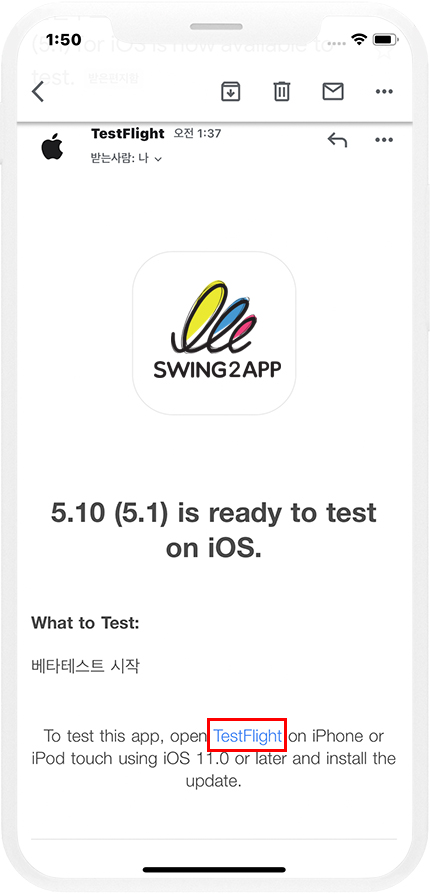
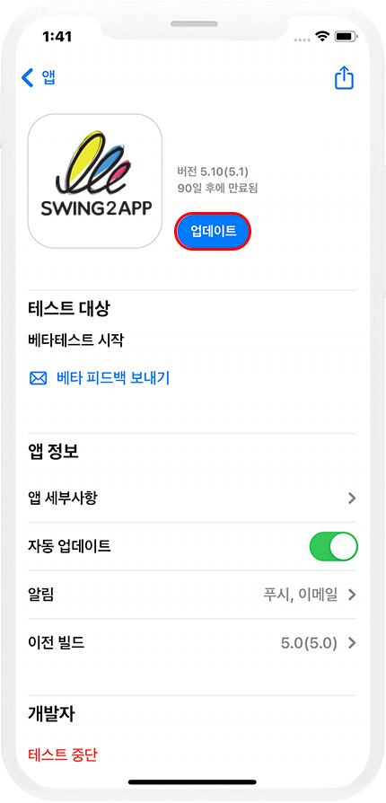
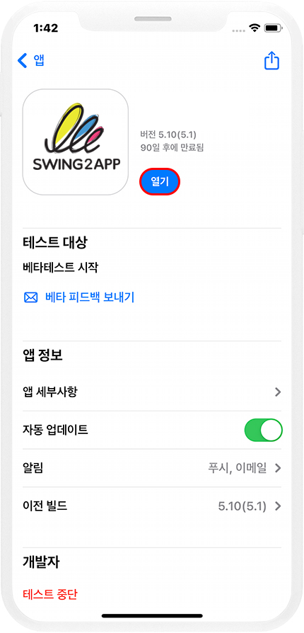
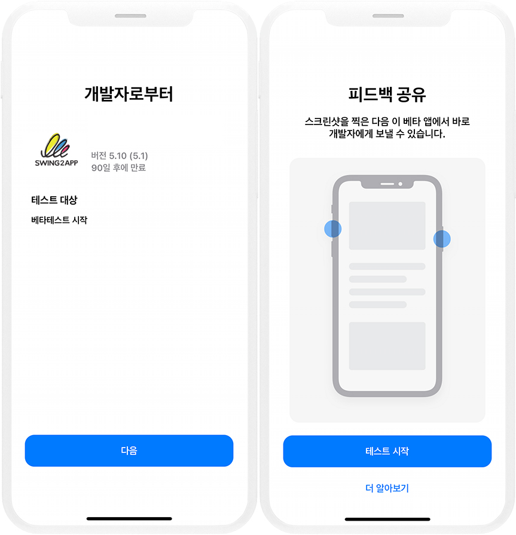
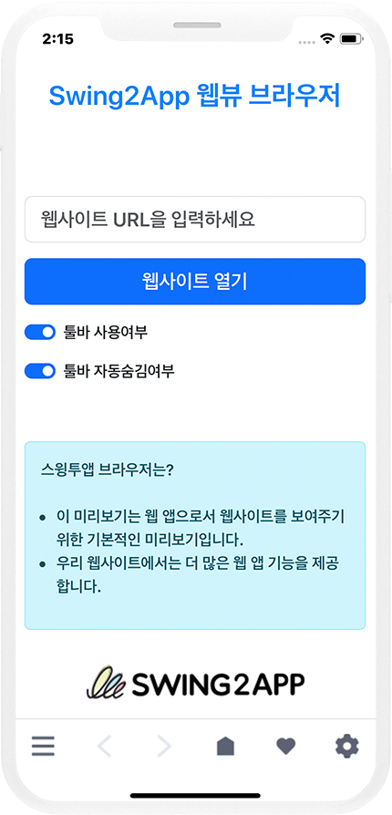
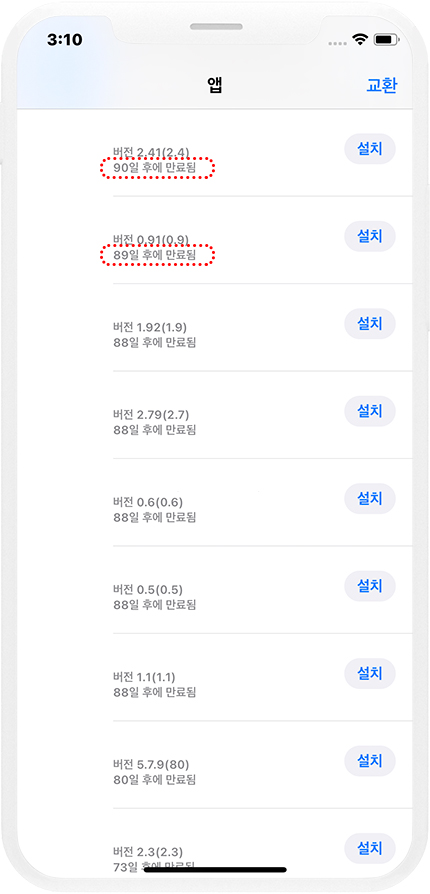

# TestFlight 앱 연장방법

***

앱스토어 test flight로 앱 이용기간은 90일입니다.

90일이 종료되면, 앱을 실행 할 수 없기 때문에 계속 이용한다면

새 버전의 업데이트 빌드를 올려서 제출을 하여 새 버전으로 계속 갱신하여 사용해야 합니다.

90일 마다 자동 연장이 되면 좋겠지만,

새 버전의 앱을 올려서 2\~3일 심사 후 새로 90일 테스트 기간을 시작하는 것이죠.

따라서 스윙투앱에서 테스트플라이트에 앱을 등록하신 분들은 앱스토어 업로드 신청을 다시 주셔야 하구요.

업로드 신청을 받아 저희쪽에서 새 버전으로 빌드를 올려서 다시 90일 이용기간으로 갱신을 해드립니다.

***

## 1.연장 신청 방법

90일 이용기간 종료 전/ 후 연장하는 방법입니다.

1\)[앱운영-버전관리-앱제작 이력](http://www.swing2app.co.kr/view/app\_work\_history) 페이지에서 \[앱스토어 업로드 신청] 버튼을 눌러서 신청서 제출해주세요.

이때 기존 초대된 사용자 외에 신규 사용자 추가를 원하시면 업로드 요청 메모란에 사용자 이메일주소를 기재해주세요.&#x20;

많은 인원이 추가되어야 한다면, 따로 엑셀파일로 기재 후 마켓업로드팀: market@swing2app.co.kr 메일로 보내주시기 바랍니다.&#x20;

2\)앱스토어 업로드 신청시 출시된 버전과 동일한 버전에서는 신청이 되지 않아요.&#x20;

따라서 앱 업데이트 후(앱제작 화면 이동-앱 업데이트 버튼 선택)신규버전에서 신청해주세요.

3\)앱스토어 업로드 티켓(20,000원)이 없다면, 티켓 구매 후 신청해주세요.

[앱스토어 업로드티켓 구매 페이지](http://www.swing2app.co.kr/view/order\_info\_action?product\_id=3)

4\)업로드 신청이 들어와야 접수가 되어 연장도 진행해드릴 수 있습니다.

5\)연장 갱신이 완료되면, 동일하게 등록된 사용자들에게 업데이트 설치 초대 메일이 발송됩니다.

메일을 받은뒤, TestFlight 앱을 통해 업데이트 진행하여 이용할 수 있습니다.&#x20;

\*앱 업데이트 진행시에도 위의 방법과 동일하게 앱스토어 업로드 신청주시기 바랍니다.

\*연장시 기존 이용기간이 남아 있는 상태에서 미리 연장을 해도, 남아 있는 기간이 합산되지 않습니다.&#x20;

남은 기간은 리셋되어 다시 90일이 추가 되는 개념입니다.&#x20;

***

## 2.업데이트 방법

테스트플라이트 앱 업데이트 후, 다시 어떻게 업데이트 받아 앱 이용을 하면 되는지 알려드릴게요.

기존에 테스트플라이트로 앱을 사용하던 분들도 업데이트를 다시 받아 실행 해주셔야 합니다.

### <mark style="color:blue;">1)받은 메일함 - testflight 선택</mark>

<figure><figcaption></figcaption></figure>

앱스토어에 새 버전의 앱 TestFlight 승인이 완료되면, 애플에서 기존 초대된 사용자분들에게 메일을 보냅니다.

베타 테스트를 할 수 있는 버전 준비가 완료되었다라는 내용으로 발송되구요.

메일에서 'TestFlight' 선택하면 TestFlight 앱으로 이동합니다.

\*혹은 바로 TestFlight 앱 실행해주세요 앱에서 바로 업데이트 하실 수 있어요.

### <mark style="color:blue;">**2)\[업데이트] 버튼 선택**</mark>

<figure><figcaption></figcaption></figure>

### <mark style="color:blue;">3)\[열기]버튼 선택</mark>

<figure><figcaption></figcaption></figure>

### <mark style="color:blue;">4)테스트 시작</mark>

<figure><figcaption></figcaption></figure>

\[다음] 버튼 및 \[테스트 시작] 버튼을 선택하면, 앱이 실행됩니다.

### <mark style="color:blue;">5)앱 시작</mark>

<figure><figcaption></figcaption></figure>

정상적으로 아이폰에서 앱이 실행되어, 이용하실 수 있습니다.

***



## 3.자주 묻는 질문 Q\&A

1\)기간은 어떻게 체크하나요?

테스트 플라이트 어플에 앱이 언제 만료되는지 날짜가 기재되어 있어요. 어플에서 해당 앱에 대한 기간을 체크해주세요.

<figure><figcaption></figcaption></figure>

애플은 기간에 대해 따로 고지하거나 메일을 보내주지 않기 때문에 알아서 관리를 해주셔야 합니다.

2\)기간 만료 전에 다시 갱신을 하면, 남은 테스트 기간과 합산되나요?

기존 이용기간이 남아 있는 상태에서 미리 연장을 해도, 남아 있는 기간이 합산되지 않습니다.

남은 기간은 리셋되어 다시 90일이 추가 되는 개념입니다.

3\)TestFlight를 이용할 사용자를 더 추가하고 싶은데 어떻게 하나요?

추가할 사용자 이름, 아이폰 사용자 이메일주소를 알려주시면 추가해드립니다.

동일하게 초대 메일이 전송되며, 초대 메일을 받아서 앱을 설치할 수 있습니다.

4\)TestFlight 연장시에 매번 앱스토어 업로드티켓을 구매해야 하나요?

네 그렇습니다.

테스트 플라이트 연장 작업은 단순히 기간만 늘리면 되는 작업이 아니며, 업데이트 된 번들을 다시 올려서 심사를 제출합니다.

즉, 저희가 앱스토어에 앱을 등록하는 모든 과정이 동일하게 수반이 되기 때문에 업로드작업비인 티켓을 구매해서 신청을 해주셔야 합니다.

앱스토어 업로드티켓 구매 후, 업로드 신청을 주셔야 업데이트 심사를 넣어 테스트플라이트 이용 연장을 해드릴 수 있습니다.

5\)TestFlight 이용하려면 본인 애플 개발자 계정이 꼭 있어야 하나요?

TestFlight는 애플 개발자 계정이 없어도 스윙투앱 개발자 계정으로 대신 등록해드리기 때문에 별도 애플 개발자 계정비가 들지 않아요.

만약 사용자분의 애플 개발자 계정이 있다면 해당 계정을 알려주셔도 됩니다.&#x20;

