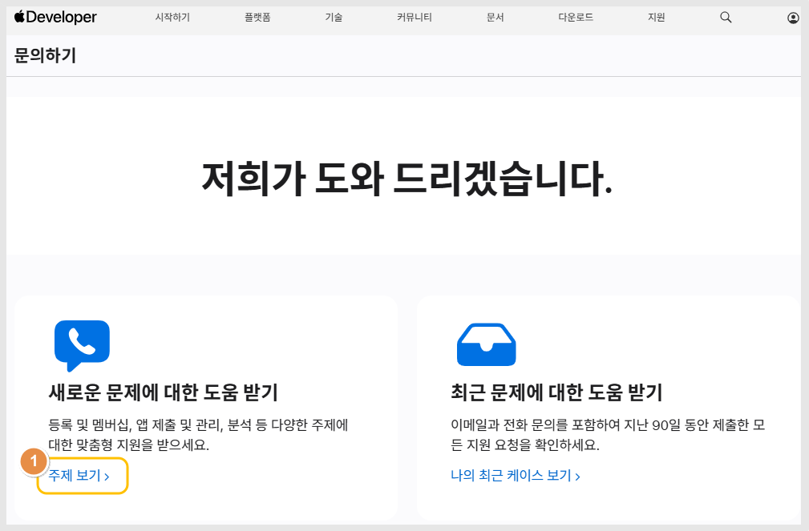
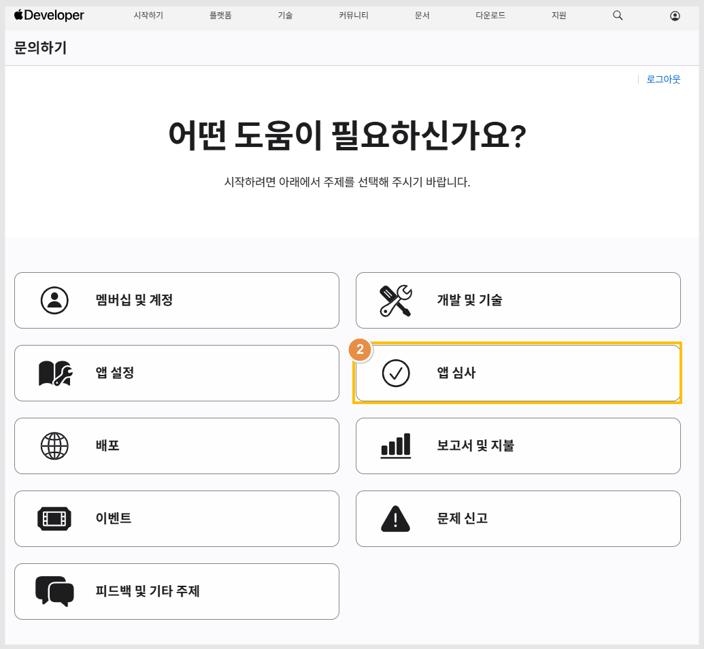
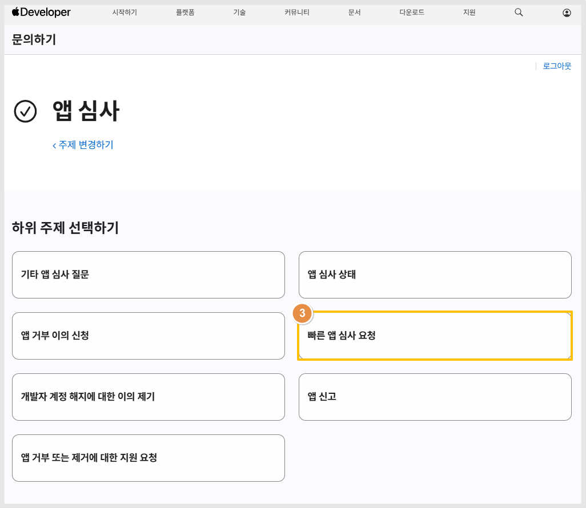
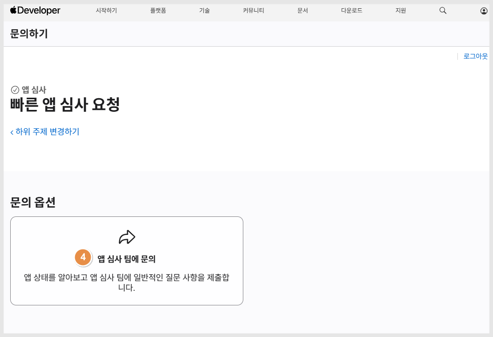

# 앱스토어 앱심사 - 빠른 심사 요청

***

앱스토어를 이용하다 보면, 심사가 1\~2일 내 바로 되는 경우도 있지만&#x20;

몇 주가 지나도록 심사중인 상태도 있고, 업데이트 일정에 따라 보다 빠른 심사가 요구되는 경우도 있어요.

그럼, 개발자는 애플 개발자 고객센터를 통해서 빠른 앱 심사 요청을 제출할 수 있습니다.&#x20;

가이드에서 애플 앱스토어에 빠른 앱 심사를 요청하는 방법을 알려드립니다.&#x20;

\*구글 플레이스토어는 빠른 앱심사가 제공되지 않습니다. 앱스토어만 제공되는 점 참고해주세요.

***

**애플 개발자 고객센터 - 문의하기 접속**&#x20;

🔗[https://developer.apple.com/contact/#!/topic/select](https://developer.apple.com/contact/#!/topic/select)

<figure><figcaption></figcaption></figure>

문의하기 페이지 접속 후&#x20;

1\)새로운 문제에 대한 도움 받기 - "주제보기>"를 선택합니다.

<figure><figcaption></figcaption></figure>

2\)"앱 심사" 를 선택합니다.&#x20;

<figure><figcaption></figcaption></figure>

3\)하위주제: "빠른 앱 심사 요청" 선택합니다.

<figure><figcaption></figcaption></figure>

4\)앱 심사팀에 문의 선택해주세요.

