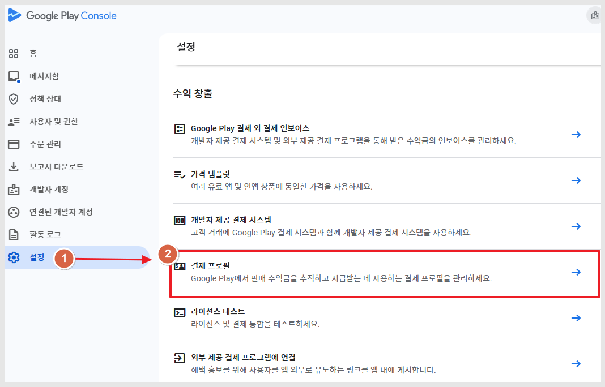

# \[구글] 인앱 판매자 계좌정보 입력

***

**인앱- 구글 판매자의 계좌정보를 입력하는 방법**

계좌정보를 입력하기 전, 먼저 구글에서 사용할 판매자 계정을 등록해주시구요.&#x20;

판매자 계정 등록이 완료되면 **결제수단- 판매자의 계좌정보**를 입력해야 하는데요.

인앱 결제의 경우 결제가 완료되면 구글에 등록한 판매자의 계좌로 입금이되요.&#x20;

따라서 **계좌정보- 예금주 이름, 은행명, 계좌번호를 입력하여 사용해야 합니다.** \
\
**매뉴얼을 통해서 구글 플레이 콘솔사이트에서 판매자의 계좌정보 -결제수단을 입력하는 방법을 알려드릴게요.**&#x20;

***

### 구글 플레이 콘솔 접속&#x20;

<figure><figcaption></figcaption></figure>

설정 - 결제 프로필 선택

<figure><figcaption></figcaption></figure>

결제 프로필 화면에  \[지금 확인하기] 메시지가 떠 있을 것입니다.

&#x20;지금 확인하기 선택 - 구글에입금된 금액을 입력하고 확인 버튼 눌러주세요.&#x20;

<figure><figcaption></figcaption></figure>

은행계좌 확인이 완료되었다는 메시지 창이 뜹니다.

<mark style="color:blue;">**판매자 지급계좌 설정 완료**</mark> \
\
계좌 승인이 완료되면, 본격적으로 판매자의 지급계좌 설정이 완료되며 판매가 가능해집니다.

\*그리고 판매자 계좌정보 수정도 가능해요.&#x20;

**지급받는 방법- 결제수단 추가를 선택해서 다른 계좌를 추가하여 사용할 수도 있어요.**
