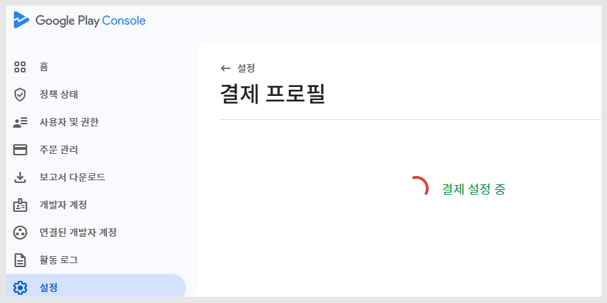

# \[인앱] 구글 개발자 '결제 프로필' 설정 방법

구글 개발자 \[결제 프로필] 설정 방법 매뉴얼

결제 프로필을 만들고, 결제수단을 입력하는 방법

***

## **1.결제프로필 만들기**&#x20;

**구글 플레이 콘솔 사이트 접속**

[**https://play.google.com/console/developers**](https://play.google.com/console/u/0/developers)



<figure><figcaption></figcaption></figure>

1\)설정 선택

2\) \[결제 프로필] 메뉴로 이동합니다.

<figure><figcaption></figcaption></figure>

3\)<mark style="color:blue;">**\[결제 프로필 만들기]**</mark> 버튼 선택합니다.&#x20;

<figure><figcaption></figcaption></figure>

4\)결제 프로필을 선택합니다.&#x20;


\*거래에 사용할 결제프로필을 새로 만들어도 되구요.

처음 개발자 계정 생성시 등록한 결제프로필을 사용하셔도 됩니다.&#x20;

해당 가이드에서는 만들어진 기존 결제프로필을 선택해서 이용하겠습니다.&#x20;


<figure><figcaption></figcaption></figure>

— 결제프로필이 설정 중입니다.

***

## 2.결제 프로필-고객 정보 입력

<figure><figcaption></figcaption></figure>

5\) 만들어진 프로필에서 세금 정보를 입력합니다.

1. 사업자 유형 선택: '일반 과세자' or '간이 과세자' 중에서 선택합니다.
2. 사업자등록번호 입력
3. 대표자 이름 입력&#x20;

<figure><figcaption></figcaption></figure>

6\)비즈니스 공개 정보를 입력합니다.

1. 웹사이트 주소 입력 \*선택사항으로 입력하지 않아도 괜찮습니다.
2. 판매하는 제품 및 서비스 선택&#x20;
3. 이메일주소 입력
4. 신용카드명세서 이름 입력 \*명세서 발송시 기재되는이름으로, 회사 이름 기재하시면 됩니다.&#x20;

7\) \[제출] 버튼 선택

***

## 3.결제-결제 수단 입력

<figure><figcaption></figcaption></figure>

8\)결제 수단을 추가해주셔야 합니다.

지급받을 방법 - 결제 수단 추가를 선택해주세요.&#x20;

<figure><figcaption></figcaption></figure>

9\)수익금을 정산 받을 은행계좌 정보를 기재합니다.

1. 예금주 이름 입력 \*법인은 반드시 회사 통장을 사용하셔야 합니다.&#x20;
2. 은행코드 입력 <mark style="color:red;">\*은행코드를 모른다면 인터넷에서 검색하셔서 조회할 수 있어요. 코드를 찾아서 입력해주세요.</mark>
3. 계좌번호 입력

10\)기본 지급 수단으로 설정 체크

11\)\[저장] 버튼을 누르면 완료됩니다.

\* 비지니스 정보: 제품을 판매할 나라를 선택할 때 ‘대한민국’이라고 선택했기 때문에 **은행계좌는 대한민국에서 발급된 계좌로 입력해주셔야 합니다.** &#x20;

계좌 입력은 모두 완료되었습니다.&#x20;


<mark style="color:blue;">\*구글에서 사용자(관리자)가 입력한 계좌가 정상적인 계좌인지 확인하기 위해서 3일 이내로 1,000원 미만의 금액을 해당 계좌로 입금하게 되요.</mark>&#x20;

통장에 입금이 된 금액을 확인하고 결제 수단 페이지에서 정확히 입금된 금액을 입력해야 계좌 인증이 완료됩니다.&#x20;

인증 완료가 되지 않으면, 정산을 받을 수 없기때문에 잊지 말고 꼭 해주세요!!


***

## 4.입금 계좌 인증하기


계좌 입금은 바로 되지 않습니다.&#x20;

3-5일(평일 기준)  이후 구글에서 1000원 미만의 금액을 계좌로 입금합니다.&#x20;

구글에서 입금이 들어오면, 다시 결제프로필 페이지로 이동 후, 입금 금액을 입력해주셔야 합니다.&#x20;


통장 계좌로 구글에서 입금이 되면  &#x20;

* 설정 - 결제 프로필 페이지로 이동하시면 \[지금 확인하기] 메시지가 떠 있을 것입니다.

**구글에서 입금한 금액을 확인하여 금액을 선택하고, \[확인] 버튼을 눌러주세요.**&#x20;

은행계좌 확인이 완료되었다는 메시지 창이 뜹니다.&#x20;

***

**5.판매자 지급계좌 설정 완료** \

계좌 승인이 완료되면, 본격적으로 판매자의 지급계좌 설정이 완료되며 인앱 상품 판매가 가능해집니다.&#x20;

\*그리고 판매자 계좌정보 수정도 가능해요.&#x20;

**지급받는 방법- 결제수단 추가를 선택해서 다른 계좌를 추가하여 사용할 수도 있습니다.**

