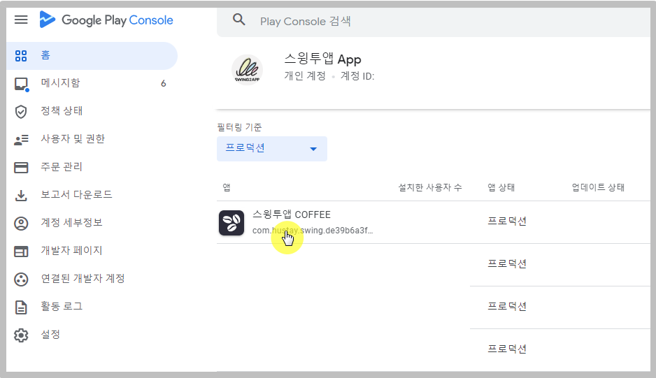
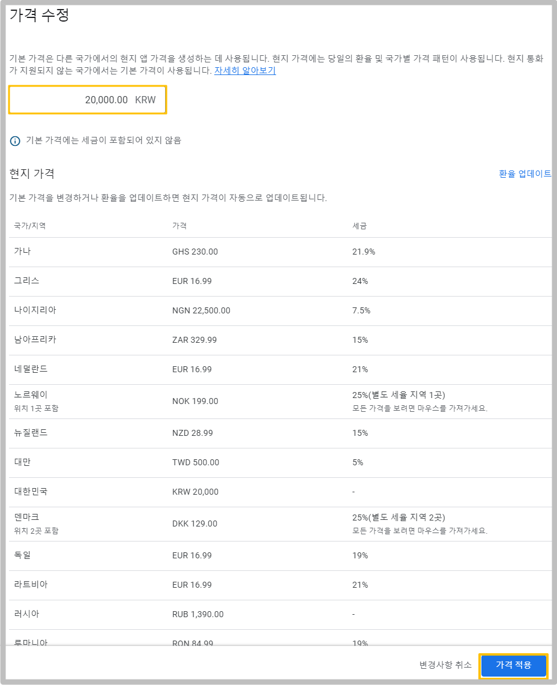
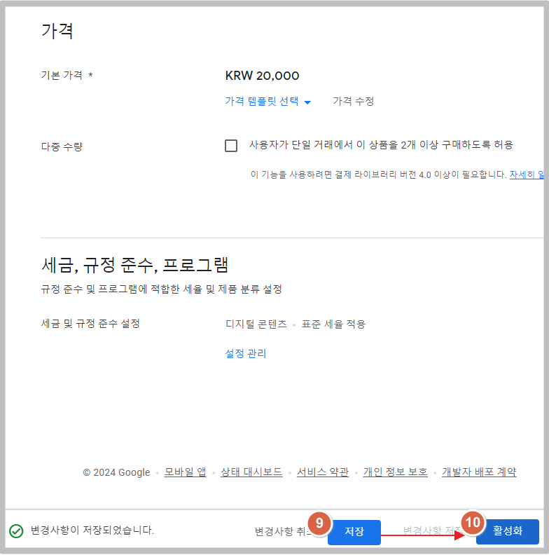
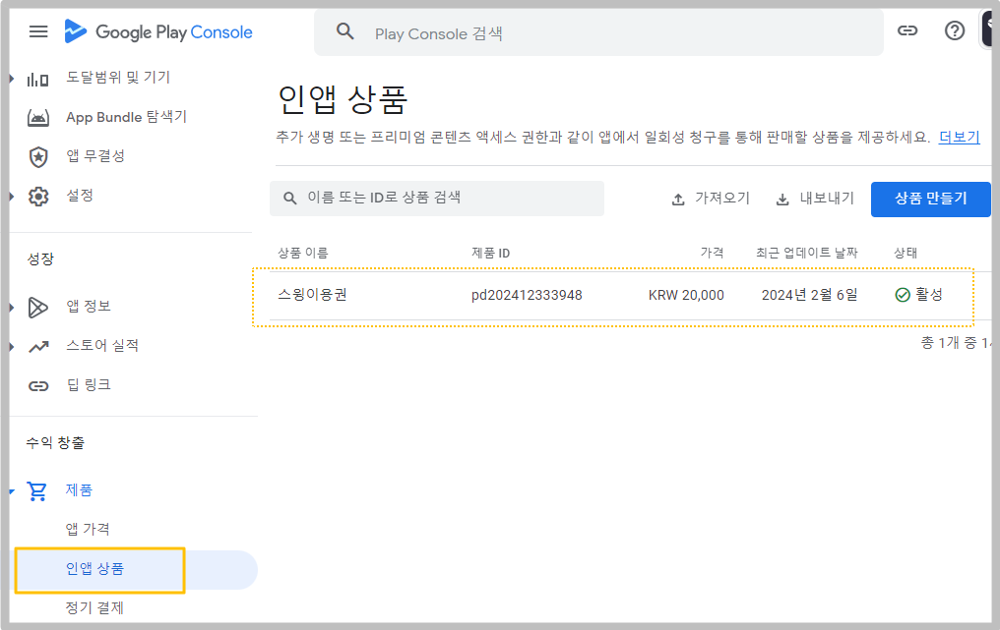

# \[인앱] 구글플레이스토어 인앱 상품 등록하기

***

[**구글 플레이콘솔 사이트**](https://play.google.com/console/u/0/developers) **접속**&#x20;

판매자 계정을 설정하기 위해서는 구글 개발자 계정을 먼저 만들어주셔야 합니다.&#x20;

개발자 계정 비용 25$ 결제 후 판매자 계정을 설정해주세요.&#x20;

<figure><figcaption></figcaption></figure>

구글 개발자 콘솔사이트에 접속 후, 어플리케이션 목록에서 인앱 상품을 등록할 어플을 선택해주세요.

## **STEP1. 상품 만들기**

<figure><figcaption></figcaption></figure>

수익창출 - 제품 - 인앱 상품 선택 - **\[상품 만들기] 버튼 선택**

\*이때 제품을 등록하기 전에 먼저 판매자 계정이 설정되어 있어야 합니다.

판매자 계정이 설정이 되어 있지않으면, 계정을 먼저 만들어야 한다고 안내 문구가 뜹니다.

해당 이용방법은 [**\[판매자 계정 만드는 방법 포스팅\]**](http://blog.naver.com/swing2app/221151714353)을 확인해주세요.

***

## **STEP2. 인앱 상품 만들기(정보 입력)**

<figure><figcaption></figcaption></figure>

1\)제품 ID입력

<mark style="color:red;">**\*제품 ID는 먼저 스윙홈페이지 – 스윙샵 상품관리에서 제품 아이디를 입력해야 합니다.**</mark>&#x20;

상품 등록에서 기재한 ID를 여기에도 동일하게 입력해주시면 되요.&#x20;

2\)상품 이름 입력

3\)상품 설명 입력

4\)기본가격: 가격 설정 선택

<figure><figcaption></figcaption></figure>

가격설정을 탭하면 가격을 입력할 수 있습니다.

한국 원화 기본 셋팅되며, 원하는 가격을 입력한 뒤 \[가격 적용] 버튼을 선택합니다.&#x20;

현지 가격은 당일의 환율 및 국가별 가격패턴(세금)이 적용됩니다.&#x20;

**각 나라의 환율, 세금에 따라서 나라마다 결제 금액이 달라지게 되요.**

인앱(In-App)의 특성상 어떤 나라에서 결제를 하더라도 그 나라의 현지 통화로 변경이 되어서 결제가 되요.

현지가격은 그날의 환율에 따라 금액이 달라지는 것으로 알고 계셔야 합니다.

<figure><figcaption></figcaption></figure>

5\)세금 및 규정 준수 설정 \[설정 관리] 선택

6\)디지털 제품인지 or 서비스 제품인지 체크합니다.

7\)스트리밍 제품이 아닙니다 체크 (스트리밍이 포함되어 있을 경우 '스트리밍 제품입니다' 체크해주세요)

8\)\[적용] 버튼 선택

<figure><figcaption></figcaption></figure>

9\)저장&#x20;

10\)활성화 선택

아직 상품 노출을 원하지 않는다면, 비활성화로 적용셔도 됩니다.

준비가 완료 된 후 다시 활성화로 변경 가능합니다.&#x20;

***

## **STEP3. 상품 등록 완료**

<figure><figcaption></figcaption></figure>

다시 인앱 상품 메뉴로 이동하면, 추가된 인앱 상품을 확인할 수 있습니다.&#x20;

만약 아직 판매할 상품은 아니라면, 상태를 비활성으로 수정해주시면 되구요.

새로 또 제품을 추가할 때에는 **\[상품 만들기]** 버튼을 선택해서 동일한 방법으로 만들 수 있습니다.

***

## **STEP4. 스윙샵에서 제품 ID입력하는 방법**

**스윙 홈페이지 접속 후 스윙샵 →상품관리 → 상품등록화면으로 이동합니다.**

상품등록은 기존의 방법과 동일하게 해주시구요.

결제수단부터 확인해주세요.

먼저! 인앱 셋팅이 완료되면, **\*상품별 결제수단에는 \[안드로이드 인앱, 아이폰 인앱] 을 선택합니다.**

인앱결제를 체크하면 바로 밑에 상품 아이디를 입력하는 란이 생성됩니다.\
\
**\*여기서 **<mark style="color:blue;">**상품 아이디는 = 주문아이디**</mark>**와 동일하구요.**

<mark style="color:red;">**사용자가 직접 원하는 ID로 설정**</mark>을 하시면 됩니다.

<mark style="color:red;">**ID는 영문과(소문자)+숫자를 혼합**</mark>해서 기재해주시면 됩니다.&#x20;

**1)안드로이드 인앱 상품 아이디**

**2)아이폰 인앱 상품 아이디**

&#x20;

안드로이드, 애플 ID가 동일해도 상관 없으며,  관리자가 관리하기 용이하게 ID를 정해주세요.

여기서 기재한 아이디가 플레이스토어와 앱스토어에서 주문 ID로 사용이 됩니다.

해당 아이디를 위의 구글 인앱 제품 등록의 제품ID로 기재해주시면 됩니다.
