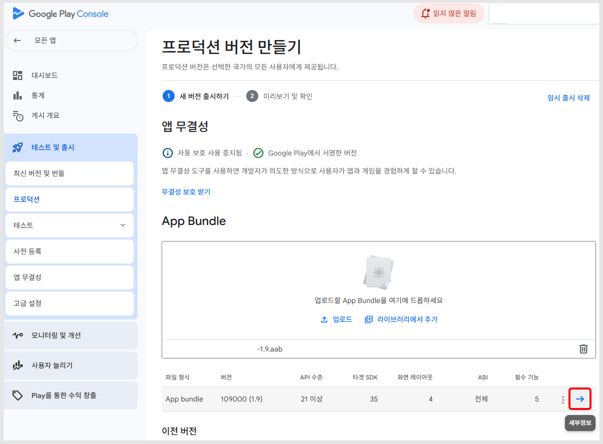
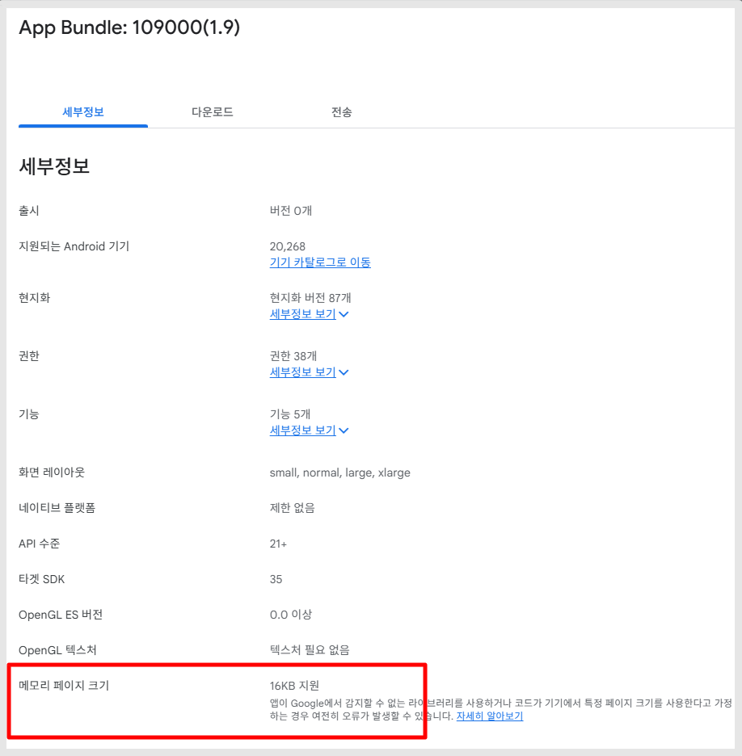
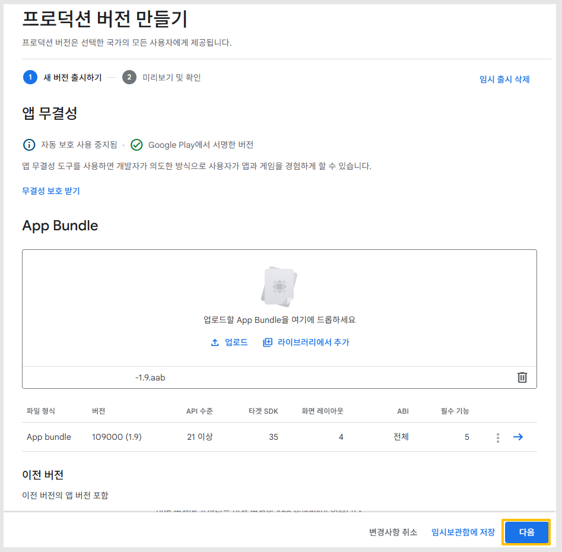
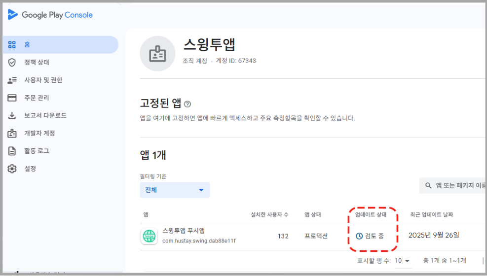
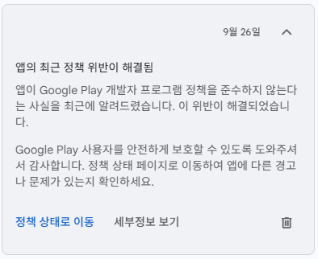
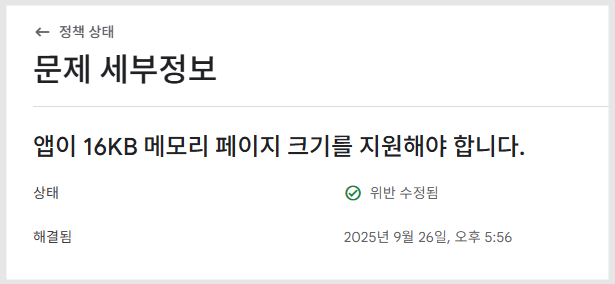

# 플레이스토어 16KB 업데이트 제출하기

***

<mark style="background-color:yellow;">**25년 9월 30일 이후 제작한(업데이트) 앱에 16KB 메모리 크기 반영됩니다.**</mark>&#x20;

구글 플레이스토어 - 16KB 메모리크기 앱업데이트를 진행하는 방법입니다.

해당 과정은 **스윙투앱 사용자분들이 직접 해야 하는 작업**이며, 앱을 업데이트 후 - 플레이 콘솔에 제출을 해야 합니다.

만약 직접 제출이 어렵다면 스윙투앱에 업로드 신청을 주시면 모든 과정 대행해드립니다.

아래 플레이스토어 업로드 신청방법 확인해주세요.


**\[플레이스토어 업로드 신청방법]**

1\)앱제작 화면으로 이동 후 앱 업데이트를 먼저해주세요. [\*앱 업데이트 가이드](https://documentation.swing2app.co.kr/manual/v3/update)

(이미 앱을 업데이트 하셨다면, 티켓 구매 후 업로드 신청주세요)

2\)플레이스토어 업로드티켓을 구매해주세요 (플레이스토어 업로드티켓 20,000원)

[티켓 구매 페이지](http://www.swing2app.co.kr/view/order_info_action?product_id=4) (티켓이 있다면 바로 3번으로 이동하여, 업로드 신청주세요)

3\)[앱운영 – 버전관리 - 앱제작 이력](http://www.swing2app.co.kr/view/app_work_history) 이동 후 \[플레이스토어 업로드 신청] 버튼 눌러서 업로드 신청주시면 됩니다.

\*신청서에 수정할 내용이 있으시면(설명, 스크린샷 이미지 등) 수정 후 신청주시면 되고, 없으시면 그대로 신청하기 버튼 눌러 제출해주세요



앞서 API35 업데이트를 안했다면, 이번에 업데이트를 하신 뒤 플레이콘솔에 제출해주세요.

API35 버전과 16KB메모리크기 반영된 버전으로 모두 반영되어 조치 완료됩니다.&#x20;


***

## **1.앱 업데이트** 

앱제작에서 앱을 먼저 업데이트 해주세요.

**스윙투앱 제작 시스템에서 메모리 페이지 크기 16KB로 레벨로 셋팅을 완료했습니다.**

<mark style="background-color:yellow;">**\*2025년 9월 30일 이후 제작한 앱 - 일반 프로토타입, 웹뷰앱, 푸시앱 모두 동일합니다.**</mark>

사용자분들은 앱을 업데이트 해야  16KB 반영된 버전으로 제작됩니다.   &#x20;

해당 앱을 플레이스토어에 제출해야 완료됩니다.

<figure><figcaption></figcaption></figure>

1\)앱제작 화면으로 이동

<figure><figcaption></figcaption></figure>

2\)오른쪽 상단 \[앱 업데이트] 버튼 선택

3\)업데이트 표시 옵션 체크 후 \[제작하기] 선택

<mark style="color:red;">**\*푸시앱 업데이트 표시옵션: "업데이트 표시 안함"으로 체크 후 제작해주세요.**</mark>


<mark style="color:orange;">**웹뷰앱은 업데이트 팝업이 뜨지 않습니다.**</mark>

업데이트 버튼 선택시 바로 앱제작이 시작됩니다.

**Q.웹뷰앱은 왜 업데이트 표시 옵션 선택이 안뜨나요?**

웹뷰앱은 업데이트시 앱에서 업데이트 안내 팝업이 뜨지 압습니다.

따라서 업데이트 표시 옵션 자체를 선택할 필요가 없습니다.


**📢일반 프로토타입 앱 업데이트 방법**

\*업데이트시 업데이트 유형: **'하드업데이트(앱 재설치)'** 선택해주세요.

\*업데이트 표시옵션: **‘업데이트 표시 안함**’으로 선택해주세요.

<mark style="color:red;">만약 해당 업데이트 외에 다른 내용이 변경된 것이 있어서, 사용자들에게 업데이트를 꼭 유도해야 한다면 업데이트 표시 옵션: "필수" 혹은 "권장"으로 선택해주세요.</mark>

<figure><figcaption></figcaption></figure>

앱제작이 시작되면, [앱운영- 버전관리-앱운영](https://www.swing2app.co.kr/view/app_work_history) 화면으로 이동합니다.

**앱제작은 최대 10분 정도 소요되오니, 제작완료되는 시간을 조금 기다려 주세요.**

제작 완료가 되면 AAB파일 받기 버튼이 활성화 됩니다.

AAB파일 받아주신 뒤, 플레이 콘솔로 이동합니다.

***

## **2.구글 플레이스토어 앱 업데이트** 

[**구글 플레이 콘솔**](https://play.google.com/console/u/0/developers) 접속

<figure><figcaption></figcaption></figure>

1\)업데이트 하고자 하는 앱 선택

<figure><figcaption></figcaption></figure>

2\)테스트 및 출시 - 프로덕션 선택

3\)새 버전 만들기 선택

<figure><figcaption></figcaption></figure>

4)App Bundle 화면 - \[업로드]를 선택해서 AAB파일을 등록합니다.

<mark style="background-color:blue;">**\*AAB파일 가져오는 방법**</mark>

<figure><figcaption></figcaption></figure>

[**앱운영- 버전관리 – 앱제작이**력](https://www.swing2app.co.kr/view/app_work_history) 페이지 \[AAB파일 받기 선택]

PC로 다운된 AAB파일을 위의 구글 플레이 – 프로덕션 – App Bundle 파일로 업로드 해주시면 됩니다.


**\*중요안내**

**-APK파일로 출시된 앱→업데이트도 APK파일로 등록해주세요.**

**-AAB파일로 출시된 앱→업데이트도 AAB파일로 등록해주세요.**

플레이스토어 업데이트를 하는 경우, 기존 APK파일로 출시된 앱은 AAB파일이 아닌 APK파일로 올려주시면 됩니다.

일반 프로토타입 앱, 푸시/웹뷰 앱 모두 동일합니다. 즉, 파일 확장자를 동일하게 맞춰서 업데이트 해주셔야 합니다.


<mark style="background-color:blue;">**\*메모리크기 16KB 적용된 버전인지 확인하는 방법**</mark>

<figure><figcaption></figcaption></figure>

5\) AAB파일 업로드 후, '→'세부정보 버튼을 선택해주세요.

<figure><figcaption></figcaption></figure>

새로 업로드된 파일의 메모리 페이지 크기를 확인할 수 있습니다.

16KB지원이라고 되어 있다면, 앱 업데이트가 잘 된 것입니다.&#x20;

<figure><figcaption></figcaption></figure>

\[다음] 버튼 선택합니다.

<figure><figcaption></figcaption></figure>

6\)'저장' 선택

7\)'개요로 이동' 선택

<mark style="color:orange;">\*제출 전 오류, 경고 및 메시지에 경고 메시지가 뜰 수 있어요.</mark>

경고 메시지는 무시하고 넘어가도 됩니다. (출시에는 아무 영향을 주지 않아요!)

단, 에러라고 해서 다음 단계로 넘어가지 않는다면 이때는 문제가 있는 것이니 조치를 따라주시구요.

&#x20;내용 확인이 어렵다면, 스윙투앱 고객센터로 문의주시기 바랍니다.

<figure><figcaption></figcaption></figure>

8\)검토를 위해 변경사항 00개 전송

\*변경사항 갯수는 앱에 따라 다릅니다. 앱 마다 변경되는 사항이 다 다를 수 있어서 숫자는 다르게 나타납니다.

9\)검토를 위해 변경사항 전송 선택

<figure><figcaption></figcaption></figure>

홈화면으로 돌아와서 업데이트 상태가 "검토중"으로 변경되었는지 확인해주세요.

검토중이면 정상적으로 앱 심사가 제출된 상태입니다.

만약 "제출 준비중" 등으로 내용이 뜨면 제대로 제출이 안된 것이오니 '게시개요'로 이동해서 심사를 제출해주세요.

이제 심사를 기다려 주세요.


업데이트도, 앱 출시와 동일하게 심사 시간이 있어요.

(보통 1\~2일 이내로 완료되지만, 최대 7일까지 심사가 걸릴 경우도 있습니다.)

-심사가 완료되면 업데이트된 버전으로 다시 출시가 됩니다.

-업데이트 심사에서 심사가 거절될 수도 있기 때문에 거절 될 경우 내용을 확인하여 다시 재심사 진행해야 합니다.

업데이트가 완료되면, 출시 개요 페이지에서 프로덕션 출시를 확인할 수 있습니다.

만약 ‘업데이트 거절됨’, ‘업데이트 거부됨’, ‘앱 삭제’ 등의 메시지가 뜰 경우 심사가 거절된 것이구요.

구글에서 받은 거절 메일 확인하셔서 조치사항대로 처리해주셔야 합니다


***

## **3.16KB 정책 위반 해결 메시지** 

<figure><figcaption></figcaption></figure>

<figure><figcaption></figcaption></figure>

앱 업데이트가 완료된 후 하루가 지나면, 위의 메시지가 뜹니다.&#x20;

'해결됨'  메시지가 뜨면 조치가 완료된 것입니다.

**해당 메시지까지 떠야 모든 작업 완료됩니다**.


\***해당 메시지는 앱이 업데이트 되어도 최대 하루 정도 시간이 더 소요될 수 있습니다.**

**따라서 앱이 업데이트 되었는데 메시지가 안 뜬다면 하루 정도 기다려보신 뒤 확인해주세요.**


***

위의 가이드는 앱 업데이트 후 직접 플레이 콘솔에 제출하는 과정 가이드입니다.

만약 직접 제출이 어렵다면 스윙투앱에 업로드 신청을 주실 경우 업로드 대행해드립니다.

아래 플레이스토어 업로드 신청방법 참고해주세요.


**\[플레이스토어 업로드 신청방법]**

1\)앱제작 화면으로 이동 후 앱 업데이트를 먼저해주세요. [\*앱 업데이트 가이드](https://documentation.swing2app.co.kr/manual/v3/update)

(이미 앱을 업데이트 하셨다면, 티켓 구매 후 업로드 신청주세요)

2\)플레이스토어 업로드티켓을 구매해주세요 (플레이스토어 업로드티켓 20,000원)

[티켓 구매 페이지](http://www.swing2app.co.kr/view/order_info_action?product_id=4) (티켓이 있다면 바로 3번으로 이동하여, 업로드 신청주세요)

3\)[앱운영 – 버전관리 - 앱제작 이력](http://www.swing2app.co.kr/view/app_work_history) 이동 후 \[플레이스토어 업로드 신청] 버튼 눌러서 업로드 신청주시면 됩니다.

\*신청서에 수정할 내용이 있으시면(설명, 스크린샷 이미지 등) 수정 후 신청주시면 되고, 없으시면 그대로 신청하기 버튼 눌러 제출해주세요


