# 구글 플레이 정책 - 데이터 보안

***

**데이터 보안이란?**

​데이터 보안은 **앱에서 어떤 데이터를 수집 및 공유하는지, 사용자 데이터 유형이 무엇인지 항목을 제출**하는 메뉴입니다.

예시) 개인정보: 이름, 연락처, 주소, 생년월일 / 위치 정보/ 금융정보 수집 등 앱 마다 수집하는 데이터 항목을 체크

따라서 앱에서 제공하는 사용자의 데이터 수집 정보를 플레이스토어에 모두 제출하여 심사시 문제가 없도록 해야 합니다.

\-신규 앱을 등록하는 사용자분들은 프로세스에 따라 등록해주시면 되구요.

\-기존 앱 출시 사용자분들은 앱 콘텐츠 메뉴로 이동하시면, 새롭게 추가된 '데이터 보안' 메뉴를 확인할 수 있습니다.

​

\*해당 정책은 플레이스토어에 앱을 출시했거나, 출시하고자 하는 분들은 필수!! 입력해야 하는 사항입니다.

2022년 상반기 부터 모든 앱에 적용 반영됩니다. (2022년 2월 반영)

따라서 기존 앱 출시 사용자분들은 해당 정책사항을 확인하시어 '데이터 보안' 메뉴를 반드시 입력 완료해주시기 바랍니다.

'데이터 보안' 메뉴 미입력시 정책위반으로 앱이 플레이스토어에서 삭제될 수 있습니다.


### **데이터 보안 메뉴 입력시 주의사항**

'데이터 보안' 메뉴 입력방법은 매뉴얼이 있는 것이 아닙니다.

즉, 모두 동일하게 체크해야 하는 항목이 아니며 사용자분들이 만든 앱에 따라 입력 및 체크해야 하는 항목이 모두 다릅니다.

<mark style="color:red;">예를 들어 로그인 메뉴에서 앱 아이디, 이메일주소, 사용자 전화번호, 주소 등을 수집한다면 해당 정보를 체크해주셔야 하구요.</mark>

<mark style="color:red;">로그인 메뉴에서 앱 아이디만 입력할 경우 해당 정보만 체크하는 등 어떻게 앱을 제작했는지에 따라서 체크해야 하는 정보가 다릅니다.</mark>

특히! 웹사이트를 연결한 웹앱-푸시, 웹뷰앱 사용자분들은 웹사이트에서 수집하는 정보를 바탕으로 체크해주셔야 합니다.

해당 **매뉴얼**에서는 진행방법만 확인해주시기 바랍니다.


<figure><figcaption></figcaption></figure>

## **STEP1. 앱 콘텐츠 메뉴 - 데이터 보안**

**​구글 플레이 콘솔 사이트 접속 후 로그인**



<figure>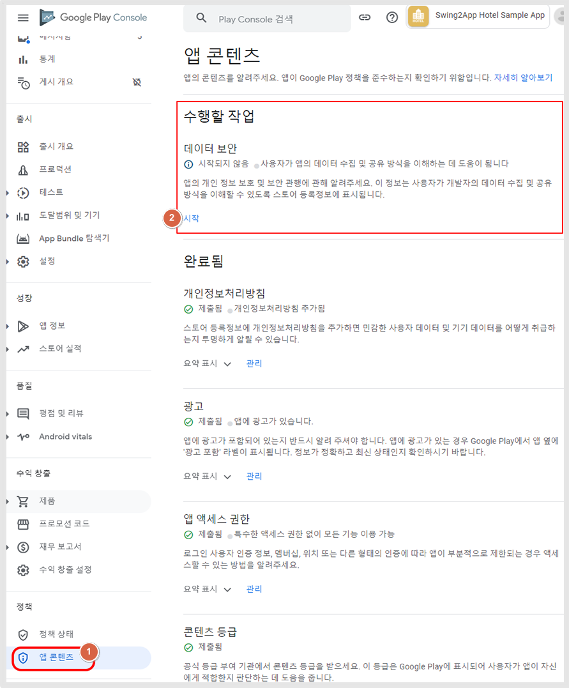<figcaption></figcaption></figure>

\*처음 앱을 등록하는 분들은 등록 단계 중 정책 -\[앱 콘텐츠]메뉴로 이동 - 데이터 보안 시작

\*앱이 출시된 사용자는 앱 선택 후 - 정책 - \[앱 콘텐츠]메뉴로 이동 - 데이터 보안 시작

​

1\)왼쪽 카테고리에서 \[앱 콘텐츠] 선택

2\)데이터 보안 \[시작] 선택

### <mark style="color:blue;">1. 개요</mark>

<figure>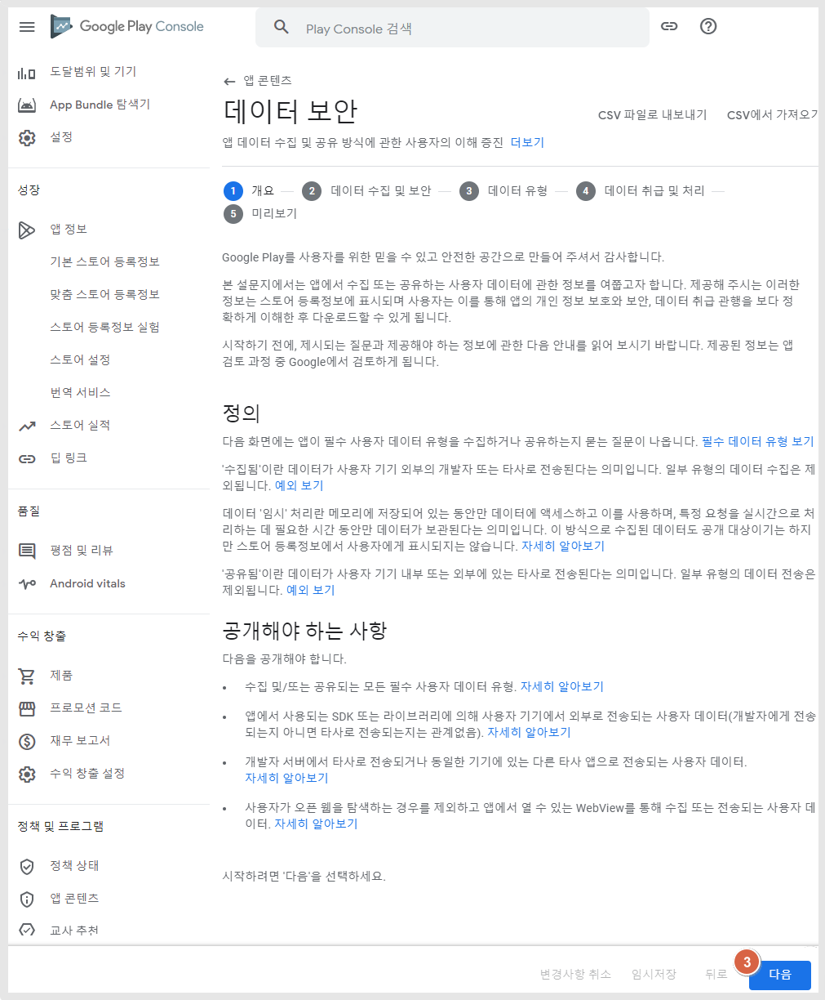<figcaption></figcaption></figure>

데이터 보안 - 개요 항목을 읽어본 뒤 \[다음] 버튼을 선택합니다.

**​**

### <mark style="color:blue;">**2.데이터 수집 및 보안**</mark>

<figure>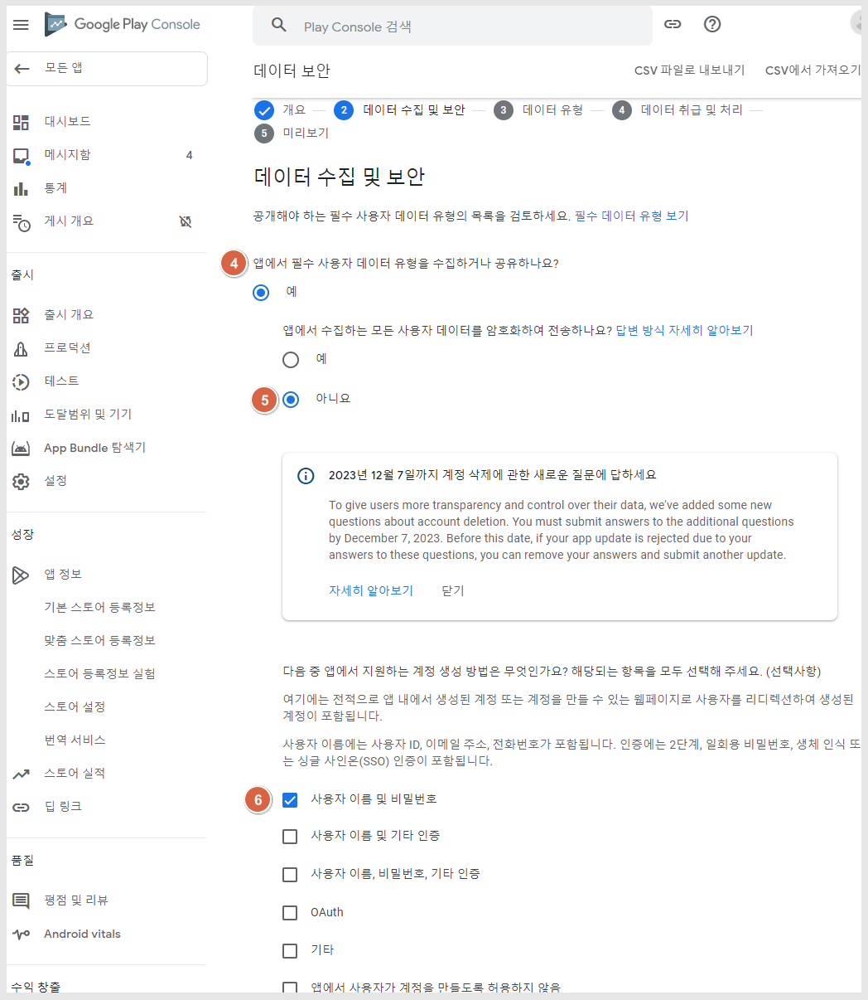<figcaption></figcaption></figure>

4\)앱에서 필수 사용자 데이터 유형을 수집하거나 공유하나요? “예”에 체크합니다.

​

5\)앱에서 수집하는 모든 사용자 데이터를 암호화하여 전송하나요?

일반 프로토타입 앱 사용자분들은 모두 “아니요” 체크

\*웹뷰or푸시앱 사용자분들은 사용자분의 웹사이트 보안에 맞게 입력해주세요.

“예” or “아니요” 모두 밑에 입력해야 하는 항목은 동일합니다.

​

6\)\[사용자 이름 및 비밀번호] 체크

거의 모든 앱은 위의 입력항목을 체크해주시면 되지만 2단계 인증(pass를 이용한 본인인증), 생체인식 등의 추가 인증을 사용하는 경우 ‘기타 인증’에도 함께 체크 해주셔야 합니다.

\*사용자 계정을 만들지 않아도 되는 앱(회원가입&로그인 기능이 없는 앱)은 다음 Case.2 조치방법 확인해주세요.

\*계정삭제에 대한 항목 제출은 12월 7일까지 입니다. 해당 기한까지 제출되지 않을 경우 앱이 삭제될 수 있습니다.

<figure>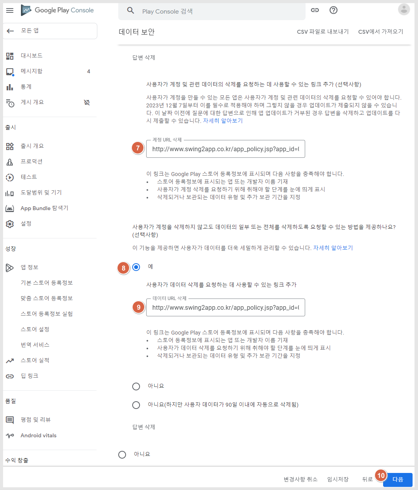<figcaption></figcaption></figure>

7\)계정 URL 입력 \*중요\*

\-일반 프로토타입앱 사용자는 스윙투앱에서 제공하는 개인정보 취급방침 링크 입력

\-웹사이트를 연결한 웹뷰 or푸시앱 사용자는 사용자분의 홈페이지에서 제공하는 개인정보 취급방침 링크를 입력합니다.

​

<mark style="color:red;">(1)스윙투앱 일반 프로토타입 앱 이용자분들 확인해주세요.</mark>

스윙투앱에서 제공하는 개인정보 취급방침 항목에 계정 삭제 및 데이터 삭제 방법에 대한 내용을 보다 정확히 명시 해놓았습니다.

\[개인정보 취급방침 링크를 가져오는 방법]

[앱운영-서비스관리-정책관리-앱가입 정책](http://www.swing2app.co.kr/view/app\_setting)- \[정책 설정하기] 버튼 선택 - 서비스 이용약관 URL보기 선택 – 인터넷 창에 기재된 URL복사하여 이용

개인정보 취급방침 링크를 가져오는 자세한 설명이 필요하다면 아래 매뉴얼 참고해주세요.



<mark style="color:red;">(2)웹뷰 or 푸시앱 사용자분들 확인해주세요.</mark>

웹사이트를 연결한 웹뷰 및 푸시앱 사용자분들은 사용자분의 홈페이지에서 제공하는 개인정보 취급방침 링크로 넣어주세요.

웹앱은 스윙투앱에서 개인정보 취급방침을 제공하지 않습니다.

따라서 웹뷰 or 푸시앱 사용자분들 사용자분의 홈페이지 내에서 제공하는 개인정보 취급방침 링크 제출해주시구요.

\*중요\* 개인정보 취급방침 내용에 사용자 계정 삭제, 회원탈퇴, 데이터 삭제방법 등의 내용이 없다면 해당 내용 명확히 기재 후 제출해주세요.

​

8\)사용자가 계정을 삭제하지 않고도 데이터의 일부 또는 전체를 삭제하도록 요청할 수 있는 방법을 제공하나요? 질문에 “예” 체크

일반 프로토타입 앱은 설정 메뉴 – 회원정보수정에서 정보를 수정하거나 삭제할 수 있습니다.

따라서 일반 프로토타입 앱 사용자분들은 “예” 체크 후 위와 동일한 개인정보 취급방침 링크를 제출해주시면 되구요.

웹뷰or푸시앱 사용자분들은 사이트에 이러한 기능을 제공하고 있는지 확인하여 맞는 답변으로 제출해주세요. 해당 기능 여부를 잘 모르겠다면 “아니요”를 선택해주세요.

“아니요” 선택시 계정 URL 입력하지 않아도 됩니다.

​

9\)위의 7번에 제출한 동일 링크(개인정보 취급방침 URL) 입력해주세요. “예”에 체크한 분들만 해당

​

10\)\[다음] 버튼 선택



### <mark style="color:blue;">Case.2계정을 제공하지 않는 앱(회원가입&로그인 기능이 없는 앱)​</mark>

앱에서 회원가입이나 로그인 기능을 제공하지 않는 앱은 아래 방법대로 조치해주세요.

\*앱에 로그인 기능이 있는데, 없다고 진행하실 경우 심사가 거절됩니다. 반드시 실제 제공하는 기능에 맞게 제출해주세요.

<figure><figcaption></figcaption></figure>

1\)앱에서 필수 사용자 데이터 유형을 수집하거나 공유하나요? “예”에 체크합니다.

2\)앱에서 수집하는 모든 사용자 데이터를 암호화하여 전송하나요?

일반 프로토타입 앱 사용자분들은 모두 “아니요” 체크

\*웹뷰or푸시앱 사용자분들은 사용자분의 웹사이트 보안에 맞게 입력해주세요.

“예” or “아니요” 모두 밑에 입력해야 하는 항목은 동일합니다.

<figure>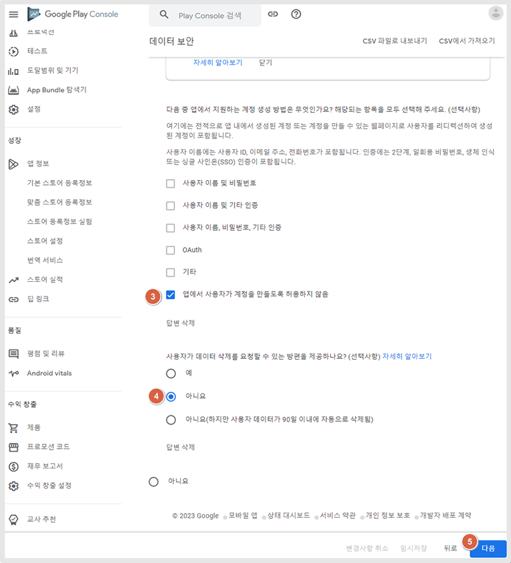<figcaption></figcaption></figure>

3\)\[앱에서 사용자가 계정을 만들도록 허용하지 않음] 체크

4\)사용자가 데이터 삭제를 요청할 수 있는 방편을 제공하나요? “아니요” 체크

5\)\[다음]버튼 선택

이후 진행과정은 아래 내용과 동일하게 진행해주시면 됩니다.



### <mark style="color:blue;">**3.데이터 유형**</mark>

데이터 유형은 앱에서 어떤 데이터를 수집 및 공유하는지 체크하는 항목입니다.

스윙투앱으로 제작한 앱은 <mark style="color:red;">\*위치, 사진 및 동영상, 파일 및 문서, 기기 또는 기타 ID</mark>에 필수 체크를 해주셔야 합니다.

​

\+추가하여 앱에 회원가입(로그인) 기능이 있을 경우

개인정보에서 이름, 아이디, 전화번호, 주소를 수집하고 있다면 위의 항목에 맞게 체크해주시구요.

그외 위치 수집 금융정보-구매내역 등, 파일 저장 등 해당되는 항목에 체크한 뒤 \[다음] 버튼을 선택합니다.

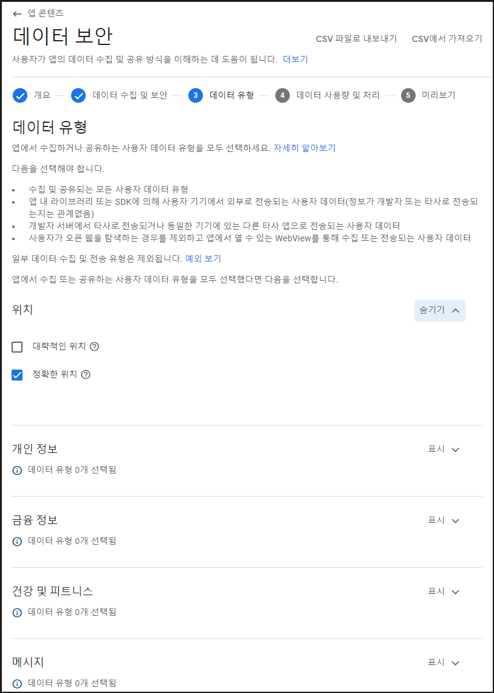

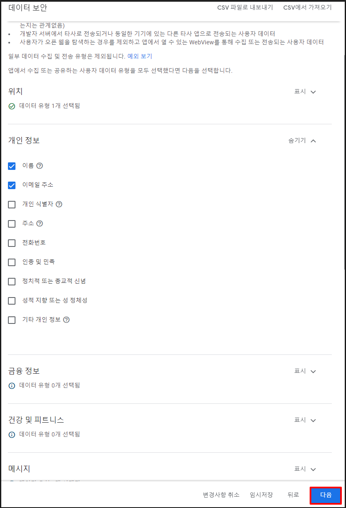

데이터 유형도 마찬가지로, 사용자의 앱에서 해당되는 항목에 체크를 해주시면 됩니다.

<mark style="color:red;">tip. 각 항목이 잘 이해되지 않으면 항목 옆에 ?물음표 버튼에 마우스 커서를 가져다 대면 해당 항목에 대한 상세 설명을 확인할 수 있어요.</mark>

**​**<mark style="background-color:yellow;">**\[기기 또는 기타 ID 데이터 유형]**</mark>

<figure>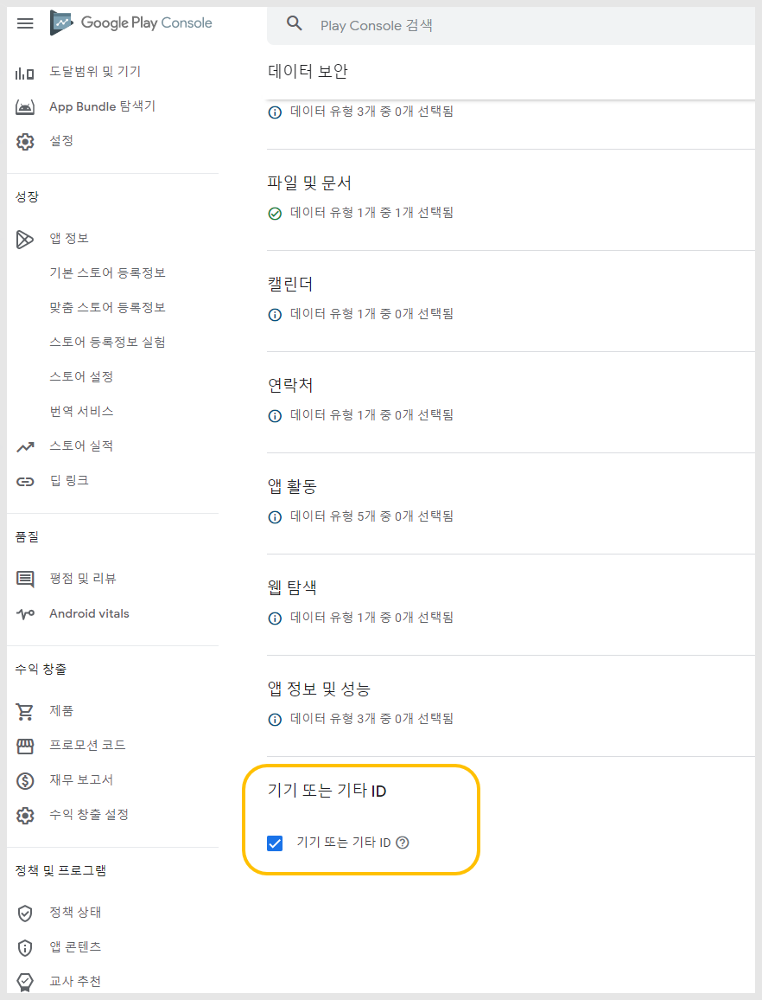<figcaption></figcaption></figure>

<figure>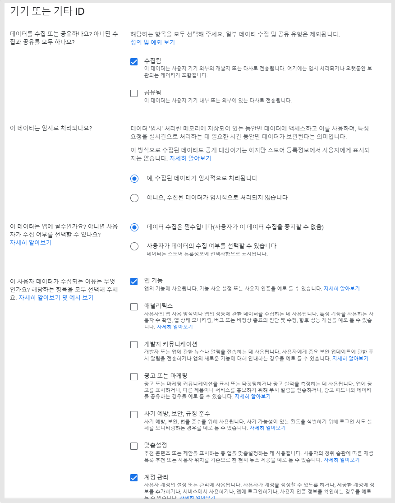<figcaption></figcaption></figure>

기기 또는 기타 ID 메뉴도 확인해서 입력을 해주세요 - **필수!!**

### <mark style="color:blue;">**4.데이터 사용량 및 처리**</mark>

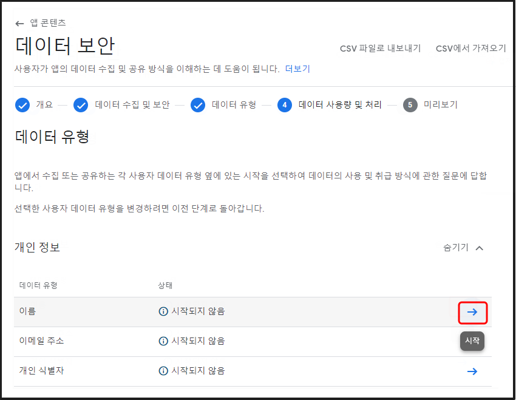

데이터 사용량 및 처리 메뉴에서는 앞서 체크한 데이터 유형별로 상세 내용을 입력하는 단계입니다.

각 데이터 유형별 시작 버튼을 선택해주세요.

​

.png)

데이터 사용량 및 처리 메뉴 상세 페이지 입니다.

해당 항목을 수집하는 이유에 대해서 체크하면 되구요.

해당 메뉴 역시 사용자의 앱에 따라 앱에서 수집하는 정보를 확인하여 체크해주세요.

입력이 완료되면 \[저장] 버튼을 선택합니다.

***

​

## **STEP2. 데이터 보안 입력완료**

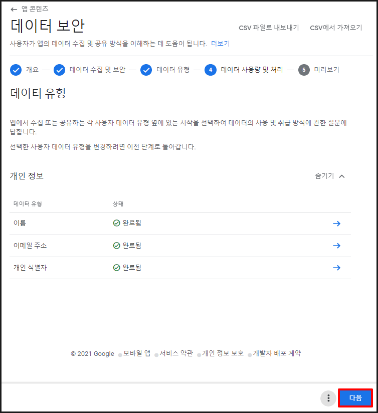

데이터 항목 입력이 완료되었습니다.&#x20;

다른 데이터 유형도 다 체크를 완료한 뒤 \[다음] 버튼을 선택합니다.

<figure>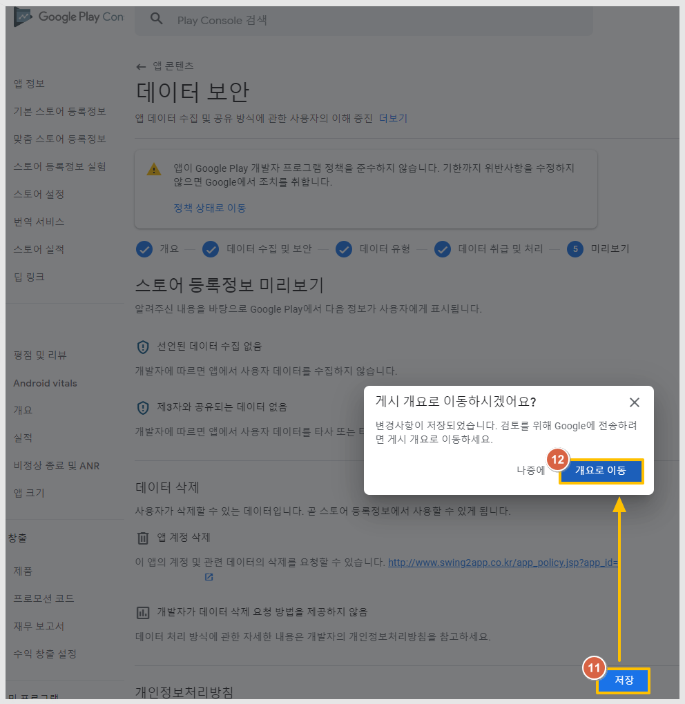<figcaption></figcaption></figure>

\[저장] 선택 - \[개요로 이동] 선택

<figure>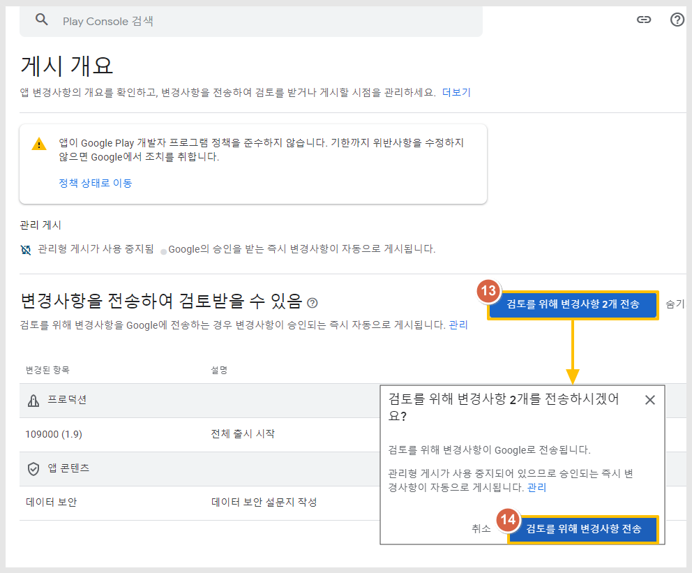<figcaption></figcaption></figure>

게시개요 화면에서 \[검토를 위해 변경사항 \~개 전송]선택 - \[검토를 위해 변경사항 전송] 선택

변경사항은 어떤 항목들을 추가 및 수정했는지에 따라 숫자가 다르게 나타납니다.

<figure><figcaption></figcaption></figure>

콘솔 대시보드를 보시면 앱 심사가 다시 들어간 것을 확인할 수 있습니다. "검토중"표시

해당 심사가 완료되어야 모든 업데이트가 완료됩니다.

\*중요\* 등록 후 반드시 대시보드 메뉴로 이동하여 앱 검토중으로 잘 넘어갔는지 체크해주세요.

간혹 제출 준비중으로 뜨고, 심사가 제대로 제출되지 않는 경우도 있습니다.

<figure><figcaption></figcaption></figure>

## **STEP3.** 모든 조치가 다 되었는지 확인하는 방법

모든 조치가 다 되었는지, 문제가 된 항목은 더 없는지 어떻게 확인하나요?

<figure><figcaption></figcaption></figure>

<figure>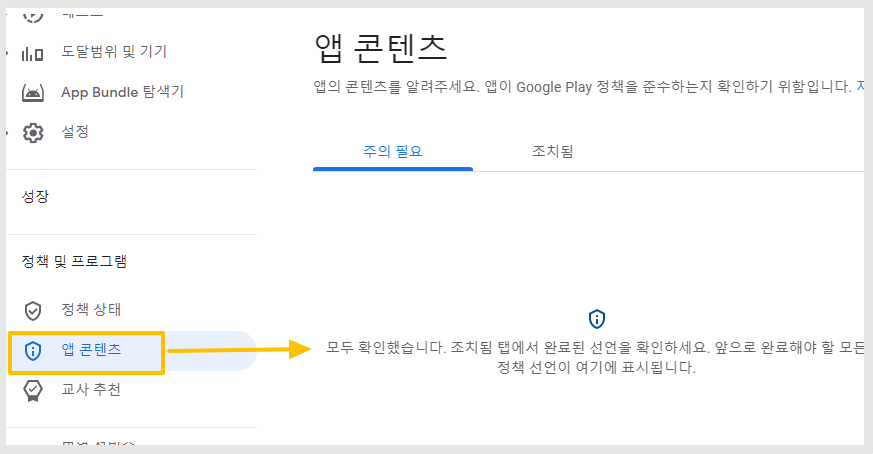<figcaption></figcaption></figure>

주의항목 제출이 모두 완료되면 정책 상태, 앱 콘텐츠 항목에서 완료된 내용을 확인할 수 있습니다.

정책 상태 – “발견된 문제 없음”, 주의 필요에서도 “모두 확인됨” 내용 및 주의가 필요한 경고 문구 등 기재된 내용이 없다면 모두 정상적으로 잘 반영이 된 것입니다.

***


정책은 2022년 상반기 부터 모든 앱에 적용 반영됩니다. (2022년 2월 반영)

'데이터 보안' 메뉴 미입력시 정책위반으로 앱이 플레이스토어에서 삭제될 수 있습니다.

현재도 구글 필터링에 따라 해당 항목 입력이 안되어 있을 경우 앱이 삭제되는 사례가 늘고 있습니다.

따라서 기존 앱 출시 사용자분들은 해당 정책사항을 확인하시어 '데이터 보안' 메뉴를 반드시 입력 완료해주시기 바랍니다.



2023년 9월 새로운 항목이 더 추가가 되었습니다.

본 내용은 최종 수정항목이 반영된 버전입니다.



해당 내용 입력이 완료되면 앱은 다시 업데이트 심사에 들어갑니다.

사용자가 기재한 내용이 적합한지 구글에서 판단해서 업데이트를 적용해주거나, 적합하지 않을 경우 심사를 거절합니다.

\*스윙투앱에서 제작한 앱으로, 위의 내용으로 기재시 특별한 이유 없이 심사가 거절된 적은 없습니다.\


