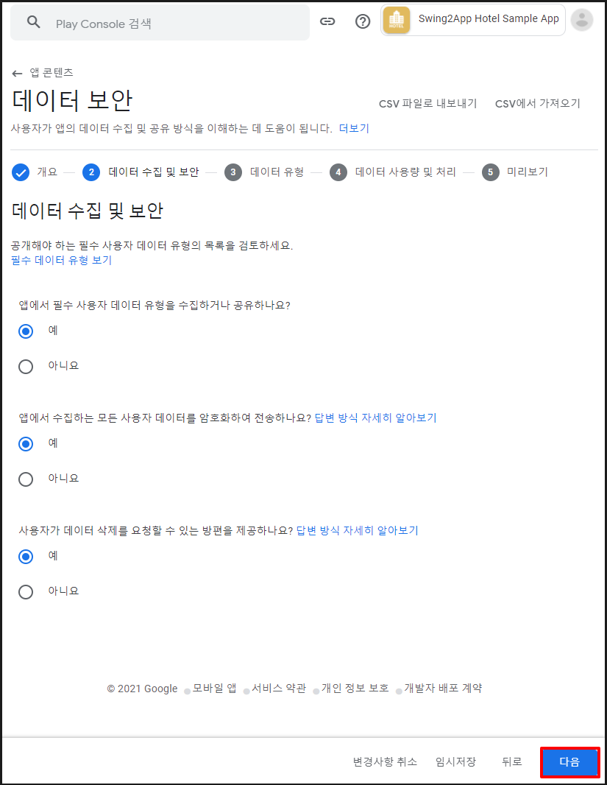

# 구글 플레이 정책 - 데이터 보안

****

**데이터 보안이란?**

​데이터 보안은 **앱에서 어떤 데이터를 수집 및 공유하는지, 사용자 데이터 유형이 무엇인지 항목을 제출**하는 메뉴입니다.

예시) 개인정보: 이름, 연락처, 주소, 생년월일 / 위치 정보/ 금융정보 수집 등 앱 마다 수집하는 데이터 항목을 체크

따라서 앱에서 제공하는 사용자의 데이터 수집 정보를 플레이스토어에 모두 제출하여 심사시 문제가 없도록 해야 합니다.

\-신규 앱을 등록하는 사용자분들은 프로세스에 따라 등록해주시면 되구요.

\-기존 앱 출시 사용자분들은 앱 콘텐츠 메뉴로 이동하시면, 새롭게 추가된 '데이터 보안' 메뉴를 확인할 수 있습니다.

​

\*해당 정책은 플레이스토어에 앱을 출시했거나, 출시하고자 하는 분들은 필수!! 입력해야 하는 사항입니다.

2022년 상반기 부터 모든 앱에 적용 반영됩니다. (2022년 2월 반영)

따라서 기존 앱 출시 사용자분들은 해당 정책사항을 확인하시어 '데이터 보안' 메뉴를 반드시 입력 완료해주시기 바랍니다.

'데이터 보안' 메뉴 미입력시 정책위반으로 앱이 플레이스토어에서 삭제될 수 있습니다.


### **데이터 보안 메뉴 입력시 주의사항**

****

'데이터 보안' 메뉴 입력방법은 매뉴얼이 있는 것이 아닙니다.

즉, 모두 동일하게 체크해야 하는 항목이 아니며 사용자분들이 만든 앱에 따라 입력 및 체크해야 하는 항목이 모두 다릅니다.

<mark style="color:red;">예를 들어 로그인 메뉴에서 앱 아이디, 이메일주소, 사용자 전화번호, 주소 등을 수집한다면 해당 정보를 체크해주셔야 하구요.</mark>

<mark style="color:red;">로그인 메뉴에서 앱 아이디만 입력할 경우 해당 정보만 체크하는 등 어떻게 앱을 제작했는지에 따라서 체크해야 하는 정보가 다릅니다.</mark>

특히! 웹사이트를 연결한 웹앱-푸시, 웹뷰앱 사용자분들은 웹사이트에서 수집하는 정보를 바탕으로 체크해주셔야 합니다.

해당 **매뉴얼**에서는 진행방법만 확인해주시기 바랍니다.


****

<figure><figcaption></figcaption></figure>

## **1. 앱 콘텐츠 메뉴 - 데이터 보안**

**​구글 플레이 콘솔 사이트 접속 후 로그인**

[https://play.google.com/console/developers](https://play.google.com/console/u/0/developers)

\*처음 앱을 등록하는 분들은 등록 단계 중 정책 -\[앱 콘텐츠]메뉴로 이동 - 데이터 보안 시작

\*앱이 출시된 사용자는 앱 선택 후 - 정책 - \[앱 콘텐츠]메뉴로 이동 - 데이터 보안 시작

​

<mark style="color:green;">앱 콘텐츠 메뉴에 \[데이터 보안] 항목이 새롭게 추가된 것을 확인할 수 있어요.</mark>

<mark style="color:green;">'시작' 버튼을 선택합니다.</mark>

<figure><figcaption></figcaption></figure>

## **2. 데이터 보안**

### **1)개요**

데이터 보안 - 개요 항목을 읽어본 뒤 \[다음] 버튼을 선택합니다.

**​**

### **2)데이터 수집 및 보안**

데이터 수집 및 보안은 앱에서 공개하는 필수 사용자 데이터 유형의 항목을 선택하는 메뉴입니다. 해당 되는 항목에 체크해주세요.

일반적으로 첫번째 항목인 데이터 유형 수집 및 공유에는 "예" 그외 항목은 "아니요"를 선택합니다.

\[다음] 버튼을 선택합니다.

<mark style="color:red;">단, 해당 되는 내용이 있다면 앱에 맞게 입력해주세요.</mark>

**​**

### **3)데이터 유형**

데이터 유형은 앱에서 어떤 데이터를 수집 및 공유하는지 체크하는 항목입니다.

데이터 유형도 마찬가지로, 사용자의 앱에서 해당되는 항목에 체크를 해주시면 됩니다.

개인정보에서 이름, 아이디, 전화번호, 주소를 수집하고 있다면 위의 항목에 맞게 체크해주시구요.

그외 위치 수집 금융정보-구매내역 등, 파일 저장 등 해당되는 항목에 체크한 뒤 \[다음] 버튼을 선택합니다.

tip. 각 항목이 잘 이해되지 않으면 항목 옆에 ?물음표 버튼에 마우스 커서를 가져다 대면 해당 항목에 대한 상세 설명을 확인할 수 있어요.

**​**

### **4)데이터 사용량 및 처리**

데이터 사용량 및 처리 메뉴에서는 앞서 체크한 데이터 유형별로 상세 내용을 입력하는 단계입니다.

각 데이터 유형별 시작 버튼을 선택해주세요.

​

.png)

데이터 사용량 및 처리 메뉴 상세 페이지 입니다.

해당 항목을 수집하는 이유에 대해서 체크하면 되구요.

해당 메뉴 역시 사용자의 앱에 따라 앱에서 수집하는 정보를 확인하여 체크해주세요.

입력이 완료되면 \[저장] 버튼을 선택합니다.

​

다른 데이터 유형도 다 체크를 완료한 뒤 \[다음] 버튼을 선택합니다.

**​**

### **5)미리보기**

스토어 등록정보 미리보기 메뉴는 따로 체크해야 할 내용은 없구요.

사용자가 체크한 입력정보를 미리보기로 확인할 수 있습니다.

\[저장] 버튼을 선택합니다.

***

<figure><figcaption></figcaption></figure>

## **3. 데이터 보안 입력완료**

.png>)

데이터 보안 메뉴 입력이 완료되었구요.

'완료됨'으로 표시되어야 앱 콘텐츠 항목 입력이 완료됩니다.


당 정책은 2022년 상반기 부터 모든 앱에 적용 반영됩니다. (2022년 2월 반영)

'데이터 보안' 메뉴 미입력시 정책위반으로 앱이 플레이스토어에서 삭제될 수 있습니다.

현재도 구글 필터링에 따라 해당 항목 입력이 안되어 있을 경우 앱이 삭제되는 사례가 늘고 있습니다.

따라서 기존 앱 출시 사용자분들은 해당 정책사항을 확인하시어 '데이터 보안' 메뉴를 반드시 입력 완료해주시기 바랍니다.


\
