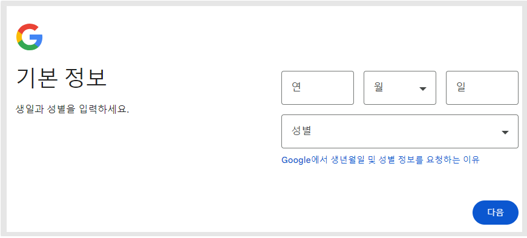
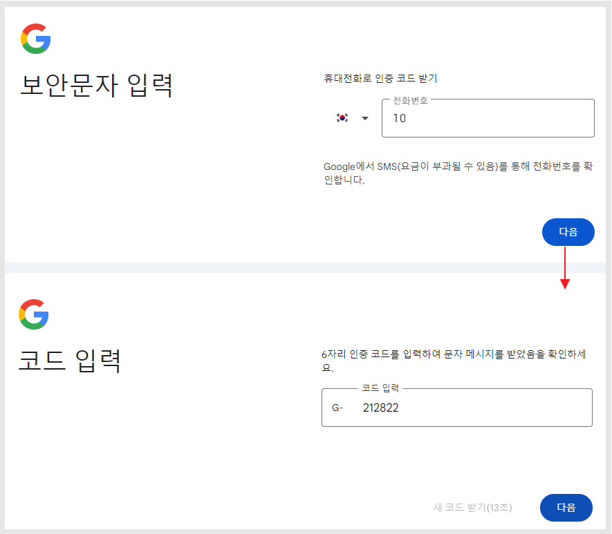

# 구글 계정 만들기

***

## 구글 계정 만들기 

구글 지메일 계정은 아래 링크로 접속해서, 새로 만들어주세요.



#### **계정 만들기 - "개인용"으로 선택하고 진행해주세요.** 

<figure><figcaption>
계정 만들기 - 개인용 선택
</figcaption></figure>

<figure><figcaption></figcaption></figure>

1\) 성, 이름 입력 후 다음

<figure><figcaption></figcaption></figure>

2\) 생년월일, 성별 입력 후 다음

<figure><figcaption></figcaption></figure>

3\)새로운 Gmail 계정을 만들어주세요. 다음 선택

<figure><figcaption></figcaption></figure>

4\) 비밀번호 입력 후 다음 선택

<figure><figcaption></figcaption></figure>

5\)휴대전화 번호 입력하면 문자 메시지로 인증코드가 전송됩니다.

6자리 인증번호를 입력 후 다음 선택해주세요.

<figure><figcaption></figcaption></figure>

6\)복구 이메일 주소 입력 후 다음 선택

<figure><figcaption></figcaption></figure>

7\)계정 정보 검토 확인 후 다음 선택

<figure><figcaption></figcaption></figure>

8\)개인 정보 보호 및 약관 내용 동의 체크한 뒤 - 계정 만들기 선택하면 완료됩니다.

