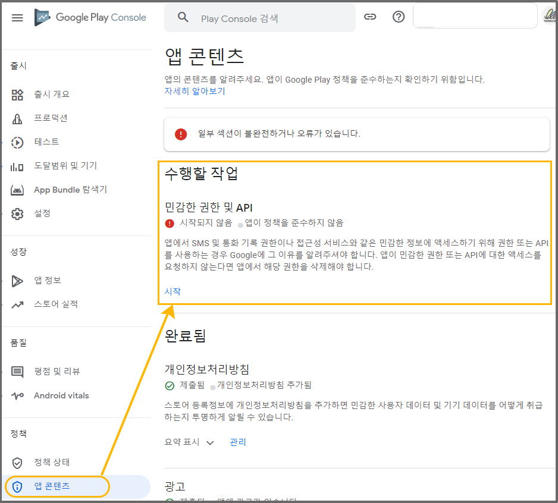
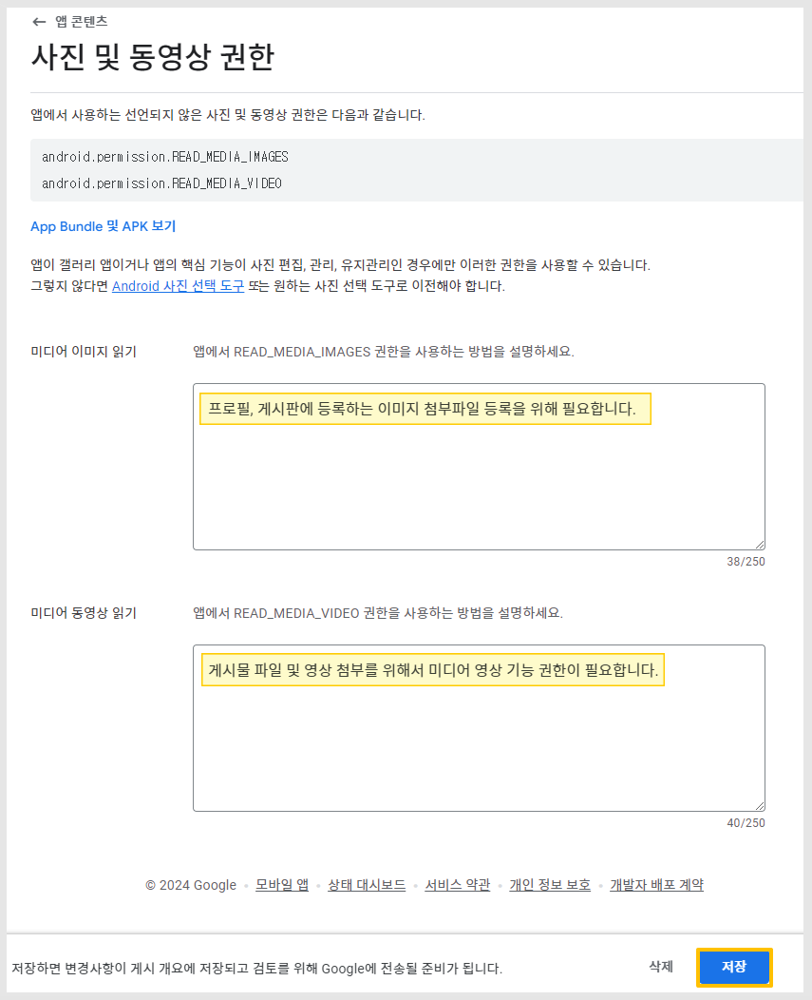
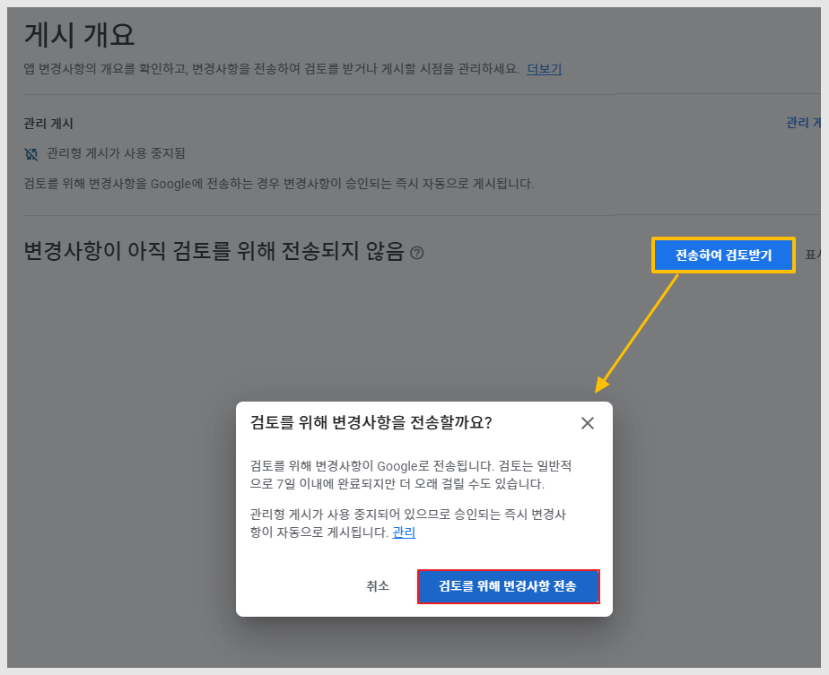
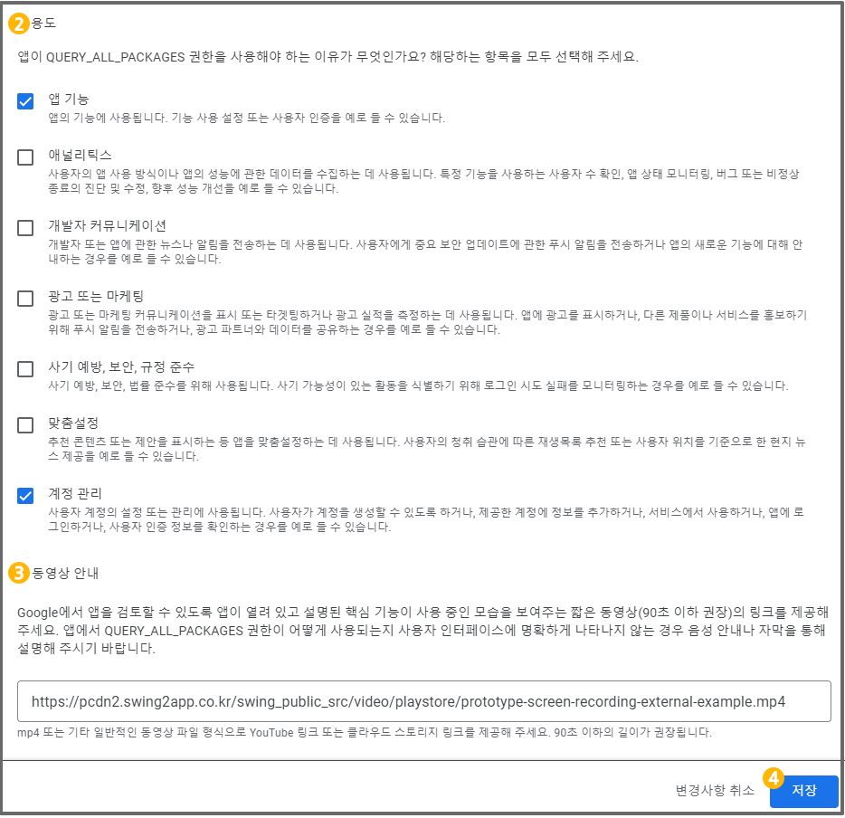
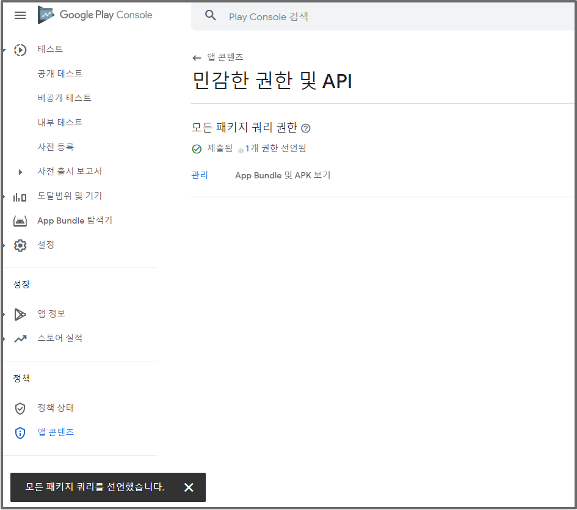

# 구글 플레이 정책 - 민감한 권한 API: 쿼리 권한 정책

<figure><figcaption></figcaption></figure>


민감한 권한 API정책은 <mark style="color:green;">2022년 6월 14일 이후 제작한 앱에서는 패키지 쿼리 권한 문제가 모두 처리되어 제공됩니다. (권한 내용 모두 삭제된 버전으로 제작됩니다)</mark>

따라서 플레이 콘솔에서 별도 조치를 할 것이 없습니다.

이전에 제작된 앱이라면, 업데이트만 해주세요.&#x20;

새 버전의 앱으로 프로덕션에 다시 제출하면 됩니다.&#x20;


<mark style="color:red;">**\*\*민감한 권한 API: 쿼리 권한 정책이란?**</mark><mark style="color:red;">\*</mark>

앱 실행 시 SMS, 통화기록, 위치기반 등 개인정보 등의 사용자 정보에 접근할 경우 앱에서 해당 기능이 왜 필요한지 구글에 이유를 알려줘야 한다는 내용입니다.

QUERY\_ALL\_PACKAGES 내용으로 일반 프로토타입으로 제작한 앱에서는 자주 뜨는 정책사항입니다.

\*웹사이트를 연동한 푸시, 웹뷰앱은 거의 제출되지 않는 내용입니다.

만약 해당 내용을 계속해서 등록하지 않는다면, 구글에서 앱을 삭제하오니 반드시 따라서 작업해주셔야 합니다. ​

<figure><figcaption></figcaption></figure>

> ### **구글 경고 메일 발송**

.PNG>)

**이렇게 앱이 정책에 준수하지 않는다는 내용으로 구글에서 앱이 삭제되거나, 업데이트가 거부되는 경우가 있을거에요.**

**메일을 받았다면, 아래 매뉴얼을 확인해서 조치를 취해주시기 바랍니다**

##

> ### **조치사항 안내**

2022년 6월 14일 이후 제작한 앱에서는 패키지 쿼리 권한 문제가 모두 처리되어 제공되므로 별도 조치를 할 것이 없습니다.

**그러나 6월 14일 이전에 제작한 앱에서는 해당 내용으로 경고를 받거나 앱이 삭제될 수 있으니 반드시 업데이트를 해주셔야 합니다.**

스윙투앱 앱제작 화면으로 이동하여 \[앱 업데이트] 버튼만 눌러서 새 버전으로 재제작 해주시면 됩니다.

업데이트 된 버전의 앱으로 플레이스토어에 다시 업데이트만 해주시면  됩니다.&#x20;

앱 업데이트만 하면 완료되는 내용이기 때문에, 아래 내용은 확인하지 않아도 됩니다.&#x20;

<figure><figcaption></figcaption></figure>

**\*여기서부터는022년 6월 이전 제작된 앱에 해당되는 매뉴얼입니다.**

## <mark style="color:blue;">**1**</mark>

**\*\*구글 플레이 콘솔 사이트 접속** [**https://play.google.com/console/developers**](https://play.google.com/console/developers) **앱을 선택해주세요.**

**왼쪽 카테고리에서 정책 -\[앱 콘텐츠] 메뉴를 선택합니다.**

정책 상태에 문제가 있을 경우 위의 이미지처럼, 특정 섹션(메뉴)에 빨간 불이 들어와있어요.

민감한 권한 및 API에서 \[시작] 버튼을 눌러주세요.

**\*\*해당 정책을 잠시 설명 드리면**, 앱 실행 시 SMS, 통화기록, 위치기반 등 개인정보 등의 사용자 정보에 접근할 경우 앱에서 해당 기능이

왜 필요한지 구글에 이유를 알려줘야 한다는 내용입니다.

만약 해당 내용을 계속해서 등록하지 않는다면, 구글에서 앱을 삭제하오니 반드시 따라서 작업해주셔야 합니다.

​

민감한 권한 및 API 정책 외에도 다른 정책 메뉴에서 빨간 불이 들어왔다면, 내용을 확인하여 작업을 모두 완료해주셔야 해요!

동일하게, 경고가 들어온 내용을 계속 처리하지 않는다면 구글에서 앱을 삭제하오니 반드시 따라서 작업해주셔야 합니다.

***

## <mark style="color:blue;">**2**</mark>

모든 패키지 쿼리 권한 \[시작] 버튼을 선택해주세요.

***

## <mark style="color:blue;">3</mark>

모든 패키지 쿼리 페이지에서는 구글에 해당 기능에 대한 설명 및 이를 증빙할 수 있는 동영상 링크를 첨부해야 해요.

​

\*스윙투앱에서 제작한 <<일반 프로토타입>>앱은 기본적으로 공유기능이 기본 셋팅되어서 제작이 됩니다.

따라서 앱을 외부 앱으로 공유하는 내용에 대해서 설명을 해주셔야 합니다.

**1) 핵심 목적 작성**

> **<원고>**
>
> **플레이스토어 다운로드 링크 및 컨텐츠를 공유하여 다른 사용자들에게 공유하기 위해서**
>
> **Facebook , Instagram 등 외부앱에 직접 공유할 수 있도록 해당 기능을 사용하고 있습니다.**

<mark style="color:red;">\*해당 내용은 모두 스윙투앱에서 제작한 앱에 허용되는 내용입니다.(스윙투앱으로 제작한 사용자분만 이용해주세요)</mark>

다른 업체 및 다른 개발자가 만든 앱은 그에 맞는 내용을 넣어주셔야 합니다.

​

**2)용도**

앱이 쿼리 패키지 권한을 사용해야 하는 이유에 대해서, 해당 하는 항목을 모두 선택해주세요.

기본적으로 '앱 기능'에 선택하면 되구요. 그외에 만든 앱을 확인하여 해당 되는 항목이 있다면 선택해주세요.

​

**3)동영상 안내**

구글에서 앱을 검토할 수 있도록 \*해당 기능이 어떻게 사용되는지 보여지도록\* 영상 링크를 제공해주세요.

> **제공하는 영상 링크 주소**
>
> https://pcdn2.swing2app.co.kr/swing\_public\_src/video/playstore/prototype-screen-recording-external-example.mp4

4**)저장** 버튼을 선택하면 완료됩니다.

​

## <mark style="color:blue;">4</mark>

"모든 패키지 쿼리를 선언했습니다." 메시지가 뜨면 완료된 것입니다.

​

<mark style="color:red;">**\[안내]**</mark>

\*해당 내용 입력이 완료되면 앱은 다시 업데이트 심사에 들어갑니다.

사용자가 기재한 내용이 적합한지 구글에서 판단해서 업데이트를 적용해주거나, 적합하지 않을 경우 심사를 거절합니다.

\*스윙투앱에서 제작한 앱으로, 위의 내용으로 기재시 특별한 이유 없이 심사가 거절된 적은 없습니다.

​

**2022년 6월 14일 이후 제작한 앱에서는 패키지 쿼리 권한 문제가 모두 처리되어 제공되므로 별도 조치를 할 것이 없습니다.**

그러나 22년 6월 14일 이전에 제작한 앱에서는 해당 내용으로 경고를 받거나 앱이 삭제될 수 있으니 반드시 업데이트를 해주셔야 합니다.

\-스윙투앱 앱제작 화면으로 이동하여 \[앱 업데이트] 버튼만 눌러서 새 버전으로 재제작 해주시면 됩니다.

\-새로 제작된 버전의 앱으로 플레이스토어 - 프로덕션에 제출해주세요.

\-앱만 새로 제출하면 위의 항목은콘텐츠에서 없어집니다. \

