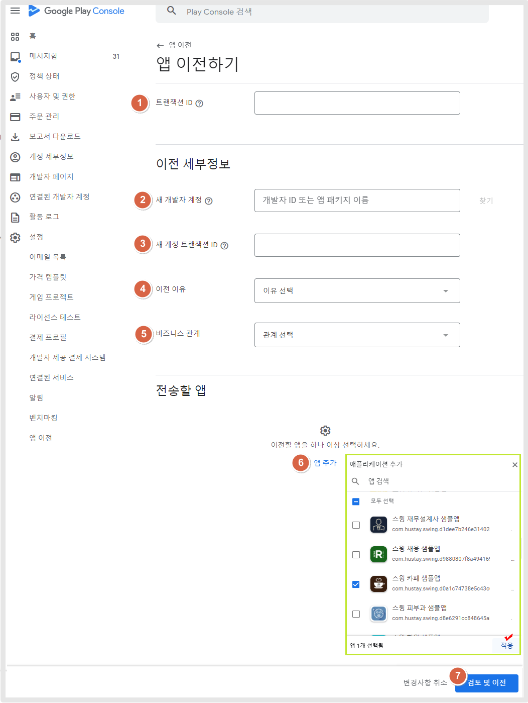
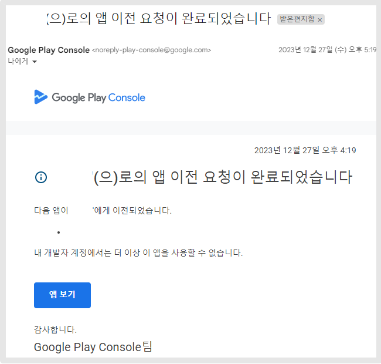

# 다른 개발자계정으로 앱 이전하기

***

플레이스토어에 앱을 출시하여 사용하는 도중 운영하고 있는 앱을 다른 구글 개발자 계정으로 옮겨야 할 때가 있는데요.

이때 구글에서는 출시된 앱을 그대로 다른 계정으로 옮길 수 있는 앱 이관 서비스를 제공하고 있습니다.

스윙 도움말을 참고하여서, 다른 구글 개발자 계정으로 앱을 옮기는 방법을 확인해주세요.&#x20;


앱 이전 준비사항

1\)앱이 출시된 기존(현재)계정 소유자만 진행 가능합니다. (아이디, 비밀번호 알고 있어야 합니다)

2\)앱을 옮고자 하는 대상 계정(아이디, 비밀번호) 역시 알고 있어야 합니다.

3\)현재 개발자, 새 개발자 계정의 거래 ID를 함께 준비해주셔야 합니다.



<mark style="color:red;">**★ 앱 이전 안내사항**</mark>

\-다른 개발자 계정으로 앱 이전은 앱이 플레이스토어에 출시가 되어있을 때 옮길 수 있어요.

\-임시보관중인 앱이나(게시가 안된 앱), 삭제된 앱은 옮길 수 없습니다!

\-앱 이전은 계정 소유주만 진행이 가능합니다.&#x20;

개발자 계정 소유주분이 직접 해주셔야 하며, 스윙투앱에서 대행해드리거나 대신 해드리지 않습니다.


***

## **1. 구글 플레이 콘솔 접속 - 앱 이전 선택**

<figure><figcaption></figcaption></figure>

[<mark style="color:blue;">**구글 플레이 콘솔 사이트**</mark>](https://play.google.com/console/u/0/developers) 접속 및 로그인후, 왼쪽 설정 메뉴 선택 - 앱 이전을 선택합니다.&#x20;

***

## **2. 앱 이전 신청서 작성하기**

<figure><figcaption></figcaption></figure>

<mark style="color:blue;">**\[앱 이전하기]**</mark> 버튼을 누르면 신청서 작성 페이지로 이동합니다.

\*앱 이전을 할 때에는 앱이 출시된 ‘ 기존’ 계정으로 로그인해주셔야 합니다.&#x20;

기존 계정을 모르면 앱을 옮길 수 없습니다.

### <mark style="color:orange;">**신청서 작성**</mark>

<figure><figcaption></figcaption></figure>

1\)트랜잭션 ID : 이전할 앱이 있던  개발자 계정의 트랜잭션 ID입니다.

<mark style="color:red;">\*계정 ID 확인방법</mark>

플레이콘솔 대시보드 상단에 보시면 개발자 이름 밑에 계정 ID확인 가능합니다.

<figure><figcaption></figcaption></figure>

2\)새개발자 계정 개발자 ID입력: 앱을 옮기고자 하는 새 개발자 계정의 ID를 입력합니다.&#x20;

3\)새 계정 트랜잭션 ID: 앱을 이전할 새 계정의 주문 ID를 기재해주세요.

**\*주문 ID는 개발자 계정을 만들 때 받게 되는 거래 ID인데요. 거래 ID 확인방법은 아래에서 확인해주세요.**&#x20;

### <mark style="color:orange;">**구글 개발자 계정 주문(거래)ID 확인하는 방법**</mark>

<figure><figcaption></figcaption></figure>

[Google Payments](https://payments.google.com/payments/home)에 접속한 뒤(구글 개발자 계정 로그인 후) , 본문에 거래내역을 선택하면- 오른쪽 화면에 거래 ID를 확인할 수 있습니다.&#x20;

해당 거래 ID를 기재해주세요.&#x20;

> 등록 거래 ID의 형식은 대부분 다음 중 하나와 같습니다.
>
> 01234567890123456789.token.0123456789012345
>
> 0.G.123456789012345
>
> Registration-1234ab56-7c89-12d3-4567-8e91234567f8
>
> PDS.1234-5678-9012-3456

4\) 이전이유:  선택창을 탭하여 적합한 이유를 선택해주세요.&#x20;

5\)비즈니스 관계 선택 : 선택창을 탭하여 적합한 이유를 선택해주세요.&#x20;

6\)전송할 앱&#x20;

&#x20;<mark style="color:blue;">**\[앱 추가]**</mark> 버튼을 눌러서 이전하고자 하는 앱을 선택한 뒤 적용 버튼을 탭합니다.&#x20;

\*한 계정에 여러 앱이 있을 경우 여러 개의 앱을 동시에 이전할 수 있구요.&#x20;

원하는 앱만 하나 선택해서 이전할 수 있습니다.

7\) <mark style="color:blue;">**\[검토 및 이전]**</mark> 버튼 선택

<figure><figcaption></figcaption></figure>

신청서 작성이 완료되면, 약관 동의 메시지 팝업창이 뜹니다.

약관에 "동의합니다" 체크 후 \[동의 및 이전] 버튼 선택합니다.

***

## **3. 신청 완료**

<figure><figcaption></figcaption></figure>

앱 이전 신청서 작성이 완료되었구요.&#x20;

이전 요청이 완료되었다는 메시지를 확인할 수 있습니다.&#x20;

***

<mark style="color:red;">**★중요**</mark>

여기서 끝이 아니구요, 새 개발자 계정(앱을 옮기는)으로 다시 접속해서 요청 승인 완료를 해주셔야 합니다.

## 4.이전 요청 검토(동의하기)

<figure><figcaption></figcaption></figure>

새 개발자 계정으로 다시 로그인한 뒤

동일하게 플레이 콘솔 접속 - 설정- 앱 이전 메뉴로 이동합니다.

<figure><figcaption></figcaption></figure>

"나에게 이전 중인 앱 " 항목에서 앞에서 이전을 요청한 앱을 확인할 수 있구요.

\[요청 검토] 를 선택해주세요.

<figure><figcaption></figcaption></figure>

약관에 "동의합니다" 체크 후 \[동의 및 이전] 버튼 선택합니다.

<figure><figcaption></figcaption></figure>

이전 요청이 수락되었다는 메시지를 확인할 수 있습니다.

\*옮기는 새 개발자 계정에서 승인 동의를 완료해주셔야 정상적으로 이전 작업이 완료됩니다.

잊지 말고 진행해주세요.

***

## **5. 앱 이전 완료**

<figure><figcaption></figcaption></figure>

앱 이전이 완료되면, 이렇게 구글에서 앱 이전이 완료되었다는 메일을 발송해줍니다.

메일을 받으면 변경된 개발자 계정으로 접속하여 앱을 운영할 수 있습니다.

앱 이전은  최근 4-5일 정도 소요되고 있으니 시간을 가지고 신청해주세요.&#x20;

***

## 6. 앱 이전 취소 방법

만약 이전 중 취소를 하고 싶다면, 요청을 취소할 수 있습니다.

<figure><figcaption></figcaption></figure>

기존(현재)개발자 계정으로 로그인 된 플레이 콘솔에서 \*설정 - 앱 이전 선택

1\)이전 요청 취소 버튼 선택

2\)이전 취소 버튼 선택해주세요.

<figure><figcaption></figcaption></figure>

이전 요청이 취소되어, 요청 앱이 목록에서 삭제됩니다.

새 개발자 계정에도 앱이 삭제됩니다.

