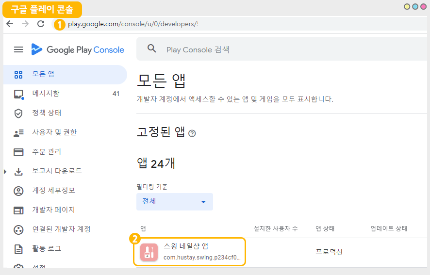
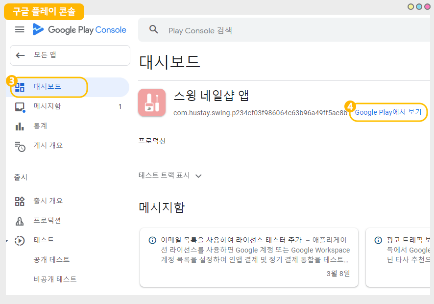
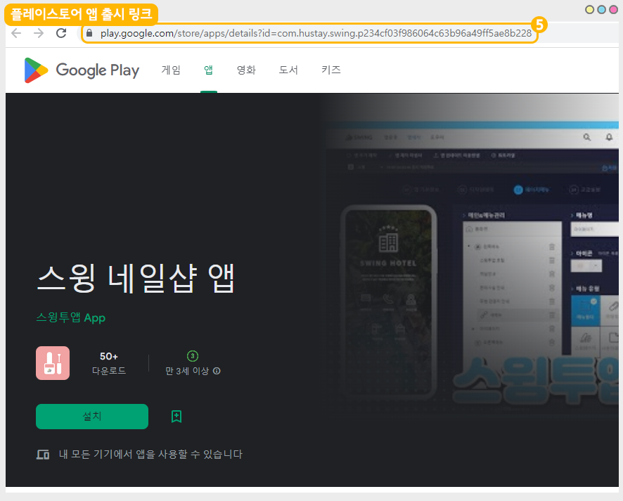
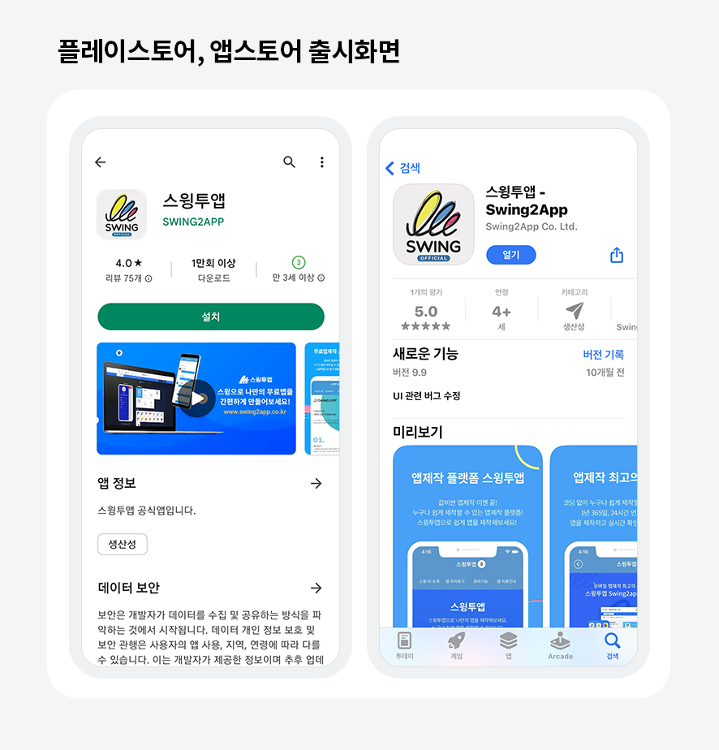
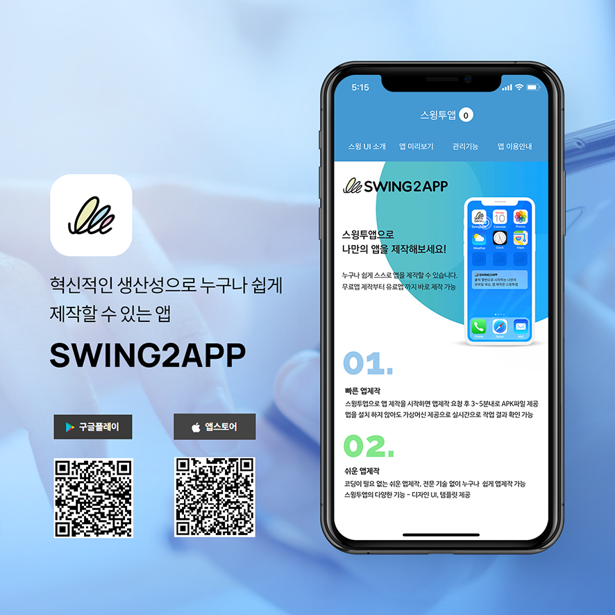

# 플레이스토어 앱 출시 링크 확인 방법   ​

<figure><figcaption></figcaption></figure>

### 플레이스토어 앱 출시 링크 확인 방법


1\)구글 플레이 콘솔 사이트 접속 및 로그인

[https://play.google.com/console/developers](https://play.google.com/console/developers)

2\)출시된 앱 선택

3\)대시보드 선택

4\)Google Play에서 보기 선택

5\)출시 화면으로 이동하며, 상단 사이트 주소란에 보여지는 주소가 해당 앱의 출시 링크입니다.

플레이스토어 앱 출시 링크 확인 방법


<figure><figcaption></figcaption></figure>

1\)구글 플레이 콘솔 사이트 접속 및 로그인 [https://play.google.com/console/developers](https://play.google.com/console/developers)

2\)출시된 앱 선택

​

<figure><figcaption></figcaption></figure>

3\)대시보드 선택

4\)Google Play에서 보기 선택

​

<figure><figcaption></figcaption></figure>

5\)출시 화면으로 이동하며, 상단 사이트 주소란에 보여지는 주소가 해당 앱의 출시 링크입니다.

***

### 출시 링크 활용예시1)

출시 링크를 보내서 앱 설치 및 홍보를 유도할 수 있구요.

\-안드로이드폰 사용자는 플레이스토어 앱 출시 링크 이동

\-아이폰 사용자는 앱스토어 앱 출시 링크 이동

<figure><figcaption></figcaption></figure>

​

### 출시 링크 활용예시2)

빠르게 앱을 설치할 수 있도록 QR코드를 만들 수도 있습니다.

<figure><figcaption></figcaption></figure>

​

### ★ 추가 안내

스토어 출시 URL이 길어서 불편하다면 URL단축 서비스 등을 이용하여 URL길이를 줄일 수 있습니다.

일반적으로 Bitly, TinyURL, Rebrandly 등과 같은 서비스를 사용하여 URL을 단축할 수 있습니다.

