# 구글 개발자 조직 계정 인증

***

**구글 개발자 '조직' 계정 설정 완료하기**

구글 개발자 조직 계정으로 가입 후에 계정 설정 까지 완료해야 모든 작업이 완료됩니다.

계정 설정을 위해서는 3가지 작업이 완료되어야 합니다.

해당 작업 까지 완료되어야 계정 이용이 가능하며, 앱 등록이 가능합니다.&#x20;

<figure>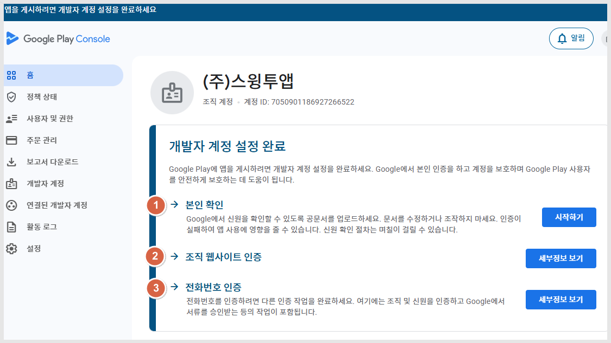<figcaption></figcaption></figure>


**구글 조직 개발자 계정 등록시 인증하는 정보**

<mark style="color:blue;">**1)본인 확인**</mark>

조직 정보 확인을 위해 사업자등록증을 제출합니다.

또한 계정을 등록한 개인 신원을 확인하기 위해 이름, 주민번호 입력, 주소지를 입력합니다.

핸드폰번호 인증 번호를 받습니다.

<mark style="color:blue;">**2)조직 웹사이트 인증**</mark>

조직의 경우 해당 회사에서 운영하는 공식 홈페이지(웹사이트)가 있어야 합니다.

\*홈페이지가 없을 경우 개발자 계정을 만들 수 없습니다. 없을 경우 먼저 사이트를 만든 뒤 진행해주세요.

웹사이트 인증을 통해 실제 해당 회사에서 정상적으로 운영되고 있는 공식 홈페이지인지, 홈페이지 운영에 문제가 없는지 등을 봅니다.

전체적으로 계정을 등록해도 될만한 회사인지 확인하는 과정이라고 보시면 됩니다.

<mark style="color:blue;">**3)전화번호 인증**</mark>

계정 소유자의 연락처(핸드폰번호)로 인증번호를 받아 번호 인증을 합니다.

전화 번호는 위의 2개 인증이 모두 완료된 후 마지막으로 진행 가능합니다.



***

## 1.본인확인

\*본인 인증에는 조직 증명 서류(사업자등록증) 제출, 본인 인증을 위한 휴대전화 번호 제출, 주소 입력으로 정보를 제출합니다.

<figure>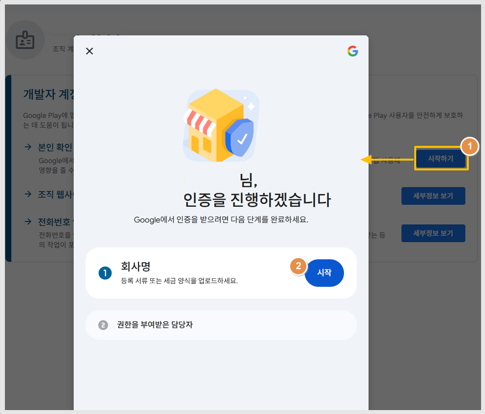<figcaption></figcaption></figure>

1\)\[시작하기] 버튼 선택시, 인증 진행 팝업이 뜹니다.

2\)가장 먼저 회사명 - 시작 버튼 선택합니다.

<figure>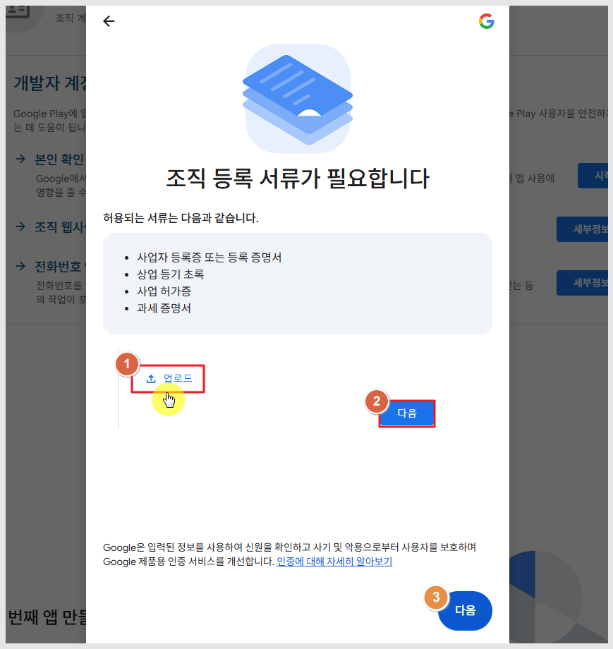<figcaption></figcaption></figure>

\[업로드] 버튼을 선택해서 조직을 증명할 수 있는 서류를 제출합니다.

\*사업자등록증/등록증명서, 상업 등기 초록, 사업 허가증, 과세 증명서 중에서 제출

3.다음 버튼 선택

​

<figure>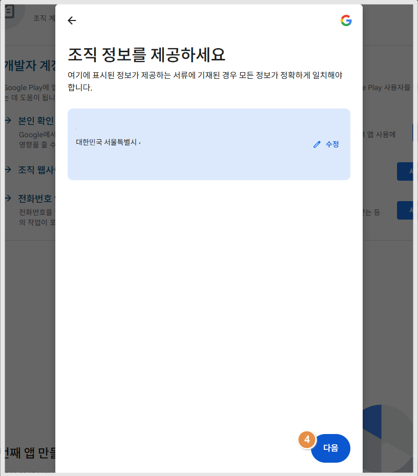<figcaption></figcaption></figure>

조직 정보 확인 후 4)다음 버튼 선택

주소 수정 버튼이 있으나, 이미 DUNS번호에 등록한 정보로 연동해서 보여지기 때문에&#x20;

굳이 주소 수정을 하지 않아도 됩니다.&#x20;

<mark style="color:$primary;">**\[권한을 부여받은 담당자 정보 입력]**</mark>

<figure>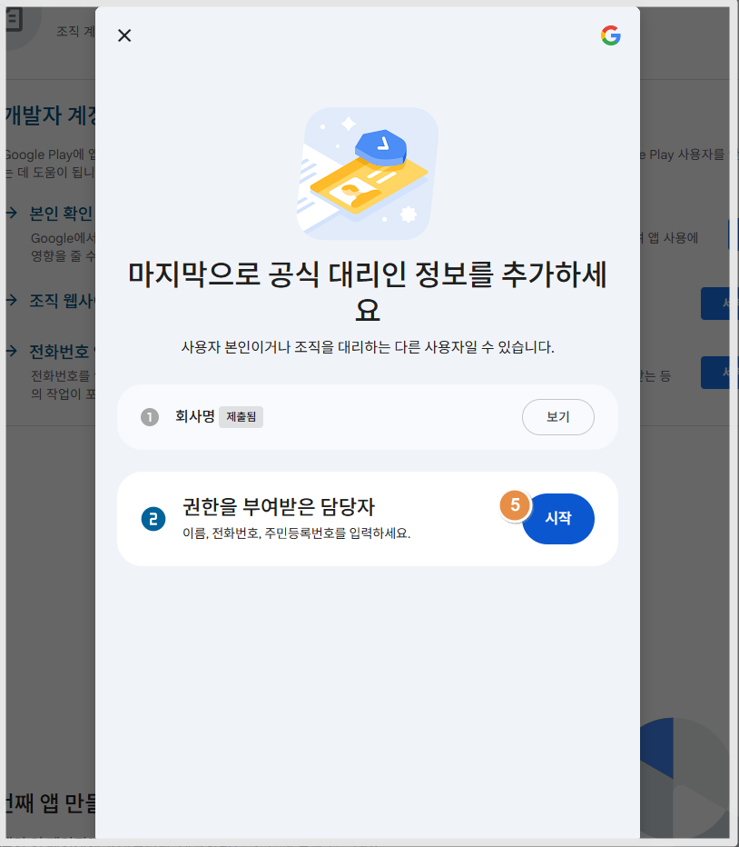<figcaption></figcaption></figure>

5\)시작 버튼 선택

<figure>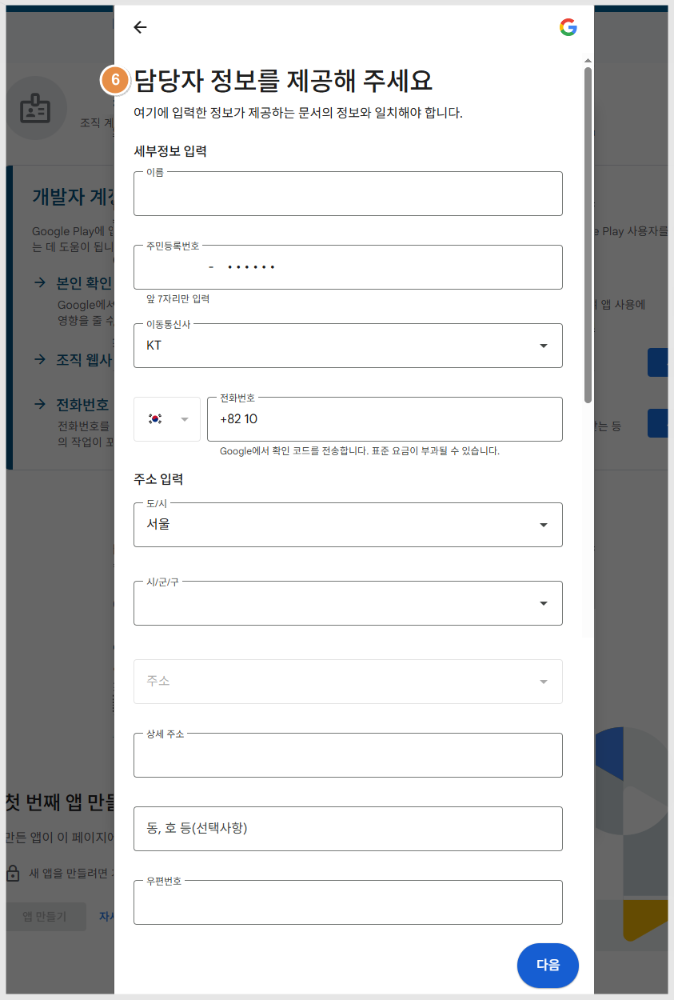<figcaption></figcaption></figure>

6\)담당자 정보 입력

* 이름 입력 \*대표자로 입력하지 않아도 됩니다. 계정을 등록하는 본인(직원) 개인 정보로 입력해주세요.
* 주민번호 7자리 입력
* 이동 통신사 선택
* 연락처 :핸드폰 번호 입력

주소 입력

* 도/시 선택
* 시/군/구 선택&#x20;
* 상세 주소 입력
* 우편번호 입력

7\) 다음 버튼 선택

<figure>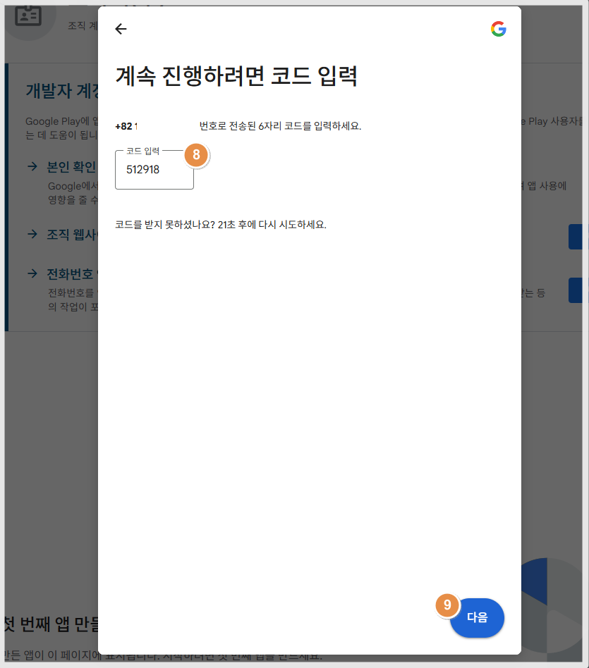<figcaption></figcaption></figure>

8\)핸드폰 문자로 전송된,인증번호 6자리 코드 입력 후&#x20;

9\)\[다음] 선택

<figure>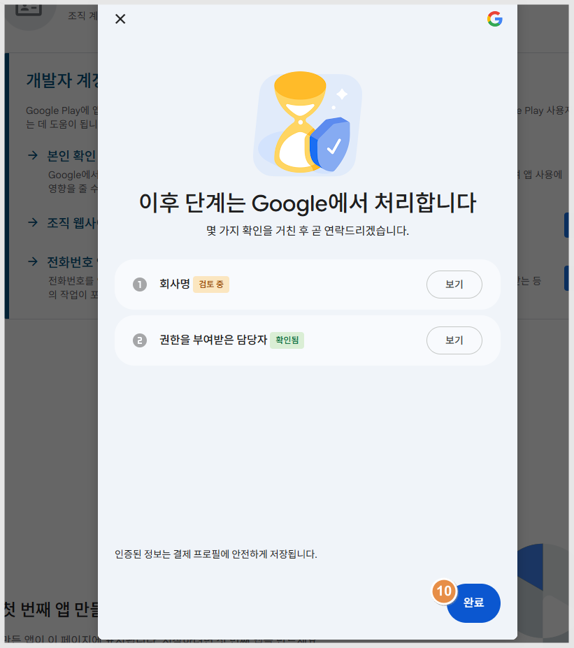<figcaption></figcaption></figure>

10\)완료 선택

모든 정보 제출이 완료되었구요. 구글에서 제출된 정보를 검토 한 뒤 승인을 하게 됩니다.

<figure>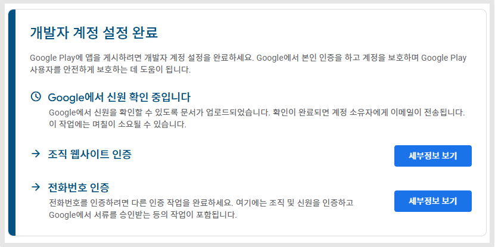<figcaption></figcaption></figure>

보통 1일이내 처리가 완료되는데 승인이 되면 바로 이용 가능하며, 서류가 적합하지 않을 경우 승인을 거절합니다.&#x20;

받은 메일을 확인해서 조치사항 확인 후 다시 요청정보를 제출해야 합니다.&#x20;

***

## 2.조직 웹사이트 인증

<figure>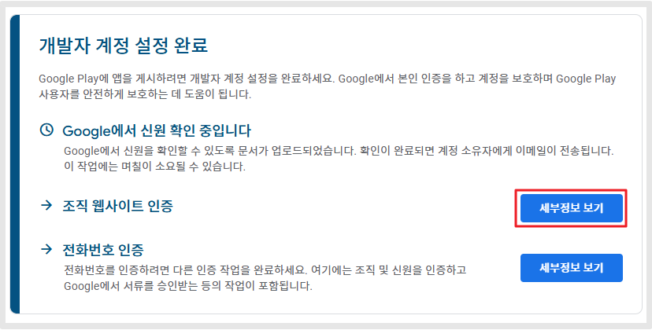<figcaption></figcaption></figure>

조직 웹사이트 인증 \[세부정보 보기] 선택

<figure><figcaption></figcaption></figure>

1\) **'Search Console'** 인증 버튼을 선택해주세요.

등록된 소유자가 Search Console에서 요청을 승인하면 웹사이트가 인증됩니다.

<mark style="color:red;">\*구글 개발자 조직 계정을 만들 때는 회사 홈페이지(웹사이트)가 있어야 합니다.</mark>

웹사이트 인증을 해야 계정 사용이 가능하기 때문에, 홈페이지가 없을 경우 사이트를 만든 뒤 등록 해주세요.

만약 이미 웹사이트가 구글 Search Console에 등록되어 있다면 바로 웹사이트 인증 버튼을 선택해서 인증 완료해주세요.

<figure>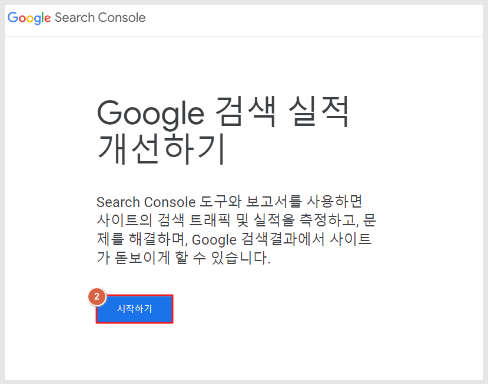<figcaption></figcaption></figure>

2\)구글 Search Console 에서 \[시작하기] 확인

<mark style="background-color:yellow;">**\[속성 유형은 아래 2가지 중에서 하나 선택 할 수 있습니다]**</mark>

<figure>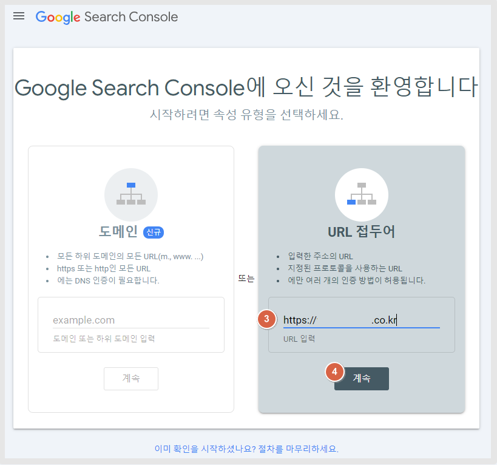<figcaption></figcaption></figure>

해당 포스팅에서는 'URL접두어'로 선택해서 진행하겠습니다.

<mark style="background-color:yellow;">**URL 접두어 항목**</mark>

3\)홈페이지 URL 입력해주세요. http:// 포함하여 입력합니다.

4\)\[계속] 선택

​

<figure>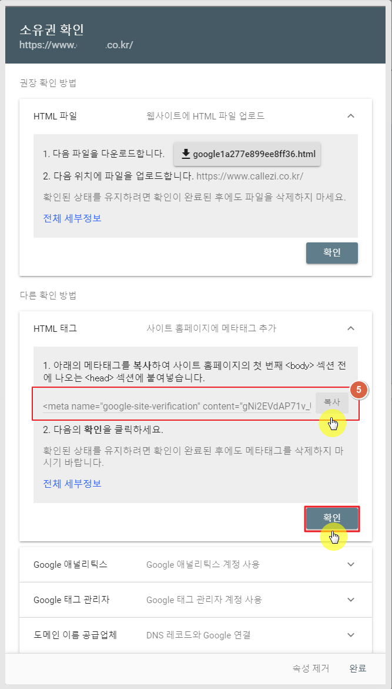<figcaption></figcaption></figure>

다른 확인방법에 보시면 첫번 줄에 '사이트 홈페이지에 메타태그 추가'방법이 있습니다.

5\) HTML태그 선택 - 메타태그 값을 복사해주세요.

<mark style="color:red;">복사한 태그값을 사이트 홈페이지(도메인/호스팅)에 추가해시면 됩니다.</mark>

사이트에 메타태그 값을 입력을 완료한 뒤 \[확인] 버튼을 선택합니다.


\[웹사이트 인증을 위한 메타태그 값]
\
<            >
\
메타태그를 복사하여 도메인과 연결된 페이지 첫 번째 body 섹션 전에 나오는 head 섹션에 붙여넣어주세요
\
코드 삽입 후 다시 돌아와서 확인을 선택합니다.&#x20;



조직 웹사이트 인증에 어려움이 있다면, 구글 도움말 - 지원티켓을 제출하여 상담을 받아주세요.

스윙투앱은 가이드 제공 외에 사용자 웹사이트 인증에 대한 문제 해결을 제공하지 않습니다.

(웹사이트마다 다른 시스템, 구조, 구현방식이 다 다르므로 동일 방법으로 안내가 어렵습니다)

따라서 인증에 문제가 있다면 구글 플레이콘솔 고객센터를 통해서 문의해주세요.  \
[https://play.google.com/console/u/0/developers/5516876313100318753/help-and-support](https://play.google.com/console/u/0/developers/5516876313100318753/help-and-support)


<figure>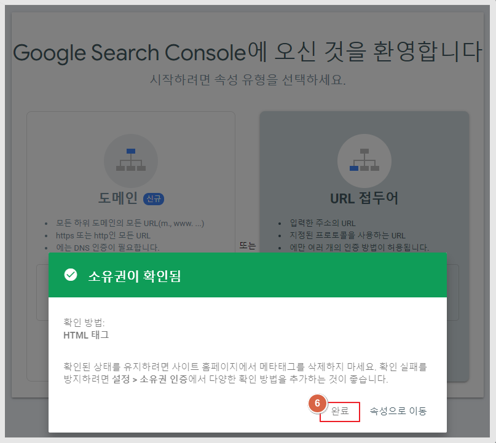<figcaption></figcaption></figure>

'소유권이 확인됨' 창이 뜹니다.

6\)\[완료] 버튼을 선택합니다.

<figure>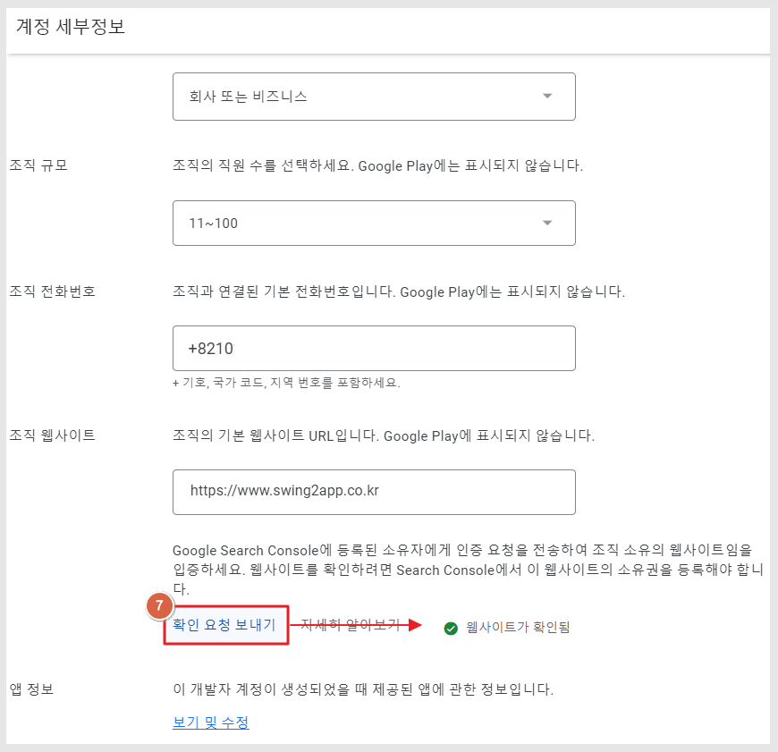<figcaption></figcaption></figure>

7\)다시 \[개발자 계정- 내 정보]로 이동한 뒤 \[확인 요청 보내기]를 선택해주세요.

<mark style="color:green;">\*웹사이트가 확인됨 표시 까지 떠야 완료가 됩니다.</mark>


조직 웹사이트 인증에 어려움이 있다면, 구글 도움말 - 지원티켓을 제출하여 상담을 받아주세요.

스윙투앱은 가이드 제공 외에 사용자 웹사이트 인증에 대한 문제 해결을 제공하지 않습니다.

(웹사이트마다 다른 시스템, 구조, 구현방식이 다 다르므로 동일 방법으로 안내가 어렵습니다)

따라서 인증에 문제가 있다면 구글 플레이콘솔 고객센터를 통해서 문의해주세요.  \
[https://play.google.com/console/u/0/developers/5516876313100318753/help-and-support](https://play.google.com/console/u/0/developers/5516876313100318753/help-and-support)


***

## 3.전화번호 인증

<figure>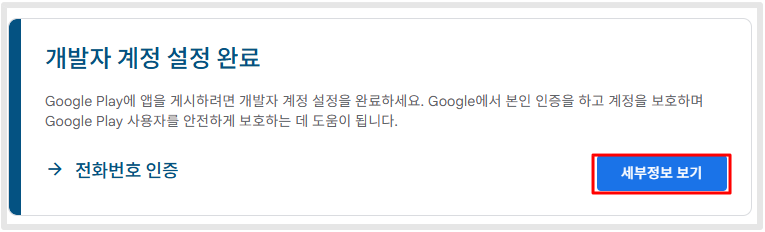<figcaption></figcaption></figure>

마지막으로 전화번호 인증을 시작하겠습니다.

<mark style="color:$primary;">\*전화번호 인증은 위에 본인 확인과 조직웹사이트 인증이 모두 완료되어야 진행할 수 있습니다.</mark>&#x20;

<mark style="color:$primary;">먼저 할 수 없으며, 순서대로 인증 후 전화번호 인증 가장 마지막에 진행해주세요.</mark>&#x20;

\[세부정보 보기] 선택해주세요.

<figure>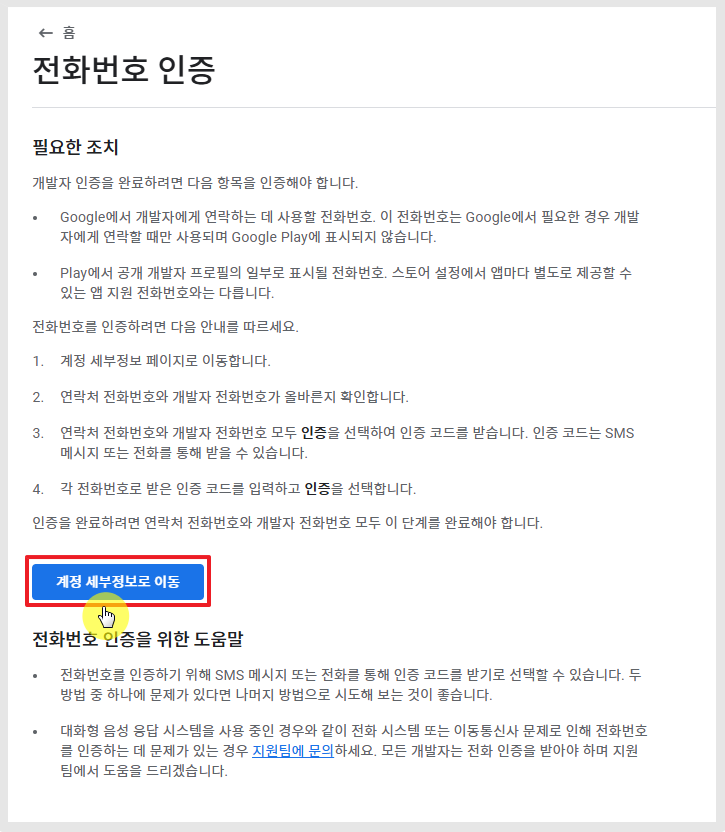<figcaption></figcaption></figure>

유선 전화도 가능하다고 기재되어 있으나, 한국에서는 아직 지원이 되고 있지 않습니다.

따라서 아직은 핸드폰번호 문자 인증만 가능합니다.

<figure>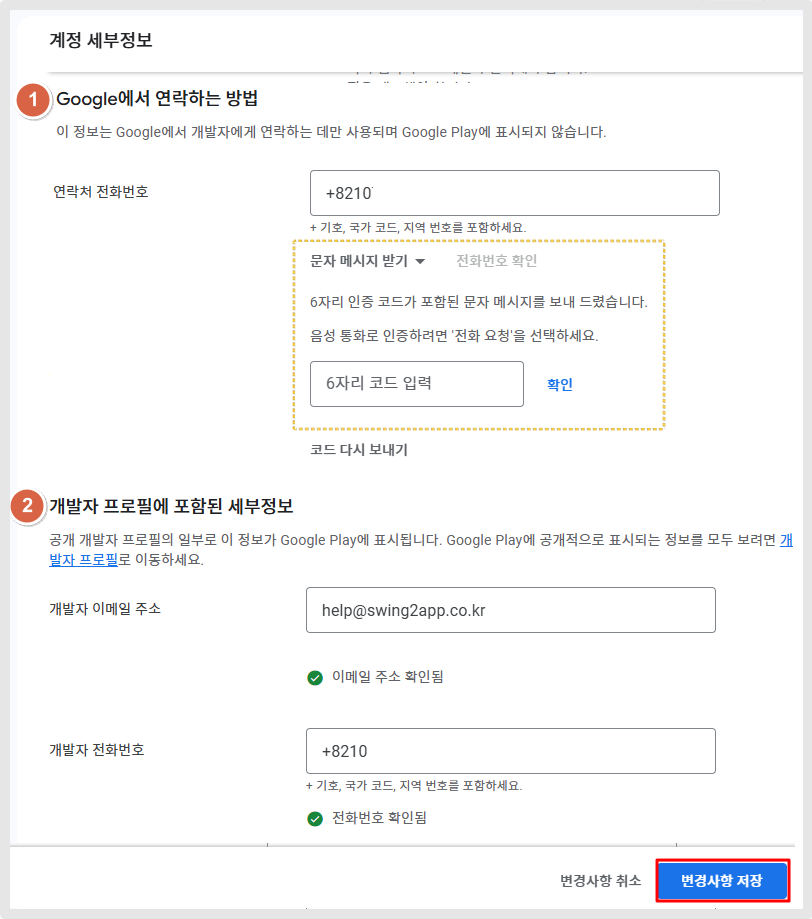<figcaption></figcaption></figure>


전화번호 인증은 계정 소유자분의 핸드폰 번호를 입력해서 인증번호를 받아야 합니다.

2군데 인증을 하는데요. 2개 모두 같은 번호라면 한번만 인증을 받으시면 되구요.

서로 다른 번호라면 각각의 번호로 인증 받아야 합니다.


<mark style="color:blue;">**1)Google에서 연락하는 방법**</mark>

이 정보는 Google에서 개발자에게 연락하는 데만 사용되며 Google Play에 표시되지 않습니다.

<mark style="color:blue;">**2)개발자 프로필에 포함된 세부정보**</mark>

공개 개발자 프로필의 일부로 이 정보가 Google Play에 표시됩니다.

이 정보는 플레이스토어 앱 등록 후, 개발자 정보 탭에서 모두 노출이 됩니다.

따라서 노출이 되는 번호로 고려해서 등록해주세요.

#### **\[개발자 소개에 노출되는 정보 확인하기]**

<figure>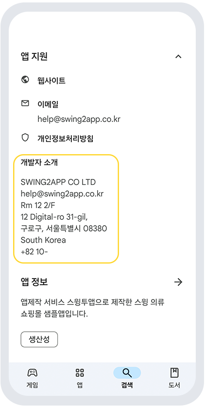<figcaption></figcaption></figure>

연락처 전화번호 확인 후 - 문자 메시지 받기 선택 - 전화번호 확인을 탭해주세요.

잠시 후 핸드폰번호로 인증코드 6자리가 전송됩니다.

코드를 입력하고 확인을 눌러주세요.

변경사항 저장 선택하면 완료됩니다.

***

## 4.인증완료

<figure>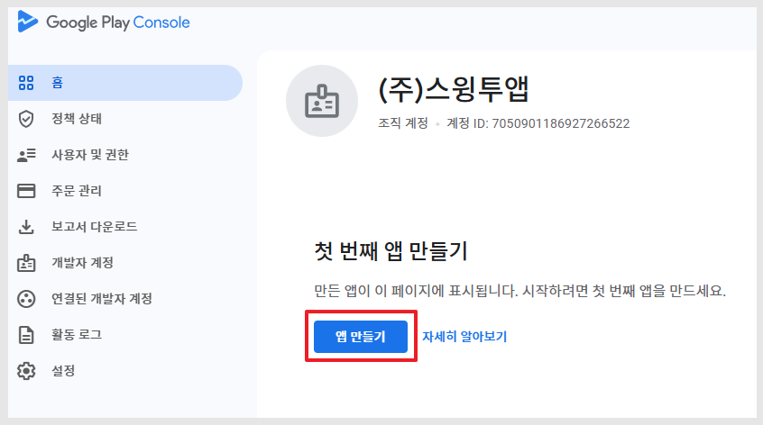<figcaption></figcaption></figure>

이렇게 3가지 요청사항이 완료되어야, 구글 개발자 조직 계정이 최종적으로 등록이 완료되며 앱 등록을 하실 수 있습니다.


1\)구글 개발자 계정 설정 완료를 꼭 해주세요!

구글 개발자 조직 계정은 등록비 결제가 완료되었다고 해서 모든 작업이 완료된 것이 아닙니다.

대시보드에서 개발자 계정 설정 완료를 해주셔야 모든 작업이 완료됩니다.

2\)웹사이트가 있어야 등록이 가능합니다.

홈페이지 인증을 해야 함으로, 사이트가 없을 경우 조직계정 등록이 불가합니다.


