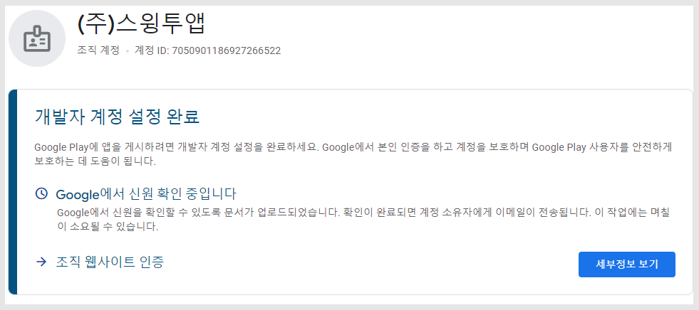
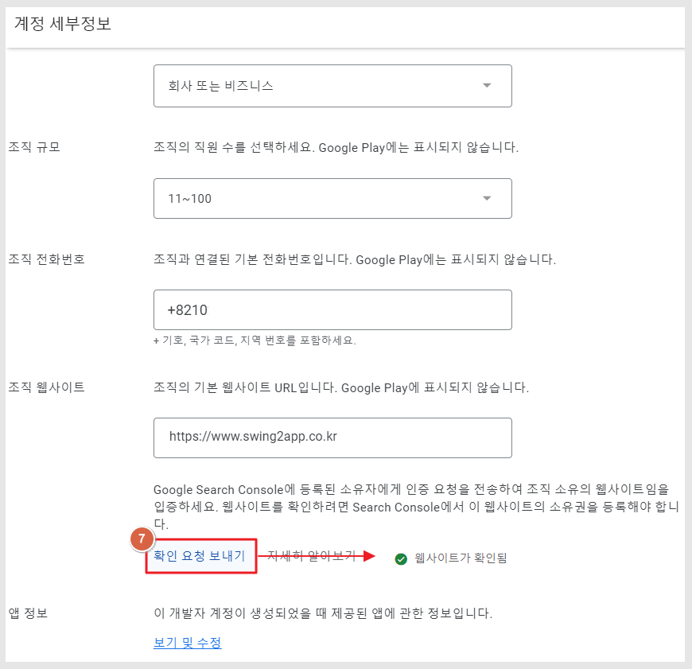

# 구글 개발자 조직 계정 설정(인증)

***

**구글 개발자 '조직' 계정 설정 완료하기**

구글 개발자 조직 계정으로 가입 후에 계정 설정 까지 완료해야 모든 작업이 완료됩니다.

계정 설정을 위해서는 2가지 작업이 완료되어야 하구요.

매뉴얼을 통해서 인증을 하는 방법을 확인해주세요.


**구글 조직 개발자 계정 등록시 인증하는 정보**

<mark style="color:blue;">**1)본인 확인**</mark>

조직 정보 확인을 위해 사업자등록증을 제출합니다.

또한 계정을 등록한 개인 신원을 확인하기 위해 이름, 주민번호 입력, 주소지를 입력합니다.

핸드폰번호 인증 번호를 받습니다.

<mark style="color:blue;">**2)조직 웹사이트 인증**</mark>

조직의 경우 해당 회사에서 운영하는 공식 홈페이지(웹사이트)가 있어야 합니다.

\*홈페이지가 없을 경우 개발자 계정을 만들 수 없습니다. 없을 경우 먼저 사이트를 만든 뒤 진행해주세요.

웹사이트 인증을 통해 실제 해당 회사에서 정상적으로 운영되고 있는 공식 홈페이지인지, 홈페이지 운영에 문제가 없는지 등을 봅니다.

전체적으로 계정을 등록해도 될만한 회사인지 확인하는 과정이라고 보시면 됩니다.


***

## 1.본인확인

<figure><figcaption></figcaption></figure>

\*본인 인증에는 조직 증명 서류(사업자등록증) 제출, 본인 인증을 위한 휴대전화 번호 제출, 주소 입력으로 정보를 제출합니다.

\[시작하기] 버튼 선택시, 인증에 필요한 정보가 뜹니다.&#x20;

\[확인 절차 시작하기] 버튼을 선택합니다.

<figure><figcaption></figcaption></figure>

1.\[업로드] 버튼을 선택해서 조직을 증명할 수 있는 서류를 제출합니다.

\*사업자등록증 , 상업 등기 초록, 사업 허가증, 과세 증명서 중에서 제출

2.다음 버튼 선택

​

<figure><figcaption></figcaption></figure>

본인(개인) 신원 정보 입력

3.이름 입력 \*대표자로 입력하지 않아도 됩니다. 계정을 등록하는 본인(직원) 개인 정보로 입력해주세요.

4.주민번호 7자리 입력

5.이동 통신사 선택

6.연락처 :핸드폰 번호 입력

7.\[다음] 선택

<figure><figcaption></figcaption></figure>

주소 입력

8.도/시 선택

9.시/군/구 선택

10.상세 주소 입력

11.우편번호 입력

12\. \[제출] 확인

<figure><figcaption></figcaption></figure>

13\) 인증번호 6자리 코드 입력 후 \[확인] 선택

<figure><figcaption></figcaption></figure>

14\)확인 선택합니다.

모든 정보 제출이 완료되었구요. 구글에서 제출된 정보를 검토 한 뒤 승인을 하게 됩니다.

<figure><figcaption></figcaption></figure>

보통 1일이내 처리가 완료되는데 승인이 되면 바로 이용 가능하며, 서류가 적합하지 않을 경우 승인을 거절합니다.&#x20;

받은 메일을 확인해서 조치사항 확인 후 다시 요청정보를 제출해야 합니다.&#x20;

***

## 2.조직 웹사이트 인증

<figure><figcaption></figcaption></figure>

조직 웹사이트 인증 \[세부정보 보기] 선택

<figure><figcaption></figcaption></figure>

1\) **'Search Console'**&#xC778;증 버튼을 선택해주세요.

등록된 소유자가 Search Console에서 요청을 승인하면 웹사이트가 인증됩니다.

<mark style="color:red;">\*구글 개발자 조직 계정을 만들 때는 회사 홈페이지(웹사이트)가 있어야 합니다.</mark>

웹사이트 인증을 해야 계정 사용이 가능하기 때문에, 홈페이지가 없을 경우 사이트를 만든 뒤 등록 해주세요.

<figure><figcaption></figcaption></figure>

2\)구글 Search Console 에서 \[시작하기] 확인

<figure><figcaption></figcaption></figure>

<mark style="background-color:yellow;">**URL 접두어 항목**</mark>

3\)홈페이지 URL 입력해주세요. http:// 포함하여 입력합니다.

4\)\[계속] 선택

​

<figure><figcaption></figcaption></figure>

다른 확인방법에 보시면 첫번 줄에 '사이트 홈페이지에 메타태그 추가'방법이 있습니다.

5\) HTML태그 선택 - 메타태그 값을 복사해주세요.

<mark style="color:red;">복사한 태그값을 사이트 홈페이지(도메인/호스팅)에 추가해시면 됩니다.</mark>

사이트에 메타태그 값을 입력을 완료한 뒤 \[확인] 버튼을 선택합니다.

​

<figure><figcaption></figcaption></figure>

'소유권이 확인됨' 창이 뜹니다.

6\)\[완료] 버튼을 선택합니다.

<figure><figcaption></figcaption></figure>

7\)다시 \[개발자 계정- 내 정보]로 이동한 뒤 \[확인 요청 보내기]를 선택해주세요.

<mark style="color:green;">\*웹사이트가 확인됨 표시 까지 떠야 완료가 됩니다.</mark>

이렇게 2가지 요청사항이 완료되어야, 구글 개발자 조직 계정이 최종적으로 등록이 완료되며 앱 등록을 하실 수 있습니다.

***


1\)구글 개발자 계정 설정 완료를 꼭 해주세요!

구글 개발자 조직 계정은 등록비 결제가 완료되었다고 해서 모든 작업이 완료된 것이 아닙니다.

대시보드에서 개발자 계정 설정 완료를 해주셔야 모든 작업이 완료됩니다.

2\)웹사이트가 있어야 등록이 가능합니다.

홈페이지 인증을 해야 함으로, 사이트가 없을 경우 조직계정 등록이 불가합니다.


