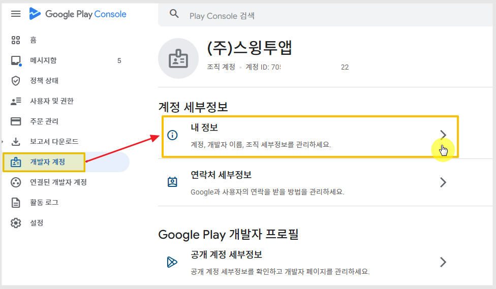
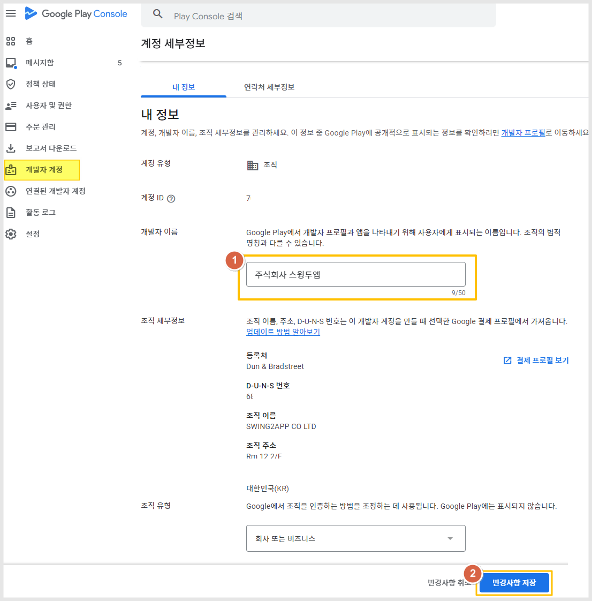
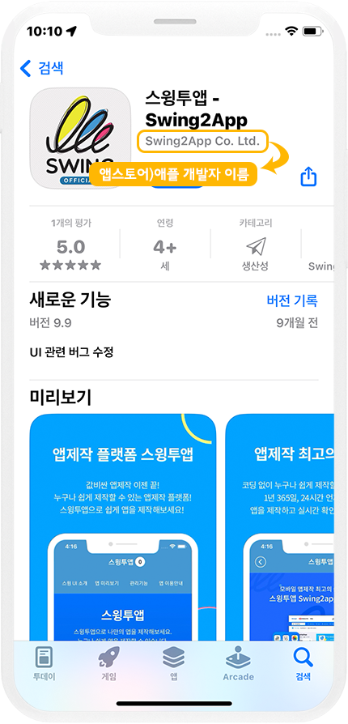
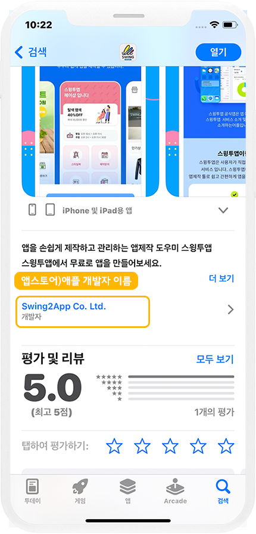

# 구글 플레이 개발자 이름 변경

<figure><figcaption></figcaption></figure>

**개발자 이름이란?**

개발자 이름은 스토어에 앱을 출시하고 해당 앱을 운영하는 사용자의 이름을 말합니다.

개발자 이름은 스토어에 출시된 앱 이름 아래에 표시가 됩니다.&#x20;

최초 개발자계정을 등록할 때 개발자 이름을 입력하며, 앱 출시 이후에도 구글은 개발자 이름 변경이 가능합니다.

<mark style="color:red;">\*애플 앱스토어는 한번 등록된 이후 개발자 이름 변경 안됩니다.</mark>

***

## **1.구글 개발자 이름 변경하기**&#x20;

**※구글 플레이 콘솔사이트 접속:**  [**https://play.google.com/console/developers**](https://play.google.com/console/developers)

구글 개발자 콘솔 사이트 접속 후 개발자 계정으로 로그인해주세요.

<figure><figcaption></figcaption></figure>

**대시보드의 화면 왼쪽의   \[개발자계정] → \[내 정보] 선택**

<figure><figcaption></figcaption></figure>

내 정보 페이지에서, 개발자 이름을 수정한 뒤 \[변경사항 저장] 버튼을 누르면 완료됩니다.&#x20;

**개발자 이름은 수정 후 반영시간 1일\~2일 내에 반영됩니다.**

승인 완료 후, 플레이스토어에서 앱 검색하시면 개발자 이름이 변경된 것을 확인할 수 있습니다.


내 정보 페이지에는 이름 외에도 다른 정보 수정도 가능한데요.

**1)조직 개발자 계정**

<mark style="color:red;">조직 세부정보(DUNS에 등록된 정보입니다)는 변경 불가합니다.</mark>

조직규모, 조직 전화번호, 웹사이트 주소는 모두 변경 가능합니다.

**2)개인 개발자 계정**

개인은 개발자 이름 외에 웹사이트 주소, 이름과 주소 항목이 있는데요.

개발자 이름, 웹사이트 주소 외에 <mark style="color:red;">이름, 주소 변경 불가합니다.</mark>

이름은 법적 이름으로 등록되며, 주소 역시 인증된 정보로 자동 입력되므로 중간에 변경할 수 없습니다.

이름 개명, 이사 등의 정보 변경이 생긴 경우만 구글에 요청하여 정보 변경을 요청할 수 있습니다.


***

## 2.구글, 애플 개발자 이름은 어디에 표시되나요?

### <mark style="color:blue;">**1)구글 플레이스토어**</mark>

**구글 개발자 이름은 플레이스토어에 앱이 출시 되면, 앱 이름 밑에 개발자명이 표시가 되요.**

위의 이미지처럼 플레이스토어 앱에서 출시된 앱 이름을 검색하시면, 앱 이름 아래에 개발자 이름을 확인할 수 있어요.

해당 개발자 이름을 변경하여 사용할 수 있어요\~!

### <mark style="color:blue;">2)애플 앱스토어</mark>

<figure><figcaption></figcaption></figure>

앱스토어도 동일하구요. 앱 이름 아래에 개발자 이름이 표시되요.

단, 앱스토어는 개발자 이름이 아주 잠깐 표시되고, 부제로 내용이 바뀌면서 보여져요.

개발자 이름은 스토어 설명 하단에 표시가 됩니다.&#x20;

<figure><figcaption></figcaption></figure>

<mark style="color:red;">-애플은 한번 등록된 개발자이름은 변경해서 쓸 수 없습니다.(개발자명 변경 불가)</mark>

<mark style="color:red;">-스윙투앱 계정으로 대리등록한 사용자분들 역시 개발자명은 변경할 수 없습니다.</mark>&#x20;
