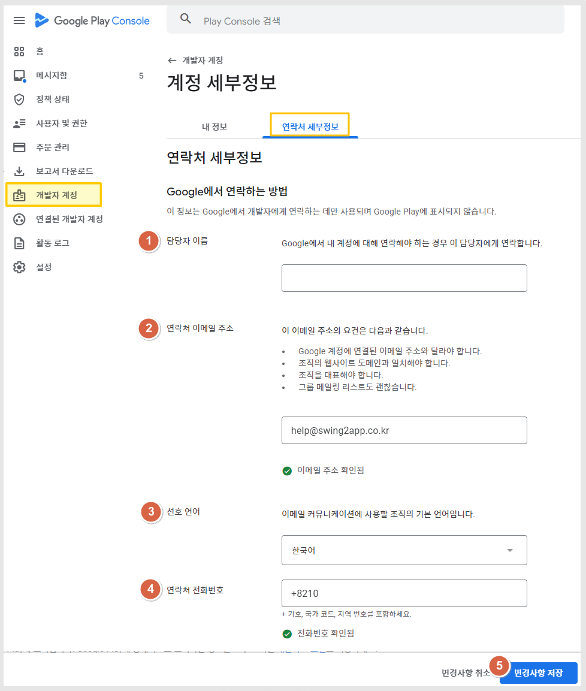

# 구글 플레이 개발자 연락처 정보 변경

<figure><figcaption></figcaption></figure>

개발자 연락처는 비노출 정보와 구글 플레이에 표시되는 정보 2가지로 나뉩니다.

-비공개 정보(구글에서 연락하는 개발자 연락처) 연락처  수정

-플레이스토어 어플에서 공개되는 연락처 수정(모든 사용자들에게 노출되는 정보) 방법입니다.&#x20;

**※구글 플레이 콘솔사이트 접속:**  [**https://play.google.com/console/developers**](https://play.google.com/console/developers)

구글 개발자 콘솔 사이트 접속 후 개발자 계정으로 로그인해주세요.

***

## **1.**&#xAD6C;글에서 연락하는 방법 - 연락처 수정하기

**※구글 플레이 콘솔사이트 접속:**  [**https://play.google.com/console/developers**](https://play.google.com/console/developers)


첫번째는 구글에서 연락할 수 있는 정보를 수정하는 것입니다.

어디에 노출되는 정보가 아니며, 구글에서 연락이 필요할 경우 해당 정보에 입력된 내용으로 연락을 하게 됩니다.


<figure><figcaption></figcaption></figure>

**대시보드의 화면 왼쪽의   \[개발자계정] → \[연락처 세부정보] 선택**

<figure><figcaption></figcaption></figure>

담당자 이름, 이메일주소, 선호언어, 연락처 전화번호를 수정 입력 할 수 있습니다.

\*이메일과 연락처는 인증을 받아야 등록됩니다.

실제 이용가능한 메일인지, 연락처인지 확인하기 위해서 인증번호를 전송하며 인증을 해야만 등록됩니다.

수정 후 \[변경사항 저장] 버튼을 선택하면 저장됩니다.

***

## 2.구글 플레이에 노출되는 정보 - 사용자에게 오픈되는 정보

<figure><figcaption></figcaption></figure>

**구글 플레이 콘솔사이트 접속:**  [**https://play.google.com/console/developers**](https://play.google.com/console/developers)

연락처 세부정보 화면에서 밑으로 내려보시면, "개발자 프로필에 포함된 세부정보" 라고 있습니다.

해당 정보에는 **이메일주소, 개발자 전화번호 2가지 항목**이 보이는데요.

여기에 입력된 정보들은 구글 플레이 어플 - 앱 지원에서 사용자들에게 모두 노출이 됩니다.

<mark style="color:blue;">**\*앱 지원 화면 캡쳐 이미지**</mark>

<figure><figcaption></figcaption></figure>

앱 지원에서 노출되는 정보가 위의 "개발자 프로필에 포함된 세부정보"에 입력된 정보로 노출됩니다.

조직, 개인 개발자 계정 모두 이메일주소와 전화번호는 수정이 가능하구요.


-조직 개발자 계정의 경우 주소와 사업자명(업체명)은 수정 불가합니다.

-개인 개발자 계정의 경우도 주소 변경시 본인 인증(초기에 인증했던 주소 인증 서류를 다시 해야 함)을 다시 진행하지 않는 이상 변경이 불가합니다.&#x20;

(이사 등의 변수가 있을 경우만 변경 요청 할 수 있음)


