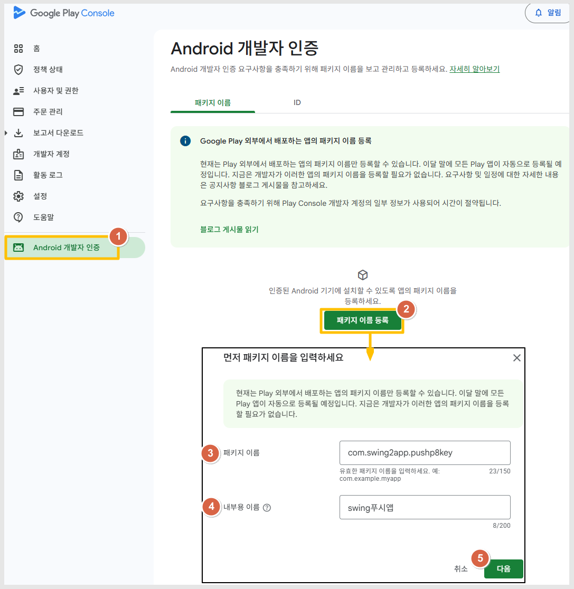
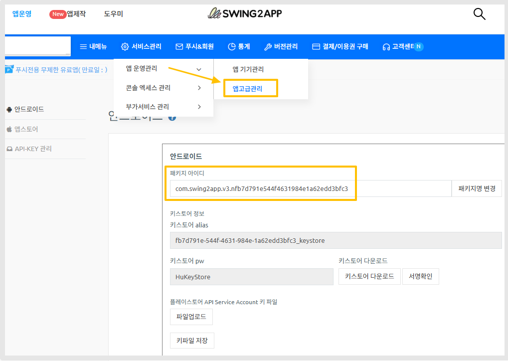
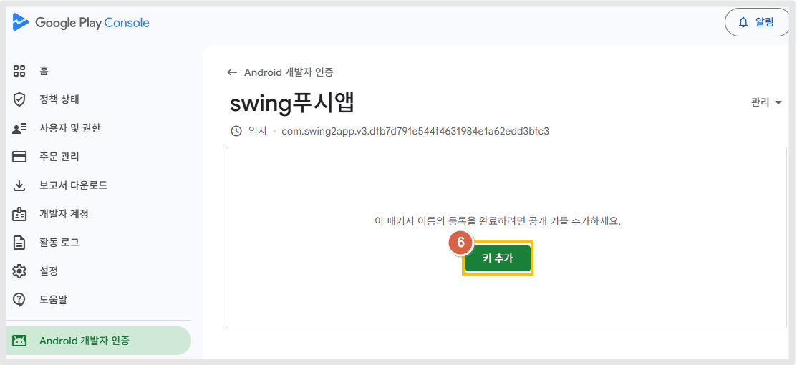
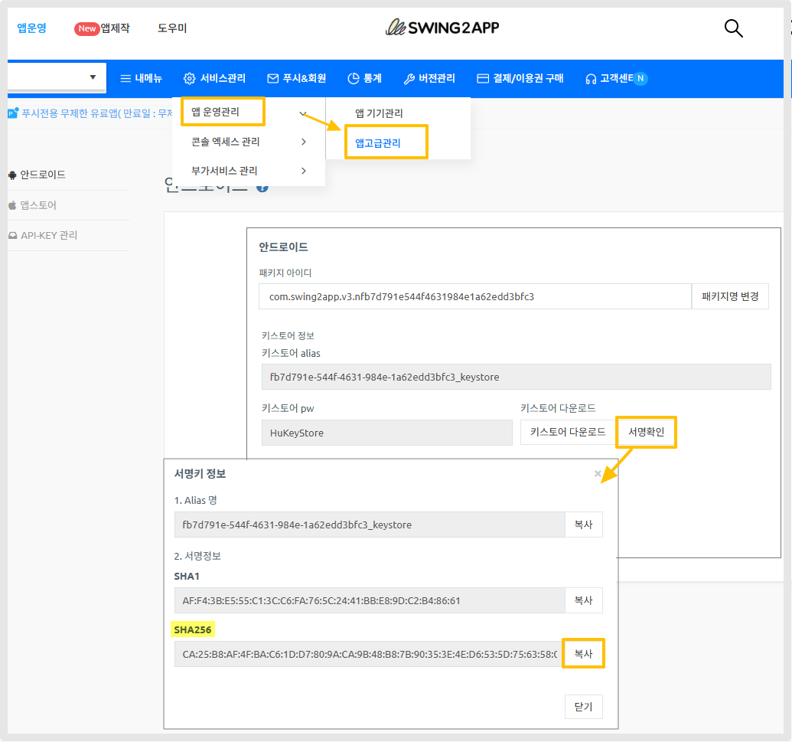
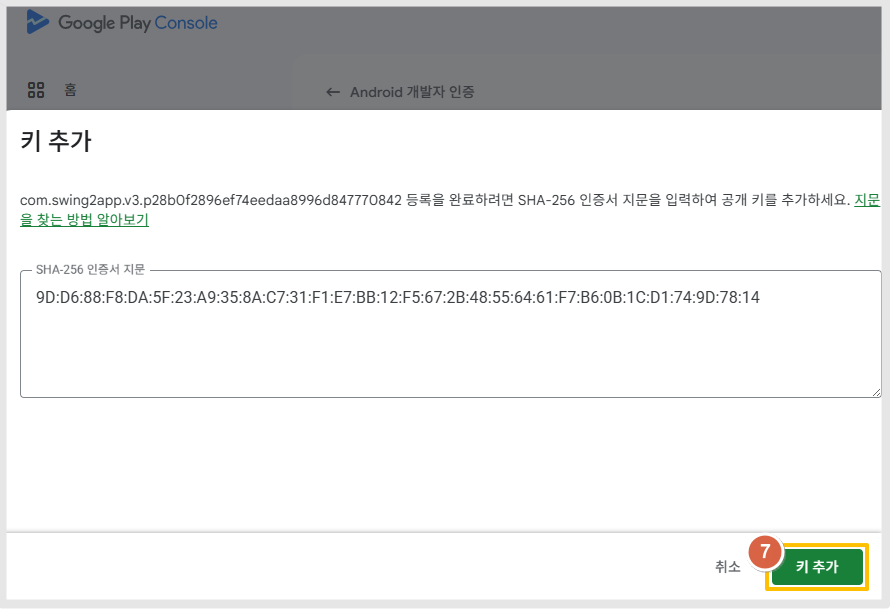
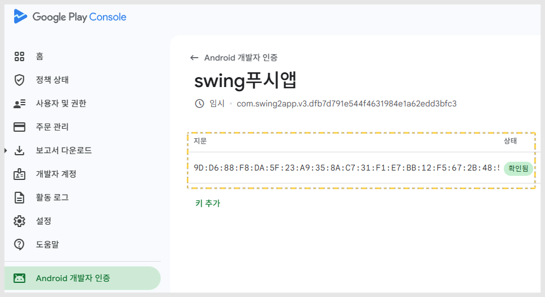

# Android 개발자 인증 등록 방법

***

## Android 개발자 인증 등록 방법

2026년 4월 부터 구글 플레이콘솔 앱을 등록하는 시스템이 변경되었습니다.

신규 앱 등록전 먼저 Android 개발자 인증에서 패키지이름, SHA256 인증서 입력 후 구글의 승인을 받아야 앱 등록을 시작할 수 있습니다.

해당 매뉴얼에서는 앱 등록 전 **Android 개발자 인증 등록 절차를 설명해드립니다.**&#x20;

먼저 Android 개발자 인증에서 <mark style="color:$warning;">**패키지 이름 등록 + SHA-256 인증서 지문**</mark>을 등록해주세요.

<figure><figcaption></figcaption></figure>

1\)[플레이 콘솔](https://play.google.com/console/u/0/developers) 접속 - Android 개발자 인증 선택

2\)패키지 이름 등록 선택&#x20;

3\)패키지 이름 입력

<mark style="background-color:blue;">**✔ 패키지 이름 확인하는 방법 \*스윙투앱 앱 이용**</mark>

<figure><figcaption></figcaption></figure>

[앱운영-서비스관리-앱운영관리-앱고급관리](https://www.swing2app.co.kr/view/app_advanced_management_by_android) 이동 > 패키지 아이디 값 그대로 복사해서 붙여넣기 해주세요.

<mark style="color:$danger;">\*고급관리는 유료앱 이용권 구매한 유료버전 사용자 대시보드에서만 확인 가능, 무료앱은 확인 불가합니다.</mark>

4\)내부용 이름 \*출시하고자 하는 앱 이름 그대로 써주시거나, 테스트용 이름 입력해도 됩니다.

(어디에 노출되는 정보 아닙니다)

5\)\[다음] 버튼 선택

<figure><figcaption></figcaption></figure>

6\)\[키 추가] 버튼 선택

<mark style="background-color:blue;">**✔앱 서명키 SHA-256인증서 확인하는 방법 \*스윙투앱 앱 이용**</mark>&#x20;

<figure><figcaption></figcaption></figure>

[앱운영-서비스관리-앱운영관리-앱고급관리](https://www.swing2app.co.kr/view/app_advanced_management_by_android) 이동 >키스토어 \[서명확인] 선택

**SHA-256 항목 \[복사]**&#xBC84;튼 선택해서 그대로 아 인증서 지문에 붙여넣기 해주세요.

<figure><figcaption></figcaption></figure>

7\)\[키 추가] 버튼 선택

<figure><figcaption></figcaption></figure>

상태가 '확인됨' 이라고 뜨면 완료된 것입니다.

**키 추가 확인이 완료되면, 이제 본격적인 앱을 등록할 수 있습니다.**

콘솔에 앱을 등록 하는 과정은 기존  시스템과동일합니다.

<mark style="color:purple;">\*2026년 4월 구글 플레이콘솔에 새로(최초) 등록하는 앱부터 진행됩니다.(위의 방법대로 등록 해야 합니다.)</mark>

<mark style="color:purple;">이미 출시(등록)된 앱은 아무 조치 안해도 됩니다.</mark>

플레이스토어 앱 등록 매뉴얼은 아래 가이드 링크를 보시고 작업해주세요.



