# 구글 개발자-조직 계정 만들기

***

구글 개발자 조직 계정은 조직(회사)에서 만들 수 있는 계정이구요.

회사에서 사용하는 이메일주소를 구글 개발자 계정으로 연동할 수 있습니다.

구글 비즈니스 개발자 계정을 만드는 방법을 확인해주세요.


**★구글 개발자 계정이란?**

\-플레이스토어에 앱을 출시하기 위해 만들어야 하는 개발자용 계정으로, 구글에 등록비를 내고 만들 수 있습니다.

\-계정 등록비 : 25달러 (한번 결제시 평생 이용, 한국 원화로 약 31,000\~34,000원 비용)

**\*구글 플레이 개발자 콘솔 사이트** [**https://play.google.com/console/developers**](https://play.google.com/console/developers)

\*일반 지메일 계정이 있다고 해서, 해당 계정이 구글 개발자 계정이 되는 것이 절대 아니에요.!

구글 콘솔에서 25달러 등록수수료를 결제한 계정이 개발자 계정이 됩니다\~!



<mark style="color:red;">**개발자 조직 계정 등록에 필요한 조건**</mark>

**1.회사 홈페이지가 있어야 합니다.**

조직 계정 등록시 '조직 웹사이트 인증' 항목이 추가되어 인증을 해야 합니다\_24년 4월 추가

따라서 회사 홈페이지(웹사이트)가 없으면 조직 계정 등록이 불가합니다.&#x20;

**2.DUNS 넘버 있어야 합니다**

조직 개발자 계정을 만들기 전에는 DUNS 넘버를 먼저 등록해주세요.&#x20;

(발행일이 4-5일 소요될 수 있으므로 계정 등록 전 먼저 진행해주세요.)

기업 개발자 등록시에는 이제 DUNS 넘버 등록도 함께 진행되어야 합니다.

[DUNS 넘버 등록 방법 보러가기](https://documentation.swing2app.co.kr/storedeveloper/duns)



<mark style="color:orange;">**구글 개발자 계정 등록 전 확인해주세요.**</mark>&#x20;

1. Google Play 개발자 계정을 만들려면 만 18세 이상이어야 합니다.&#x20;
2. 구글 개발자 계정 등록시, 여러 차례 인증을 거칩니다.                                                                              이메일 주소 인증, 핸드폰 번호 인증 등의 과정이 여러번 진행되기 때문에 반드시 실제 이용가능한 이메일주소, 연락처를 이용해주셔야 합니다.
3. 본인 인증이 가능해야 합니다. 경우에 따라 구글에서 본인 법적 이름으로 발급된 유효한 국가 발급 신분증과 신용카드가 모두 요구할 수 있습니다.
4. 구글 개발자 등록비 25달러가 있습니다. 한 번만 청구되며, 아래 목록에 있는 신용 또는 체크카드로 결제 가능합니다. (카드로만 결제됩니다)
5. 본인 인증이 되지 않거나, 잘못된 정보를 제공하는 경우 등록 수수료가 환불되지 않습니다.
6. 아래 목록에 있는 신용카드 또는 체크카드로 결제할 수 있습니다. (해외 결제가 가능한 카드면 모두 결제 가능합니다)

* Mastercard
* Visa
* American Express
* Discover(미국만 해당)
* Visa Electron(미국 이외의 지역만 해당)

&#x20;**참고**: 선불카드는 사용할 수 없습니다. 사용할 수 있는 카드 유형은 지역에 따라 다를 수 있음.


**\*구글 개인 개발자 계정 등록은 아래 매뉴얼 가이드로 확인해주세요**



***

## 1. 구글 계정 만들기

[https://accounts.google.com/](https://accounts.google.com/)  계정 만들기


**사용 중인 개인 계정(지메일)으로 개발자 계정 만들어도 되나요?**

\=네 사용중인 구글 계정으로 구글 개발자 조직 계정 등록하셔도 됩니다.&#x20;

계정이 있을 경우는 바로 [2. Play Console 개발자 계정 만들기](google-businessdeveloper.md#id-2.-play-console) 챕터로 이동해서 진행해주세요.

그러나 조직용 계정은 아무래도 다른 직원들이 같이 공유하거나 회사 내에서 이용할 수 있는 계정이므로 아무래도 해당 기업(업체)용으로 계정을 새로 하나 만들어서 사용하는 것이 좋습니다.


\*지메일 계정은 아래 링크로 접속해서, 새로 만들어주세요.



&#x20;**계정 만들기 - "개인용"으로 선택하고 진행해주세요.**

<figure>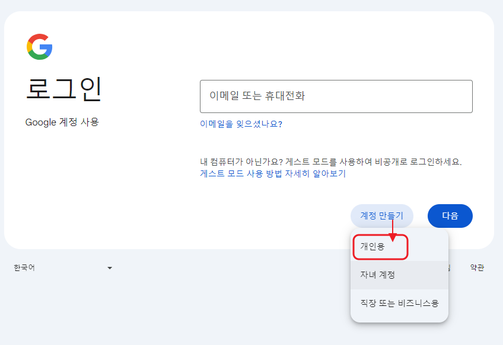<figcaption>
계정 만들기 - 개인용 선택
</figcaption></figure>

<figure>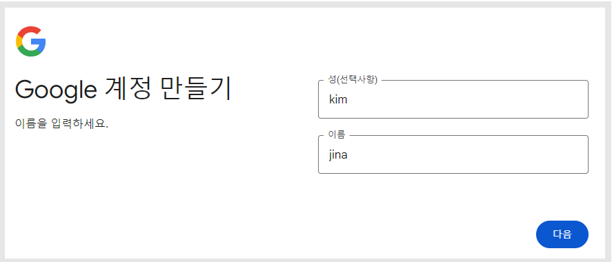<figcaption></figcaption></figure>

1\) 성, 이름 입력 후 다음 선택

<figure>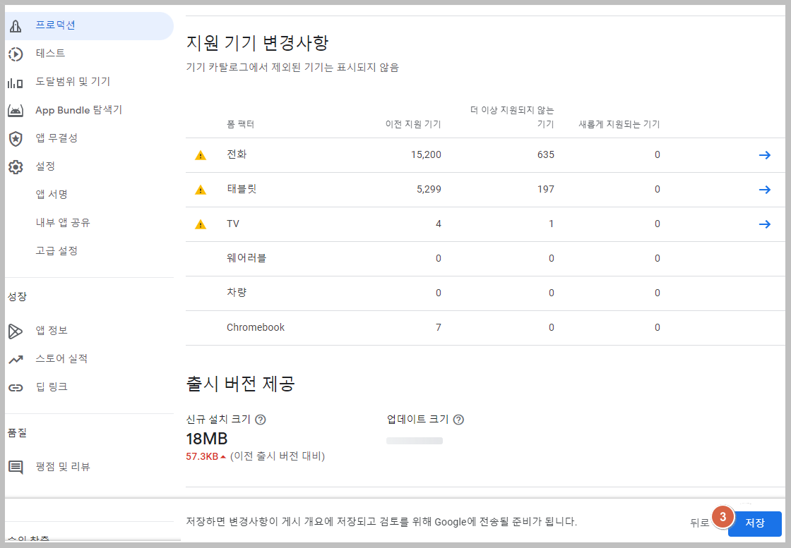<figcaption></figcaption></figure>

2\) 생년월일, 성별 입력 후 다음 선택

<figure>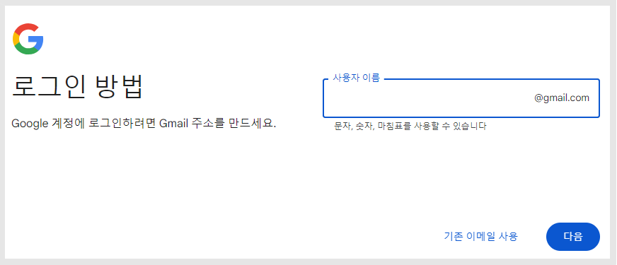<figcaption></figcaption></figure>

3\)새로운 Gmail 계정을 만들어주세요. 다음 선택

<figure>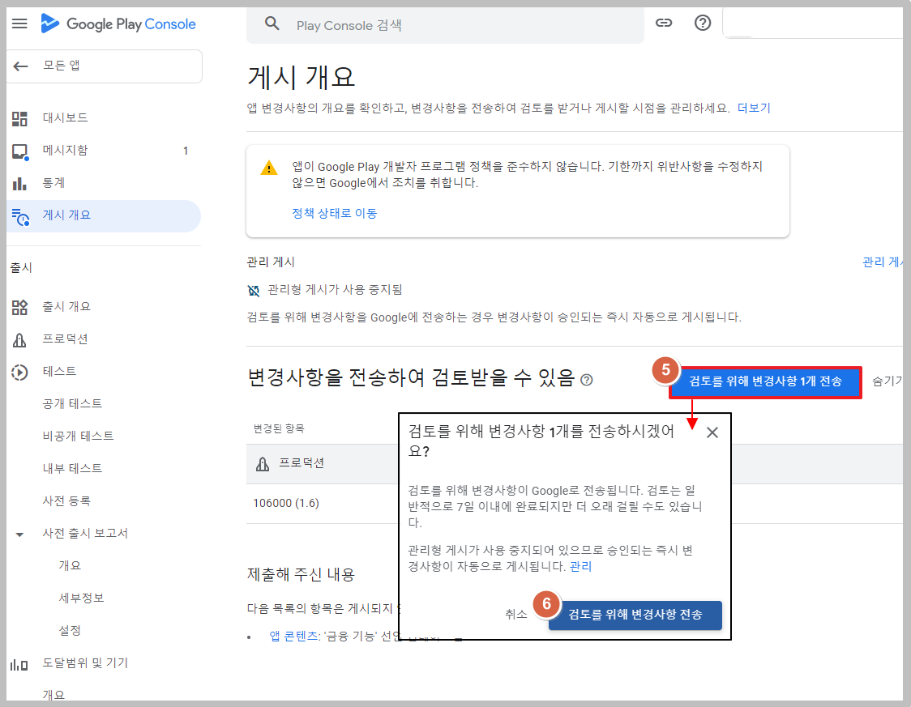<figcaption></figcaption></figure>

4\) 비밀번호 입력 후 다음 선택

<figure>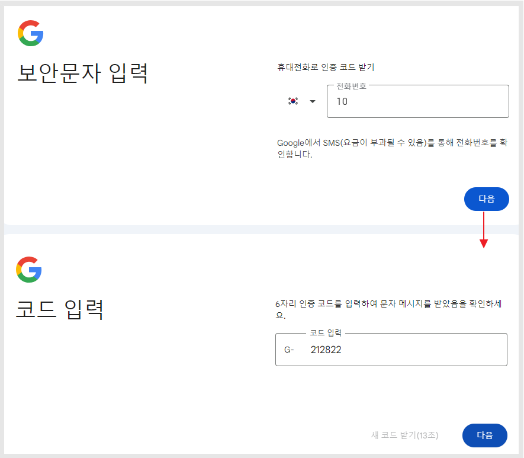<figcaption></figcaption></figure>

5\)휴대전화 번호 입력하면 문자 메시지로 인증코드가 전송됩니다.

6자리 인증번호를 입력 후 다음 선택해주세요.

<figure>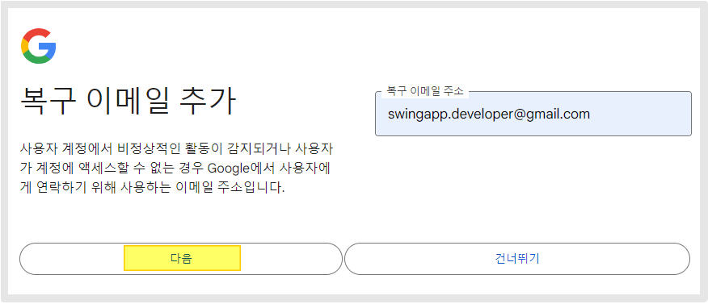<figcaption></figcaption></figure>

6\)복구 이메일 주소 입력 후 다음 선택

<figure>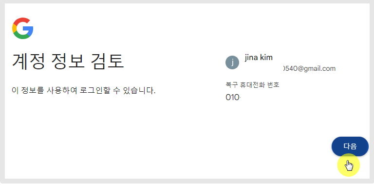<figcaption></figcaption></figure>

7\)계정 정보 검토 확인 후 다음 선택

<figure>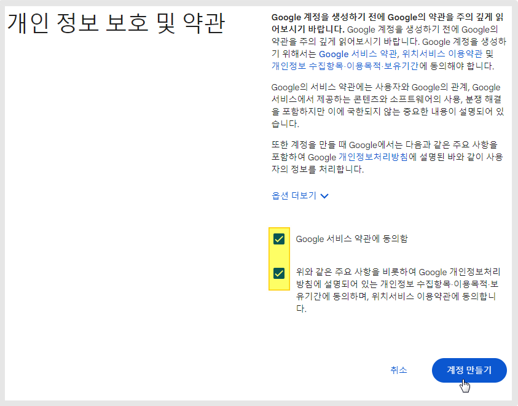<figcaption></figcaption></figure>

8\)개인 정보 보호 및 약관 내용 동의 체크한 뒤 \[계정 만들기] 선택하면 완료됩니다.

계정등록이 완료되면 이제 구글 플레이 콘솔로 이동하여 개발자 등록을 완료해주세요.

***

## 2. Play Console 개발자 계정 만들기

​

계정 기본정보 입력이 완료되었구요.

[구글 플레이 콘솔 ](https://play.google.com/console/u/0/developers)화면으로 이동하여, 본격적으로 개발자 계정을 만들어보겠습니다.&#x20;

[https://play.google.com/console/u/0/developers](https://play.google.com/console/u/0/developers)

### STEP1.계정유형 선택

<figure>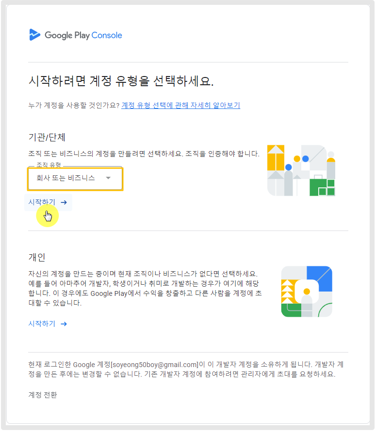<figcaption></figcaption></figure>

기관/단체  - 조직유형을 선택해주세요 \*일반적으로 회사 또는 비즈니스 선택합니다.&#x20;

\[시작하기] 선택해주세요.

<figure>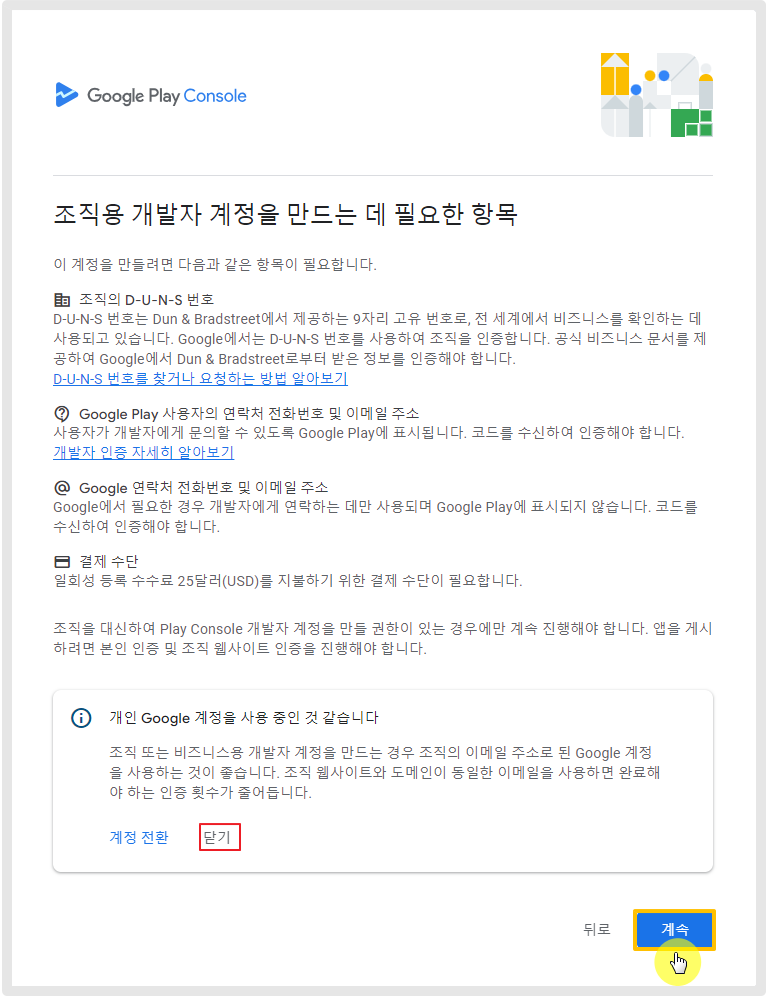<figcaption></figcaption></figure>

조직용 개발자 계정을 만드는데 필요한 항목으로 DUNS 번호, 연락처, 이메일주소, 결제수단을 안내하고 있습니다.

내용 확인 후 \[계속] 버튼 선택합니다.

\*만약 개인 구글 계정(gmail) 사용중이라면 이미지처럼 해당 메시지가 뜰 수 있어요.&#x20;

회사 이메일주소가 아닐 경우 해당 메시지가 뜨는데 진행에는 전혀 문제가 없으니 \[닫기] 버튼 선택해주세요.&#x20;

### STEP2.정보 입력

<figure>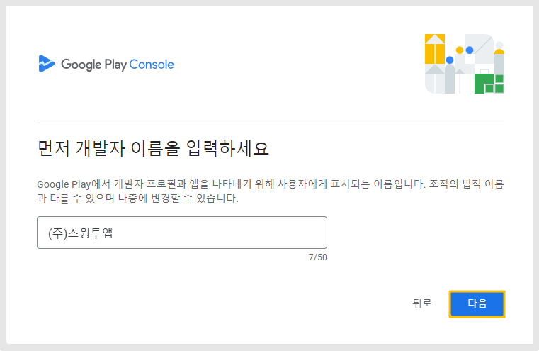<figcaption></figcaption></figure>

### STEP3.결제 프로필 연결(등록)

<figure>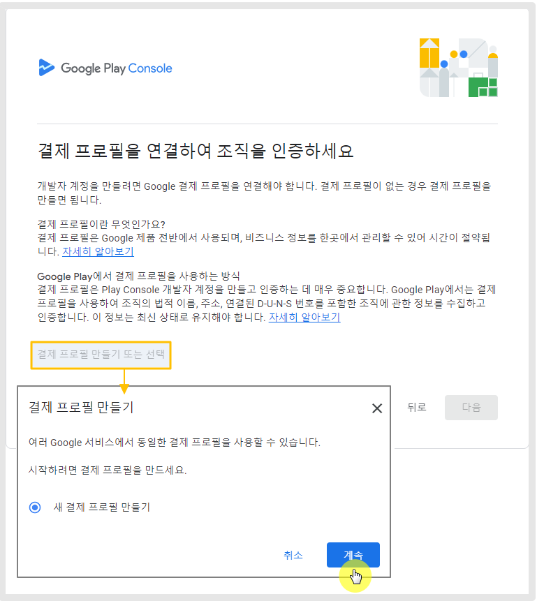<figcaption></figcaption></figure>

\[결제 프로필 만들기 또는 선택] 버튼 선택

'새 결제 프로필 만들기' 체크 후 \[계속] 버튼 선택

### STEP4.DUNS 번호 입력

<figure>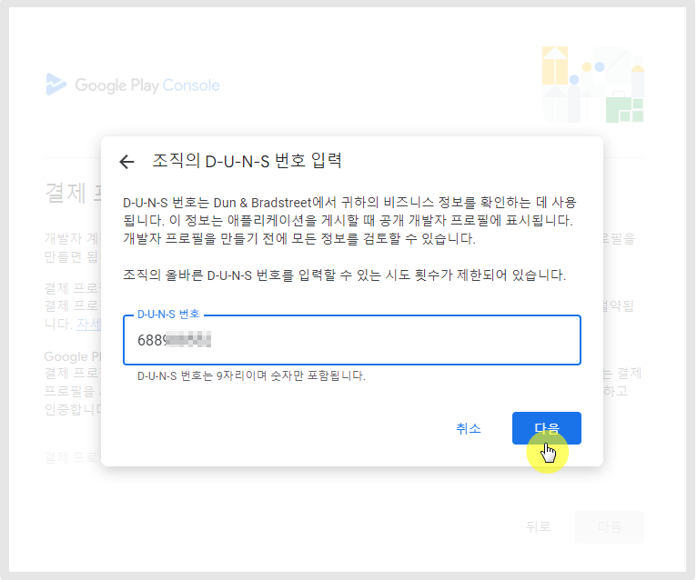<figcaption></figcaption></figure>

발급받은 DUNS 번호 9자리를 등록한 뒤 \[다음] 버튼 선택해주세요.&#x20;

아직 DUNS 넘버 발행을 받지 않았다면, 계정 등록을 잠시 멈추고 번호 등록 먼저 해주세요.&#x20;



<figure>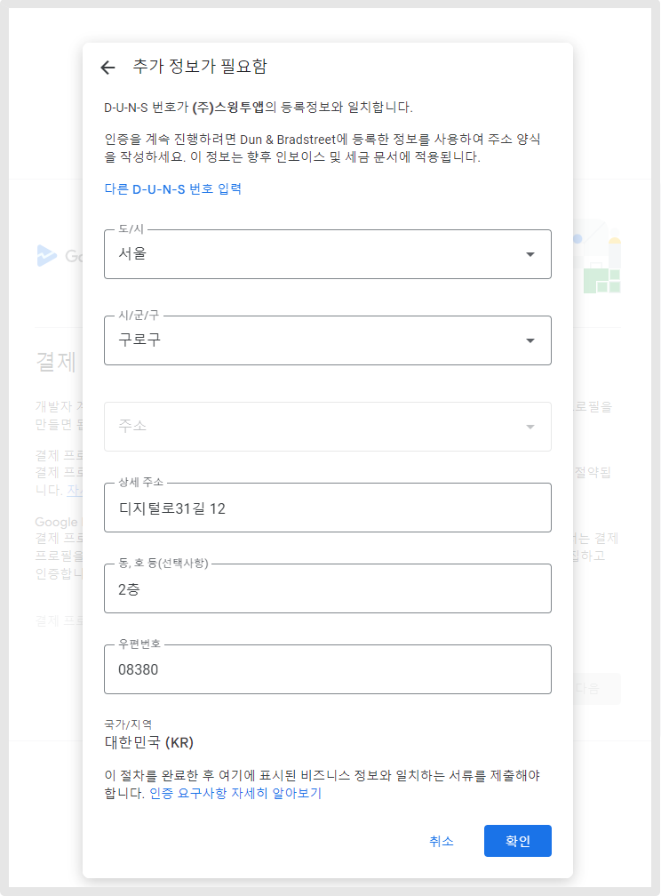<figcaption></figcaption></figure>

DUNS 번호 입력시 자동으로 번호 발행시 등록한 주소가 자동으로 기재됩니다.

만약 세부 주소 등을 수정한다면 해당 화면에서 직접 수정하실 수 있습니다.

모든 내용 입력 후  \[확인] 버튼 선택해주세요.&#x20;

<figure>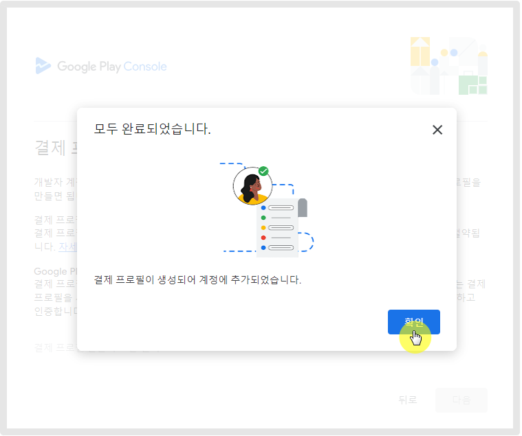<figcaption></figcaption></figure>

결제 프로필 생성이 완료되어, 계정에 추가되었다는 메시지가 뜹니다.

\[확인]버튼 선택해주세요.&#x20;

### STEP5.조직 인증

<figure>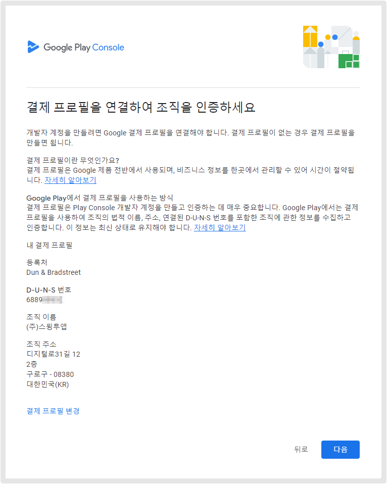<figcaption></figcaption></figure>

입력된 정보 확인 후 \[다음]버튼 선택합니다.

<figure>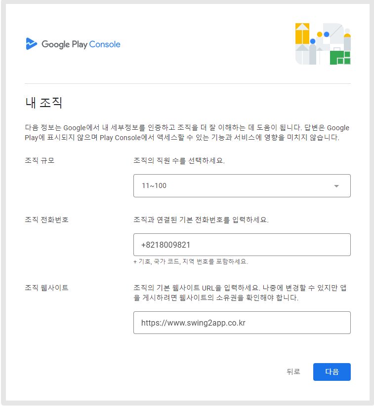<figcaption></figcaption></figure>

1\)조직 규모: 네모칸 화살표를 선택해서 맞는 유형을 선택해주세요.

2\)조직 전화번호: 회사 기본 연락처 기재해주세요. \*국가번호 포함 입력 예)+821012345678

(꼭 회사 번호가 아니더라도 관리자 개인 핸드폰번호 입력도 가능해요)

3\)조직 웹사이트: 회사에서 운영중인 웹사이트 URL을 입력해주세요.&#x20;

사이트가 없으면 ‘웹사이트 없음’에 체크해주세요.

<mark style="color:red;">안내)</mark>

해당 정보는 개발자 프로그램 자격요건에 영향을 미치지 않습니다.

즉, 조직 규모가 작거나 웹사이트가 없더라도 개발자 계정을 만드는데는 아무 영향을 주지 않습니다.

구글에서 수집하는 세부정보일 뿐입니다.

<figure>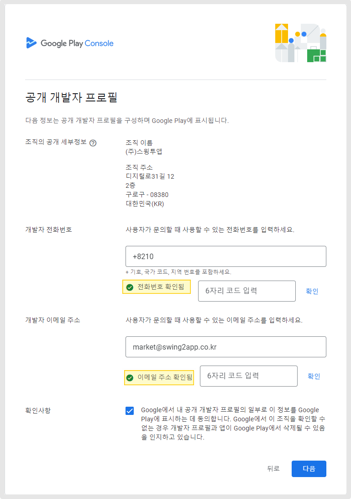<figcaption></figcaption></figure>

1\)개발자 전화번호 입력  \*국가번호 포함 입력 예)+821012345678

\*기호, 국가코드, 지역번호 포함합니다.

입력한 번호로 인증번호가 전송됩니다. 인증까지 해야 번호 확인이 완료됩니다.&#x20;

2\)개발자 이메일주소 입력

\*입력한 메일로 인증번호가 전송됩니다. 인증까지 해야 번호 확인이 완료됩니다.&#x20;

3\)동의 체크

4\)다음 버튼 선택

### STEP6.플레이콘솔 이용 정보

<figure>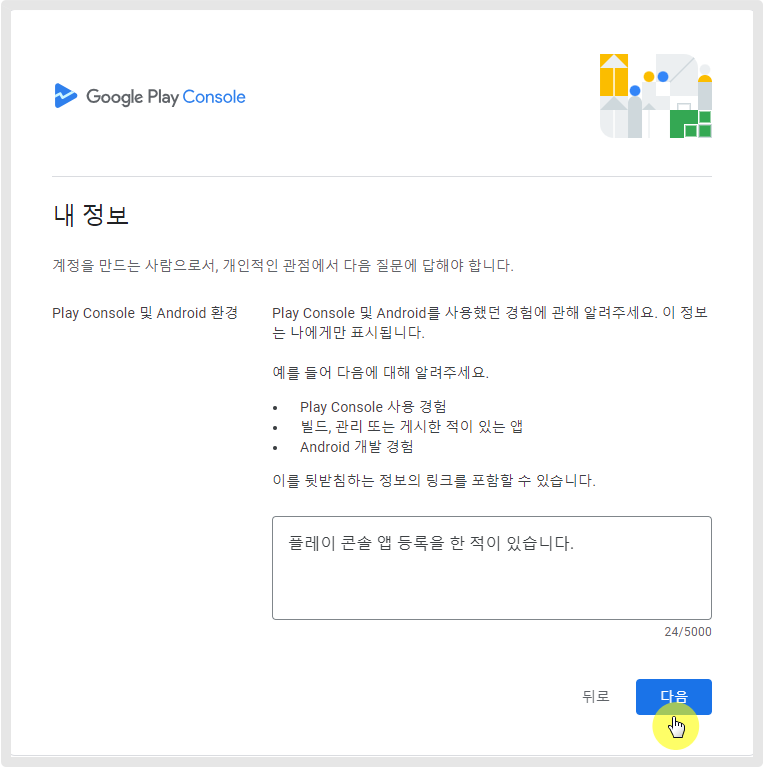<figcaption></figcaption></figure>

플레이 콘솔 사용 및 안드로이드 앱개발 경험이 있다면 메시지란에 기재해주세요.

아무선 경험이 없다면, 사용한 경험이 없다고 기재하시면 됩니다.

\[다음] 버튼 선택

### STEP7.앱 정보

<figure><figcaption></figcaption></figure>

1\)앱 수 체크: 앞으로 구글 플레이에 몇 개 앱을 게시할 지 묻는 질문입니다.

2\)Google Play에서 수익 창출: 앱으로 수익 창출 계획이 있는지 묻는 질문입니다.

3\)앱 카테고리:다음 유형의 앱을 제출할 계획이 있는지 묻는 질문입니다.&#x20;

\*특별한 경우가 아니면 ‘해당 사항 없음’에 체크해주세요.

4\)\[다음] 선택

### STEP8.구글에서 연락하는 방법

<figure>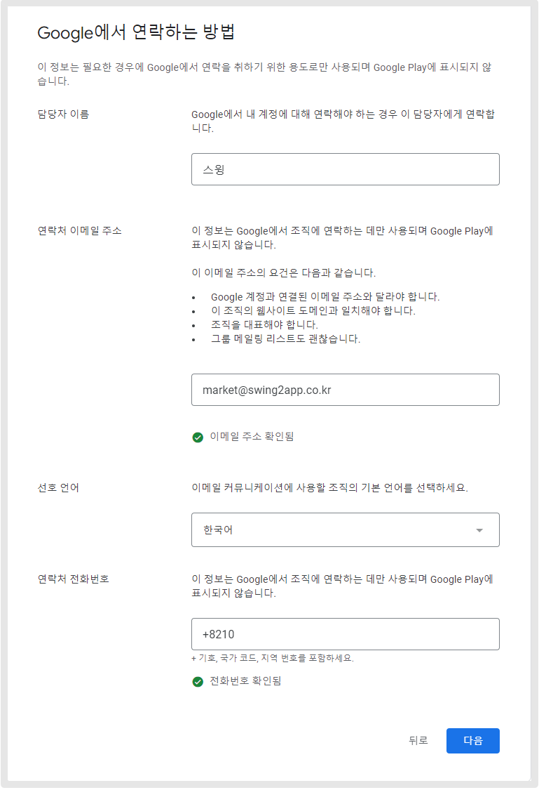<figcaption></figcaption></figure>

​1)담당자 이름 입력

2\)연락처 이메일주소

\*앞서 등록한 이메일 동일하게 입력시 추가 인증 없이 바로 확인 완료됩니다.&#x20;

3\)선호 언어: 한국어 선택 (혹은 국가에 맞게 선택해주세요)

4\)연락처 전화번호

앞서 등록한 번호와 동일번호로 입력시 추가 인증 없이 바로 확인 완료됩니다.&#x20;

5\)\[다음]버튼 선택합니다.&#x20;

### STEP9.약관

<figure><figcaption></figcaption></figure>

약관 내용 체크해주세요.

\[계정 생성 및 결제] 선택해주세요.

***

## 3.결제하기(계정 등록비 결제)

<figure><figcaption></figcaption></figure>

**조직 등록에 필요한 정보 입력은 모두 완료했구요. 마지막 단계인 개발자 계정 등록비를 결제합니다.**

**\[신용카드 또는 체크카드 추가]** 선택해주세요.

\-구글 개발자 등록비 $25 (한화에 따라 33,000\~35,000원)

\-카드만 결제 가능합니다.

\-카드 결제시 계정을 등록한 사람과 결제하고자 하는 카드 소유자는 달라도 상관없습니다.

​

<figure><figcaption></figcaption></figure>

1\)카드 번호 입력

2\)유효기간, 보안코드(CVC번호)

3\)카드 소유자 이름

4\)국가/지역 선택

5\)청구지 우편번호 입력

6\)\[카드 저장] 버튼 선택합니다.


<mark style="color:red;">**\*주의사항**</mark>

국가/지역은 앞서 계정 등록시 입력한 국가와 동일해야 합니다.

카드 소유자 이름은 개발자 계정을 운영하는 사람과 달라도 상관없으나 국가는 동일해야 합니다.

예시) 계정 등록시에는 조직 주소를 ‘대한민국’으로 입력했으나, 카드 등록시 국가를 ‘미국’으로 선택시 본인 인증이 되지 않아 계정 사용이 불가해집니다.

‘대한민국’이라면 모두 통일해서 입력해야 합니다.

개발자 계정등록비가 결제가 되어도, 본인인증이 불가하여 실제 사용을 못하게 되며 환불도 불가합니다.


<figure><figcaption></figcaption></figure>

카드등록이 완료되었구요. \[구입] 버튼을 선택해주세요.

<figure><figcaption></figcaption></figure>

구매 완료 및, 개발자 계정 생성이 완료되었습니다.

그런데! 여기서 중요한 점은 조직(비즈니스용) 계정은 여기서 끝이 아니라 본인 인증을 한번 더 해야 합니다.

**\[Play Console로 이동]** 선택해주세요.

<figure><figcaption></figcaption></figure>

## 4.본인 인증

​

### STEP1.본인인증 선택

<figure><figcaption></figcaption></figure>

버튼 선택시,

구글 플레이 콘솔 페이지로 이동되며, 위의 이미지처럼 본인 인증이 필요하다는 메시지가 떠 있는 것을 확인할 수 있어요.

\[본인 인증]을 선택해주세요.

​

### STEP2.본인 확인 절차

<figure><figcaption></figcaption></figure>

본인 확인을 위해 가장 먼저 개인 신원을 확인하게 됩니다.

1.이름, 주민번호 입력, 통신사 선택, 연락처(핸드폰번호)를 등록하여 인증 받습니다.

2.주소를 입력합니다.

거주지 주소를 입력하고, 국가/지역은 대한민국을 선택합니다.

3.제출 버튼을 선택해주세요.


<mark style="color:red;">\*주의사항\*</mark>

여기서 주의하셔야 할 사항은, 주소지를 구글 개발자 계정시 입력한 주소지와 다르게 입력시 인증이 되지 않을 수 있습니다.

예를 들어, 개발자 계정 입력에서는 국가를 ‘미국’으로 입력했으나, 본인 인증 주소는 ‘대한민국’으로 입력하여

서로 입력된 국가가 다를 경우 구글에서 본인 인증을 처리해주지 않습니다. \_유령 계정 등 불법 계정 복제를 막기 위한 정책입니다.

따라서 국가 및 주소는 꼭 동일하게 기재해주시기 바랍니다.


### STEP3.OTP(인증 코드 번호) 입력

<figure><figcaption></figcaption></figure>

마지막 인증으로 사용자가 입력한 핸드폰번호로 인증번호(코드)를 발송합니다.

발송된 코드(6자리)를 입력하고 \[확인] 버튼을 눌러주세요.

### STEP4.확인 완료

<figure><figcaption></figcaption></figure>

OTP 코드 등록까지 완료되면 모든 본인 인증 확인이 완료됩니다.

​

### STEP5.완료 – 콘솔 이용 가능

<figure><figcaption></figcaption></figure>

이제 플레이 콘솔 이용이 가능해집니다.

이렇게 본인 인증까지 완료해야 앱 등록이 가능합니다.

본인 인증이 완료되지 않을 경우, 콘솔이 만들어져도 앱 등록을 할 수 없어요.

따라서 개발자 계정 등록이 완료되었다는 메시지 확인 후, 반드시 플레이 콘솔로 이동하여 해야 할 작업이 모두 완료되었는지 체크해주세요.

본인 인증 확인 메시지가 뜨지 않는 경우도 있습니다.

이 경우는 바로 앱 등록이 가능합니다.


<mark style="color:red;">**중요 안내**</mark>

1\)플레이스토어 앱 등록 및 출시를 위해서는 사용자분의 구글 개발자 계정이 반드시 있어야 하며, 선택이 아닌 필수입니다.

2\)개발자 등록비는 25달러이며, 구글 측에 납부하는 수수료입니다. 한번 결제시 평생 이용할 수 있습니다.&#x20;

3\)구글개발자 등록비는 스윙투앱 서비스와는 관련이 없습니다. (스윙투앱 서비스와는 관계없으며, 환불 등의 내용은 모두 구글 고객센터로 문의주시기 바랍니다.)

4\)구글 개발자 계정은 스윙투앱에서 만들어드리지 않습니다. (개인 정보 입력 및 본인인증이 필요하기 때문에 만들어드리지 못합니다)&#x20;

5\)스윙투앱으로 제작한 앱을 플레이스토어 출시하고자 할 때는 유료앱만 출시 가능합니다.

무료버전 앱은 상용화가 불가한 버전으로, 스토어 출시를 하고자 할 때는 유료앱 이용권을 구매해주시기 바랍니다.&#x20;

6\)스윙투앱에서 제작한 앱을 플레이스토어 등록시, 직접 하는 것이 어렵다면 업로드 대행도 가능합니다.

관련 내용은 플레이스토어 업로드 신청방법 매뉴얼을 확인해주세요.&#x20;

**☞**[**\[플레이스토어 업로드 신청방법 보러가기\]**](../../manual/appmanage/version/playstore-upload.md)

7\) 만든 개발자 계정에는 제한없이 앱 등록이 가능합니다.

단, 정책 위반시 앱 삭제 및 개발자 계정이 삭제될 수 있으므로 구글 플레이 정책 내용은 반드시 확인해주시기 바랍니다.&#x20;


<figure><figcaption></figcaption></figure>
