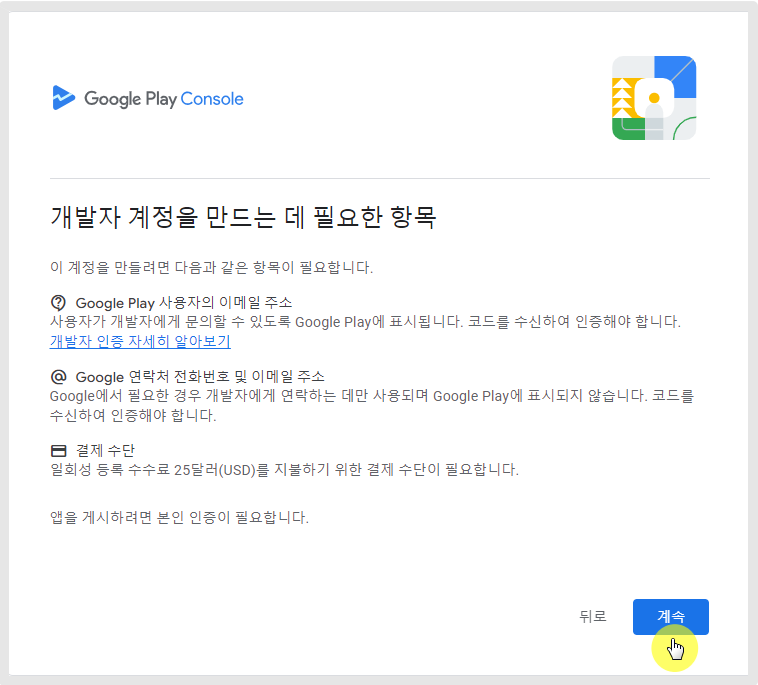
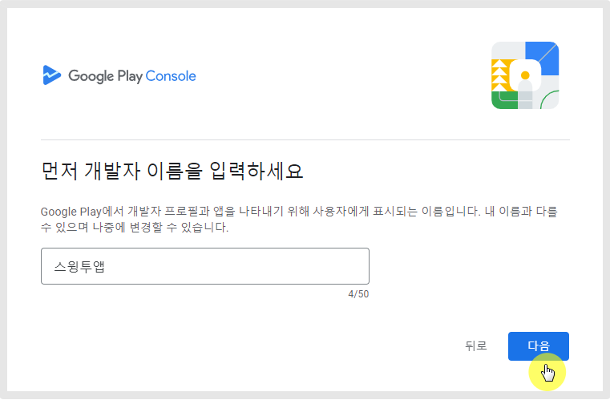
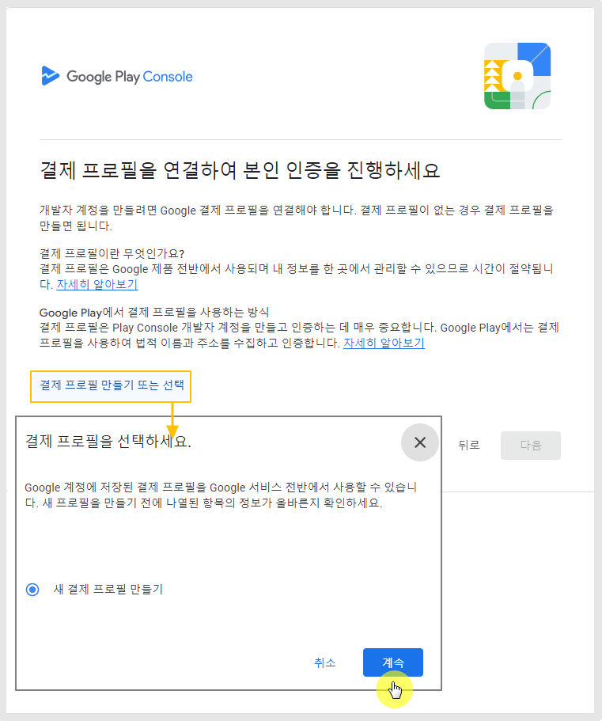
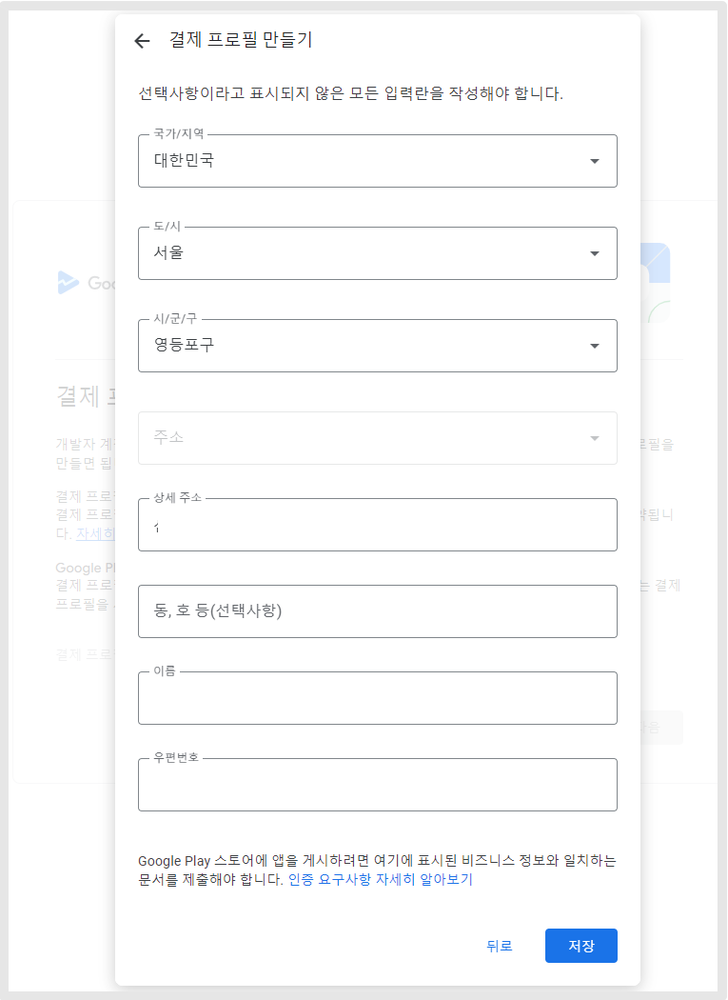
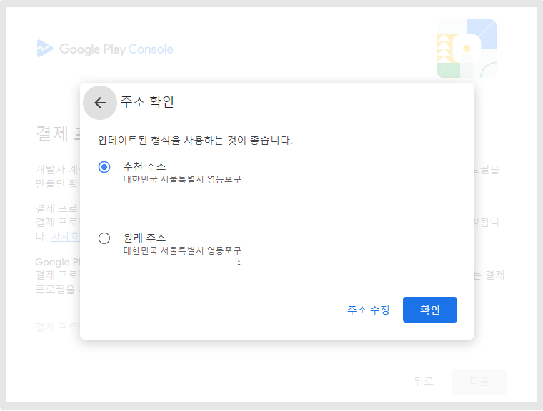
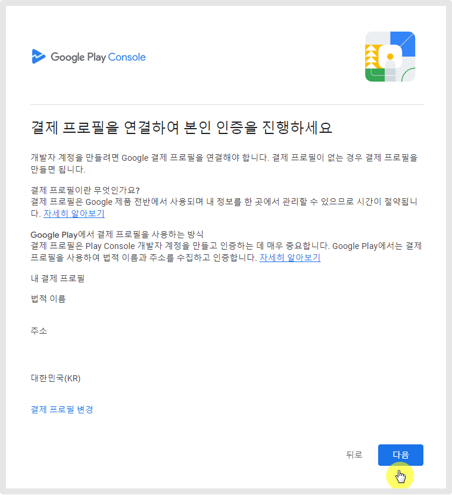
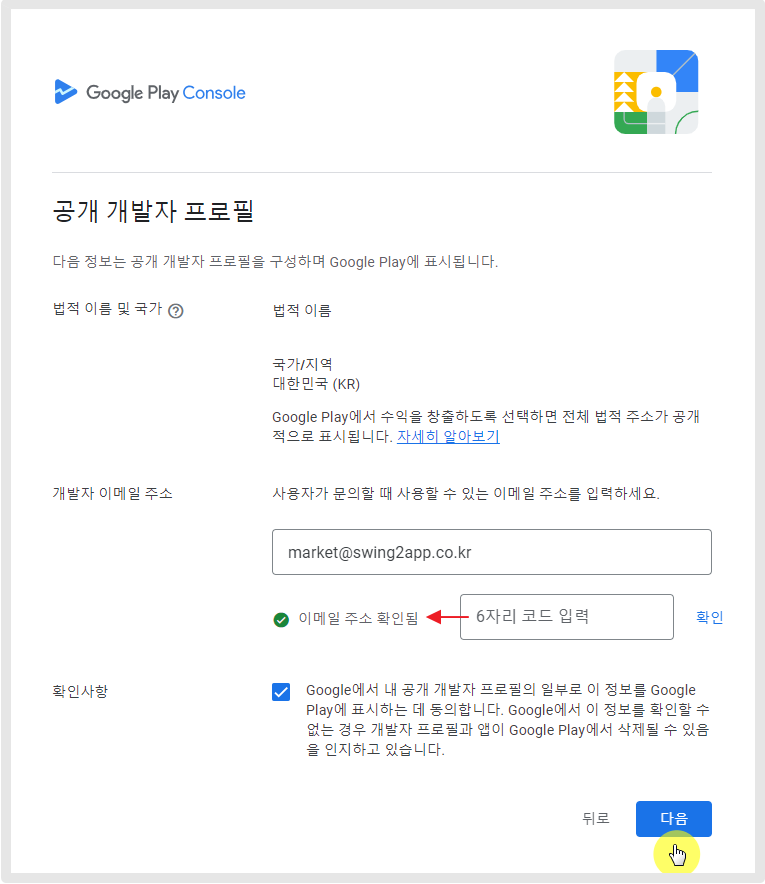
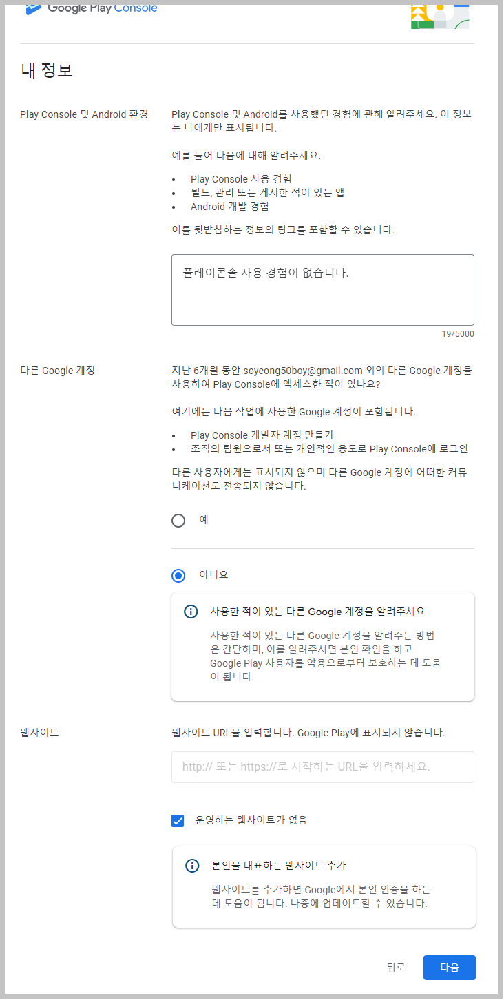

# 구글 개발자-개인 계정 만들기

<figure><figcaption></figcaption></figure>


**★구글 개발자 계정이란?**

\-플레이스토어에 앱을 출시하기 위해 만들어야 하는 개발자용 계정으로, 구글에 등록비를 내고 만들 수 있습니다.

\-계정 등록비 : 25달러 (한번 결제시 평생 이용, 한국 원화로 약 33,000\~36,000원 비용)

**\*구글 플레이 개발자 콘솔 사이트** [**https://play.google.com/console/developers**](https://play.google.com/console/developers)

\*일반 지메일 계정이 있다고 해서, 해당 계정이 구글 개발자 계정이 되는 것이 절대 아니에요.!

구글 콘솔에서 25달러 등록수수료를 결제한 계정이 개발자 계정이 됩니다\~!



<mark style="color:orange;">**구글 개발자 계정 등록 전 확인해주세요.**</mark>&#x20;

1. Google Play 개발자 계정을 만들려면 만 18세 이상이어야 합니다.&#x20;
2. 구글 개발자 계정 등록시, 여러 차례 인증을 거칩니다.                                                                              이메일 주소 인증, 핸드폰 번호 인증 등의 과정이 여러번 진행되기 때문에 반드시 실제 이용가능한 이메일주소, 연락처를 이용해주셔야 합니다.
3. 본인 인증이 가능해야 합니다. 경우에 따라 구글에서 본인 법적 이름으로 발급된 유효한 국가 발급 신분증과 신용카드가 모두 요구할 수 있습니다.
4. 구글 개발자 등록비 25달러가 있습니다. 한 번만 청구되며, 아래 목록에 있는 신용 또는 체크카드로 결제 가능합니다. (카드로만 결제됩니다)
5. 본인 인증이 되지 않거나, 잘못된 정보를 제공하는 경우 등록 수수료가 환불되지 않습니다.
6. 아래 목록에 있는 신용카드 또는 체크카드로 결제할 수 있습니다.

&#x20;&#x20;

* Mastercard
* Visa
* American Express
* Discover(미국만 해당)
* Visa Electron(미국 이외의 지역만 해당)

&#x20;**참고**: 선불카드는 사용할 수 없습니다. 사용할 수 있는 카드 유형은 지역에 따라 다를 수 있음.



**-사용하는 구글 gmail 계정이 있다면, 해당 계정을 개발자로 연동할 수 있구요.**

**-계정이 없거나, 개발자용 계정을 새로 만들어야 한다면 지메일 계정을 새로 등록한 뒤→개발자 계정을 등록할 수 있습니다.**&#x20;


매뉴얼을 통해서 기존 구글 계정(지메일)로 개발자 계정을 만드는 방법과

구글 계정을 새로 만들어서 개발자 계정을 등록하는 방법 2가지 내용을 확인해주세요.

**\*구글 비즈니스(조직용) 개발자 계정 등록은 아래 매뉴얼 가이드로 확인해주세요.**



<figure><figcaption></figcaption></figure>

##  **STEP1. 사용중인 gmail(구글)계정으로 만들기**&#x20;

**사용하는 구글 gmail(지메일) 계정이 있고, 해당 계정을 개발자 계정으로 사용한다면 로그인한 상태에서 바로 구글 플레이 콘솔 사이트로 이동합니다.**

**\*구글 플레이 콘솔 사이트 이동**

&#x20;[**https://play.google.com/console/developers**](https://play.google.com/console/developers)

지메일이 없는 분들은 구글 계정을 새로 만들어서 등록해주세요,&#x20;

해당 파트 다음 글을 참고해주세요!

### <mark style="color:blue;">**1. 시작: 개발자 계정 만들기**</mark>

<figure><figcaption></figcaption></figure>

개인 \[시작하기] 선택합니다.

<figure><figcaption></figcaption></figure>

개발자 계정을 만드는데 필요한 항목 확인 후 \[계속] 버튼 선택합니다.

<figure><figcaption></figcaption></figure>

개발자 이름 입력 후 \[다음] 버튼 선택

### <mark style="color:blue;">2.결제프로필 만들기</mark>

<figure><figcaption></figcaption></figure>

\[결제 프로필 만들기 또는 선택] 버튼 선택 - 새결제 프로필 만들기 선택 - \[계속] 버튼 선택합니다.&#x20;

<figure><figcaption></figcaption></figure>

주소 입력

국가 , 도/시, 시/군/구,  상세 주소 입력, 이름 입력, 우편번호 입력 후 \[저장] 버튼 선택


**주의사항**

개인 계정을 만들 때 주소는 반드시 인증이 가능한 주소로 입력해주세요. \*본인 집주소 기재

가입 후 구글은 본인 인증을 위해 사용자 이름과 주소가 기재된 서류를 요청할 수 있습니다.

신용카드 내역서 혹은 아파트 관리비 내역서 혹은 요금 고지서 등

따라서 본인 이름으로 가입을 하게 될 경우 집 주소로 등록하는 것이 좋습니다.


<figure><figcaption></figcaption></figure>

주소 확인 완료 후 \[확인] 버튼 선택

<figure><figcaption></figcaption></figure>

본인 인증 진행 \[다음] 버튼 선택

<figure><figcaption></figcaption></figure>

개발자이메일주소 입력

\*입력한 메일로 인증번호가 전송됩니다. 인증까지 해야 번호 확인이 완료됩니다.

다음 버튼 선택 합니다.&#x20;

### <mark style="color:blue;">3.내 정보 입력</mark>

<figure><figcaption></figcaption></figure>

1\)플레이 콘솔 사용 및 안드로이드 앱개발 경험이 있다면 메시지란에 기재해주세요.

아무선 경험이 없다면, 사용한 경험이 없다고 기재하시면 됩니다.

2\)지난 6개월 동안다른 구글 계정을 사용하여 구글 플레이 콘솔에 접속한 적이 있다면 기재해주세요.

사용한 적이 없다면 '아니요'에 체크해주세요.

3\)웹사이트

운영중인 사이트가 있을 경우 URL을 입력해주세요.

없으면 "운영하는 웹사이트가 없음"에 체크하셔도 됩니다.&#x20;

4\)\[다음] 버튼 선택 합니다.

### <mark style="color:blue;">4.앱 정보</mark>

<figure><figcaption></figcaption></figure>

1\)앱 수 체크: 앞으로 구글 플레이에 몇 개 앱을 게시할 지 묻는 질문입니다.

2\)Google Play에서 수익 창출: 앱으로 수익 창출 계획이 있는지 묻는 질문입니다.

3\)앱 카테고리:다음 유형의 앱을 제출할 계획이 있는지 묻는 질문입니다.

\*특별한 경우가 아니면 ‘해당 사항 없음’에 체크해주세요.

4\)\[다음] 선택

### <mark style="color:blue;">5.구글에서 연락하는 방법</mark> 

<figure><figcaption></figcaption></figure>

​1)담당자 이름 입력

2\)연락처 이메일주소

\*앞서 등록한 이메일 동일하게 입력시 추가 인증 없이 바로 확인 완료됩니다.

3\)선호 언어: 한국어 선택 (혹은 국가에 맞게 선택해주세요)

4\)연락처 전화번호

앞서 등록한 번호와 동일번호로 입력시 추가 인증 없이 바로 확인 완료됩니다.

5\)\[다음]버튼 선택합니다.

### <mark style="color:blue;">6.약관</mark> 

<figure><figcaption></figcaption></figure>

약관 내용 체크해주세요.

\[계정 생성 및 결제] 선택해주세요.


계정등록시 본인여부 확인을 위해 신분증을 제출하라는 메시지를 받을 수 있습니다.

본인 인증이 완료되어야 계정 등록이 완료되며, 계정 수수료를 결제했는데 본인 확인이 불가할 경우는 수수료 환불이 불가하오니 꼭 유념해주세요!


​

### <mark style="color:blue;">**7. 등록수수료 25달러 결제하기: 카드 결제**</mark>&#x20;

구글 개발자 등록비는 카드결제만 이용 가능합니다. \*해외결제 가능한 카드만 가능

결제할 카드 정보를 입력합니다. <mark style="color:red;">\*개발자 등록비 결제는 해외 결제가 가능한 카드 결제만 됩니다.</mark>

1\) 카드번호 입력 , 월/연/CVC 번호 입력

2\) 카드 소유자 이름&#x20;

<mark style="color:red;">\*계정 소유주와 카드 소유주가 달라도 괜찮습니다. 실제 결제하는 카드에 등록된 이름으로 기재합니다.</mark>

3\) 나라 선택

4\) 우편번호 입력

5\) 구매 버튼 선택

​

### <mark style="color:blue;">**8. 결제완료**</mark>

결제가 완료되었습니다. 등록 계속하기를 선택합니다.

​

### <mark style="color:blue;">**9. 구글 개발자 계정 등록 완료-본인 인증 확인**</mark>&#x20;

<figure><figcaption></figcaption></figure>

이렇게 계정이 생성이 되었다는 완료 메시지만 보고, 사이트를 종료하지 말구요.&#x20;

&#x20;<mark style="color:blue;">**\[Play Console로 이동]**</mark> 버튼을 선택해주세요.

콘솔에서 본인 인증이 필요한 경우가 있습니다.&#x20;

콘솔로 이동하여 ‘본인 인증’ 메시지가 표시된다면 본인인증을 선택해서 작업을 완료해주세요.&#x20;

바로 콘솔 이용이 가능하면, 본인 인증을 할 필요 없습니다.&#x20;



위의 매뉴얼을 확인하여, 본인 인증까지 완료해주세요.&#x20;

### <mark style="color:blue;">**10. 완료 - 구글 플레이 콘솔 접속**</mark>&#x20;

계정 등록이 완료되면, 실제로 앱을 등록할 수 있는 구글 플레이 콘솔 페이지가 열립니다.

<mark style="color:blue;">**\[앱 만들기]**</mark> 파란색 버튼을 선택해서 앱을 플레이스토어에 출시할 수 있어요.

**플레이스토어 앱 출시방법은 스윙투앱 – 플레이스토어 앱 등록 출시하기 매뉴얼을 확인해주세요\~!**

 [**플레이스토어 앱등록 출시방법 보러가기**](playstore-apprelease.md)

<figure><figcaption></figcaption></figure>

## **STEP2. 구글 계정 새로 만들어서 등록하기**&#x20;

**gmail 계정이 없거나 개발자용 계정을 새로 만들어야 한다면! 구글 계정 등록 사이트에서 계정을 먼저 만들어주세요.**

\*지메일 계정은 아래 링크로 접속해서, 새로 만들어주세요.&#x20;

&#x20;[http://accounts.google.co.kr/](http://accounts.google.co.kr/)

### <mark style="color:blue;">**1. 계정만들기**</mark>

계정 만들기 선택한 뒤 – 본인 계정 선택 – 다음 선택

<figure><figcaption></figcaption></figure>

1\) 성, 이름 입력

2\) 이메일주소 입력

3\) 비밀번호 입력

4\) 다음 선택

### <mark style="color:blue;">**2. 전화번호 인증**</mark>

구글 계정을 만든 전화번호를 입력하여 인증번호를 받아주세요.

인증 코드 입력 후 \[확인] 선택

​

### <mark style="color:blue;">**3. 개인정보 입력**</mark>

1\) 전화번호 입력

2\) 복구 이메일 주소 입력 (해당 메일주소 외에 이메일 복구시 필요한 이메일주소 입력)

3\) 생년월일 입력

4\) 성별 선택

5\) \[다음] 버튼 선택

**​**

### <mark style="color:blue;">**4. 구글 계정 만들기 완료**</mark>

### <mark style="color:blue;">**5. 구글 플레이 콘솔 사이트 이동**</mark>

계정이 다 만들어졌다면 [**구글 플레이 콘솔 사이트**](https://play.google.com/console/developers)로 이동하여 개발자 등록을 완료해주세요.

위의 개발자 계정 등록방법과 동일합니다.

[https://play.google.com/console/developers](https://play.google.com/console/developers)

### <mark style="color:blue;">**등록 수수료 결제하기**</mark>

구글 개발자 등록비 25달러를카결제합니다.  \*카드 결제만 가능합니다.&#x20;

결제할 카드 정보를 입력합니다. <mark style="color:red;">\*개발자 등록비 결제는 해외 결제가 가능한 신용,체크 카드만 결제됩니다.</mark>

1\) 카드번호 입력 , 월/연/CVC 번호 입력

2\) 카드 소유자 이름&#x20;

<mark style="color:red;">\*계정 소유주와 카드 소유주가 달라도 괜찮습니다. 실제 결제하는 카드에 등록된 이름으로 기재합니다.</mark>

3\) 나라 선택

4\) 우편번호 입력

5\) 구매 버튼 선택

​

결제가 완료되었습니다. 등록 계속하기를 선택합니다.

### <mark style="color:blue;">**6. 구글 개발자 계정 등록 완료-본인 인증 확인**</mark>&#x20;

<figure><figcaption></figcaption></figure>

이렇게 계정이 생성이 되었다는 완료 메시지만 보고, 사이트를 종료하지 마시구요.&#x20;

&#x20;<mark style="color:blue;">**\[Play Console로 이동]**</mark> 버튼을 선택해주세요.

콘솔에서 본인 인증이 필요한 경우가 있습니다.&#x20;

콘솔로 이동하여 ‘본인 인증’ 메시지가 표시된다면 본인인증을 선택해서 작업을 완료해주세요.&#x20;

바로 콘솔 이용이 가능하면, 본인 인증을 할 필요 없습니다.&#x20;



위의 매뉴얼을 확인하여, 본인 인증까지 완료해주세요

### <mark style="color:blue;">**7. 완료 - 구글 플레이 콘솔 접속**</mark>

계정 등록이 완료되면, 실제로 앱을 등록할 수 있는 구글 플레이 콘솔 페이지가 열립니다.

<mark style="color:blue;">**\[앱만들기]**</mark> 파란색 버튼을 선택해서 앱을 플레이스토어에 출시할 수 있어요.

**플레이스토어 앱 출시방법은 스윙투앱 – 플레이스토어 앱 등록 출시하기 매뉴얼을 확인해주세요\~!**

 [**플레이스토어 앱등록 출시방법 보러가기**](playstore-apprelease.md)


<mark style="color:red;">**중요 안내**</mark>

1\)플레이스토어 앱 등록 및 출시를 위해서는 사용자분의 구글 개발자 계정이 반드시 있어야 하며, 선택이 아닌 필수입니다.

2\)개발자 등록비는 25달러이며, 구글 측에 납부하는 수수료입니다. 한번 결제시 평생 이용할 수 있습니다.&#x20;

3\)구글개발자 등록비는 스윙투앱 서비스와는 관련이 없습니다. (스윙투앱 서비스와는 관계없으며, 환불 등의 내용은 모두 구글 고객센터로 문의주시기 바랍니다.)

4\)구글 개발자 계정은 스윙투앱에서 만들어드리지 않습니다. (개인 정보 입력 및 본인인증이 필요하기 때문에 만들어드리지 못합니다)&#x20;

5\)스윙투앱으로 제작한 앱을 플레이스토어 출시하고자 할 때는 유료앱만 출시 가능합니다.

무료버전 앱은 상용화가 불가한 버전으로, 스토어 출시를 하고자 할 때는 유료앱 이용권을 구매해주시기 바랍니다.&#x20;

6\)스윙투앱에서 제작한 앱을 플레이스토어 등록시, 직접 하는 것이 어렵다면 업로드 대행도 가능합니다.

관련 내용은 플레이스토어 업로드 신청방법 매뉴얼을 확인해주세요.&#x20;

**☞**[**\[플레이스토어 업로드 신청방법 보러가기\]**](../../manual/appmanage/version/playstore-upload.md)

7\) 만든 개발자 계정에는 제한없이 앱 등록이 가능합니다.

단, 정책 위반시 앱 삭제 및 개발자 계정이 삭제될 수 있으므로 구글 플레이 정책 내용은 반드시 확인해주시기 바랍니다.&#x20;


