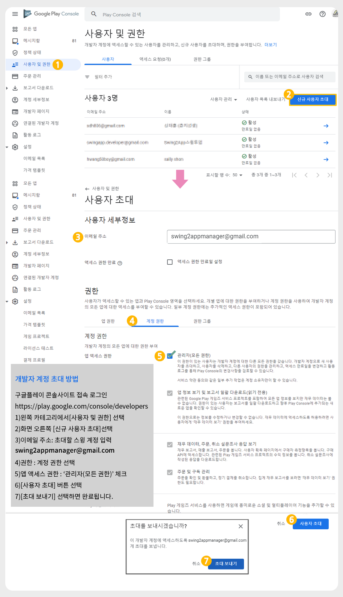
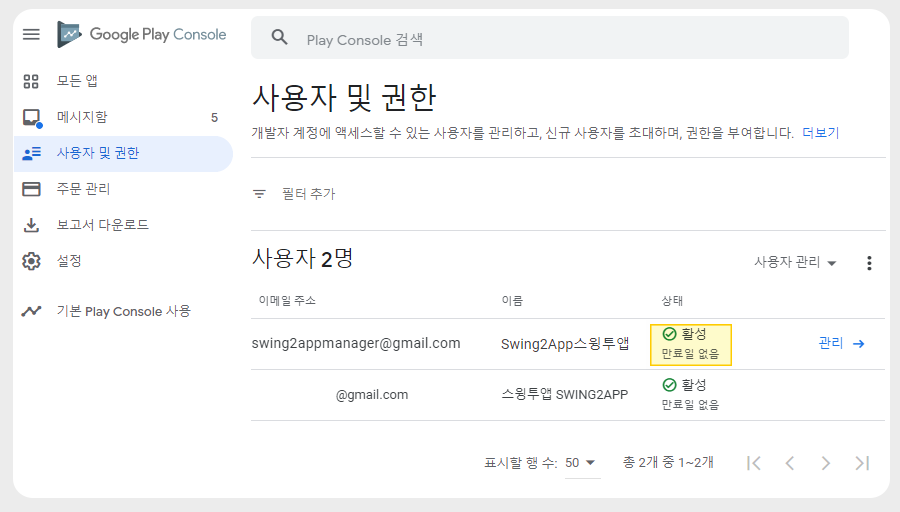

# 구글 개발자 계정 초대

***

구글 개발자 계정 등록 후, 스윙투앱으로 계정 초대 하는 방법입니다.&#x20;

아래 방법을 확인하시어 등록해주시기 바랍니다.&#x20;

***

##  구글 개발자 계정 초대

&#x20;

먼저 구글 개발자 계정을 만들어주세요(등록이 완료된 분들은 바로 초대 진행해주세요)

\*개발자 계정 등록비: 25달러 (한번 구매시 평생 이용)&#x20;

**구글 개발자계정 등록이 완료되면** [**구글 플레이 콘솔사이트**](https://play.google.com/console/developers) **에서 아래 방법으로, 계정 초대를 해주세요.**&#x20;

<figure><figcaption></figcaption></figure>

1\)왼쪽 카테고리에서\[사용자 및 권한]선택&#x20;

2\)화면 오른쪽 \[신규 사용자 초대]선택&#x20;

3\)이메일주소: 초대할 스윙투앱 계정 " <mark style="color:green;">swing2appmanager@gmail.com</mark> " 입력

4\)권한: 계정 권한 선택

5\)\[앱 액세스 권한: ‘관리자’ 체크&#x20;

6\)\[사용자 초대] 선택

7\)\[초대 보내기] 선택시 완료됩니다.

#### 초대 완료

<figure><figcaption></figcaption></figure>

스윙투앱 계정을 입력하고 초대장을 보내주시면&#x20;

그럼 스윙투앱 마켓업로드 팀에서 메일을 확인하고 초대 수락을 하게 되구요.

사용자 및 권한 메뉴에서 등록된 스윙투앱 계정을 확인할 수 있습니다.&#x20;

***

프로세스를 완료하면 사용자분께서 해야 할 구글 개발자 초대는 완료됩니다.

초대가 들어오면 이후는 스윙투앱에서 확인하여 초대 수락 및 앱 등록에 필요한 인증서를 생성합니다.

그 다음 플레이스토어 앱 등록 작업이 진행됩니다.&#x20;

