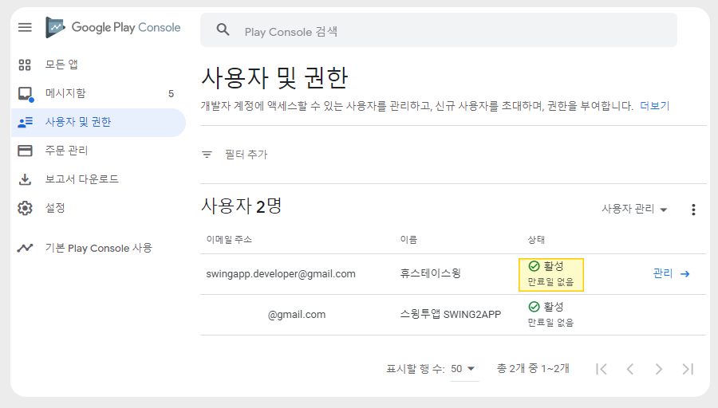
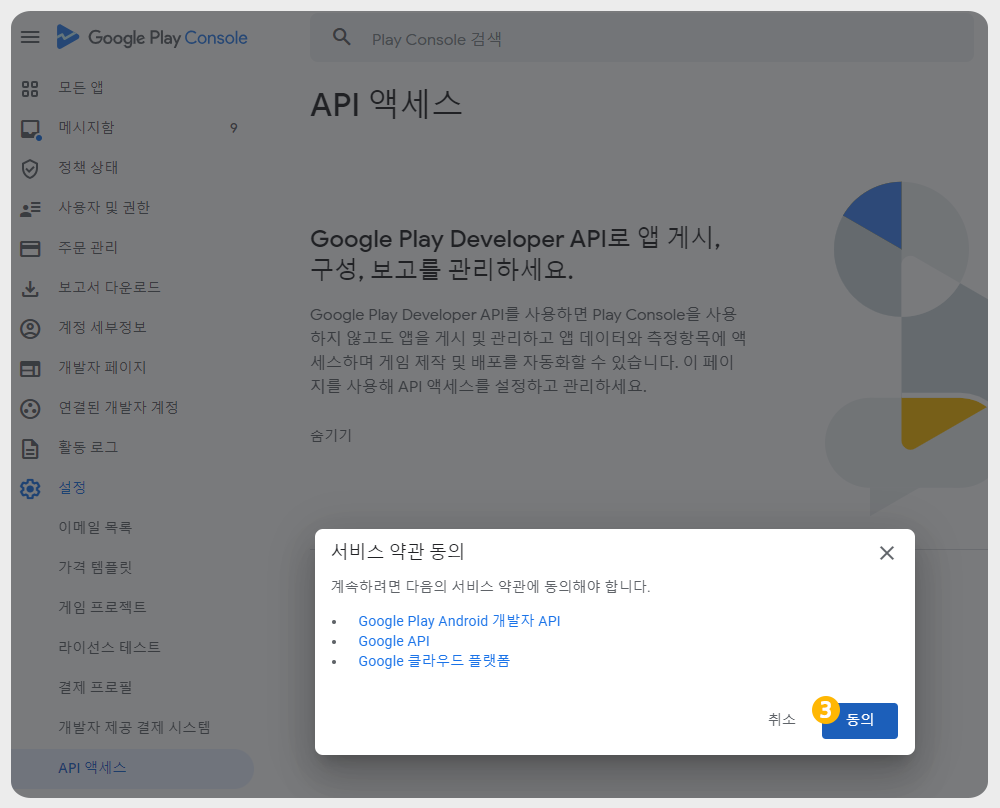
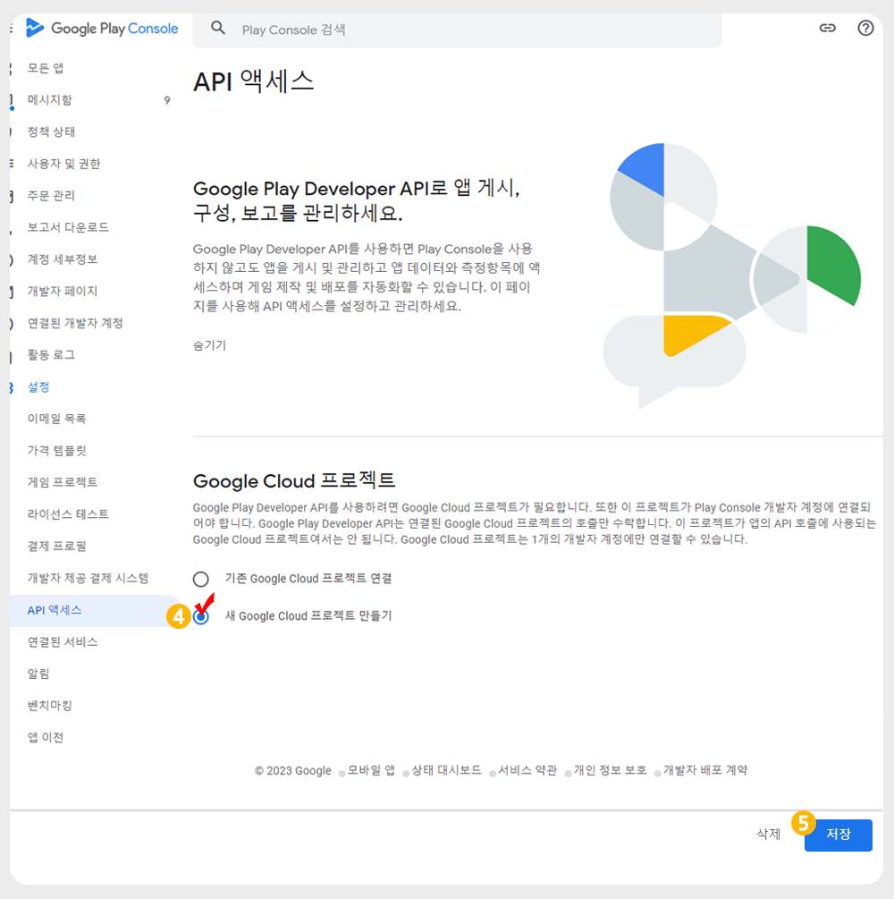
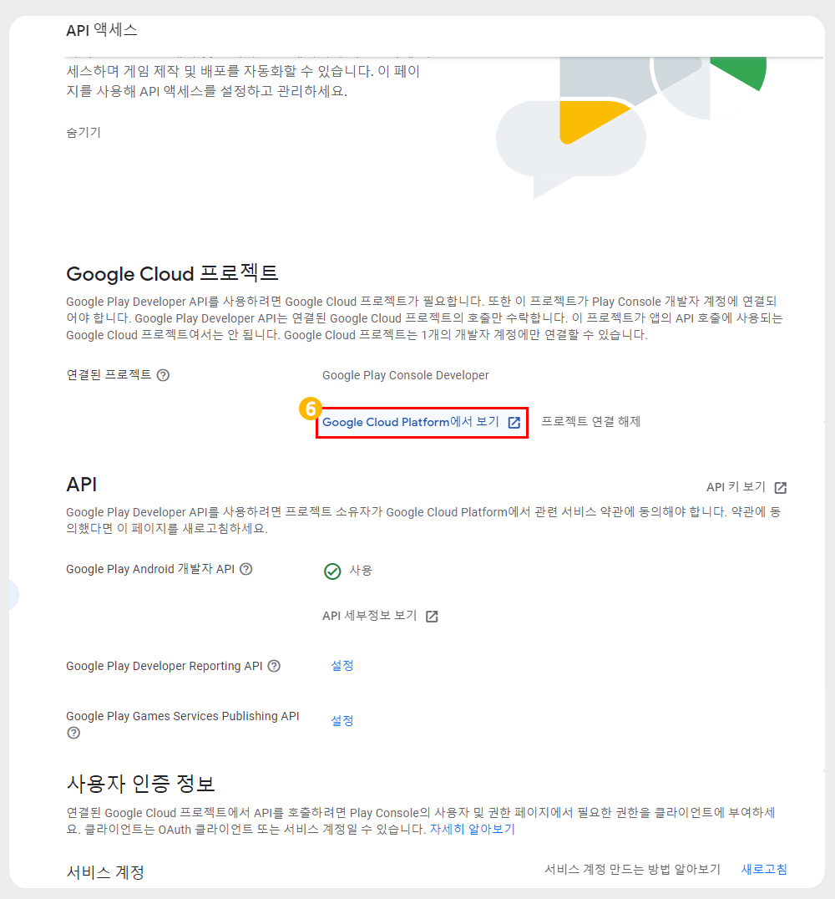
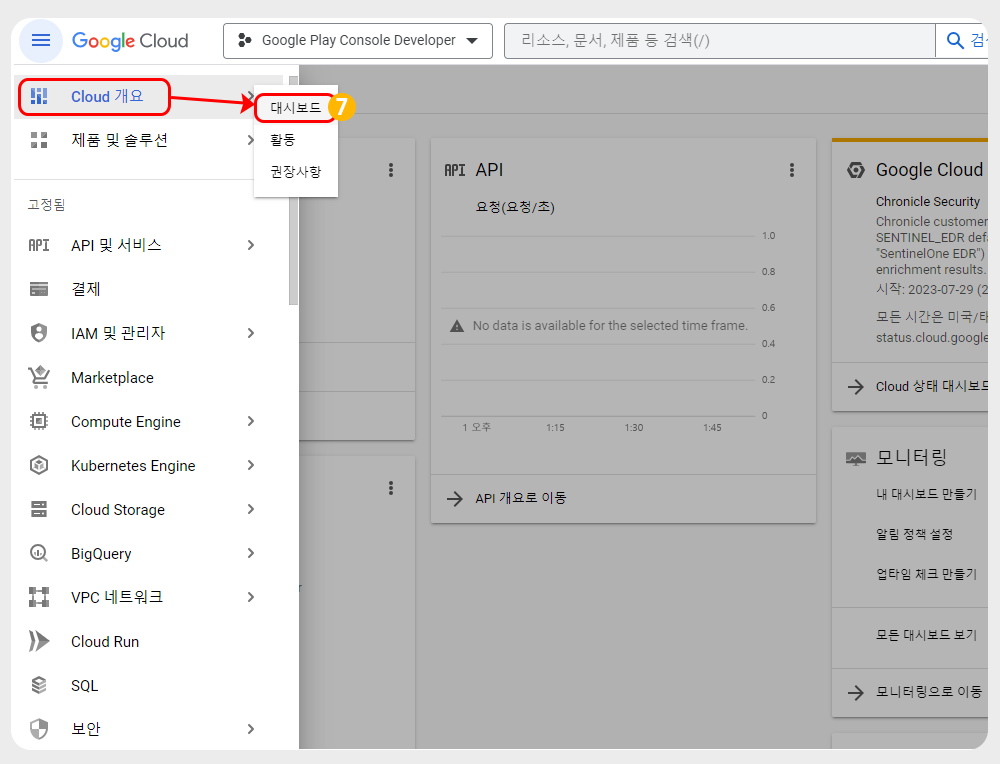
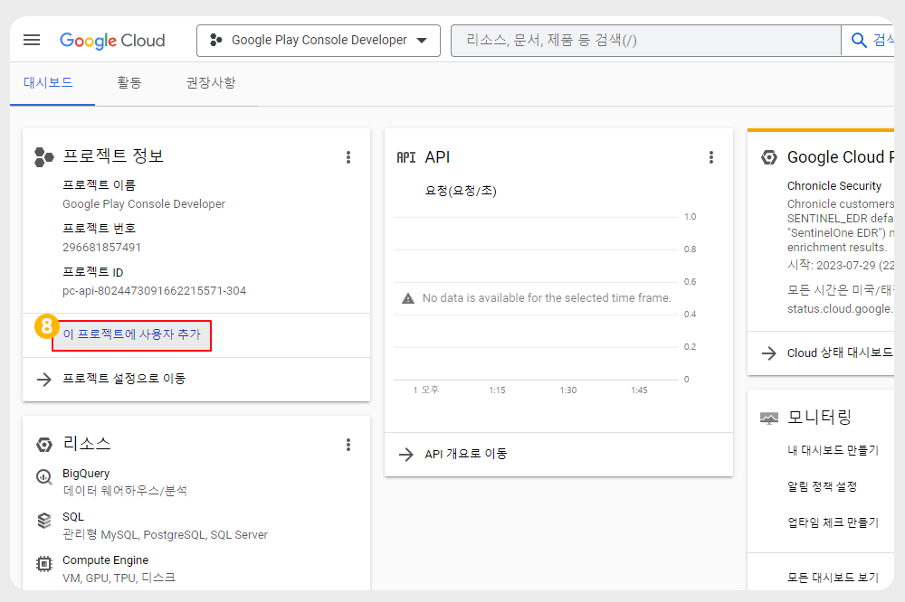
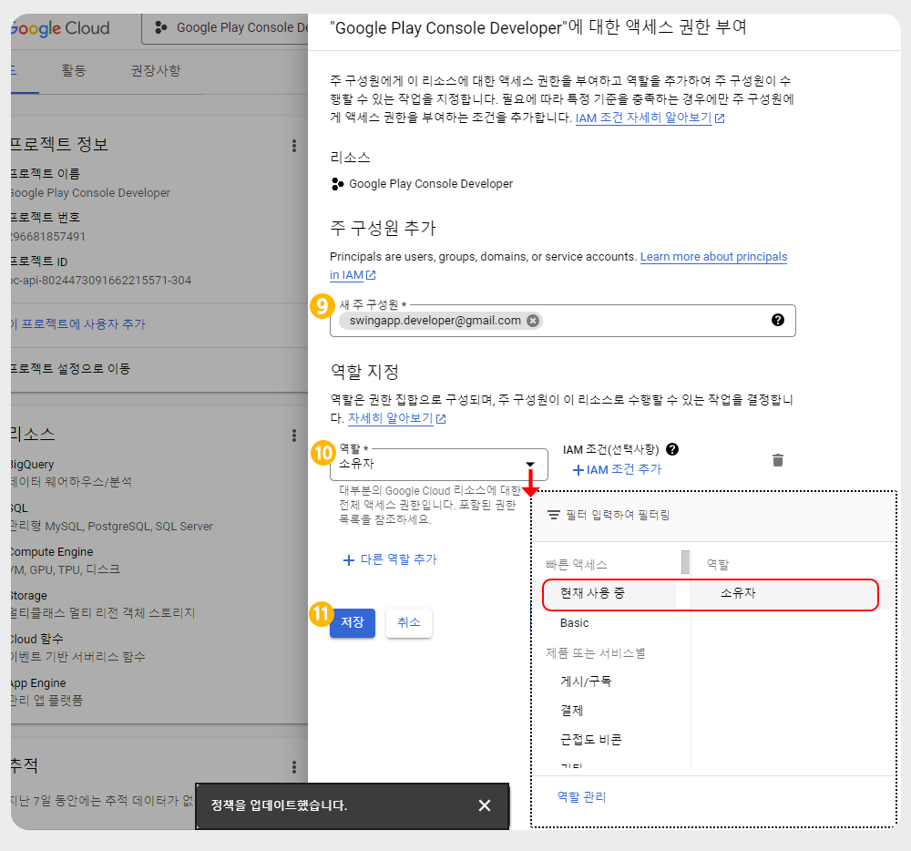

# 구글 개발자 계정 초대 프로세스

***

구글 개발자 계정 등록 후, 스윙투앱으로 계정 초대 및 API 등록하는 방법입니다.&#x20;

2가지 프로세스이며, 2개 프로세스를 완료해야 정상적으로 작업이 완료됩니다.

아래 방법을 확인하시어 등록해주시기 바랍니다.&#x20;

***

##  1.구글 개발자 계정 초대

&#x20;

먼저 구글 개발자 계정을 만들어주세요(등록이 완료된 분들은 바로 초대 진행해주세요)



\*개발자 계정 등록비: 25달러 (한번 구매시 평생 이용)&#x20;

**구글 개발자계정 등록이 완료되면** [**구글 플레이 콘솔사이트**](https://play.google.com/console/developers) **에서 아래 방법으로, 계정 초대를 해주세요.**&#x20;

<figure><figcaption></figcaption></figure>

1\)왼쪽 카테고리에서\[사용자 및 권한]선택&#x20;

2\)화면 오른쪽 \[신규 사용자 초대]선택&#x20;

3\)이메일주소: 초대할 스윙투앱 계정 **swingapp.developer@gmail.com**입력&#x20;

4\)권한: 계정 권한 선택

5\)\[앱 액세스 권한: ‘관리자’ 체크&#x20;

6\)\[사용자 초대] 선택

7\)\[초대 보내기] 선택시 완료됩니다.

#### 초대 완료

<figure><figcaption></figcaption></figure>

스윙투앱 계정을 입력하고 초대장을 보내주시면&#x20;

그럼 스윙투앱 마켓업로드 팀에서 메일을 확인하고 초대 수락을 하게 되구요.

사용자 및 권한 메뉴에서 등록된 스윙투앱 계정을 확인할 수 있습니다.&#x20;

<figure><figcaption></figcaption></figure>

##  2. 구글 API 액세스 등록&#x20;

구글 개발자 계정 초대 완료 후, API 액세스에서 사용자 등록을 해주세요.&#x20;

<figure><figcaption></figcaption></figure>

1\)구글 플레이 콘솔 - 설정 -\[ API 액세스]를 선택합니다.&#x20;

[https://play.google.com/console/u/0/developers/api-access](https://play.google.com/console/u/0/developers/api-access)

2\)\[연결할 프로젝트 선택] 버튼 선택해주세요.&#x20;

<figure><figcaption></figcaption></figure>

3\)서비스 약관 \[동의] 버튼 선택

<figure><figcaption></figcaption></figure>

4\)\[새 Google Cloud 프로젝트 만들기] 선택

5\)저장 버튼 선택

<figure><figcaption></figcaption></figure>

6\)\[Google Cloud Platform에서 보기] 선택

<figure><figcaption></figcaption></figure>

Google Cloud(구글 클라우드) 화면으로 이동합니다.&#x20;

7\)왼쪽 메뉴에서 Cloud 개요 선택 - 대시보드 선택해주세요.&#x20;

<figure><figcaption></figcaption></figure>

8\)\[이 프로젝트에서 사용자 추가] 선택

<figure><figcaption></figcaption></figure>

9\)새 주 구성원 입력란에 **스윙투앱 메일주소( swingapp.developer@gmail.com)**를 입력해주세요.

**이메일주소: swingapp.developer@gmail.com**

10\)역할: '**소유자**' 선택해주세요.

입력란화살표 버튼 선택시, \*역할: 소유자로 선택 가능합니다.&#x20;

11\)\[저장] 버튼 선택시 완료됩니다.&#x20;

***

이렇게 2개 프로세스를 완료하면 사용자분께서 해야 할 구글 개발자 초대는 완료됩니다.

초대가 들어오면 이후는 스윙투앱에서 확인하여 초대 수락 및 앱 등록에 필요한 인증서를 생성합니다.

그 다음 플레이스토어 앱 등록 작업이 진행됩니다.&#x20;

