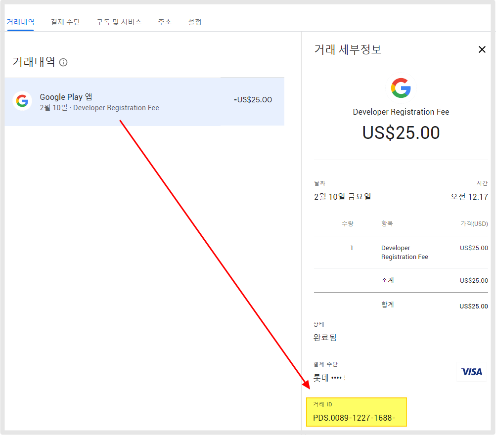

# 구글 개발자 거래 ID 확인

***

## <mark style="color:green;">1.거래 ID확인하는 방법</mark>

<figure><figcaption></figcaption></figure>

[Google Payments](https://payments.google.com/payments/home)에 접속한 뒤(구글 개발자 계정 로그인 후) – 본문 화면에 표시된 '거래내역'을 선택하면- 오른쪽 화면에 거래 ID를 확인할 수 있습니다.&#x20;

<mark style="color:red;">만약, 위의 방법으로 확인이 잘 안된다면 메일함에서 확인이 가능합니다.</mark>&#x20;

구글 개발자 계정 - 받으신 메일함에 보시면 구매 영수증을 확인할 수 있습니다.&#x20;

영수증에 구글 주문번호로 확인 가능합니다.&#x20;

**메일 제목 "Google: 감사합니다" 확인해주세요.**

<figure><figcaption></figcaption></figure>

해당 주문번호가 거래 ID입니다.

***

## <mark style="color:green;">2.계정 ID 확인방법</mark>

<figure><figcaption></figcaption></figure>

[구글플레이 콘솔](https://play.google.com/console/u/0/developers) 대시보드 상단에 보시면 개발자 이름 밑에 계정 ID확인 가능합니다.

해당 ID가 계정 ID 정보가 됩니다.&#x20;

