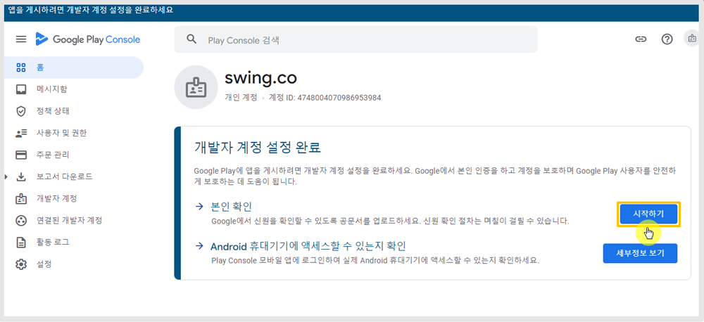

# 구글 개발자 개인 계정 설정

***

**구글 개발자 계정 설정 완료하기**

구글 개발자 개인 계정으로 가입 후에 계정 설정 까지 완료해야 모든 작업이 완료됩니다.

계정 설정을 위해서는 2가지 작업이 완료되어야 하구요.

매뉴얼을 통해서 인증을 하는 방법을 확인해주세요.

<figure><figcaption></figcaption></figure>

개발자 계정 가입이 완료되면 대시보드 상단에 위와 같은 메시지를 확인할 수 있습니다.


<mark style="color:blue;">**1)본인 확인**</mark>

개인 신원을 확인하기 위해 계정 소유자의 이름, 주민번호 입력, 주소지를 입력합니다.

핸드폰번호 인증번호를 받고, 이름과 주소지를 증빙할 서류를 제출합니다.&#x20;

<mark style="color:blue;">**2)Android 휴대기기에 액세스할 수 있는지 확인**</mark>

안드로이드폰에서 계정 로그인이 가능한지를 확인하는 것입니다.

따라서 구글 개발자 계정을 만들 때는 안드로이드 기기가 있어야 합니다.&#x20;

기기에서 구글 개발자 계정을 로그인 한 뒤, 구글 플레이 콘솔 어플에서 접속을 하여 인증을 합니다.

\*만약 본인의 안드로이드 기기가 없다면 주변 지인의 휴대기기를 이용해서 계정에 로그인하여 인증할 수 있습니다.&#x20;


***

## 1.본인확인

<figure><figcaption></figcaption></figure>

본인확인 \[시작하기] 버튼을 선택합니다.

인증에 필요한 정보&#x20;

<figure><figcaption></figcaption></figure>

동의에 체크한 뒤 \[확인 절차 시작하기] 선택해주세요.

### <mark style="color:blue;">1)개인 신원</mark>

<figure><figcaption></figcaption></figure>

(1)법적이름 입력 \*실제 계정 소유자 분의 이름을 입력해주세요

(2)주민번호 앞 7자리 입력

(3)다음 버튼 선택

### <mark style="color:blue;">2)주소 입력</mark>

<figure><figcaption></figcaption></figure>

(4)도/시 선택&#x20;

(5)시/군/구 선택&#x20;

(6)상세주소: 나머지 주소를 입력합니다.&#x20;

(7)우편번호 입력

(8)\[업로드] 선택하여, 위의 안내된 서류 중 하나를 등록 제출해주세요.&#x20;


<mark style="color:red;">\*중요\*</mark>

구글에서 제시하는 허용되는 서류 내에서만 제출해야 합니다.

주민등록증, 여권, 운전면허증 등의 서류는 허용하지 않습니다.

이름과 주소지가 나오는 명세서 등의 서류를 준비하여 제출해주세요.&#x20;

이 서류를 제출해야 하기 때문에 계정을 만들때 실제 본인이 거주하는 주소지로 입력해주셔야 합니다.&#x20;


(9)다음 선택

<figure><figcaption></figcaption></figure>

(10)확인 선택

### <mark style="color:blue;">3)전화번호 입력하기</mark>

<figure><figcaption></figcaption></figure>

(11)이동통신사 선택, 연락처 입력 대한민국이라면 +821011112222 번호로 입력해주세요.

(12)제출 선택

<figure><figcaption></figcaption></figure>

13\) 핸드폰 문자로 코드 번호가 전송되면 번호입력 후 \[확인] 버튼을 선택해주세요.&#x20;

<figure><figcaption></figcaption></figure>

(14) 확인 선택합니다.

모든 정보 제출이 완료되었구요. 구글에서 제출된 정보를 검토 한 뒤 승인을 하게 됩니다.

<figure><figcaption></figcaption></figure>

보통 1일이내 처리가 완료되는데 승인이 되면 바로 이용 가능하며, 서류가 적합하지 않을 경우 승인을 거절합니다.&#x20;

받은 메일을 확인해서 조치사항 확인 후 다시 요청정보를 제출해야 합니다.&#x20;

***

## 2. Android 휴대기기 액세스

<figure><figcaption></figcaption></figure>

Android 휴대기기에 액세스 할 수 있는지 확인 \[세부정보 보기] 선택해주세요.

### <mark style="color:blue;">1)진행방법</mark>

<figure><figcaption></figcaption></figure>

조치사항에 기재된 내용대로 따라서 진행을 해주시면 됩니다.

1\)먼저 안드로이드폰을 준비해주세요.

2\)구글 플레이 콘솔 어플을 실행해주세요.

어플이 설치 안되어 있으면 위에 기재된 QR코드 스캔하여 앱을 다운받을 수 있습니다.&#x20;

3\)구글 플레이 콘솔 앱에서 지금 만든 구글 개발자 계정으로 로그인 해주세요.

4\)개발자 계정을 선택하고 기기에 표시되는 안내를 따라 주세요.

### <mark style="color:blue;">2)안드로이드 실행화면</mark>

이어서 안드로이드폰에서 진행되는 캡쳐화면을 확인해주세요.

<figure><figcaption></figcaption></figure>

<figure><figcaption></figcaption></figure>

<figure><figcaption></figcaption></figure>

구글 플레이 콘솔 어플 접속 후, 구글 개발자 계정으로 로그인 해주세요.&#x20;

<figure><figcaption></figcaption></figure>

개발자 계정 선택 및 기기 액세스 확인 선택해주세요.

<figure><figcaption></figcaption></figure>

확인 선택해주세요.&#x20;

<figure><figcaption></figcaption></figure>

기기 검사가 완료되었습니다.

다시 구글 플레이 콘솔 화면으로 이동하면, 휴대기기 액세스 확인이 완료되어 메시지가 사라진 것을 확인할 수 있습니다.&#x20;

***


1\)구글 개발자 계정 설정 완료를 꼭 해주세요!

구글 개발자 조직 계정은 등록비 결제가 완료되었다고 해서 모든 작업이 완료된 것이 아닙니다.

대시보드에서 개발자 계정 설정 완료를 해주셔야 모든 작업이 완료됩니다.

2\)개인 개발자 계정은 앱을 프로덕션에 출시할 수 없습니다.

변경된 정책에 따라 테스트 배포만 가능하며 일정 조건을 통과하면 프로덕션으로 전환됩니다.

따라서 개인 개발자 계정 등록시에도 앱 출시를 할 수 없는 점 참고해주세요.

\*조직은 관계없이 등록 가능합니다.


