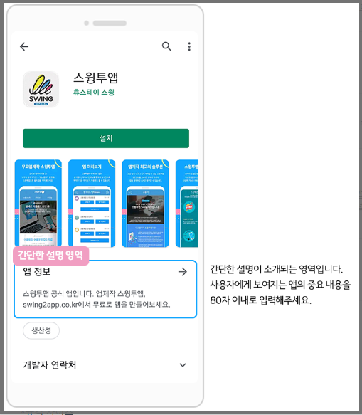
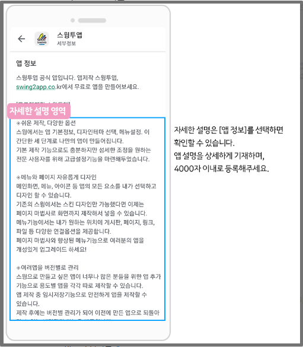
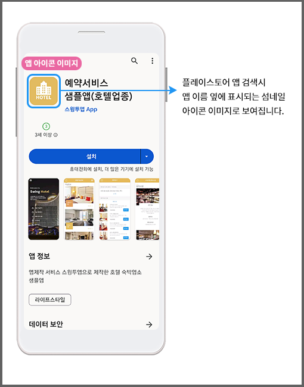
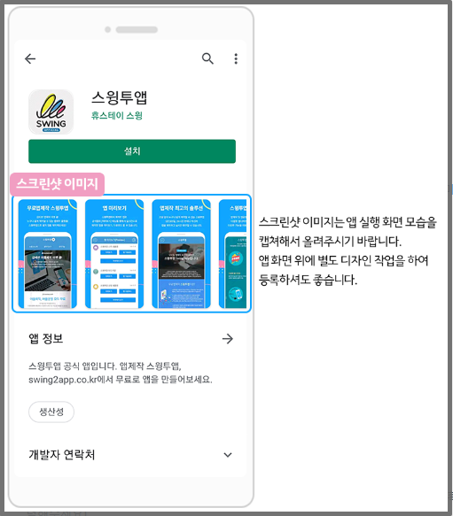
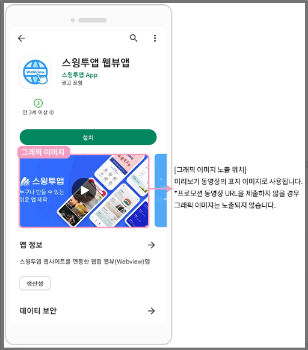
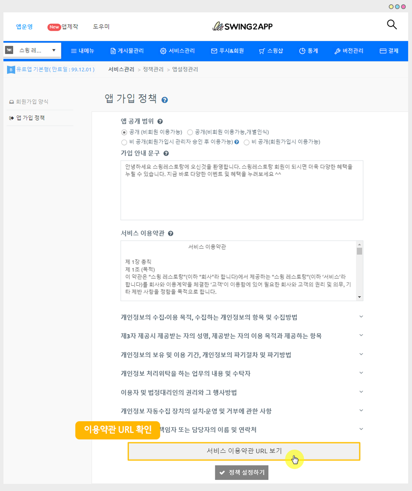
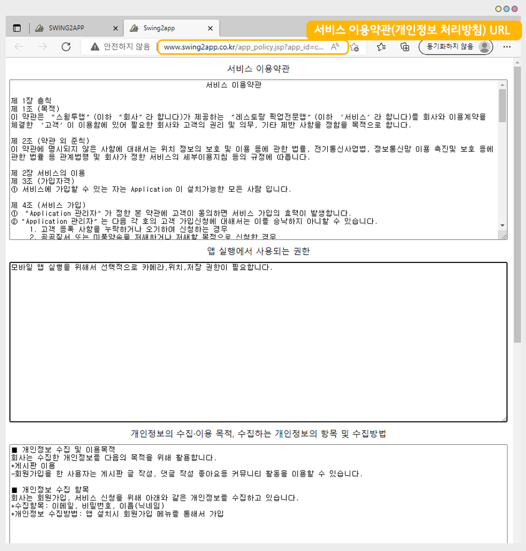

# 플레이스토어 앱 등록 준비사항

***

구글 플레이스토어에서 앱을 등록하기 전 미리 준비해야 하는 항목을 알려드립니다.

시간이 소요되는 작업도 있기 때문에 미리 준비해놓으시면 빠른 등록 가능합니다!


<mark style="color:green;">**준비사항 간단 정리!!**</mark>

1\)앱이름

2\)간단한설명

3\)자세한설명

4\)앱아이콘 이미지

5\)스크린샷 이미지

6\)그래픽 이미지

7\)로그인 계정

8\)개인정보 처리방침 링크

9\)웹 도메인 등록 증명(확인)서 <mark style="color:red;">\*웹뷰, 푸시앱만 제출</mark>


***

## 1.앱 이름

플레이스토어에 출시되는 이름, 검색시 나오는 이름을 생각해주세요.

이름 글자수는 30자 이내입니다.

<figure><figcaption></figcaption></figure>

***

## 2.간단한설명

앱을 소개하는 설명이고 소개문이라서 간단하게 한줄로 작성하는게 좋아요

글자수는 80자 이내입니다.

<figure><figcaption></figcaption></figure>

***

## 3.자세한설명

앱을 설명하는 내용으로 상세하게 기재해주세요.

우리 앱에서 제공하는 서비스, 기능을 상세하게 입력해주시는 것이 좋아요.

글자수는 4,000자 이내입니다.

<figure><figcaption></figcaption></figure>


<mark style="color:red;">**\*간단한 설명, 자세한 설명 주의사항**</mark>

구글은 키워드를 허용하지 않아요.

\-앱제작, 어플제작, 하이브리드앱 .. 이렇게 단어를 여러번 나열하지 않도록 해주세요.

\-증명되지 않는 사실(no.1, 국내1위) , 숫자(1등), 가격 정보(무료, free) 기재도 안되요


***

## 4.앱 아이콘 이미지

앱 아이콘 이미지는 앱 이름 옆에 표시되는 아이콘입니다.

앱제작시 등록한 아이콘을 올리면 되는데, 사이즈) 512\*512px 수정해주시면 되요.

<figure><figcaption></figcaption></figure>

앱 아이콘 제작가이드를 확인해주세요.



***

​

## 5.스크린샷 이미지

플레이스토어 앱 검색시 앱 이름 밑에 보여지는 미리보기 이미지에요.

앱 실제 화면을 캡쳐하여 권장 사이즈에 맞게 디자인한 것을 스크린샷 이미지라고 보시면 됩니다.

앱 실행화면이 들어가야 하며, 앱 다운을 유도하는 홍보 사진이 됩니다.

플레이스토어는 image 크기가 정해지지 않고, 규격 사이즈 내로만 작업해서 등록해야 합니다.

\* 가로: 380픽셀\~3840픽셀

\*세로 길이는, 가로 비율로 1:2.30 입니다. 즉, 세로는 가로의 2.3배를 넘지 않도록 해주세요.

예시)

일반적인 안드로이드폰 가로 사이즈는 1080px 입니다. 그럼 세로는 2400px 이내로 맞춰 주시면 됩니다.

\*설명이 어렵지만 일반 안드로이드폰에서 캡쳐되는 사이즈는 모두 권장 범위이기 때문에 사이즈 맞추는게 어렵다면 안드로이드폰에서 캡쳐한 화면 그대로 등록

하셔도 됩니다.

\-최소 2장 \~최대 8장

\-파일 확장자: JPEG 또는 24비트 PNG(알파 미포함)

\-정렬 방향: 왼쪽에서 오른쪽으로 슬라이드 됩니다.

<figure><figcaption></figcaption></figure>

***

## 6.그래픽 이미지

그래픽 이미지는 프로모션 동영상 링크 제출시, 미리보기에서 동영상 섬네일(표지) 이미지로 표시됩니다.

동영상 프로모션 링크를 제출하지 않으면, 그래픽 image는 보이지 않습니다.

\*사이즈: 1024\*500px

<figure><figcaption></figcaption></figure>

**"동영상 링크를 제출하지 않는데 그럼 그래픽 이미지 등록 안해도 되는것 아닌가요"**

\=No, 그렇지 않습니다.&#x20;

그래픽 이미지는 필수 항목이라 프로모션 동영상링크 유무와 관계없이 필수로 제출 해주셔야합니다.

그리고 수시로 이용항목이 변경되기 때문에 나중에 다른 경로로 보여질 수 있어요

그래서 아무 이미지 보다는 앱과 관련된 우리 브랜드와 관련된 컨텐츠로 올리는 것이 좋습니다.

***

​

## 7.로그인 계정

앱에서 로그인 기능을 제공하고 있다면 테스트용 계정을 입력해주셔야 합니다.

구글에서 심사시 실제 로그인을 해서 보구요.

모든 메뉴에 접근 가능한 계정을 제공해야 합니다.

\*로그인 기능이 없는 앱은 계정을 제출하지 않아도 됩니다.

<mark style="color:blue;">-웹사이트를 연결한 웹앱은 해당 웹사이트 상에서 로그인 가능한 계정 정보를 준비</mark>

<mark style="color:blue;">-일반 프로토타입앱은 만드신 앱에서 테스트용 계정 가입해서 준비해주세요</mark>


**\*주의\***

1\)관리자 계정이 아닌, 일반 사용자용 계정을 주셔야 합니다.

2\)로그인을 하지 않아도 앱 이용을 할 수 있으니, 계정 제출을 안해도 되는 것 아닌가요?

\= No, 그렇지 않습니다. 기능 사용 관계 없이 필수로 계정을 제공해야 합니다.

3\)웹앱(웹뷰, 푸시앱) 사용자분들은 웹사이트 내에 기본 로그인 기능이 있는지 확인해주세요.

카카오톡, 구글, 네이버 등의 소셜 간편 로그인만 사용할 경우 구글에서는 이용이 불가합니다.

(해당 방법 모두 본인 인증을 통해 로그가 되는 방법이기 때문에, 타 사용자는 접속이 불가합니다.)

따라서 일반적으로 웹 기본 로그인 기능이 함께 제공되어야 합니다.


***

​

## 8.개인정보 처리방침 링크

개인정보 취급 및 처리방침이란 홈페이지나 앱에서 필수 제공해야 하는 정책이에요.

해당 서비스를 이용하는 이용자에게 수집되는 개인정보가 무엇인지 해당 정보를 어떻게 사용하고, 어떻게 철회하는지 등에 대한 정보를 알려주는 약관입니다.

모바일 정책상 입력해야 하는 필수 항목이기 때문에 플레이스토어 앱 등록에도 해당 링크를 제출 해야 해요.

\*앱스토어, 원스토어, 갤럭시 스토어 등도 모두 동일하게 제출됩니다.

​

**-웹앱(푸시, 웹뷰앱)​ 사용자분들은 앱에 연결한 웹사이트에 있는 개인정보 처리방침 링크를 제출하면 됩니다.**

사이트에 개인정보 취급 혹은 처리방침 내용이 없다면 추가해주셔야 합니다.

​

**-일반 프로토타입 제작 앱은 스윙투앱에서 자체적으로 링크를 제공해드립니다.**

업로드 신청서에 자동으로 링크 URL이 들어가 있구요.

직접 플레이스토어에 등록하는 분들은 아래 경로로 들어가서 링크를 확인 할 수 있어요.

<mark style="color:red;">단, 이용약관은 샘플 내용으로 기재되어있으니 내용은 해당 앱에 맞게 수정해서 쓰셔야 해요</mark>

​

\*[앱운영 페이지 → 서비스관리 → 정책관리 → \[앱 가입 정책\] ](https://www.swing2app.co.kr/view/app\_setting)메뉴

<figure><figcaption></figcaption></figure>

하단의 \[서비스 이용약관 URL보기]를 선택해주세요.

<figure><figcaption></figcaption></figure>

이용약관 내용이 담긴 새 웹페이지 창이 뜹니다.

인터넷 주소 창에 URL 주소를 복사하여 제출해주면 됩니다.

***

## 9.웹 도메인 등록 확인서 준비

<mark style="color:orange;">웹뷰앱, 푸시앱을 등록할 때는 반드시 사전고지 문서를 함께 제출해야 합니다.</mark>

<mark style="color:orange;">일반 프로토타입 앱으로 제작한 분들은 제출할 필요 없습니다!</mark>

\*웹뷰 앱, 푸시앱(웹사이트를 그대로 앱에 연동한 웹브라우저 앱 형태)으로 제작한 사용자분들은 플레이스토어 앱 등록시 위의 사전고지 문서를 제출해야 합니다.

구글은 정책상 웹앱 제출시, 앱에 연결된 웹사이트가 본인의 소유가 맞는지 증빙서류를 사전고지 문서로 제출하게 됩니다.

정책상 다른 사람의 웹사이트를 함부로 가져와 쓰거나, 승인 없이 타사 웹사이트를 걸어놓을 위반이 됩니다. \*출시 불가

따라서 웹사이트를 연결한 웹앱 제출시, 증빙서류를 제출해야 하며 이를 증명하는 서류가 바로 "도메인 등록 증명서(확인서) 입니다.

<mark style="color:blue;">**\[웹 도메인 등록 확인증]**</mark>

<figure><figcaption>
도매인 등록 증명서 샘플 예시
</figcaption></figure>

웹 소유자를 증빙하는 서류로 웹사이트 제작한 호스팅 업체에서 발급받을 수 있습니다.

해당 서류에는 도메인 이름, 등록인, 사업자 정보 등이 기재되어 있습니다.

따라서 웹앱을 제출하시는 분들은 웹 호스팅업체를 통해 도메인 등록 확인서를 발급받아 함께 준비해주세요.

<mark style="color:blue;">**Q. 증명서를 발급 받을 수 없을때는 어떻게 해야 하나요?**</mark>

증명서 혹은 확인서 제출이 어렵다면,

구매 영수증(invoice) 혹은 웹 도메인 관리자 화면(도메인이 기재된 화면)을 캡쳐한 이미지를 보내주셔도 됩니다.

위의 서류가 다 제출이 어렵다면 사업자등록증을 제출하실 수 있습니다.

단, 사업자등록증만 제출할 경우 구글에서 추가 서류를 요청할 수 있습니다.

***

