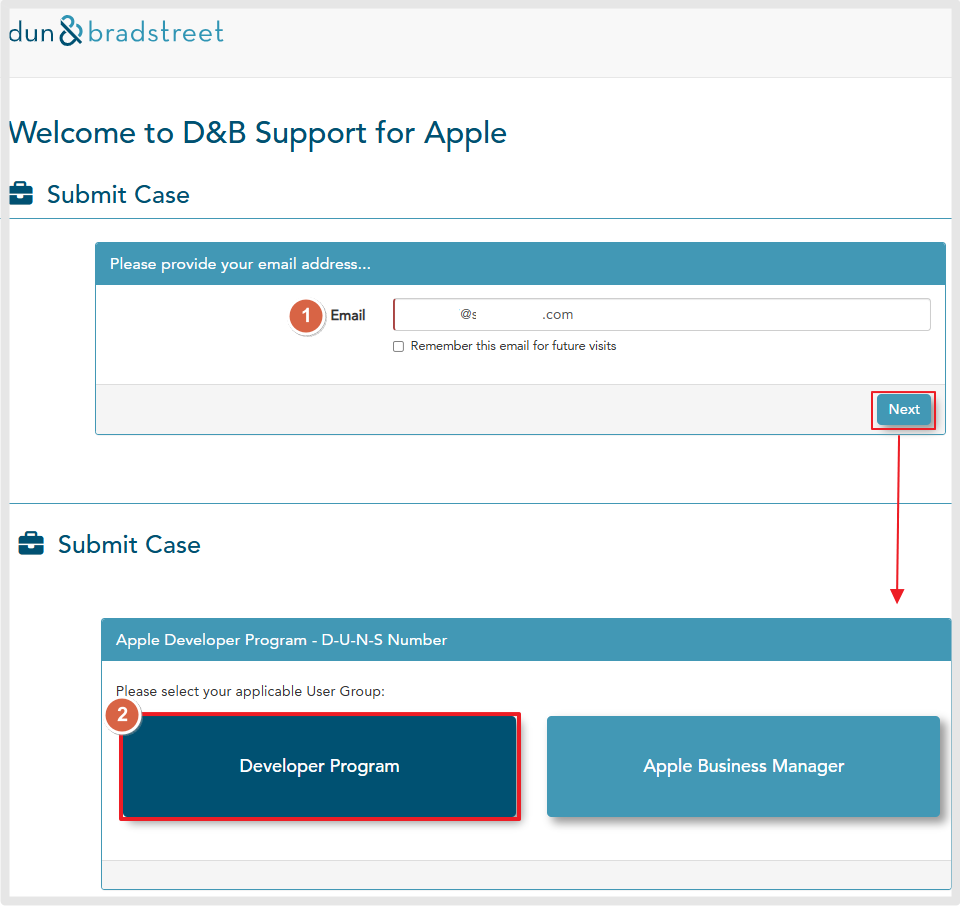
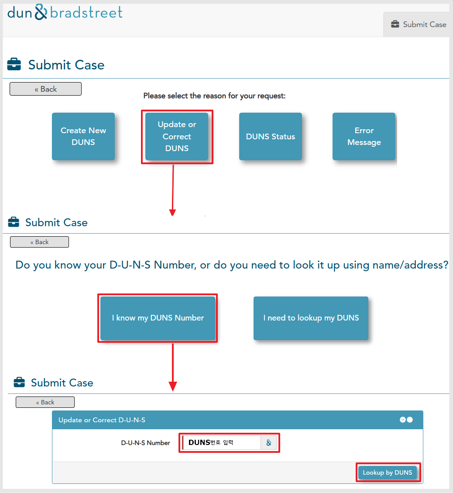
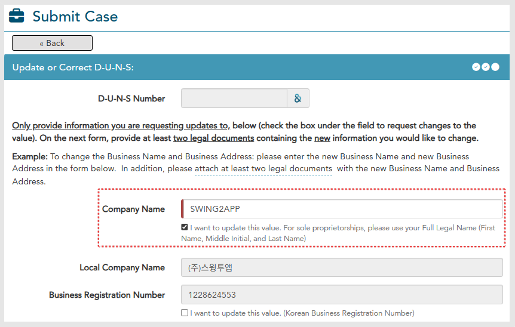
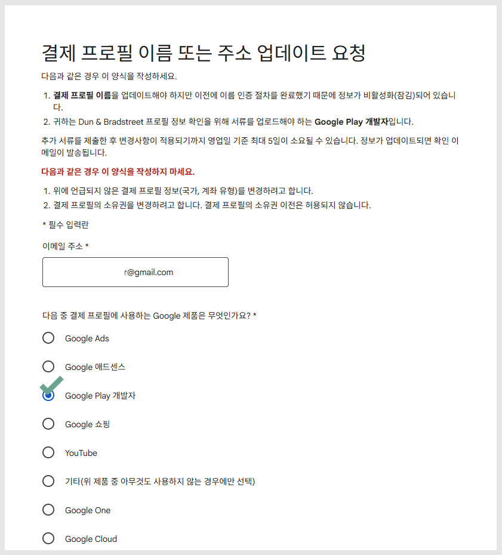
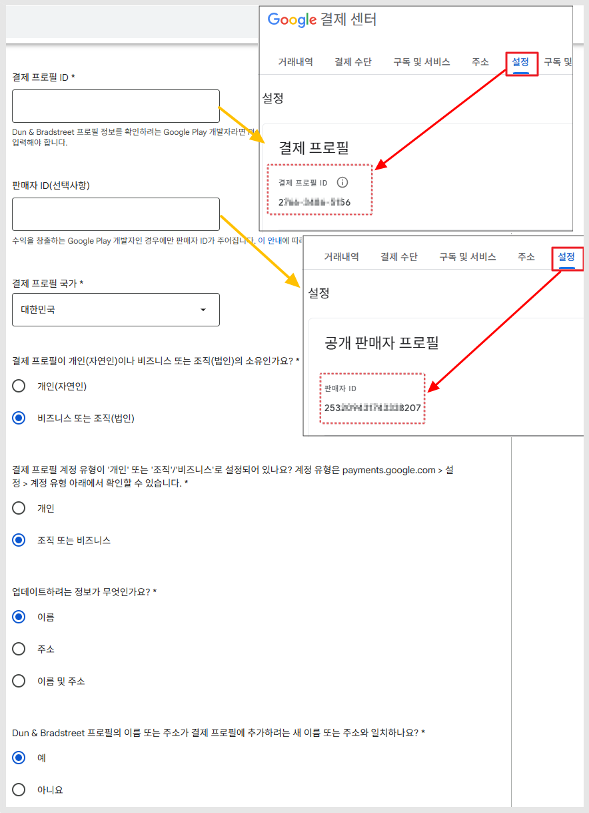
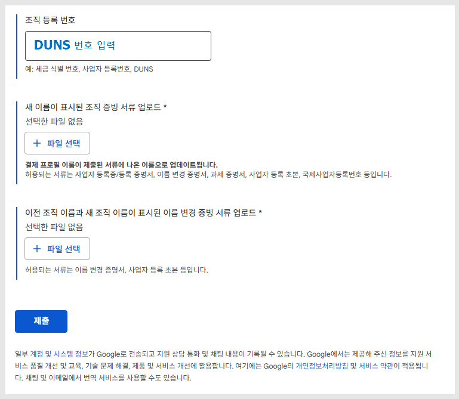

# 구글 개발자 계정 법인명 변경 방법 가이드

***

구글 개발자 조직 계정(Google Play Developer Account for Organizations)에서 사업자 상호명(법인명)이 변경된 경우, Google에 등록된 개발자 계정 정보도 반드시 업데이트해야 합니다.

이는 계정의 소유자와 실제 사업자 간의 일치 여부가 중요하기 때문입니다.

아래 절차를 따라 변경을 진행하시면 됩니다.

***

## **1.DUNS 정보 업데이트**

**\*먼저 DUNS발행사 사이트에서 던스번호에 등록된 정보를 업데이트 해주셔야 합니다.**

[DUNS 발행사이트 접속 ](https://support.dnb.com/?CUST=APPLEDEV)



<figure><figcaption></figcaption></figure>

<figure><figcaption></figcaption></figure>

[던스 발행사 ](https://support.dnb.com/?CUST=APPLEDEV)이동 후- 이메일로그인 -"Update" 선택 -"I Know DUNS Number" 선택 - DUNS번호 입력 , Lookup by DUNS 선택&#x20;

<figure><figcaption></figcaption></figure>

사업자정보 화면에서 수정할 내용 체크해서 수정 후 - next- 증빙 서류 제출 하면 완료 됩니다.

DUNS에 등록된 정보 변경 방법 상세 내용은 아래 가이드를 확인해주세요.

[DUNS 정보 변경(업데이트) 방법 가이드](https://documentation.swing2app.co.kr/developer/duns-update)



상호명 변경이 완료된 후, 변경된 상호명으로 발행된 사업자등록증과 영문 사업자등록증을 준비해주세요.

DUNS 발행사에서 조회 후, 업데이트 신청을 하면 변경하고자 하는 정보로 업데이트가 가능합니다. 

***

## **2.구글 개발자 - 결제 프로필 이름 또는 주소 업데이트 요청**

​

DUNS번호 정보 변경 업데이트가 완료되면, 구글에 정보 변경을 요청해야 합니다.

[결제프로필 이름 또는 주소 업데이트 요청 링크](https://support.google.com/googlepay/contact/change_name_address?hl=ko)

<figure><figcaption></figcaption></figure>

위의 링크로 이동해서 양식 제출해주시면 되겠습니다.

구글에서 승인이 완료되면, 변경된 정보로 계정 정상 이용이 가능합니다.

​

<mark style="background-color:blue;">**\*입력 화면**</mark>

<figure><figcaption></figcaption></figure>

결제 프로필 ID는 [구글 결제센터](https://pay.google.com/gp/w/home/settings)- 설정 탭에서 확인 가능합니다.

판매자 ID는 선택사항이지만, 입력할 경우 동일하게 결제센터 - 설정에서 확인 가능합니다.

그 외에는 해당 되는 항목에 체크해서 양식 기재해주세요.

​

<figure><figcaption></figcaption></figure>

* 조직 등록번호: DUNS 번호 입력
* 새 이름이 표시된 조직 증빙 서류 등록(상호명 변경된 새 사업자등록증 or등록증명서)
* 이전 조직 이름과 새 조직 이름이 표시된 증빙 서류 등록(이름 변경 증명서 or 사업자 등록 초본)

제출 완료시, 영업일 기준 5일 이내 변경 결과를 메일로 전송합니다.

***

**💡**<mark style="color:blue;">**증빙용으로 제출할 서류를 미리 준비해주세요.**</mark>

-상호명 변경된 새 사업자등록증 or등록증명서

-이름 변경 증명서 or 사업자 등록 초본

\*반드시 DUNS 정보 변경 업데이트가 완료된 후 진행해야 합니다. 매칭이 되지 않을 경우 프로필이 잠깁니다.

\*정보 변경이 완료되면 자동으로 결제프로필 내 사업자(조직) 정보가 변경처리 됩니다.

<mark style="color:red;">**📌 그런데 정보 변경을 꼭 해야 하나요?**</mark>

구글 개발자 조직 계정의 경우, 계정에 등록된 사업자 정보가 실제 사업자 정보와 일치한지 필터링이 됩니다.

따라서 이용 중 사업자 상호명이나 주소가 변경되었는데 아무런 변경 조치를 하지 않았다면!

구글 계정이 일시적으로 정지될 수 있고, 경고 조치를 받을 수 있습니다.

<mark style="color:red;">\*중요\*</mark>

앱 수익 창출을 하는 개발자 계정은 변경이 반드시 필요합니다.

만약 해당 계정에서 수익을 창출하고 있는 개발사라면, 수익 창출도 일시 정지되어 수익금을 정상적으로 받지 못하게 되는 일이 발생됩니다.

따라서 이러한 문제가 생기기 전에 미리 정보 변경을 해서 계정이 정상적으로 운영될 수 있도록 해주셔야 합니다.

