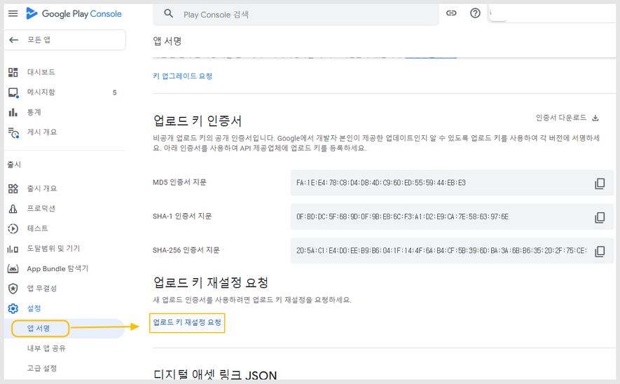
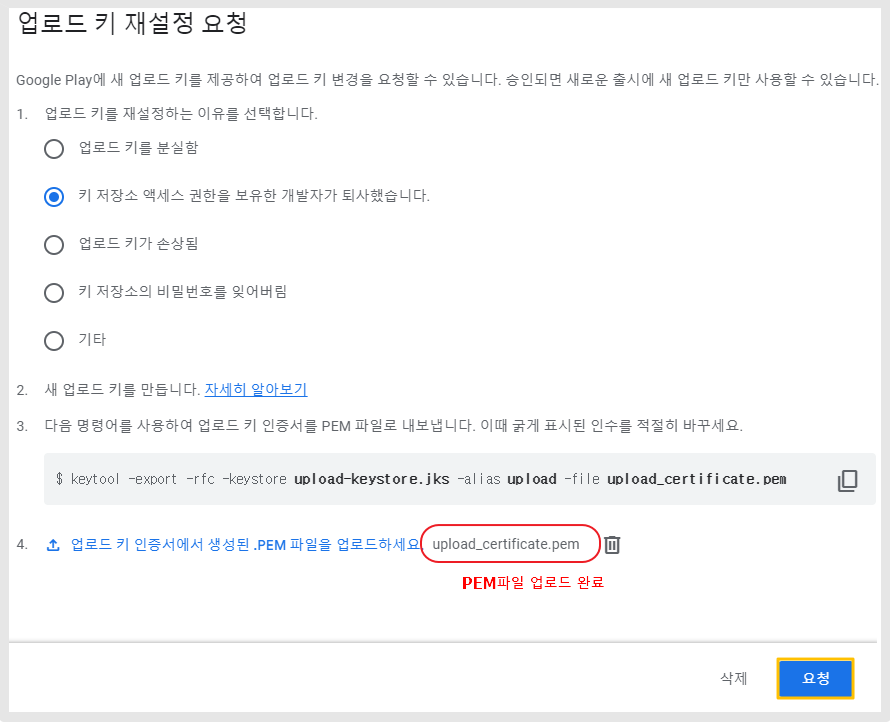
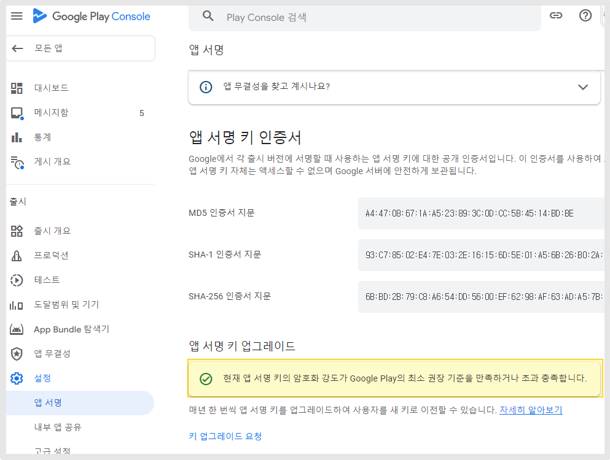
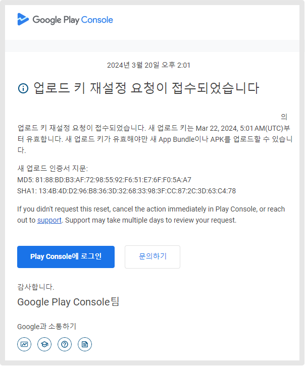
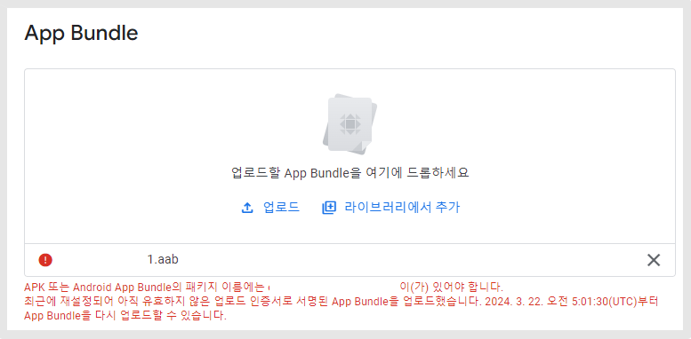

# 플레이스토어 앱 업로드 키 재설정

***


**구글 플레이스토어 앱 업로드키 재설정이란?**

키스토어 분실했을 경우 구글에 요청하여 재설정할 수 있습니다.

플레이스토어 앱을 출시하여 이용하고 있는 도중, 다른 앱 개발사 혹은 업체로 앱을 이전하여 업데이트 하려면 앱 키스토어 정보 등 키 정보를 알아야 하는데요.

해당 키 정보를 잊어 버렸거나(분실), 앱을 개발한 개발자와 연락이 되지 않아 정보를 받을 수 없는 상황 등이 있을 수 있어요.&#x20;

이때 구글에서는 이러한 상황에 대비해 개발자들에게 "업로드 키 재설정" 서비스를 제공하고 있습니다.&#x20;

업로드 키 분실 신고를 하여, 업로드 키를 다시 설정할 수 있게 만들어주는 것이죠.

이 방법으로 진행시 앱을 다른 업체로 이전하여 업데이트하여 쓸 수 있습니다.

계정 소유자가 직접 진행이 가능하며, **스윙투앱으로 본 작업을 대행 요청하실 경우 작업비가 발생됩니다.**&#x20;

앱 업로드키 재설정이 필요하실 경우 아래 가이드를 보시고 진행해주시기 바라며, 스윙투앱으로 대행 요청하실 경우는 고객센터 메일 및 문의게시판을 통해 먼저 문의 남겨주세요.&#x20;


***

### [구글 플레이 콘솔](https://play.google.com/console/u/0/developers) 접속 - 앱 선택&#x20;

### 1.왼쪽 설정에서 "앱 서명" 선택

### 2.업로드 키 재설정 요청 버튼 선택

<figure><figcaption></figcaption></figure>

### 3.새 업로드 키 만들기

<figure><figcaption></figcaption></figure>

#### 업로드 키 재설정 요청 팝업 창이 뜹니다.&#x20;

1\)업로드 키 재설정 하는 이유 선택

2\)새 업로드 키 만들어주세요. (자세히 알아보기) 선택해서 키 만드는 방법 확인해주세요.

3\)구글에서 기재한 명령어를 사용하여 업로드 키 인증서를 PEM파일로 바꿉니다.&#x20;

4\)위의 조건을 다 부합하여 만든 PEM 파일을 등록해주세요.

5\)\[요청] 버튼 탭해주세요.

### 4.앱 서명 키 업그레이드

<figure><figcaption></figcaption></figure>

다시 대시보드로 이동시 서명 키 업그레이드로 표시되며, 서명 키가 구글 플레이의 권장 기준을 충족한다는 메시지가 뜬 것을 확인할 수 있습니다.

### 5.메일 도착

<figure><figcaption></figcaption></figure>

인증키 등록 후 개발자 계정 이메일로 "업로드 키 재설정 요청이 접수되었습니다" 메일을 받게 됩니다.&#x20;

메일 본문에 보면, 새 업로드 키 유효 날짜와 언제 앱 번들 파일(AAB파일) 혹은 APK파일 제출이 가능한지 날짜를 확인할 수 있어요.

업로드 키 재설정 이후 3일 정도 소요됩니다.

<mark style="color:red;">\*만약 해당 날짜가 되지 않았는데 앱 번들 파일을 등록하려고 하면, 첨부된 이미지 처럼 경고 메시지가 뜹니다.</mark>

<figure><figcaption></figcaption></figure>

따라서 구글에서 받은 메일에 기재된 날짜, 시간에 맞춰 새로운 앱 파일을 등록해주세요.&#x20;

### 6.업로드 키 재설정 완료 - 앱 등록 가능

업로드 키 재설정 업데이트가 완료되면, 그때부터는 AAB 혹은 APK파일 등록이 가능해집니다.

<mark style="color:red;">주의) 날짜 및 시간에 보면 UTC 시간으로 기재하고 있습니다.</mark>

<mark style="color:red;">대한민국 표준시가 아니기 때문에 기재된 시간이 AM5시라고 하면, 한국시간으로 오후 2시가 됩니다.</mark>

<mark style="color:red;">(9시간 빠름) 이점 유의해주세요.</mark>



안드로이드 키스토어 등 업로드 키 정보를 분실했거나

다른 키 정보로 변경하여 업데이트하실 경우는 위의 방법으로 진행하실 수 있습니다.&#x20;

