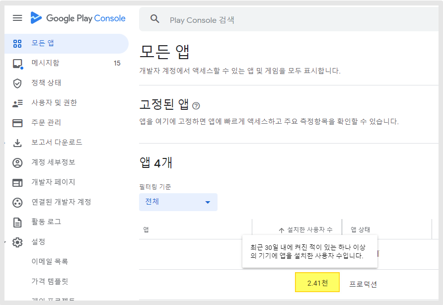
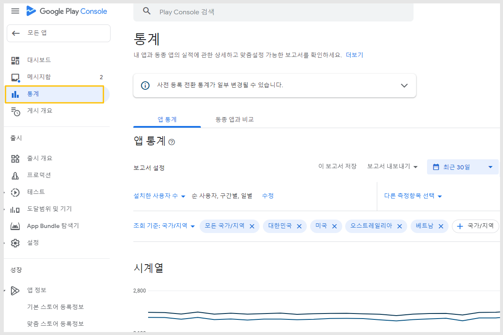
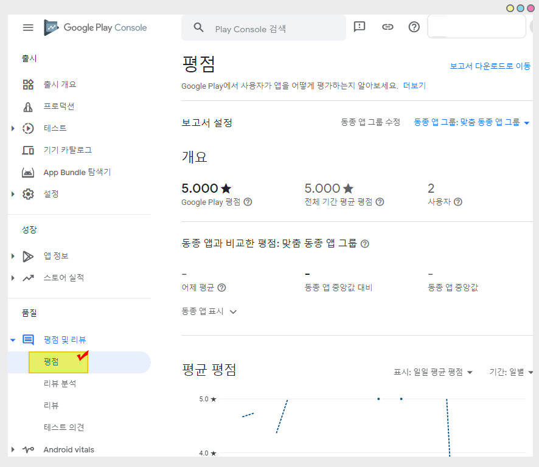
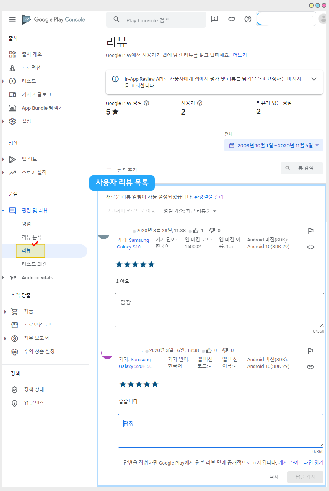
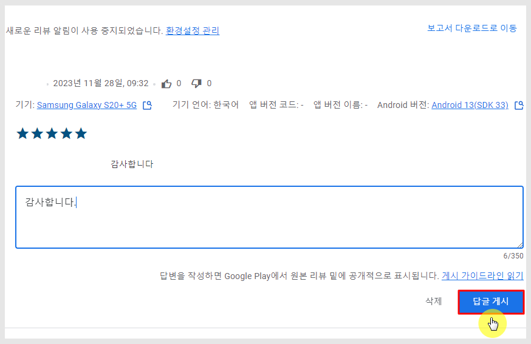
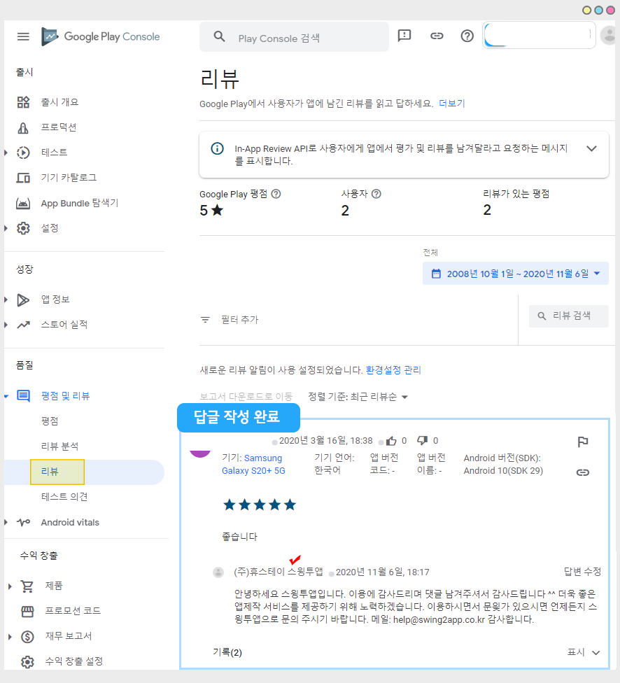

# 플레이스토어 출시 후 관리 페이지

***

플레이스토어 앱 출시 후 앱 설치(다운로드)수, 앱 리뷰 및 평점을 어디서 관리해야 하는지 궁금해 하시는 분들이 많은데요.

가이드를 통해 플레이스토어 출시 후 앱 관리 페이지를 알려드리겠습니다.

## 1.플레이스토어 출시 링크 확인하기

<figure><figcaption></figcaption></figure>

1\)[구글 플레이 콘솔](https://play.google.com/console/u/0/developers) 사이트 접속 및 로그인

2\)출시된 앱 선택

3\)대시보드 선택

4\)Google Play에서 보기 선택

5\)출시 화면으로 이동하며, 상단 사이트 주소란에 보여지는 주소가 해당 앱의 출시 링크입니다.

***

## 2.플레이스토어 앱 설치 수 확인 페이지

<figure><figcaption></figcaption></figure>

[구글 플레이 콘솔 ](https://play.google.com/console/u/0/developers)사이트 접속 후 대시보드에 보시면 앱 목록을 확인할 수 있구요.

앱이름 옆에 ‘설치된 사용자 수'로 30일 내 설치한 사용자 수를 간단하게 확인할 수 있어요.

실제 사용중인 기기를 집계한 수에요. (30일 동안 한번이라도 앱을 사용한 이력으로 집계)

따라서 앱 다운로드수와는 차이가 있어요!!

사용자분들은 활성 설치 수를 확인하여 플레이스토어에 출시된 이후부터 지금까지 우리 앱을 설치한 수를 확인할 수 있습니다.

​

### 1) 통계 페이지

<figure><figcaption></figcaption></figure>

앱을 선택한 뒤, 왼쪽 메뉴에서 '통계'를 선택해주세요.

해당 화면에서 앱 통계 상세한 보고서를 제공합니다.

날짜는 상단의 기간 버튼을 선택해서 조회를 원하는 기간을 선택할 수 있습니다.

​

앱 설치 수(통계)확인 상세 방법은 아래 매뉴얼로 확인 부탁드립니다.



***

​

## 3. 평점 및 리뷰 페이지

### <mark style="color:blue;">1)평점</mark>

<figure><figcaption></figcaption></figure>

왼쪽 카테고리에 \[평점 및 리뷰] 메뉴를 선택하면 – 평점, 리뷰, 테스트 메뉴들을 확인할 수 있어요.

평점은, 앱에 메겨진 별점 평가를 확인할 수 있습니다.

별 5개가 만점이구요. 앱에 몇점이 평가 되었는지 확인할 수 있습니다.

앱의 전체 평점 및 평점 통계 등을 확인할 수 있습니다.

​

### <mark style="color:blue;">2)리뷰</mark>

<figure><figcaption></figcaption></figure>

리뷰 페이지에서는 앱에 달린 사용자들의 댓글 목록을 모두 확인할 수 있습니다.

리뷰는 사용자들이 앱에 대해 글을 작성하는 항목입니다.

일반적으로 앱 평가시 평점(별점 체크)만 체크 하거나 리뷰+평점 같이 입력할 수도 있습니다.

평점(별점 체크) 없이 리뷰만 입력하는 것은 불가합니다.

​

### <mark style="color:blue;">3)답글 작성하기</mark>

<figure><figcaption></figcaption></figure>

<figure><figcaption></figcaption></figure>

리뷰 밑에 있는 답장 입력란에 내용을 입력 한뒤 \[답글 게시]버튼을 선택하면 답글이 달리게 됩니다.

이렇게 답글을 작성하면 플레이스토어 앱에서도 답글이 달리게 됩니다 \~!

앱 리뷰/평점 관리는 아래 매뉴얼을  통해 상세히 확인 가능합니다.



***

## 4.플레이스토어 앱 업데이트하기

​

플레이스토어 출시 후 앱을 업데이트 할 경우는 아래 매뉴얼을 확인해주세요.

앱 업데이트 상세 이용방법을 확인할 수 있습니다.



