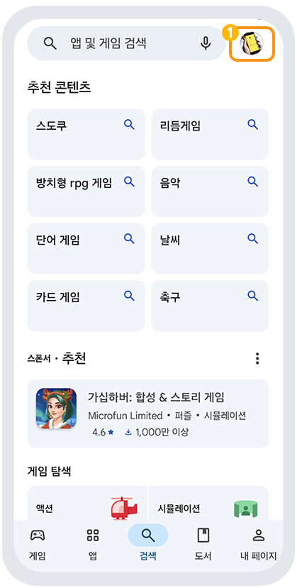
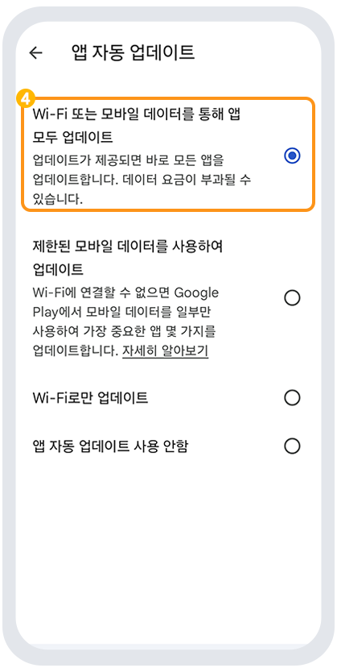

# 플레이스토어 앱 자동업데이트 설정하기

안드로이드폰에서 내가 사용하고 있는 **앱들이 최신버전으로 업데이트 될 경우 ‘자동업데이트’를 설정해놓으면 알아서 최신버전으로 업데이트 됩니다.**

**혹은 데이터가 걱정이 된다면, 와이파이 상태에서만 자동업데이트가 되도록 설정할 수 있구요.**

**자동업데이트가 싫다면, 업데이트를 하지 않음으로 설정할 수도 있어요.**

&#x20;**(그럼 업데이트가 안되겠지만요 ㅠㅠ)**

스윙투앱 이용자분들 역시 플레이스토어에 앱을 출시하셔서 이용중이라면,

**플레이스토어 앱 > ‘설정’ 에서> ‘앱 자동 업데이트’**&#xB97C; 선택해서 사용하시길 권장드립니다.

***

### <mark style="color:blue;">**플레이스토어 자동 업데이트 설정 방법**</mark>

1.구글 플레이스토어 앱을 실행해주세요.

&#x20;화면의 <mark style="color:blue;">**오른쪽 상단 프로필 버튼**</mark>을 눌러주세요.

<figure><figcaption></figcaption></figure>

그럼 아래처럼 ↓↓  메뉴창이 뜹니다.

2\. 메뉴 화면에서 **\[설정]**&#xC744; 탭합니다.&#x20;

<figure><figcaption></figcaption></figure>

&#x20;

3\. 설정 창에서 \[**앱 자동 업데이트]**&#xB97C; 선택해주세요.&#x20;

<figure><figcaption></figcaption></figure>

4\. **앱 자동 업데이트 선택 체크**&#x20;

<figure><figcaption></figcaption></figure>

&#x20;<mark style="color:blue;">**‘ Wi-Fi 또는 모바일 데이터를 통해 앱 모두 업데이트'**</mark> 로 체크

or&#x20;

데이터가 부담될 경우 <mark style="color:blue;">**‘한된 모바일 데이터를  사용하여 업데이트'**</mark>선택해주시면 됩니다.

**안드로이드폰을 이용하고 계신다면, 플레이스토어 앱에 접속하여 자동업데이트를 설정해주세요.**

**이렇게 플레이스토어에서 자동 업데이트를 선택해놓으면, 일일이 스토어로 이동하여 업데이트를 하지 않아도 되구요.**

**업데이트 건이 있으면 알아서 업데이트가 됩니다.**&#x20;

**혹은 자동업데이트를 사용하지 않을 때에도 해당 방법을 이용해주시면 됩니다. (앱 자동 업데이트 사용 안함)**

