# 구글 개인 개발자 계정 → "조직" 계정 변경

***

구글 개인 개발자 계정에서 조직 개발자 계정으로 변경하는 방법 알려드립니다.&#x20;


### 안내사항

1.구글 조직 계정으로 전환하기 위해서는 **회사 사업자등록증, DUNS번호, 회사 홈페이지(웹사이트)**&#xAC00; 반드시 있어야 합니다. 준비가 되어야 조직 계정 전환이 가능합니다.&#x20;

2.계정 유형 변경은 빠르면 당일, 길면 \~2일 정도 소요됩니다.

3.계정 세부정보가 올바르게 동기화되고 앱 중복으로 인해 앱이 거부되지 않도록 하려면 전환이 완료된 지 최소 72시간이 지난 후에 새 앱을 제출하시기 바랍니다.

&#x20;Google Play 시스템에서는 이 대기 시간 동안 계정 유형 변경을 처리하는 작업을 마무리합니다.

4.계정 유형을 '조직'에서 → '개인' 계정으로 변경할 수는 없습니다.&#x20;

개인 개발자 계정을 사용하려면 새 개발자 계정을 만들어야 하구요.&#x20;

새 계정 인증을 완료 한 뒤, 새 계정으로 앱을 이전하여 사용할 수 있습니다.&#x20;

5.웹사이트 인증을 해야 계정 유형 변경 버튼이 뜨니, 가이드를 보시고 웹사이트 인증을 먼저 완료해주세요.


***

## **1.웹사이트 인증**

[**구글 플레이 콘솔 >  개발자 계정 > 계정 세부정보 > 내 정보**](https://play.google.com/console/u/0/developers/6382805442692555802/account/developer-details?tab=aboutYou)로 이동합니다.&#x20;

계정 유형을 변경하기 전에 공식 조직 웹사이트를 제공하고 인증해야 합니다.&#x20;

인증에 관한 자세한 내용은 [**웹사이트 인증**](https://support.google.com/googleplay/android-developer/answer/13205715)을 참고하세요.&#x20;

웹사이트를 입력하고 저장한 후 **인증 요청 보내기**를 클릭해야 합니다.&#x20;

웹사이트가 인증되면 계정 유형을 업데이트할 수 있는 옵션이 표시됩니다.

\*웹사이트 인증이란, Search Console에 웹사이트를 등록하여 크롤링 하는 과정입니다. (사이트 입증을 하는 과정)

**웹사이트의 도메인, 호스팅이 모두 다 다르기 때문에 스윙투앱 가이드에서는 웹사이트 인증에 대한 방법을 제공할 수 없습니다.**&#x20;

**따라서  반드시구글에서 제공하는 가이드를 보시고 진행해주세요.**&#x20;

**🔗**[**웹사이트 인증**](https://support.google.com/googleplay/android-developer/answer/13205715?sjid=802502945889899749-NC#zippy=%2C%EC%9D%B4-%EC%9B%B9%EC%82%AC%EC%9D%B4%ED%8A%B8%EB%A5%BC-%EC%82%AC%EC%9A%A9%ED%95%A0-%EC%88%98-%EC%97%86%EC%8A%B5%EB%8B%88%EB%8B%A4-%EB%8B%A4%EB%A5%B8-%EC%9B%B9%EC%82%AC%EC%9D%B4%ED%8A%B8%EB%A5%BC-%EC%82%AC%EC%9A%A9%ED%95%B4-%EB%B3%B4%EC%84%B8%EC%9A%94%EB%9D%BC%EB%8A%94-%EC%98%A4%EB%A5%98%EA%B0%80-%ED%91%9C%EC%8B%9C%EB%90%98%EB%8A%94-%EC%9D%B4%EC%9C%A0%EB%8A%94-%EB%AC%B4%EC%97%87%EC%9D%B8%EA%B0%80%EC%9A%94)

***

## **2.계정 유형 변경 시작**

<figure>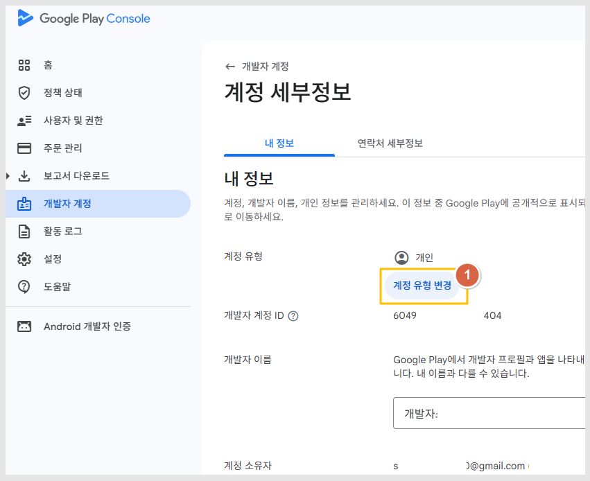<figcaption></figcaption></figure>

1.**계정 유형 변경** 을 클립합니다.

<figure>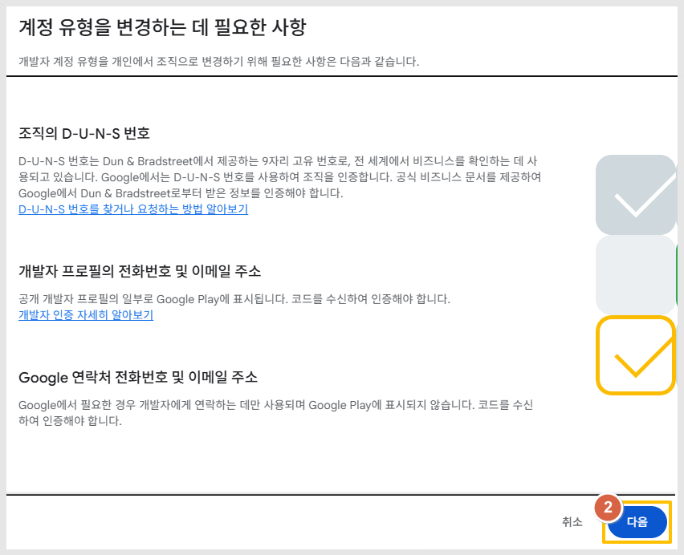<figcaption></figcaption></figure>

2.다음 버튼 선택

\*계정 유형을 변경하는 데 필요한 사항: 조직의 DUNS번호, 개발자 프로필 전화번호, 이메일주소, 구글에 기재될 연락처 전화번호, 이메일주소를 등록하게 됩니다.&#x20;

<figure>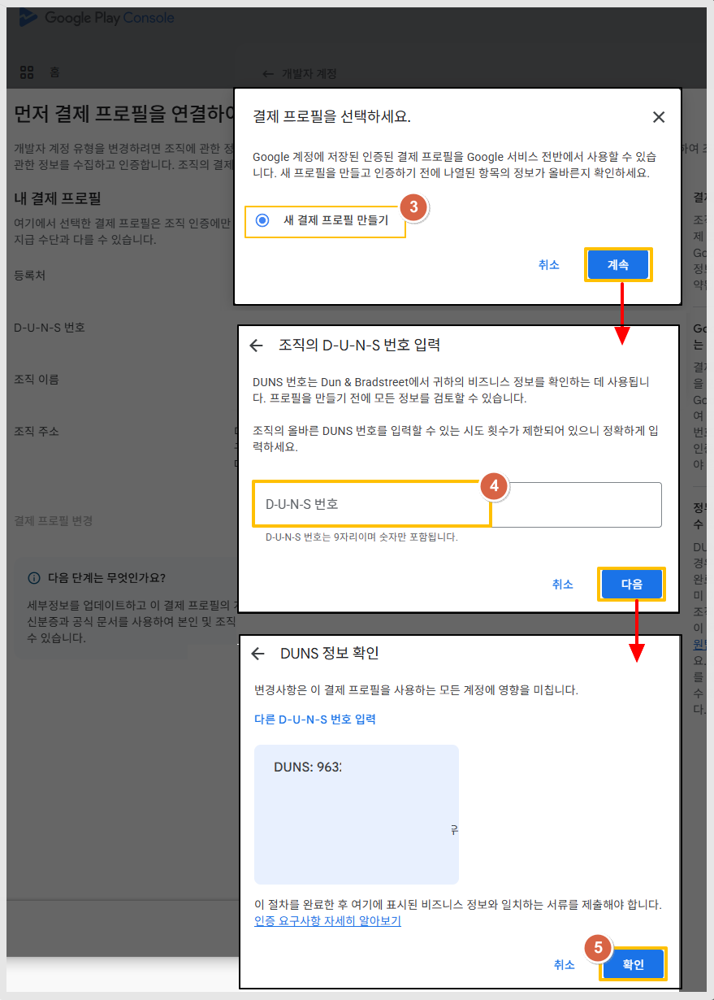<figcaption></figcaption></figure>

3.**결제 프로필 만들기 선택 하고, 계속 클릭**

<mark style="color:$primary;">조직 정보가 포함된 기존 결제 프로필이 있는 경우 해당 프로필을 선택하고</mark> <mark style="color:$primary;"></mark><mark style="color:$primary;">**계속**</mark><mark style="color:$primary;">을 클릭합니다.</mark>&#x20;

<mark style="color:$primary;">결제 프로필이 없는 경우</mark> <mark style="color:$primary;"></mark><mark style="color:$primary;">**새 결제 프로필 만들기**</mark><mark style="color:$primary;">를 클릭합니다.</mark>&#x20;

**4.DUNS번호 입력 후 다음 버튼 선택**

<mark style="color:$primary;">\*사업자로 발행된 DUNS번호가 없다면 진행이 불가해요. 번호가 없다면, 먼저 발행 후 진행해주세요.</mark>

<mark style="color:$primary;">🔗</mark>[<mark style="color:$primary;">DUNS번호 발행 방법 보러가기</mark>](https://documentation.swing2app.co.kr/developer/duns)

5.입력된 **DUNS번호 체크 후 '확인' 버튼 선택**

<figure>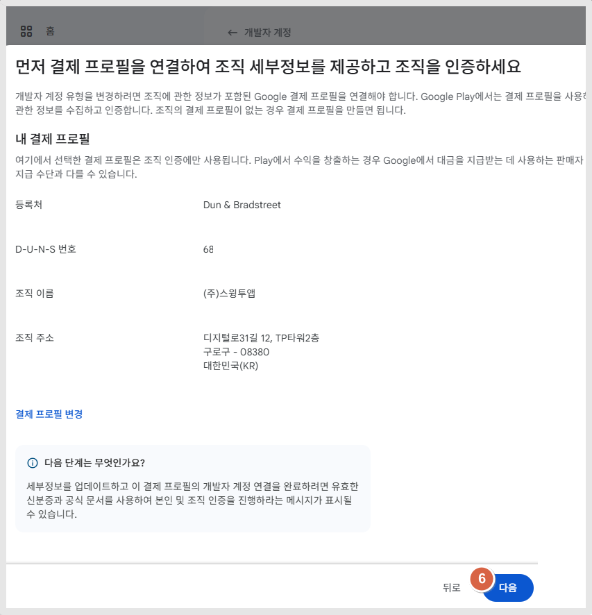<figcaption></figcaption></figure>

6.결제프로필에 보여지는 정보 확인 후 \[다음] 버튼 클릭

**\[조직 정보 입력]**

<figure>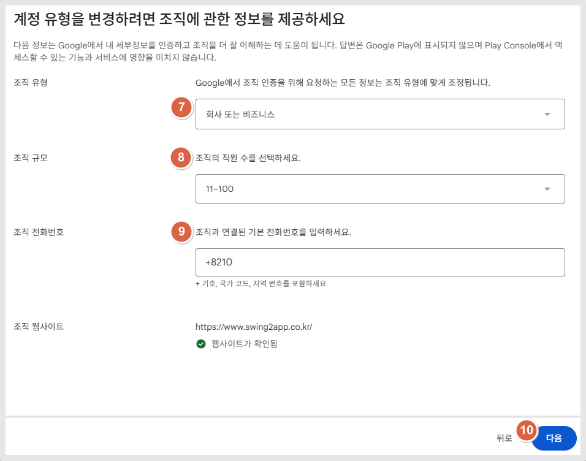<figcaption></figcaption></figure>

7.조직 유형 선택: 콘솔 박스 눌러서 회사 유형 선택합니다.

8.조직 규모 선택: 콘솔 박스 눌러서 직원수 선택합니다.&#x20;

9.조직 전화번호 입력 <mark style="color:$primary;">\*회사 전화번호 입력: +82, 지역번호 다 포함해서 기재해주세요.</mark>&#x20;

10.'다음' 버튼 선택

\*조직 웹사이트는 이미 첫번째에 사이트 인증을 완료했으므로 따로 입력하지 않아도 됩니다.&#x20;

**Google에서 연락할 방법 기재**

<figure>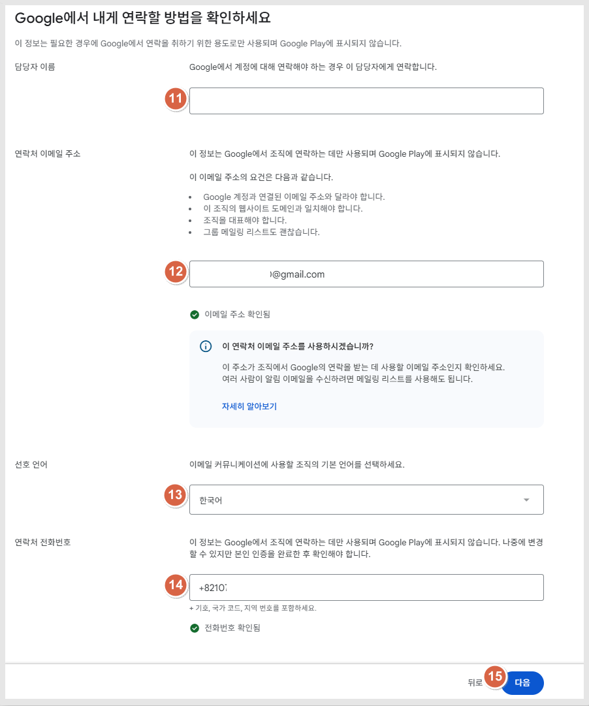<figcaption></figcaption></figure>

11.담당자 이름 입력&#x20;

12.연락처 이메일주소 입력 (지금 사용중인 구글 이메일주소 입력)

13.선호 언어: 콘솔 박스 눌러서 '한국어' 선택

14.연락처 전화번호: +82(국가코드), 지역번호 포함해서 입력

<mark style="color:violet;">예시:</mark>&#x20;

<mark style="color:violet;">유선전화:  +820210003333</mark>

<mark style="color:violet;">핸드폰번호: +821012345678</mark>

15.다음 버튼 클릭&#x20;

**개발자 프로필에 표시될 세부 정보 입력**

<figure>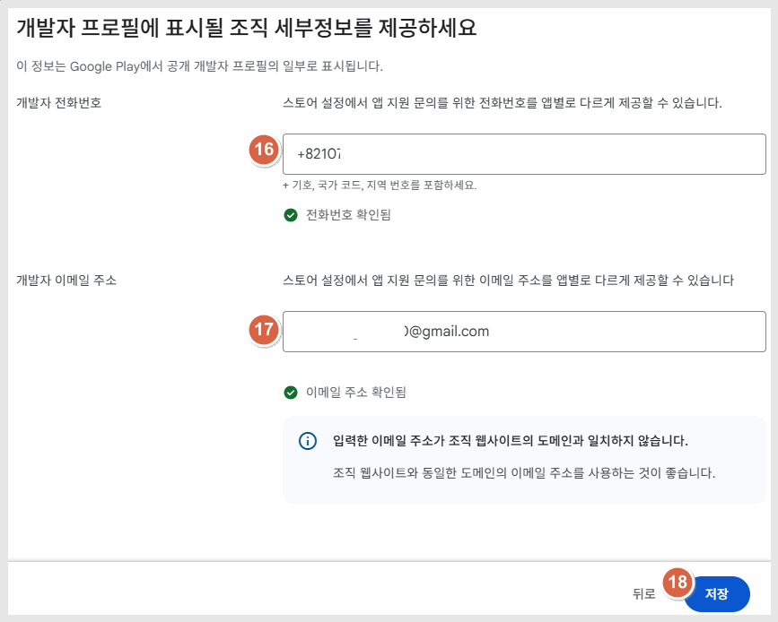<figcaption></figcaption></figure>

16.개발자 전화번호 입력: +82(국가코드), 지역번호 포함해서 입력

<mark style="color:violet;">예시:</mark>&#x20;

<mark style="color:violet;">유선전화:  +820210003333</mark>

<mark style="color:violet;">핸드폰번호: +821012345678</mark>

17.개발자 이메일주소 입력: 지금 사용중인 구글 이메일주소 입력

18.저장 버튼 선택

***

## **3.조직 인증 진행**

<figure>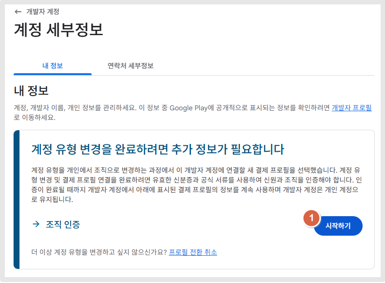<figcaption></figcaption></figure>

이어서 조직 인증을 시작하겠습니다.&#x20;

1.시작하기 선택해주세요.

<figure>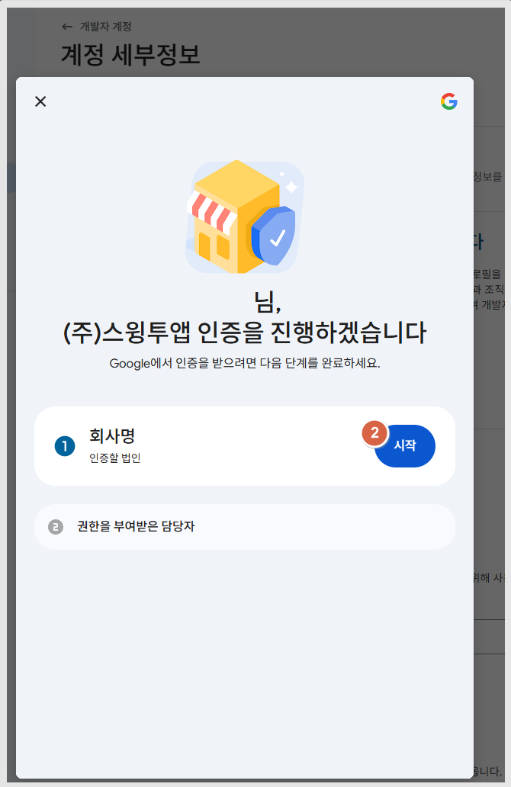<figcaption></figcaption></figure>

2.회사 인증 시작

<figure>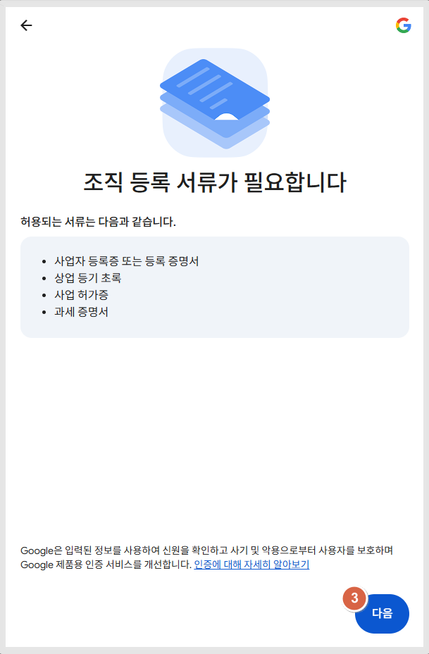<figcaption></figcaption></figure>

3.등록서류를 확인하고 '다음' 클릭해주세요.

허용되는 서류는 사업자등록증, 사업자 등록증명서, 사업 등기 초록, 사업 허가증, 과세 증명서 등이 있습니다.&#x20;

**일반적으로 대한민국 사업자는 "사업자등록증" 하나만 제출하시면 됩니다.**

<figure>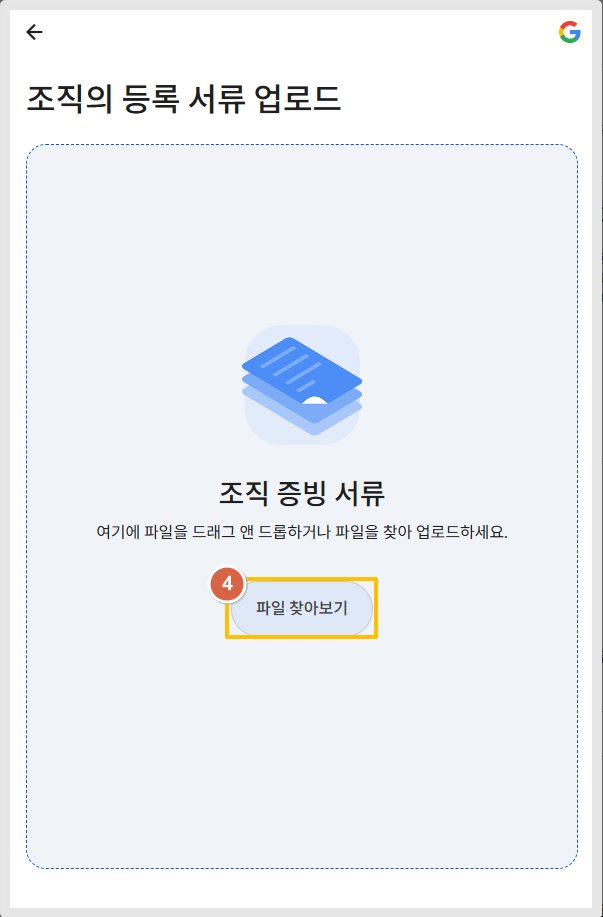<figcaption></figcaption></figure>

4.파일 찾아보기 선택- 사업자등록증 파일 업로드 합니다.

<figure>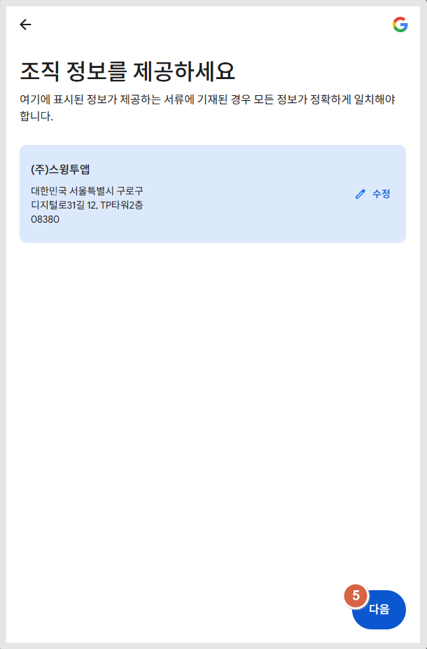<figcaption></figcaption></figure>

5.사업자(조직) 정보가 잘 들어갔는지 확인 후 \[다음] 클릭합니다.

<figure>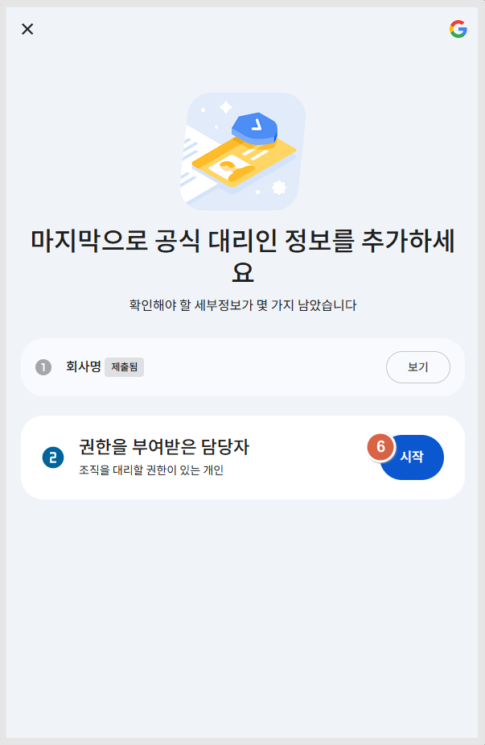<figcaption></figcaption></figure>

6.담당자(개인) 신원 확인을 시작합니다.

<figure>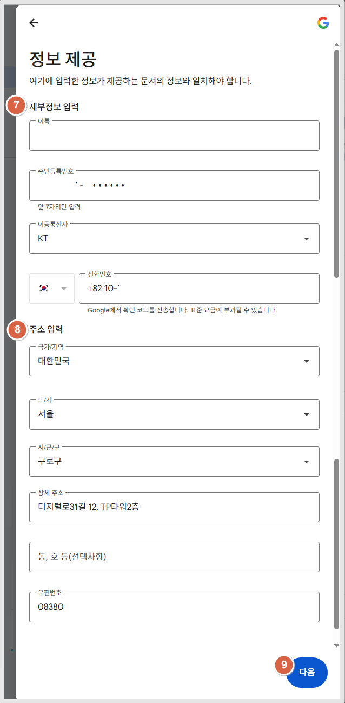<figcaption></figcaption></figure>

7.세부정보 이력: 이름, 주민번호, 통신사 선택, 전화번호 입력&#x20;

8.주소 입력: 회사 주소로 입력해주세요 (개인 거주지 주소 아닙니다)

9.다음 버튼 클릭합니다.&#x20;

<figure>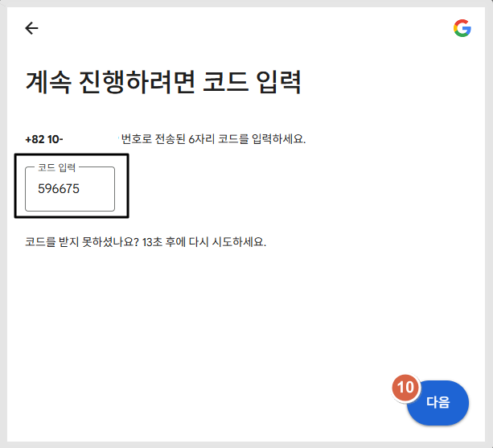<figcaption></figcaption></figure>

10.입력된 휴대폰번호로 인증번호 전송됩니다.&#x20;

코드 입력 후 '다음' 선택합니다.&#x20;

<figure>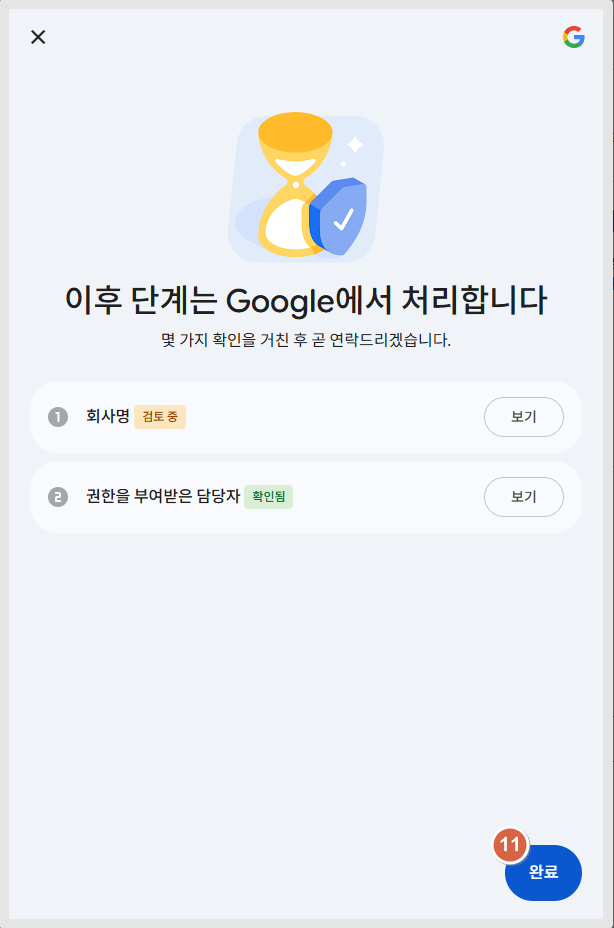<figcaption></figcaption></figure>

11. 인증 작업이 완료되었습니다. '완료' 선택

***

## **4.계정 유형 변경 완료 - 결제 프로필 연결**

<figure>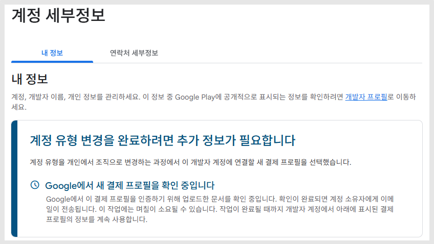<figcaption></figcaption></figure>

입력을 다 마치고 돌아오면 결제프로필 확인중이라고 기재되어 있구요.&#x20;

빠르면 몇 시간 이내, 길면 1-2일 후 계정 유형이 변경되었다고 상태가 변경됩니다.&#x20;

-**계정 유형 변경 : 프로필 연결**

<figure>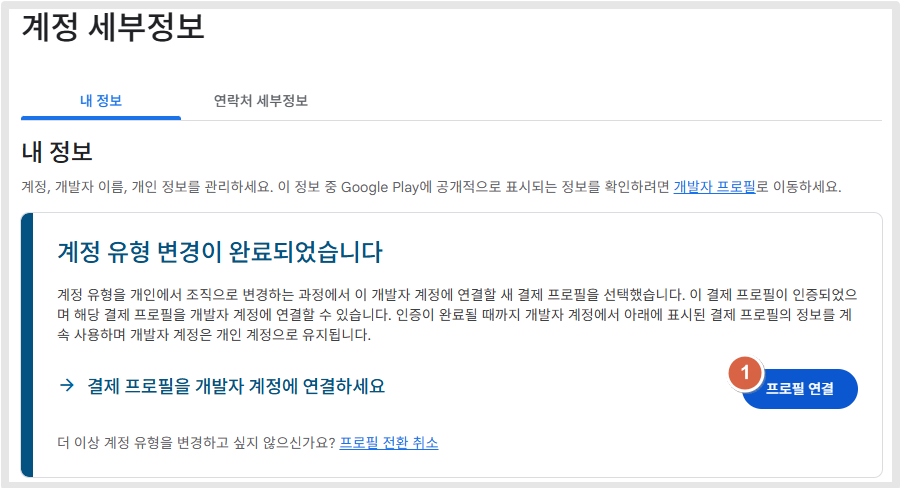<figcaption></figcaption></figure>

&#x31;**.프로필 연결** 클릭

<figure>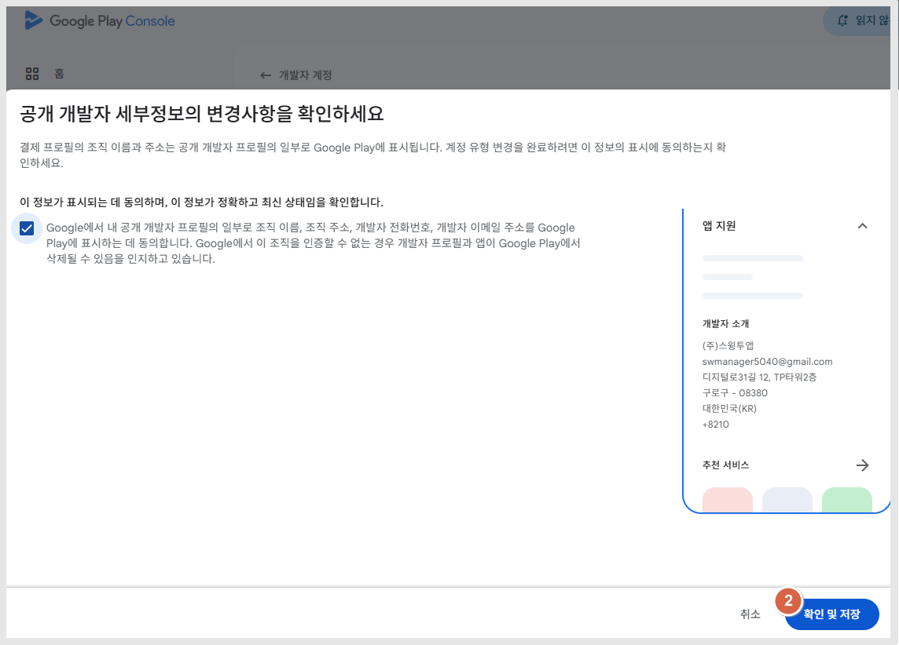<figcaption></figcaption></figure>

2.개발자 정보가 어떻게 보여지는지 확인 후. **확인 및 저장 클릭**

#### **📌최종적으로 계정 유형이 "조직"으로 변경되었음을 확인할 수 있습니다.**&#x20;

<figure>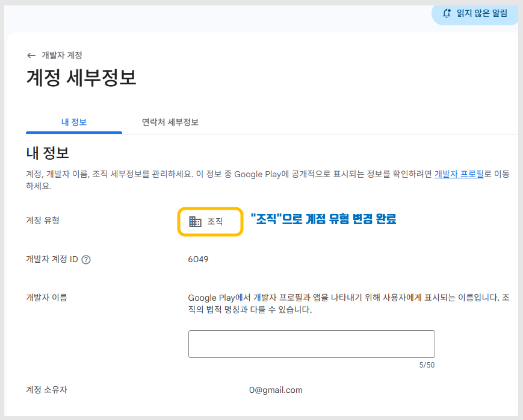<figcaption></figcaption></figure>

<figure>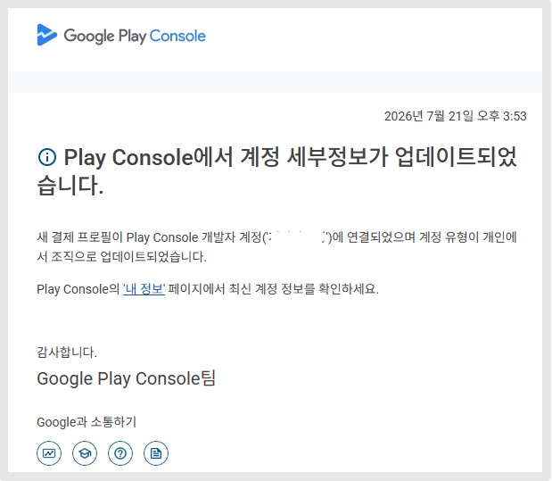<figcaption></figcaption></figure>

조직으로 계정 유형이 업데이트 되었다는 메일이 들어옵니다.

이렇게 조직으로 변경된 계정을 이용할 수 있구요.

개인 개발자계정에서 비공개 테스트 조건으로 앱 등록을 못했다면, 조직 전환 후 프로덕션에 앱 등록도 바로 할 수 있습니다.


### 안내사항

1.계정 세부정보가 올바르게 동기화되고 앱 중복으로 인해 앱이 거부되지 않도록 하려면 전환이 완료된 지 최소 72시간이 지난 후에 새 앱을 제출하시기 바랍니다.

&#x20;Google Play 시스템에서는 이 대기 시간 동안 계정 유형 변경을 처리하는 작업을 마무리합니다.

2.계정 유형을 '조직'에서 → '개인' 계정으로 변경할 수는 없습니다.&#x20;

개인 개발자 계정을 사용하려면 새 개발자 계정을 만들어야 하구요.&#x20;

새 계정 인증을 완료 한 뒤, 새 계정으로 앱을 이전하여 사용할 수 있습니다.&#x20;

3.조직 계정으로 전환하기 위해서는 회사 사업자등록증, DUNS번호, 회사 홈페이지(웹사이트)가 반드시 있어야 합니다.&#x20;

준비가 되어야 조직 계정 전환이 가능합니다.&#x20;

4.웹사이트 인증을 해야 계정 유형 변경 버튼이 뜨니, 가이드를 보시고 웹사이트 인증을 먼저 완료해주세요.


