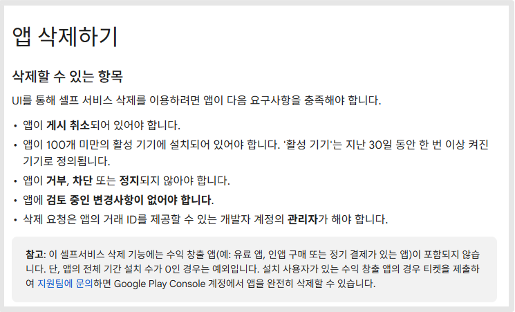
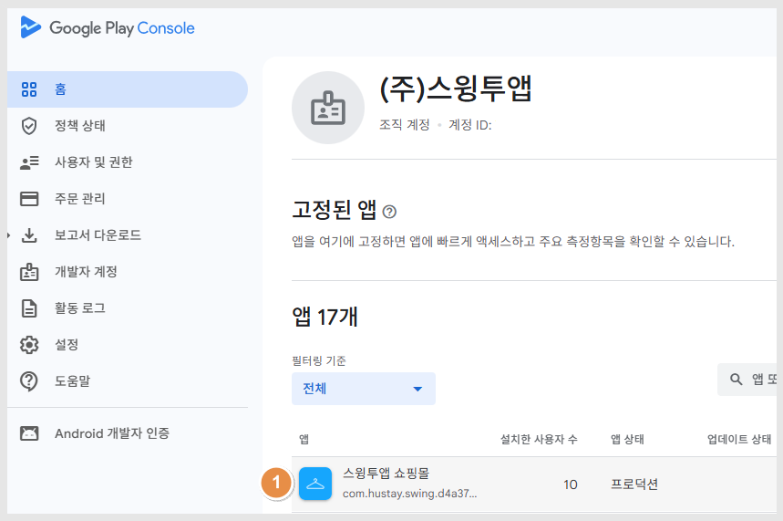
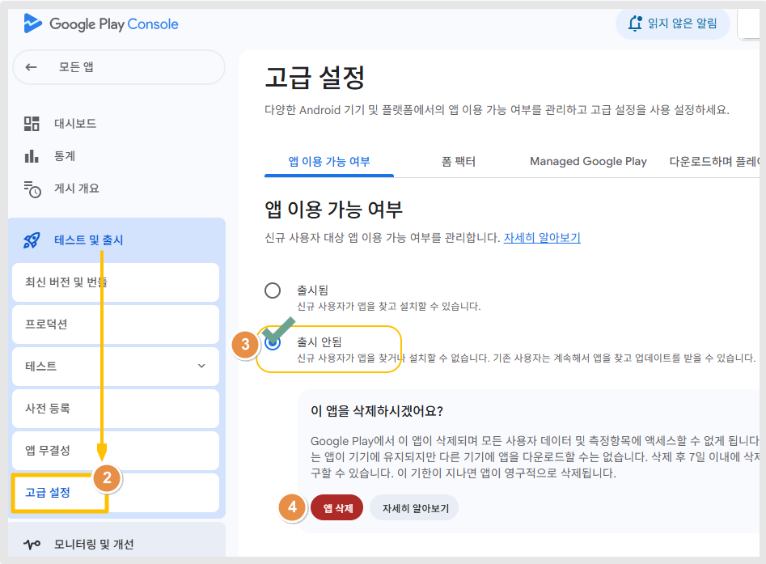
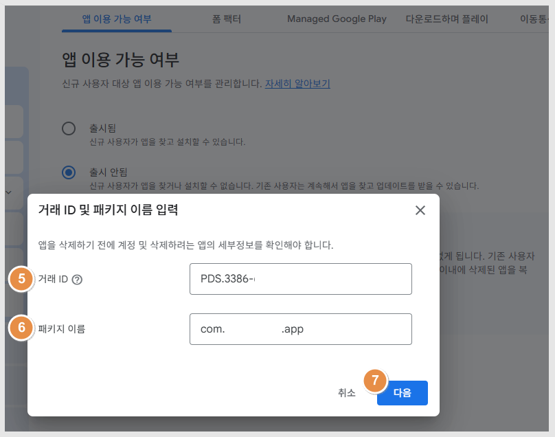
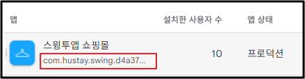
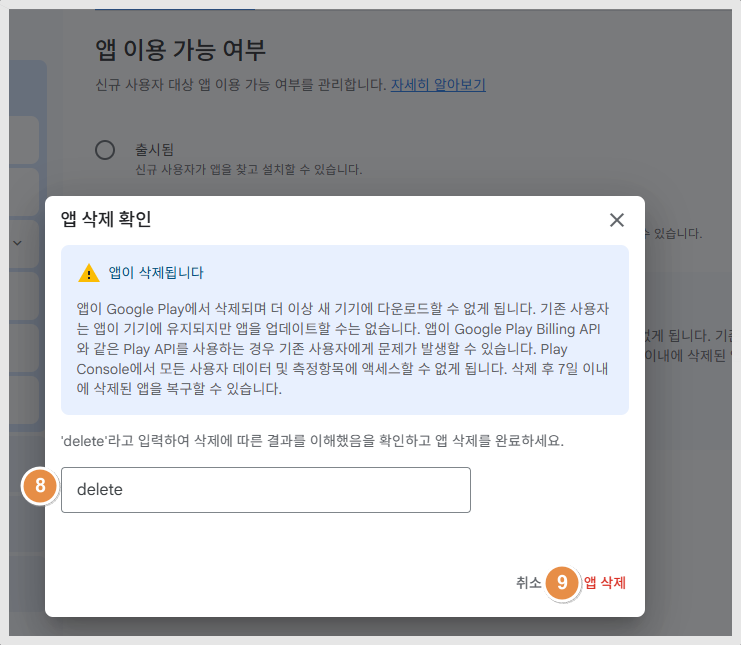
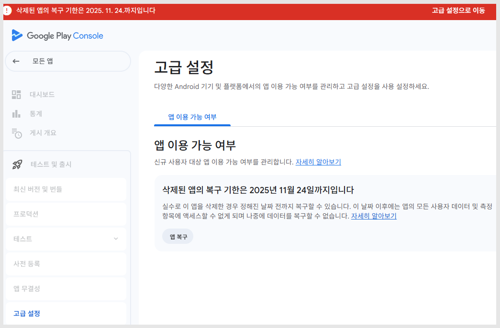
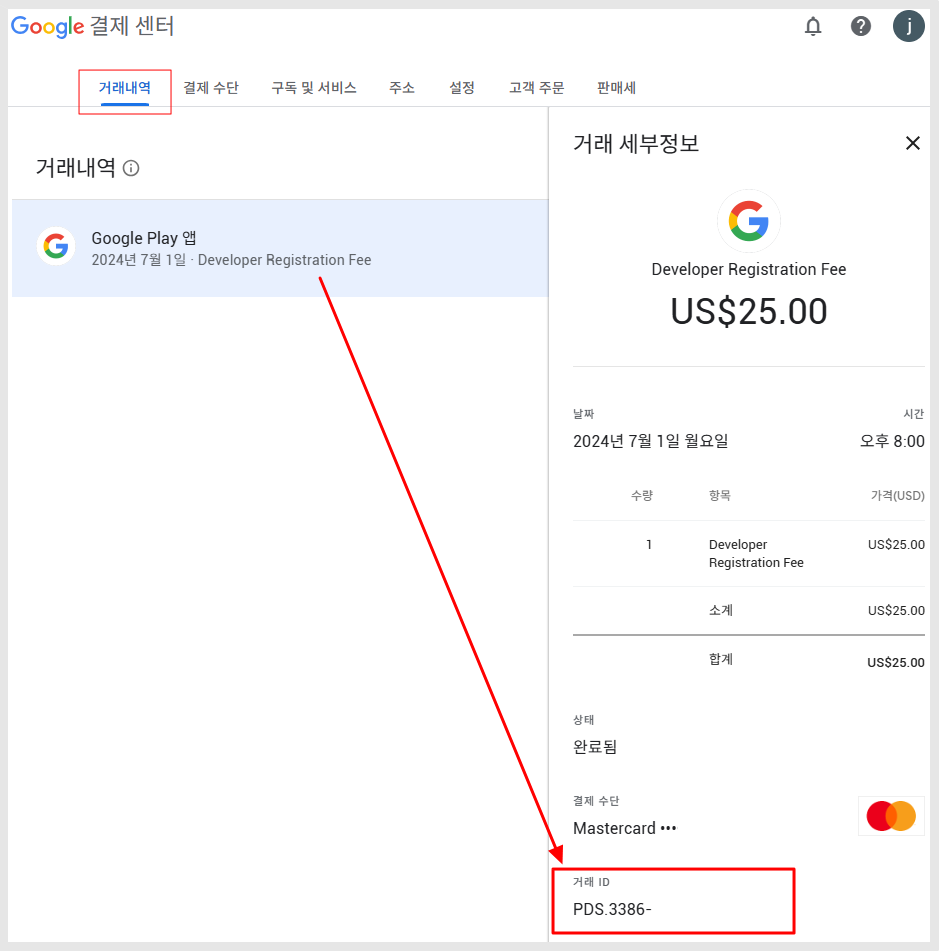
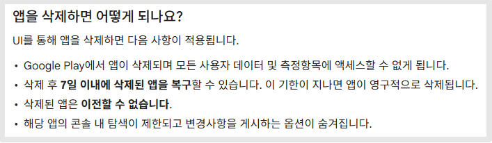
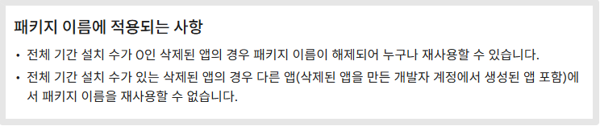

# 플레이스토어 출시 앱 삭제 방법

***

## **1. 앱 삭제가 가능한 조건**

Google Play에서 앱을 삭제하기 위해서는 다음 요건을 충족해야 합니다.

**1) 앱 게시가 취소된 상태여야 함**

앱을 먼저 게시취소 해주세요. 게시 취소된 상태에서 삭제가 가능합니다.&#x20;

**2) 활성 기기 수 100개 미만**

지난 30일 동안 설치 후 한 번 이상 실행된 기기 수가 100대 미만이어야 합니다.

**3) 앱에 정지·거부·차단 이력이 없어야 함**

정책 위반 등으로 제재 상태인 앱은 삭제가 제한됩니다.

**4) 앱에 진행 중인 검토 / 변경 사항이 없어야 함**

앱 업데이트가 검토 중인 상태에서는 삭제가 불가능합니다.

**5) 개발자 계정의 관리자 권한 필요**

앱 삭제는 계정 소유자만 진행 가능합니다.

**6)수익 창출 앱은 셀프 삭제 불가합니다.**

유료앱, 인앱 구매, 정기결제 등이 있는 수익창출 앱은 직접 앱 삭제 할 수 없습니다.

단, 앱의 전체기간 설치 수가 0일 경우는 직접 삭제가 가능합니다.

설치 사용자가 있는 수익 창출 앱은 지원팀에 문의하여 앱 삭제를 요청할 수 있습니다.

<figure><figcaption></figcaption></figure>

#### &#x20;**💡만약 위의 조건들이 충족되지 않아 앱 삭제가 불가하다면, 앱 게시취소로 진행해주세요.**



***

## **2. 앱 삭제하는 방법**

아래 단계에 따라 이동하면 삭제 메뉴를 확인할 수 있습니다.

<figure><figcaption></figcaption></figure>

1\)Google Play Console 접속, 삭제하고자 하는 앱 선택

<figure><figcaption></figcaption></figure>

2\) 테스트 및 출시 → 고급 설정 이동

3\)앱 이용 가능 여부: '출시 안됨' 선택

4\) 이 앱을 삭제하시겠어요? 메시창에서 \[앱 삭제] 버튼 선택

**📌이때 앱을 삭제 하지 않고, 게시취소만 하고 싶다면(스토어에서 노출되지 않게 앱을 내리는 것) "출시 안됨" 선택하고 나옵니다.**

앱을 완전히 삭제하실 경우만 '앱 삭제'를 선택합니다.

게시취소는 앱을 플레이스토어에서 내리는 것으로, 나중에 다시 출시로 변경할 수 있습니다.

<figure><figcaption></figcaption></figure>

5\) 거래 ID 입력 💡거래 ID는 삭제 인증을 위해 필수입니다. 아래에서 찾는 방법도 안내드릴게요.

6\)앱 패키지 이름 입력 \*앱 패키지는 com으로 시작하며, 앱 이름 밑에 표시되어 있습니다. 복사해서 붙여넣기 해주세요.

<figure><figcaption></figcaption></figure>

7\)다음 선택

<figure><figcaption></figcaption></figure>

8\)'delete' 입력

9\)\[앱 삭제] 클릭하면 완료됩니다.

<figure><figcaption></figcaption></figure>

앱이 삭제되었구요.

단, 삭제된 앱은 7일 이내 다시 복구 할 수 있습니다.

복구를 원할 경우 고급 설정에서 '앱 복구'를 클릭해주세요.

#### 💡 앱 삭제에 필요한 ‘거래 ID’ 찾는 방법

앱 삭제 시 구글에서 요구하는 ‘거래 ID’란 Google Play 개발자 계정 등록 시 발급된 결제 고유번호입니다.

<mark style="color:$success;">**✔ 거래 ID 찾는 방법**</mark>

1. 구글 개발자 계정 이메일 주소로 로그인
2. Google Payments(결제센터) 방문 pay.google.com/gp/w/home/activity
3. 거래내역에서 Google Play 앱 선택
4. 거래 세부정보에서 거래 ID 확인 가능합니다.

<figure><figcaption></figcaption></figure>

※ 대부분 PDS.XXXX-XXXX-XXXX-XXXXX 형태입니다.

***

## **3. 앱 삭제 후에는 어떻게 되나요?**

Google Play에서 앱을 삭제하면 다음 사항이 적용됩니다.

**✔ 사용자 데이터 및 측정 정보 접근 불가**

앱이 삭제되면 Google Play에서 해당 앱의 모든 사용자 데이터 및 통계에 더 이상 접근할 수 없습니다.

**✔ 7일 이내에는 삭제된 앱 복구 가능**

삭제 후 7일 동안은 ‘복구’가 가능하지만, 7일이 지나면 앱은 영구 삭제됩니다.

**✔ 삭제된 앱은 되돌릴 수 없음**

7일 이후에는 절대 복구할 수 없으니 신중히 결정해야 합니다.

**✔ 삭제 후에도 앱 이름은 일정 기간 제한됨**

앱 삭제 시 콘솔 내 탭 설정과 변경사항 표시 기능은 일부 제한될 수 있습니다.

<figure><figcaption></figcaption></figure>

***

## **4. 패키지명 재사용 규정 (중요!)**

많은 개발자들이 앱 삭제 이유 중 하나가 패키지명 재사용입니다.

하지만 패키지명도 규칙이 있습니다.

​

**✔ 전체 기간 설치 수 0 → 패키지명 즉시 해제**

한 번도 실제 기기에 설치된 적이 없으면

삭제 즉시 패키지명을 다시 사용할 수 있습니다.

​

**✔ 기존 설치자가 1명이라도 있는 경우 → 재사용 불가**

설치된 이력이 있는 앱의 패키지명은 다시 사용할 수 없습니다.

이는 계정 간 패키지명 이전도 불가합니다.

<figure><figcaption></figcaption></figure>

***

## **5. 앱 삭제 주의사항**

* 앱 삭제는 복구가 제한되므로 신중하게 결정해야 합니다.
* 삭제 후 7일 이후에는 데이터 및 통계도 완전히 사라집니다.
* 패키지명을 다시 사용하려면 반드시 설치 기록이 없는 상태여야 합니다.
* 앱 삭제는 반드시 계정 소유자 권한 계정으로 진행해야 합니다.

