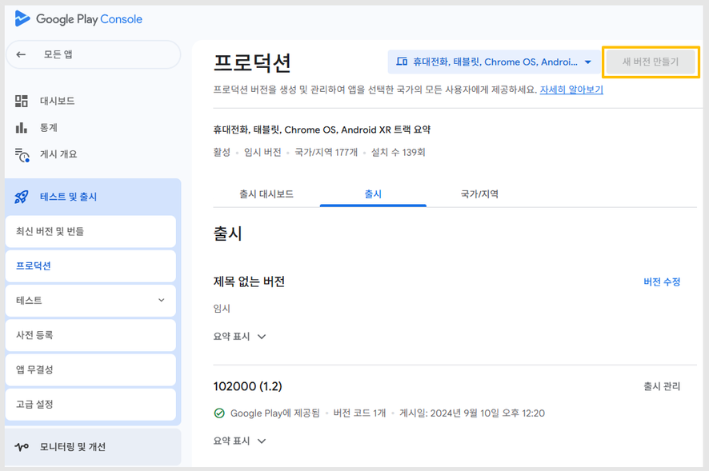
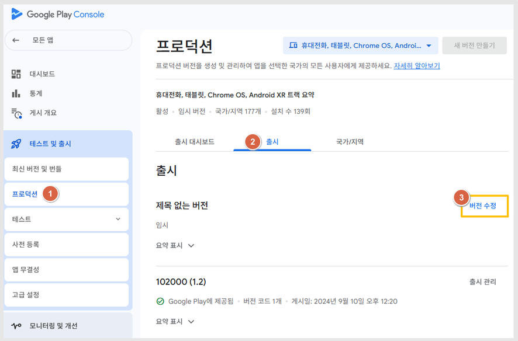

# 플레이스토어 프로덕션 새 버전 버튼 비활성화 해결 방법

***

#### **“새 버전 만들기” 버튼이 비활성화되는 이유?**

앱을 업데이트하거나 새로 등록하려고 할 때,

<mark style="color:$info;">**\[새 버전 만들기]**</mark> 버튼이 회색으로 비활성화되어 클릭되지 않아 당황하신 적 있으신가요?

<figure><figcaption></figcaption></figure>

이는 대부분 이미 프로덕션 버전에 앱 파일이 등록된 상태이기 때문입니다.

즉, 앱이 **임시 저장 상태(draft)** 로 남아 있어서 새 버전을 만들 수 없는 상황인 것이죠.

​

***

#### 🔸 **왜 임시 저장 상태가 되는 걸까요?**

다음과 같은 경우 앱 파일이 자동으로 임시 저장될 수 있습니다.

* AAB 파일을 업로드했지만 즉시 검토로 전환하지 않고 창을 닫은 경우
* 업로드 후 페이지를 새로고침(F5) 한 경우

이럴 땐, 임시 저장된 버전을 다시 불러와 검토 단계로 전환하면 문제를 해결할 수 있습니다.

***

### **💡 해결 방법: 임시 저장 버전 불러오기**

다음 단계를 순서대로 진행해주세요 👇

<figure><figcaption></figcaption></figure>

1\)프로덕션에서 2)출시 선택

3\)버전 수정을 선택합니다.

<figure><figcaption></figcaption></figure>

4\)라이브러리에서 추가 를 선택해주세요.

5\)라이브러리에 저장된 최신 버전 AAB 파일을 확인할 수 있습니다. 체크하여 저장해주세요.

​

\--이후에는 일반적인 앱 검토 절차와 동일하게 진행하시면 됩니다.

<figure><figcaption></figcaption></figure>

<figure><figcaption></figcaption></figure>

<figure><figcaption></figcaption></figure>

<figure><figcaption></figcaption></figure>

### **💡 정리**

만약 “버전을 찾을 수 없습니다” 라는 메시지가 뜨거나 새 버전 만들기 버튼이 비활성화되어 있다면,

> **프로덕션 → 출시 → 버전 수정 → 라이브러리**
>
> **이 경로를 꼭 기억해주세요!**

임시 저장된 버전을 불러오면 정상적으로 검토 및 출시를 진행할 수 있습니다.

***

#### 🚀 스윙투앱의 플레이스토어 등록·출시 대행 서비스

플레이스토어 등록 과정은 생각보다 복잡하고 세밀한 정책 검토가 필요합니다.

앱 서명, 정책 위반, AAB 업로드 오류, 검토 지연 등 다양한 문제가 발생할 수 있죠.

​

스윙투앱에서는 이러한 과정을 대신 처리해드리는 “플레이스토어 등록 및 출시 대행 서비스”를 제공하고 있습니다.

* 프로덕션 등록부터 테스트 트랙 설정까지 전 과정 대행
* 심사 거절 사유 분석 및 재심사 대응
* 앱 업데이트 및 정책 변경 지원

​

👉 앱 출시가 막막하거나 오류로 어려움을 겪고 있다면, 스윙투앱 고객센터로 문의해주세요!

전문 매니저가 앱 검토부터 출시까지 빠르고 정확하게 도와드립니다.

