# 구글 개발자 계정"통신판매업 신고"

***

**구글 플레이 콘솔 계정 세부정보 - 한국 개발자 추가 정보 필요**

: 사업자 등록 번호, 전자상거래 라이선스 번호, 라이선스 대행사 입력

***

## **0.통신판매업 번호 왜 제출해야 하나요?**

플레이스토어 구글 개발자 조직 계정 등록 및 인증을 모두 마치고 이제 앱을 등록해보려고 하는데,,,

갑자기 경고 메시지가 뜨면서 추가 정보를 입력해야 한다는 내용을 받아 보셨나요?

한국 개발자 추가 정보 필요 화면 캡처)

<figure>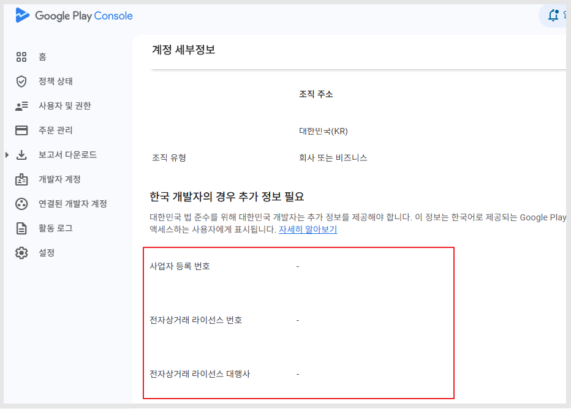<figcaption></figcaption></figure>

개발자 계정 생성시, 유료앱 및 앱 수익창출에 체크를 할 경우 해당 되는 경우인데요.

모든 개발자가 다 입력하는 것이 아니라 <mark style="background-color:yellow;">**유료앱을 판매 or 앱 내에 인앱 상품 판매를 하여 수익이 발생될 경우만 입력을 하게 됩니다.**</mark>

앱 무료로 배포중이고, 앱 내에서 인앱 상품 등 수익을 받는 경우가 전혀 없다면 해당 되지 않습니다.

​

**💡저는 무료앱이고, 앱에서 상품 판매를 하지 않는데도 해당 정보를 입력하라고 뜹니다. 왜 그런가요?**

\= 이 경우는 개발자 계정 등록할 때, 수익창출 여부 설문 항목에 "예" 라고 체크했을 경우 입니다.

가입시 입력한 항목은 번복이 안되고, 안타깝게도 변경은 불가합니다.

따라서 이렇게 체크했을 경우 - 대한민국 개발자 추가 정보(전자상거래 라이선스 번호 등)를 입력하라고 뜨는 것입니다.

<figure><figcaption>
구글 개발자 계정 - 앱 정보 "수익창출" 질문 화면
</figcaption></figure>

<figure>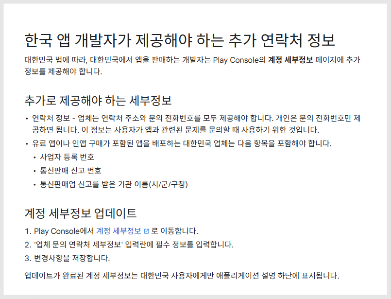<figcaption></figcaption></figure>

사업자 등록번호 입력은 쉽게 할 수 있지만 전자상거래 라이선스 번호와 전자상거래 라이선스 대행사란?


\*전자상거래 라이선스번호란?

통신판매업 번호를 말합니다.

\*전자상거래 라이선스 대행사란?​

통신판매업을 신고하여 발급한 해당 지역구를 말합니다. 예시)구로구청


따라서 통신판매업 번호가 없다면, 입력이 불가하기 때문에 앱 등록을 할 수 없습니다.

스윙투앱에서는 빠르게 통신판매업 번호를 발급받는 방법을 알려드릴게요!

<mark style="color:red;">주의)반드시 사업자가 있어야 합니다. (개인이나 법인은 상관없습니다)</mark>

***

## **1.통신판매업신고하기**

정부24사이트 통신판매업 신고에서 쉽게 발급을 할 수 있습니다.

필요한 정보: 사업자등록증에 기재된 상호명, 사업자등록번호, 연락처, 주소

​

[**정부24 사이트 접속**](https://www.gov.kr/portal/main/nologin)

<figure>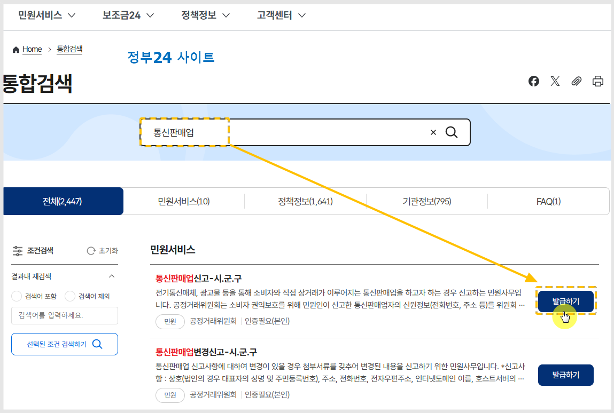<figcaption></figcaption></figure>

검색창에 "통신판매업" 검색 후 신고란 \[발급하기] 버튼 선택해주세요.

​

**\*아래는 개인 사업자가 신고 하는 방법입니다. - 개인 선택**

법인이라면 항목에서 '법인' 선택해서 진행해주세요. 진행과정은 동일합니다.

<figure><figcaption>
'개인' 선택
</figcaption></figure>

<figure>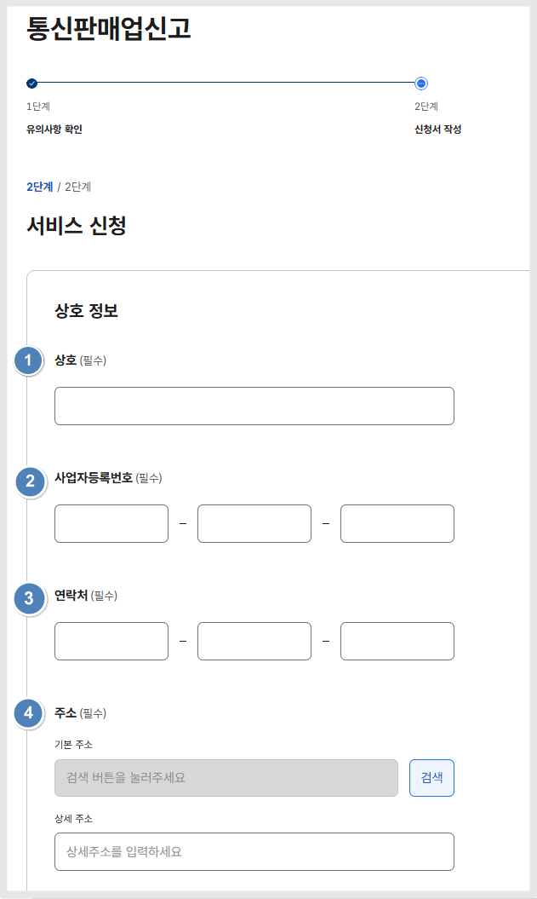<figcaption></figcaption></figure>

1\)상호명 입력

2\)사업자등록번호 입력

3\)연락처 입력

4\)주소 입력

<figure>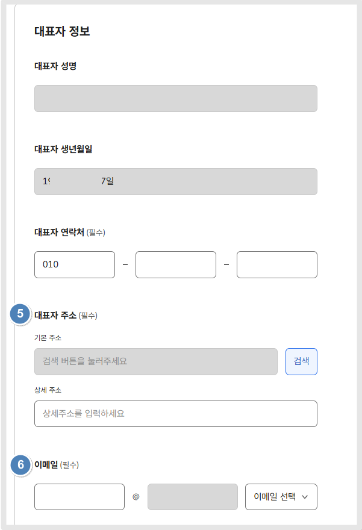<figcaption></figcaption></figure>

​대표자이름,  생년월일, 연락처는  앞서 입력된 정보로 자동셋팅 되오니 따로 기재하지 않아도 됩니다.

5\)주소 입력

6\)이메일 주소 입력

​

<figure>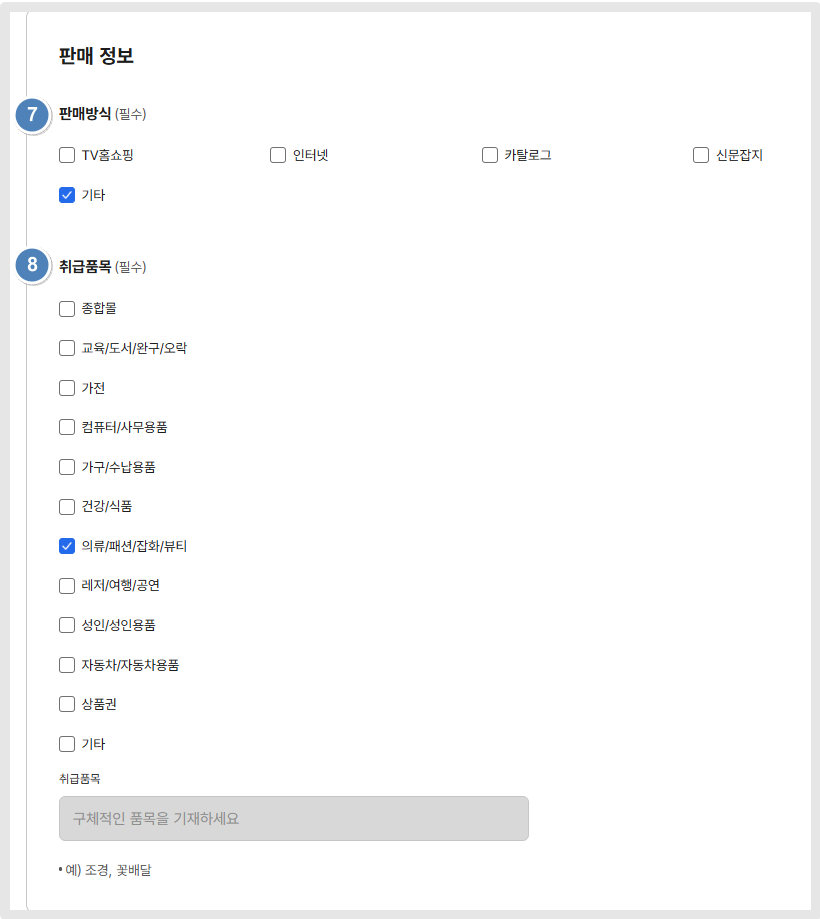<figcaption></figcaption></figure>

7\)판매방식 \*어떤 식으로 상품을 판매하는지 체크해주세요. 항목에 해당되는 것이 없다면 "기타" 선택해주세요.

8\)취급품목 \*판매하는 상품을 체크합니다.

만약 구글 플레이 콘솔에서 유료앱 판매 등을 위해 신청한다면 "기타" 체크 후 - 취급품목: 어플리케이션 이라고 기재해주세요.

<figure>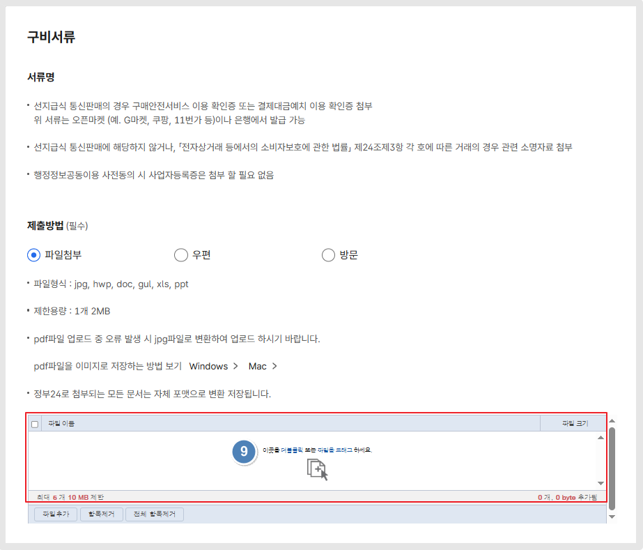<figcaption></figcaption></figure>

9\)구매안전서비스 비적용 대상 확인서를 다운 받아서 다음과 같이 체크후 내용 제출 후 파일 업로드 해주세요.

**첨부파일)**



<figure><figcaption></figcaption></figure>

<figure><figcaption></figcaption></figure>

10\)수령방법 선택

11\)동의에 전체 동의 체크해주세요.

12\)신청하기를 누르면 완료

​

\*통신판매업 발행일: 영업일 기준 2-3일

정부24 신청이 완료되면, 2\~3일 뒤에 문자로 완료 안내를 받게 됩니다.


**\*중요 안내\***

통신판매업 신고증 수령을 위해서는 등록면허세를 납부해야 합니다.

지방세법에 따라 1년 1번 납부하며, 매년 1월에 납부합니다.

**\[비용 안내]**

-인구 50만명 이상 도시 40,500원

-그 밖의 시: 22,500원

-군 단위: 12,000원 


***

## **2.통신판매업신고 조회 및 번호 조회 방법**

​

등록 완료되었다는 문자를 받으면, 번호 조회를 할 수 있습니다.

조회는, [**공정거래위원회 홈페이지**](https://www.ftc.go.kr/www/index.do)에서 확인해주세요.

<figure>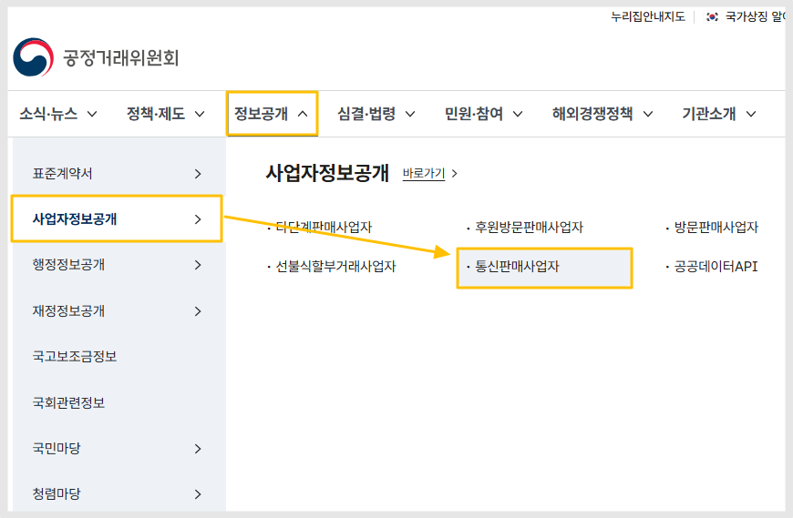<figcaption></figcaption></figure>

공정거래위원회 사이트 접속 → 정보공개→사업자정보공개→ 통신판매사업자 선택

​

<figure>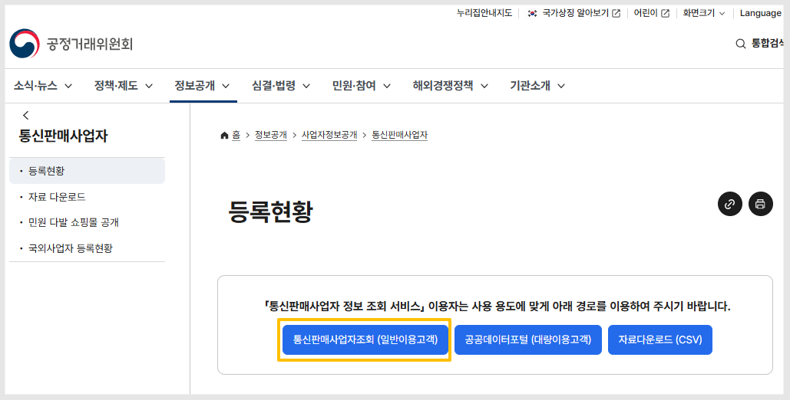<figcaption></figcaption></figure>

등록현황→ 통신판매사업자 조회 버튼 선택

​

<figure>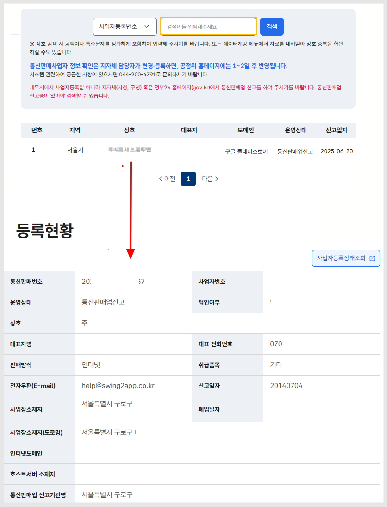<figcaption></figcaption></figure>

사업자등록번호 입력 후 검색 버튼 누르면, 신청된 현황 조회가 가능합니다.

상호명을 선택하면 → 등록화면으로 이동하여, 통신판매번호 확인이 가능합니다.

​

해당 번호를 구글 플레이 콘솔 - 한국 개발자 정보란에 입력해주시면 됩니다.

<figure>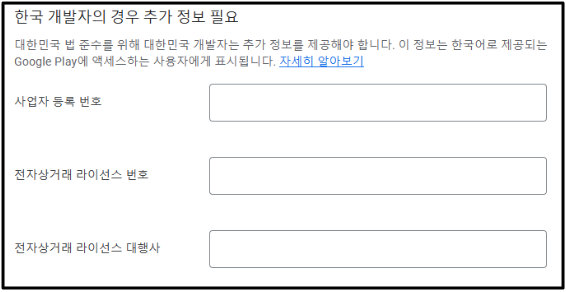<figcaption></figcaption></figure>

<mark style="color:blue;">\*사업자등록번호 입력</mark>

<mark style="color:blue;">\*라이선스 번호: 통신판매번호 입력</mark>

<mark style="color:blue;">\*라이선스 대행사: 통신판매업 신고 기관명 (예시)구로구청</mark>

정보 입력이 완료되면, 이제 구글 플레이 앱 등록 및 심사 제출이 가능해집니다.

***

&#x20;위의 가이드는, 통신판매업 번호가 없을 경우 새로 등록 및 신고를 하는 방법을 알려드린 것입니다.

이미 사업자에 통신판매업 번호가 있는 분들은 보유한 번호 및 정보로 제출해주세요.&#x20;

