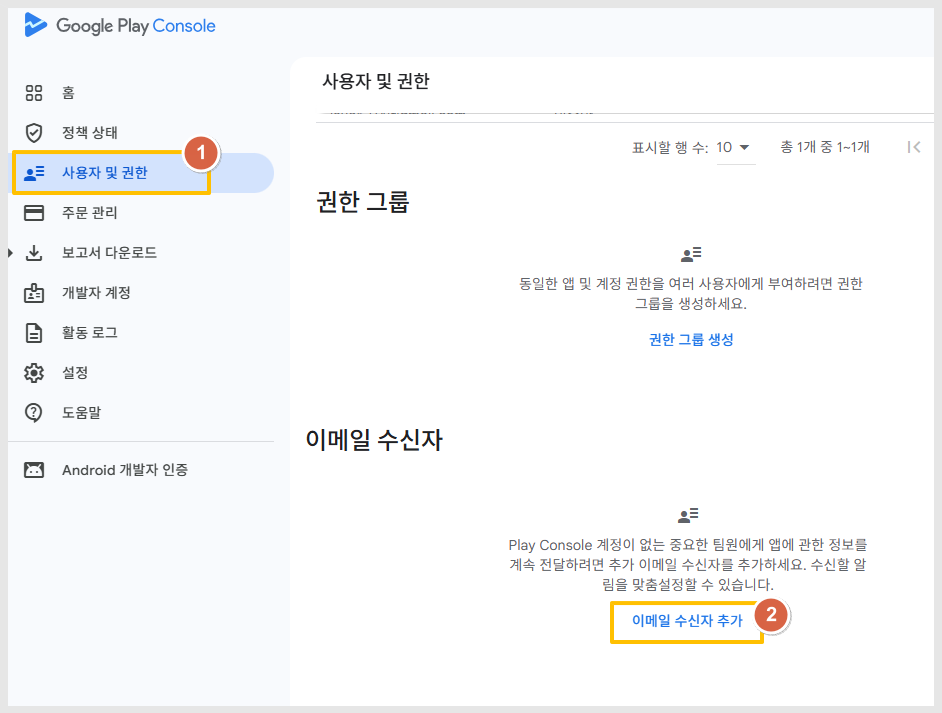
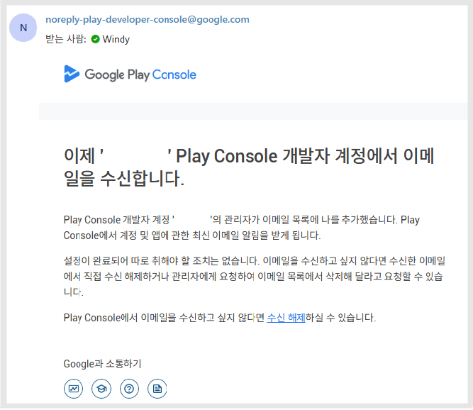
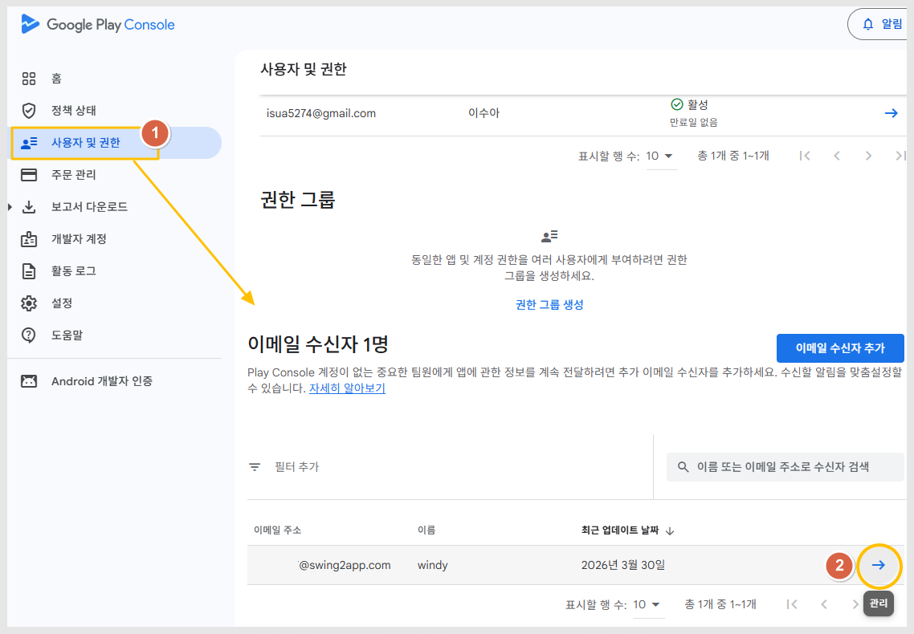
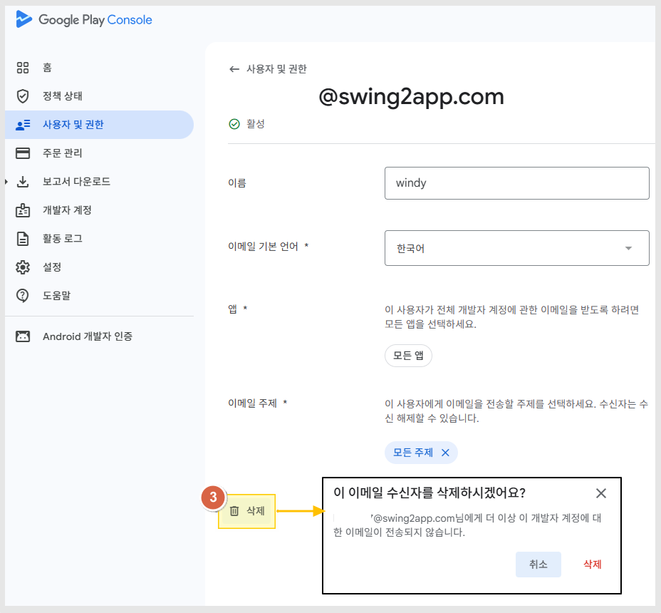

# 플레이 콘솔 이메일 수신자 추가

***

구글 플레이 콘솔에서는&#x20;

개발자 계정 접근 권한 없이도 **이메일만 받아볼 담당자**를 따로 등록할 수 있습니다.

예를 들어 👉 대표 / 마케팅 담당 / 운영팀이 정책 메일만 받도록 설정 가능합니다.

***

## **1.누가 설정할 수 있나요?**

* 계정 **소유자**
* **관리자 권한 사용자**

👉 일반 사용자(개발자 등)는 설정 불가

***

## 2.알림 주제

이메일 수신자를 추가해 이메일 주제에 따라 이메일을 받도록 할 수 있습니다.

적절한 사용자에게 계정에 대한 이메일 알림이 전송되도록 모든 주제에 이메일 수신자를 추가하는 것이 좋습니다.

개인 또는 그룹을 이메일 수신자로 추가할 수 있습니다. 이메일이 활성 상태의 직원에게 전송되도록 그룹을 추가하는 것이 좋습니다.

다음 주제를 사용할 수 있습니다. 이메일 수신자에 대해 주제를 하나 이상 선택해야 합니다.

* 정책👉 가장 중요 (앱 삭제/경고 관련)
* 지급 및 세금👉 정산 관련
* 팁, 뉴스, 기회👉 구글 안내
* 의견 및 설문조사👉 선택사항

보통 주제는 전체 주제를 체크해서 메일을 받아보는 것을 권장드립니다.&#x20;

***

## 3. 이메일 수신자 추가하는 방법

이메일 수신자 추가는아래 순서대로 진행해주세요.

<figure><figcaption></figcaption></figure>

<figure><figcaption></figcaption></figure>

1. 개발자 계정에서 [사용자 및 권한](https://play.google.com/console/developers/users-and-permissions) 탭으로 이동합니다.
2. '이메일 수신자' 섹션까지 아래로 스크롤하여, **'이메일 수신자 추가'**&#xB97C; 클릭합니다.
3. 이메일 주소 입력란에 이메일 수신자의 이메일 주소를 입력합니다.<mark style="color:$danger;">\*구글 계정(gmail)계정이 아니어도 됩니다.</mark>&#x20;
4. 이메일주소 확인 (앞서 입력된 메일주소로자동 입력 됩니다.)
5. 이름 입력 \*선택사항으로 입력하지 않아도 무관합니다.&#x20;
6. 이메일 기본 언어 선택
7. **앱 선택**: 앱등록다운메뉴에서알림을 받을 앱을 선택하거나, 전체 앱을 선택할 수 있습니다. 전체앱은 "모든 앱"선택합니다.
8. **이메일 주제:** 드롭다운 메뉴에서 이 이메일 수신자에게 알림을 전송하려는 알림 주제를 선택합니다. \
   \[+주제추가] 버튼클릭-'전체'를 선택하면 계정의 모든 앱과 계정 정보에 대한 알림이 전송됩니다.
9. **추가**를 클릭합니다.

<figure><figcaption></figcaption></figure>

'OOOO'개발자 계정에서 이메일을 수신합니다. 메일을 받으면 정상적으로 이메일주소 추가가 완료된 것입니다.

***

## 4.수정방법

이메일 수신자를 수정하려면 다음 단계를 따르세요.

<figure><figcaption></figcaption></figure>

1. 개발자 계정에서 [사용자 및 권한](https://play.google.com/console/developers/users-and-permissions) 탭으로 이동합니다.
2. '이메일 수신자' 섹션까지 아래로 스크롤, 수정할 이메일 수신자를 찾아 오른쪽에 있는 화살표를 클릭합니다.

***

## 5.이메일 수신자 삭제 방법

이메일 수신자를 삭제하려면 다음 단계를 따르세요.

<figure><figcaption></figcaption></figure>

<figure><figcaption></figcaption></figure>

1. 개발자 계정에서 [사용자 및 권한](https://play.google.com/console/developers/users-and-permissions) 탭으로 이동합니다.
2. '이메일 수신자' 섹션까지 아래로 스크롤, 수정할 이메일 수신자를 찾아 오른쪽에 있는 화살표를 클릭합니다.
3. **이메일 수신자 삭제**를 클릭합니다.

***

## 6.안내사항

* 이메일 수신자는\
  👉 **플레이콘솔 로그인 권한 없음(앱을 등록하거나, 앱을 관리하는 권한은 없습니다.**\
  👉 **구글플레이에서 제공하는 이메일만 수신받는 용도입니다.**
* 일부 메일은\
  👉 **수신 거부 불가 (중요 정책 메일)**
* 직원 퇴사 대비\
  👉 개인 이메일보다 **팀 메일 사용 권장드립니다.**&#x20;

