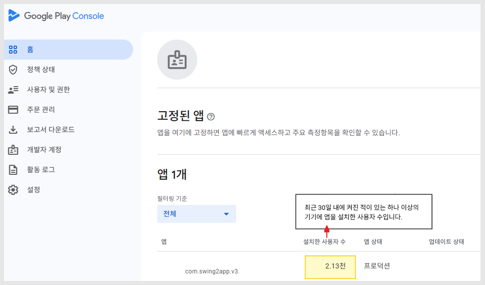
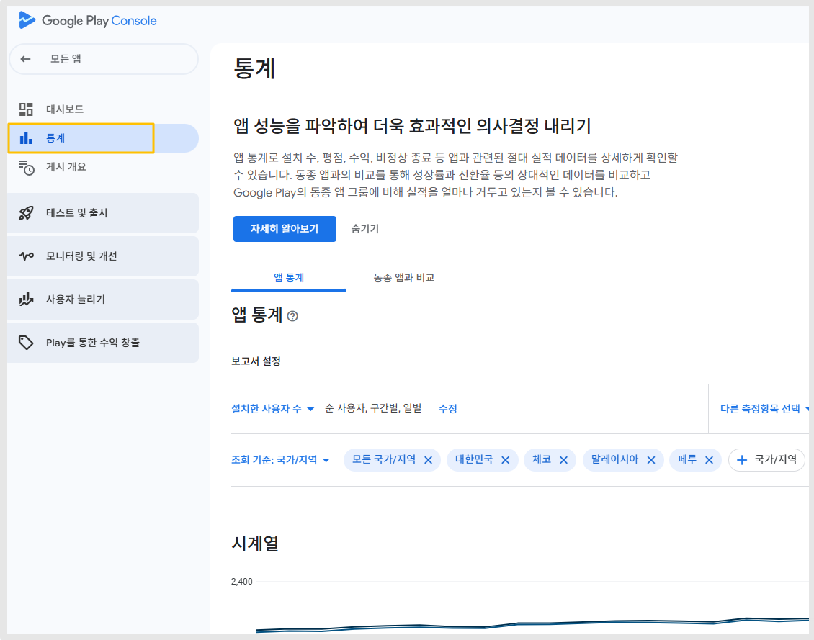
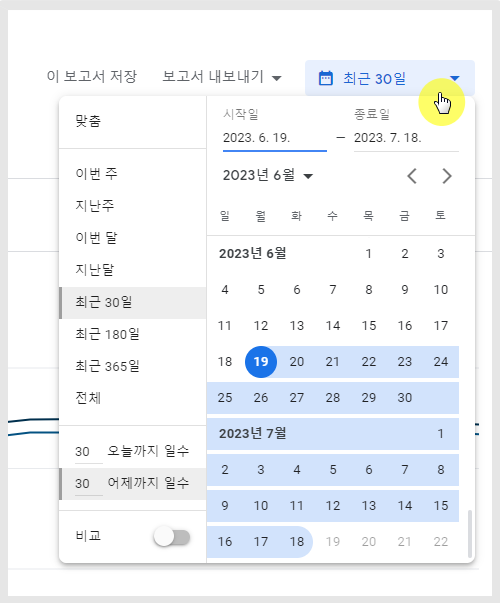
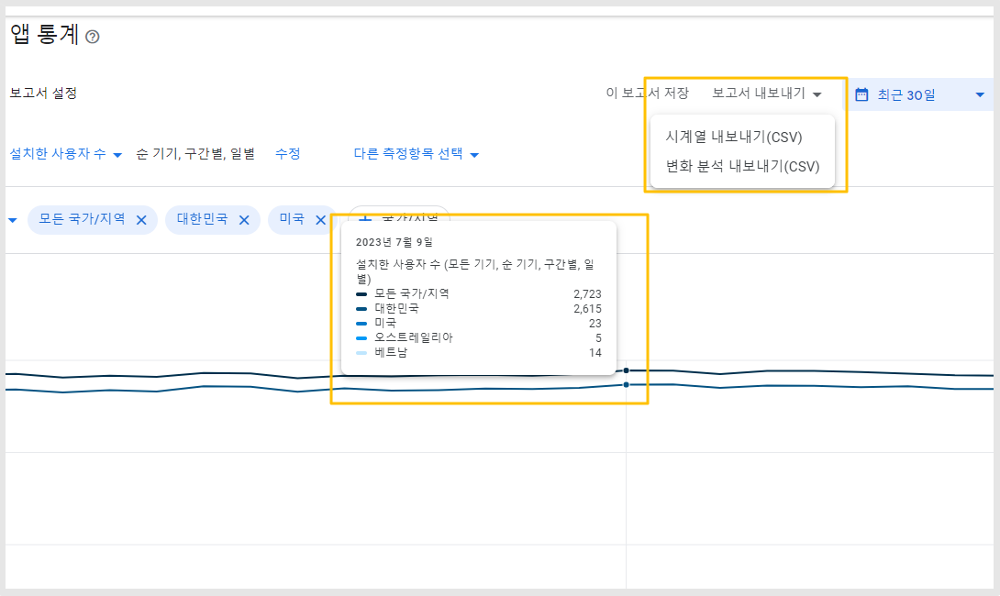
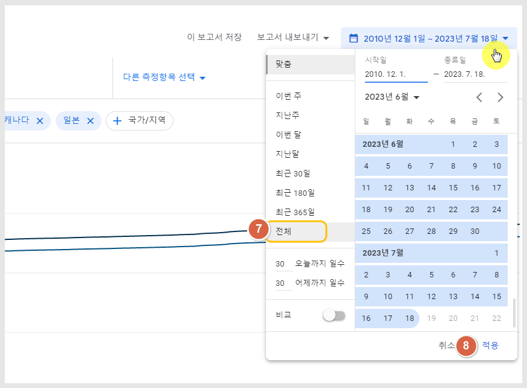
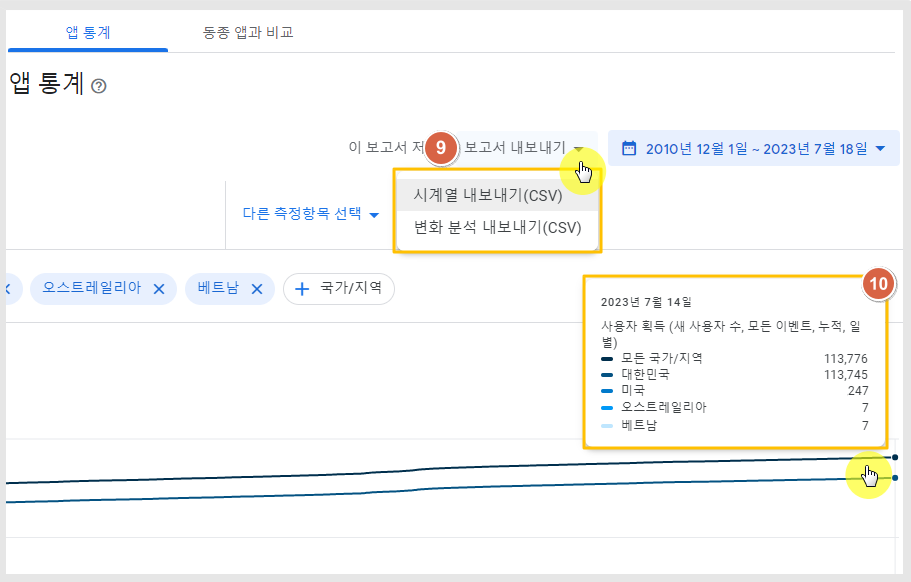

# 플레이스토어 앱 설치수 확인하기

**플레이스토어에 출시된 앱 설치수를 확인하는 방법**

사용자들이 앱을 얼마나 다운받았는지, 현재 사용 중 기기에 설치된 횟수, 앱 제거 수 등 다양한 항목들을 통계로 확인할 수 있어요.

\*애플 앱스토어 앱 설치수 확인은 아래 매뉴얼을 확인해주시기 바랍니다.



***

\
**1. 구글 플레이 콘솔 접속 후 앱 설치수 확인**
------------------------------



<figure><figcaption></figcaption></figure>

[구글 플레이 콘솔](https://play.google.com/console/u/0/developers/) 사이트 접속 후 대시보드에 보시면 앱 목록을 확인할 수 있구요.

앱이름 옆에 ‘설치된 사용자 수'로 30일 내 설치한 사용자 수를 간단하게 확인할 수 있어요.

실제 사용중인 기기를 집계한 수에요. (30일 동안 한번이라도 앱을 사용한 이력으로 집계)&#x20;

따라서 앱 다운로드수와는 차이가 있어요!!

사용자분들은 활성 설치 수를 확인하여 플레이스토어에 출시된 이후부터 지금까지 우리 앱을 설치한 수를 확인할 수 있습니다.

좀 더 자세한 통계는 아래에서 확인해주세요.

<figure><figcaption></figcaption></figure>

## **2.통계 대시보드 확인**

<figure><figcaption></figcaption></figure>

앱을 선택한 뒤 -  왼쪽 메뉴에서 '통계'를 선택해주세요.

해당 화면에서 앱 통계 상세한 보고서를 제공합니다.&#x20;

날짜는 상단의 기간 버튼을 선택해서 조회를 원하는 기간을 선택할 수 있습니다.

<figure><figcaption></figcaption></figure>

## **3. 앱 설치수는 어디서 어떻게 확인하나요?**

<figure><figcaption></figcaption></figure>

통계 대시보드에서 보고서 설정 아래에 순서대로 체크해주세요.

**1)설치한 사용자 수 탭**&#x20;

**2)기기 선택**

**3)기기 획득 선택**

**4)새 기기수 선택**

<figure><figcaption></figcaption></figure>

날짜는 설치수 확인이 필요한 날짜로 선택해서 보실 수 있습니다.&#x20;

<figure><figcaption></figcaption></figure>

통계 메뉴에서 날짜 선택 후 보고서 설정(사용자 획득) 선택시 그래프값이 표시되며,

보고서 내보내기 – 시계열 내보내기(CSV) 선택시 엑셀파일로 다운 받을 수 있어요.

**날짜별 설치수 외에 전체 기간 다운로드 수(누적 다운로드수)를 확인을 원하시면 아래 방법으로 확인 가능합니다.**

<figure><figcaption></figcaption></figure>

## **4.앱 전체 다운로드 수 확인(누적 설치 수)**

앱을 출시한 날 부터 현재까지 우리 앱을 설치받은 모든 앱 다운로드 수를 확인하고 싶다면,&#x20;

아래 방법으로 확인 가능합니다.

<figure><figcaption></figcaption></figure>

통계 대시보드에서 보고서 설정 아래 기기수를 탭해주세요.

1\)설치한 사용자 수 선택 2)기기 선택  3)기기 획득  4)새 기기 수 선택

<figure><figcaption></figcaption></figure>

4\)수정 버튼 선택

5\)이벤트/순 항목: "순 사용자" 선택

6\)측정항목 계산에서 "누적"으로 수정 선택해주세요.

7\)저장 버튼 선택합니다.&#x20;

<figure><figcaption></figcaption></figure>

대시보드 오른쪽 날짜를 탭해주세요.

7\)전체 선택

8\)적용 버튼을 선택합니다.


그런데 어떤 콘솔에서는 **"전체" 기간이 표시가 안되는 경우도 있습니다.**

**해당 케이스의 경우는 날짜를 선택하지 않아도 되구요. 누적으로 집계된 통계만 확인해주세요.**&#x20;

단, 최종 설치수에 약간의 오차는 발생될 수 있습니다.


<figure><figcaption></figcaption></figure>

결과는 보고서(엑셀파일)로 다운 받아 보거나, 아래 그래프에 마우스 커서를 가져다 대면 간편하게 확인이 가능해요.

9\)보고서 내보내기 선택: 시계열 내보내기

or

10\)그래프에서 직접 확인

보시는 것처럼 앱 출시부터 현재까지 앱을 설치한 전체 기간 다운로드 수를 확인할 수 있습니다.&#x20;

***

## **5.플레이스토어 앱 통계보기 정리**

**구글 플레이 콘솔 접속**&#x20;



1\)메인 화면의 \[설치한 사용자 수]  : 지금까지 실제로 사용자들이 앱을 이용하고 있는 수(최근 30일기준)

간단하게 볼 수 있는 통계지표 입니다.

2\)앱 선택 후- 대시보드의 통계에서 상세 내역을 확인할 수 있습니다.&#x20;

사용자 수, 기기수, 평점, 업데이트 수 등 원하는 항목을 선택해서 볼 수 있으며기간 역시 선택해서 원하는 기간 선택 or 전체 기간을 선택해서 확인할 수 있습니다.&#x20;

3\)보고서 내보내기 선택시 - 통계 내역을 엑셀파일로 다운 받아 확인 가능합니다.&#x20;

<mark style="color:blue;">**Q. 획득된 신규 사용자 수와 활성 설치수가 차이가 있는 이유는?**</mark>

-> 획득된 신규 사용자 수는 앱을 설치한 수만 집계를 한 것이구요.

활성 설치수는 지난 30일 기준으로 앱을 한번이라도 이용한 수가 집계가 된 것이기 때문에 실제 운영중인 앱수와 앱을 설치한 수는 당연히 차이가 날 수 밖에 없습니다.

획득된 신규 사용자 수가 훨씬 높고, 활성 설치수가 적은 이유는 앱을 설치한 뒤 제거하여 실제 앱을 이용하고 있지 않은 사용자들이 더 많다는 것을 의미합니다.

<mark style="color:blue;">**Q. 통계에서 사용자수와 기기수가 같은건가요?**</mark>&#x20;

->사용자 수 = Google 계정(사용자ID) 기준 → 사람 수

같은 사용자가 여러 기기에 앱을 설치해도 1명의 사용자로 집계됩니다.

\*기기 수 = 앱이 설치된 실제 물리적 기기(디바이스) → 설치된 기기 수

한 사용자가 여러 기기를 쓸 경우 기기 수가 사용자 수보다 많아질 수 있습니다.

Google Play 스토어에서 보이는 다운로드/설치 수(10만+, 50만+ 같은 범위) 는 기본적으로 사용자 기준으로 집계됩니다.


따라서 앱 다운로드 수(설치수)를 보고자 하신다면 사용자 수로 보시면 되겠습니다.&#x20;

