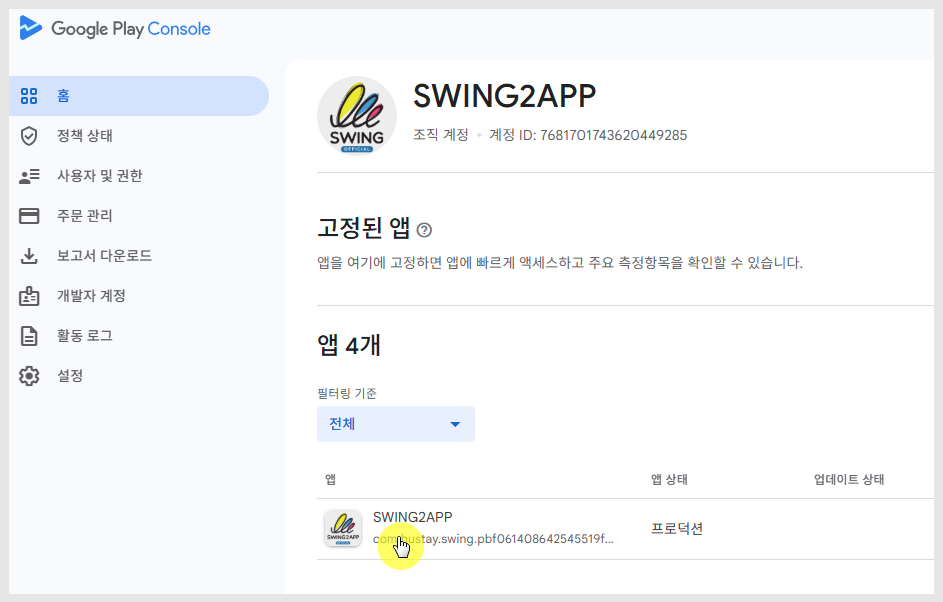
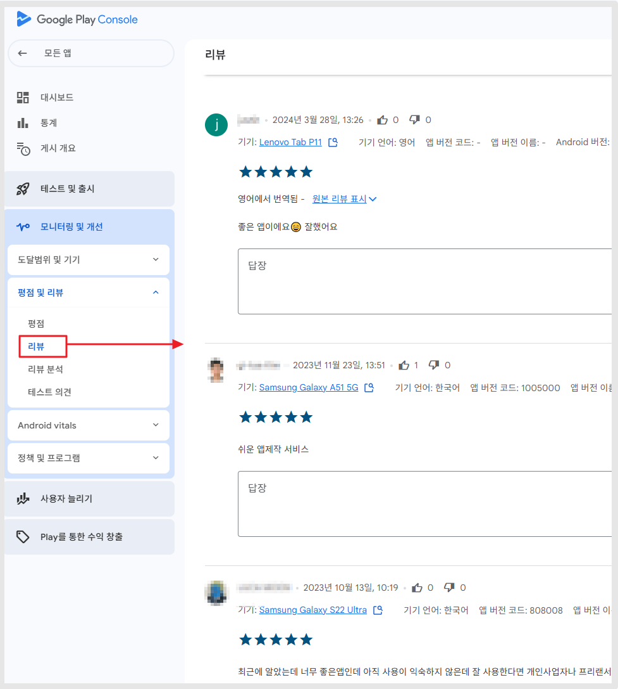
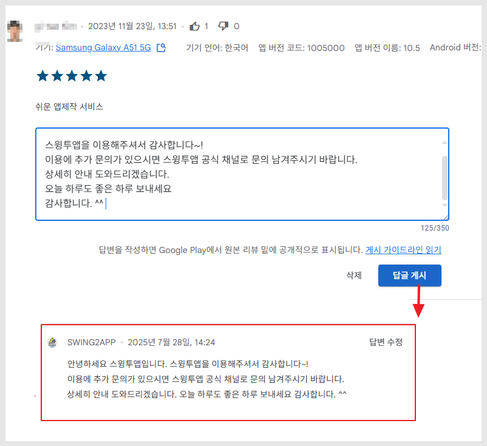
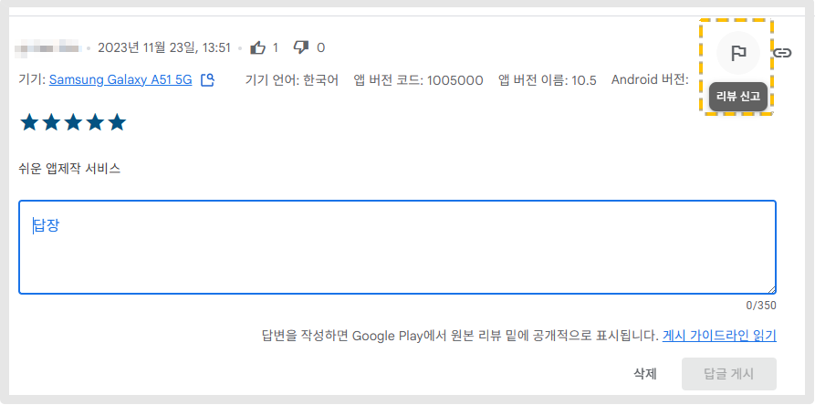

# 플레이스토어 앱 리뷰에 답글 달기

**플레이스토어 앱 리뷰에 답글을 입력하는 방법**

플레이스토어에 앱을 다운 받은 사용자가 리뷰를 달면, 개발자는 리뷰에 대한 답글을 어디서 작성해야 하는지 알고 계신가요?

-플레이스토어 앱에서는 리뷰에 대한 답글을 달 수 없구요.

– 구글 플레이 콘솔 사이트에서 구글 개발자 계정으로 로그인하여 리뷰를 확인하고 답글을 달 수 있습니다!!

스윙 도움말을 통해서 플레이스토어 앱 리뷰에 답글을 입력하는 방법을 확인해주세요.

***

## **1.구글 플레이 콘솔 접속**

**☞** [**구글 플레이 콘솔 사이트 이동**](https://play.google.com/console/developers)&#x20;

**\*\*리뷰는 플레이스토어 앱에서 확인이 가능하며, 리뷰에 대한 답글 작성은 구글 플레이 콘솔 사이트에서만 이용 가능합니다**

구글 개발자 콘솔사이트로 이동하여 구글개발자 계정으로 로그인 한 뒤, 리뷰 및 평점 확인이 필요한 앱을 선택합니다.

<figure><figcaption></figcaption></figure>

### <mark style="color:blue;">**1)평점 선택**</mark>&#x20;

왼쪽 카테고리에 \[평점 및 리뷰] 탭에서 **평점, 리뷰, 리뷰 분석, 테스트 의견 메뉴 확인할 수 있어요.**

"평점" 메뉴 선택

<figure><figcaption></figcaption></figure>

앱에 매겨진 별점을 종합적으로 확인할 수 있습니다.&#x20;

앱의 전체 평점 및 평점 통계 등을 확인할 수 있기 때문에 리뷰와 함께 많이 이용되는 메뉴에요.

### <mark style="color:blue;">**2)리뷰 선택**</mark>

<figure><figcaption></figcaption></figure>

아래 \[리뷰] 메뉴를 선택하면 리뷰 페이지로 이동합니다.

**\[리뷰] 메뉴를 선택해주세요.**&#x20;

리뷰 페이지에서는 앱에 달린 사용자들의 리뷰 목록을 모두 확인할 수 있습니다.&#x20;

<figure><figcaption></figcaption></figure>

댓글 밑에 있는 답장 입력란에 내용을 입력 한뒤 **\[답글 게시]**&#xBC84;튼을 선택하면 답글이 달리게 됩니다.

간단하죠?

이렇게 답글을 작성하면 플레이스토어 앱에서도 사용자 리뷰에 답글이 달리게 됩니다 \~!

***

## **2.리뷰에 광고나 스팸 글이 달린다면??**

<figure><figcaption></figcaption></figure>

리뷰 페이지에 보시면 각 리뷰 글마다 깃발 모양의 아이콘이 있어요.

**해당 아이콘이 \[신고] 버튼이구요.**&#x20;

**리뷰 신고 버튼을 통해서 리뷰를 신고하고 글을 삭제할 수 있습니다.**&#x20;

<mark style="color:red;">\*리뷰 신고를 한다고 리뷰가 바로 삭제되는 것이 아니며, 구글에서 정당한 내용인지를 확인하여 승인 후 처리를 해줍니다.</mark>

따라서 단순히 별점을 낮게 줬다는 이유로는 신고가 되지 않구요.

홍보글, 비방, 욕설 등의 내용이 있을 경우 승인을 하기 때문에 이점 유념해주세요.

***

## **3.플레이스토어 어플 실행(모바일)**

플레이스토어 어플을 실행하면 사용자 리뷰에 개발자 답글이 달린 것을 볼 수 있습니다.

***

이상으로 플레이스토어 앱 리뷰에 답글을 입력하는 방법을 알려드렸어요.

플레이스토어 개발자 분들은 각자의 플레이 콘솔 사이트에서 답글을 입력해주시기 바랍니다.
