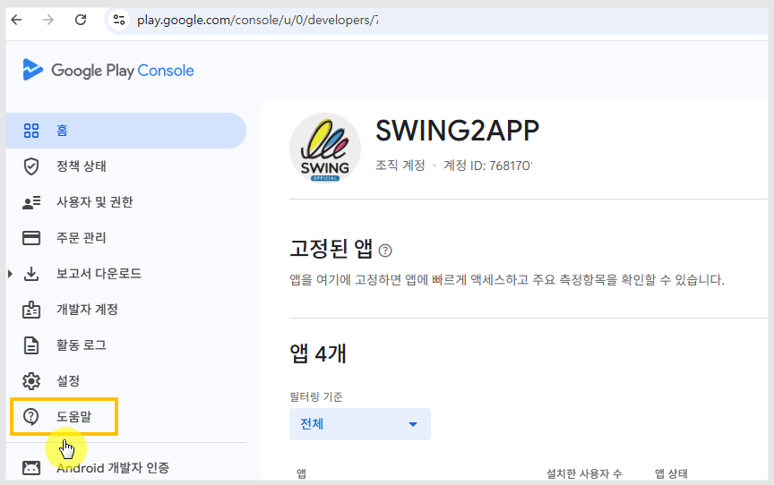
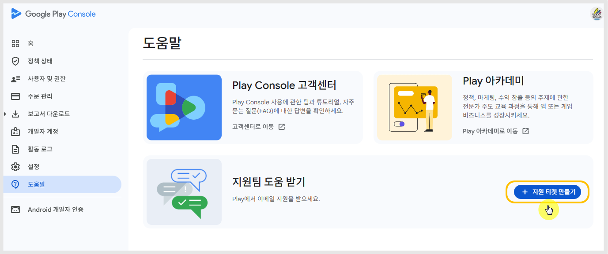
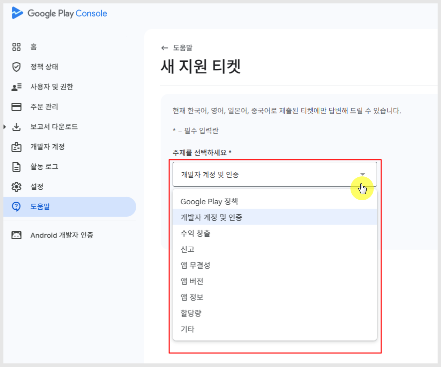
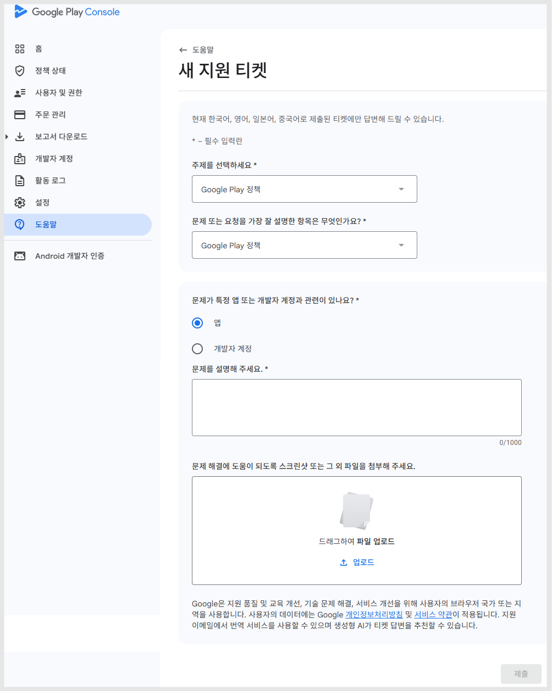
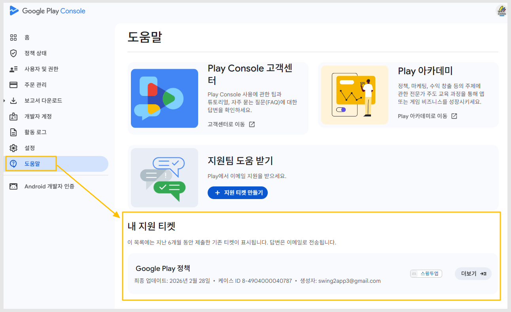

# 구글 플레이 개발자 고객센터 문의 방법 (Play Console 지원팀 연락)

***

구글 플레이 개발자 고객센터 - 지원팀 연락 방법 도움말 입니다.&#x20;

구글 플레이 개발자 분들은 이용에 참고해주세요.


### **📌중요 안내**

현재 플레이 콘솔 개발자 전용 채팅 상담은 더 이상 지원되지 않습니다.

구글 플레이 개발자 지원팀에 문의한 결과,

* 플레이 콘솔 개발자 전용 채팅 상담 종료
* 영어 및 해외 언어 채팅 상담도 지원하지 않음

따라서 현재는 채팅 상담이 불가능하며, 지원 티켓을 통해서만 문의가 가능합니다.


***

### **1️⃣구글 플레이 고객센터 문의 방법 (개발자)**

일반 사용자 고객센터와 달리 구글 플레이 개발자 고객센터는 Play Console에서 문의를 접수해야 합니다.

문의 방법은 다음과 같습니다.

1.구글 플레이 콘솔 접속(개발자 계정 로그인) [https://play.google.com/console/developers](https://play.google.com/console/developers)

대시보드 왼쪽 메뉴 "도움말" 선택

<figure><figcaption></figcaption></figure>

2.\[+지원 티켓 만들기] 선택

<figure><figcaption></figcaption></figure>

3.새 지원 티켓 화면에서 주제를 선택해서 내용을 제출합니다.

<figure><figcaption></figcaption></figure>

정책팀(지원팀)에 상담을 받을 알맞은 주제를 선택해주세요.

4.티켓 제출하기

<figure><figcaption></figcaption></figure>

주제, 항목 선택, 앱 선택, 문제 설명, 스크린샷 혹은 파일 첨부 후 제출해주시면 됩니다.

***

### **2️⃣제출한 문의 확인 방법**

<figure><figcaption></figcaption></figure>

다시 도움말로 들어가면 "내 지원 티켓" 항목이 있으며, 여기서 제출된 이의제기 내용을 확인할 수 있습니다.

***

### **3️⃣자주 묻는 질문 (FAQ)**



**Q.이의제기 한 답변은 메일로 오나요?**

답변은 메일로 전송됩니다.

이의제기 제출시 메일주소를 더 추가할 수 있어요.

다른 메일로도 함께 답변 받길 원하면 메일주소 추가 입력해주세요.

**Q. 구글 플레이 개발자 채팅 상담은 완전히 없어졌나요?**

네.현재 플레이 콘솔 개발자 지원팀 채팅 상담은 지원되지 않습니다.

따라서 문의가 필요한 경우 지원 티켓을 생성하여 문의해야 합니다.

**Q. 구글 플레이 지원팀 답변은 얼마나 걸리나요?**

일반적으로 7일 정도 소요됩니다.

다만 아래와 같은 경우 시간이 더 걸릴 수 있습니다.

* 정책 위반 관련 문의
* 계정 정지 관련 문의
* 앱 삭제 관련 문의

7일 이상 소요되면 다시 지원팀에 문의를 넣을 수 있습니다.

**Q. 지원 티켓을 제출했는데, 7일이 넘었는데 답변이 오지 않습니다.**

메일을 받지 못했다면, 지원팀에 다시 문의를 넣어주세요. = 추가 티켓 제출

이의제기를 한 지 7일이 지났으나 어떠한 답변을 받지 못했다는 내용으로 다시 문의 넣을 수 있습니다.

**Q. 앱 정책 위반 이의제기는 어디에서 제출하나요?**

앱 삭제나 정책 위반 이의제기도 안내드린 지원 티켓에서 제출해주세요.

**Q. 여러 개 앱이 있을 때 하나만 선택해서 문의할 수 있나요?**

네 가능합니다.

지원 티켓 작성 시 문제가 발생한 특정 앱을 선택하여 문의할 수 있습니다.

최근 구글 플레이 개발자 지원 정책이 변경되면서

기존 채팅 상담 방식이 종료되고 지원 티켓 방식으로 통합되었습니다.

플레이스토어 앱 운영 중 문제가 발생했다면

[Play Console](https://play.google.com/console/u/0/developers) → 도움말 → 지원 티켓 만들기

기능을 통해 구글 플레이 개발자 지원팀에 문의하시면 됩니다.


