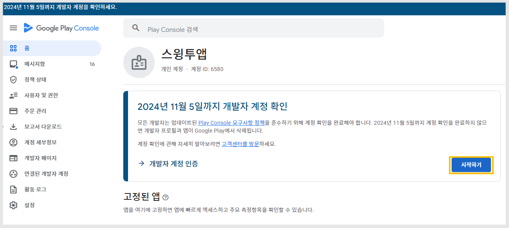
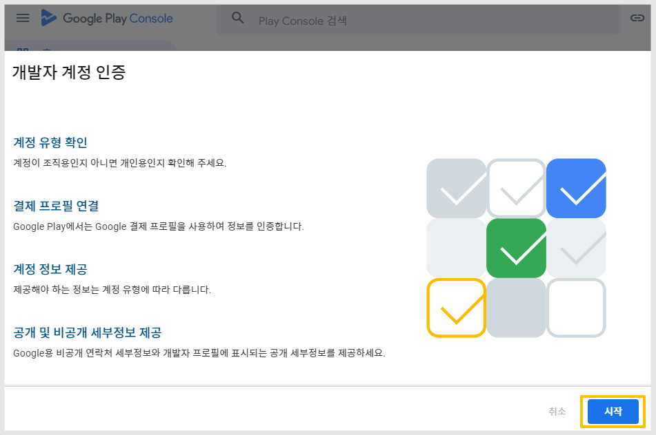
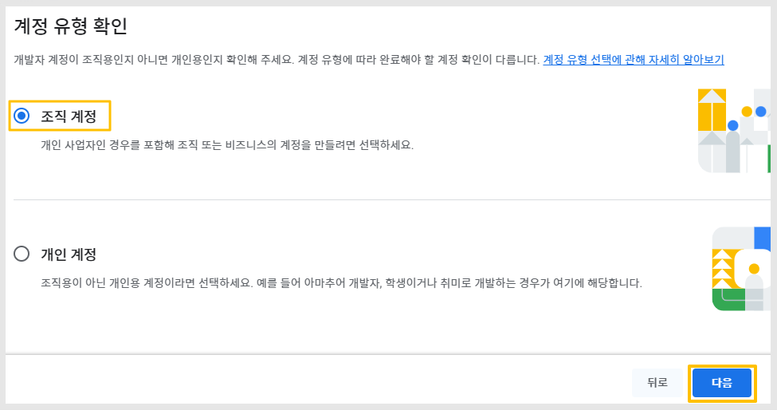
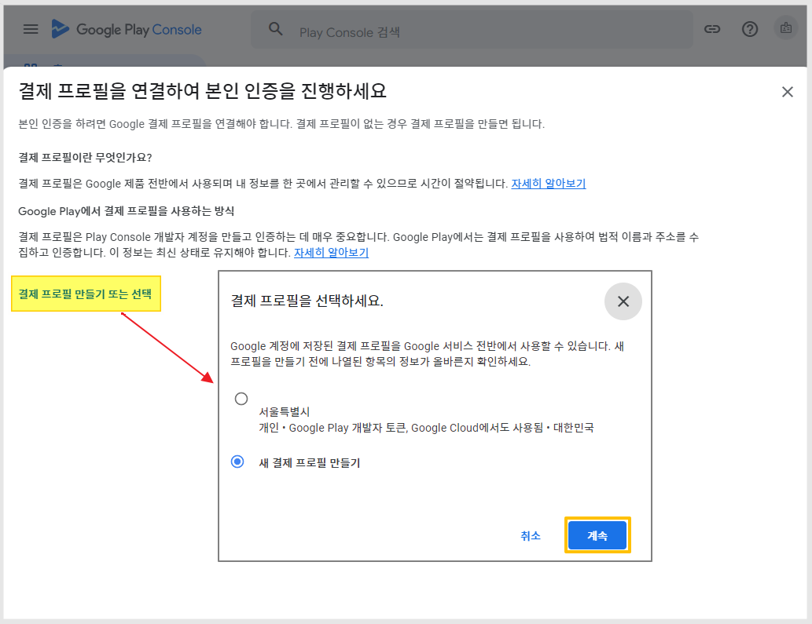
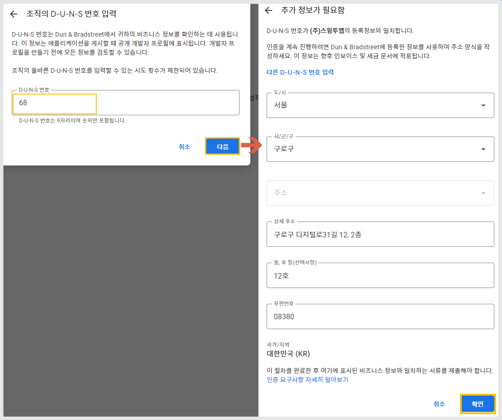
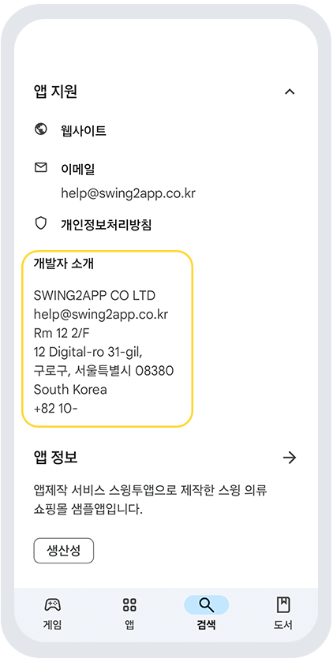
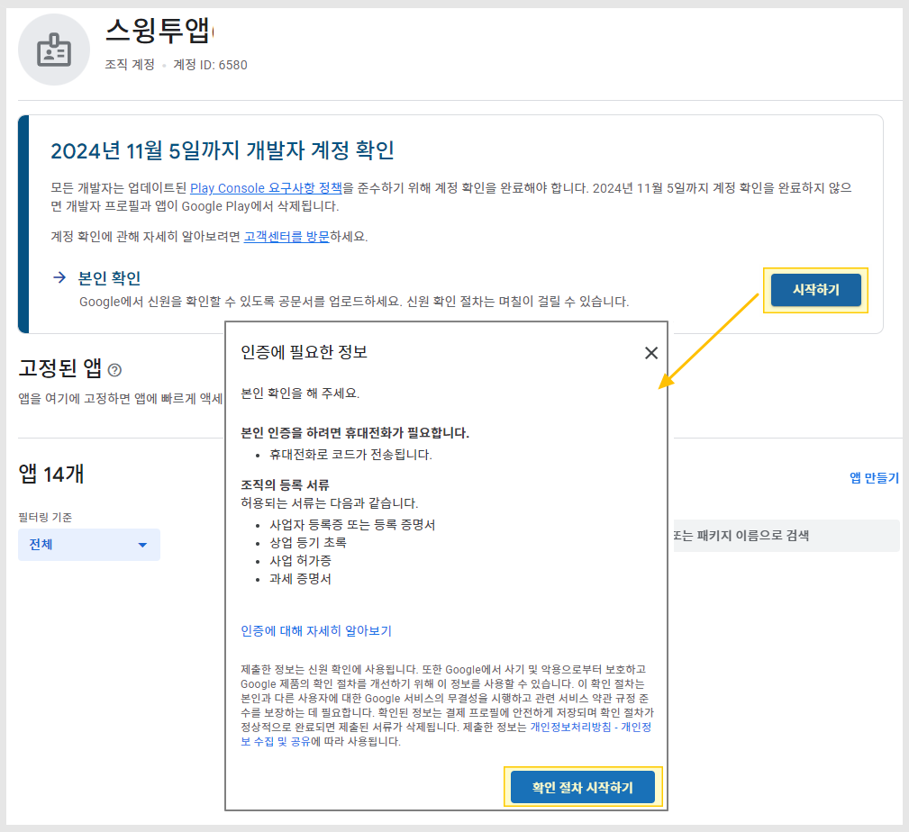
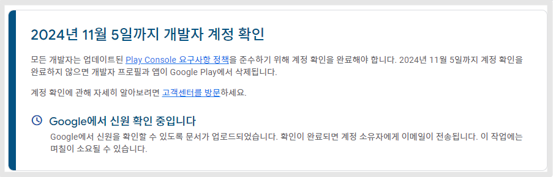
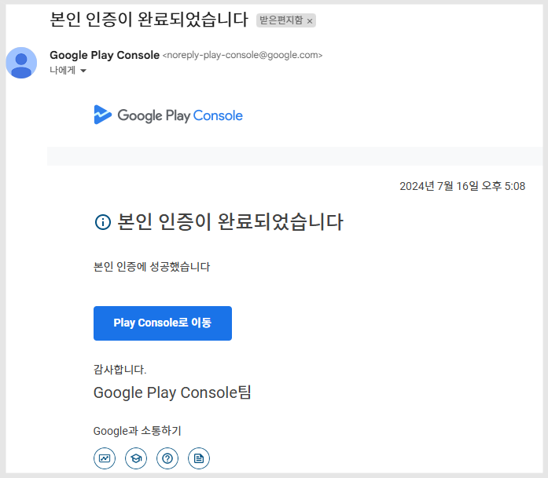

# 구글 개발자 계정 확인 기한 '조직' 계정 인증

***

구글 개발자 계정 확인 기한이 도래하면, 개발자는 구글의 요청대로 계정 인증을 완료해야 합니다.

해당 도움말은 개인 개발자 계정에서 인증을 하는 방법입니다.


#### 해당 케이스는 계정을 등록하여 사용하고 있는 분들 중, 계정 확인 기한을 선택하여 기한이 시작된 경우만 해당됩니다.

2024년 3월 이후에 계정을 생성하신 분들은 이미 계정 인증을 완료하여 가입을 했기 때문에 해당 되지 않구요.

24년 이전 오래 전 계정을 등록하신 분들만 해당 됩니다.


***

## 1.개발자 개인 계정 인증

구글 플레이 콘솔 접속

[https://play.google.com/console/developers](https://play.google.com/console/developers)

<figure><figcaption></figcaption></figure>

\[시작하기] 버튼 선택

<figure><figcaption></figcaption></figure>

개발자 계정 인증에 필요한 단계가 표시됩니다. , \[시작] 선택

<figure><figcaption></figcaption></figure>

계정 유형은 "조직 계정"을 선택해주세요. \[다음] 선택

<figure><figcaption></figcaption></figure>

결제 프로필 만들기 또는 선택

\*기존에 계정에 만들어놓은 결제프로필이 있다면 선택하면 되구요.

없을 경우는 "새 결제 프로필 만들기"를 선택해서 프로필을 등록해주세요.&#x20;

해당 매뉴얼에서는 결제프로필을 만들어서 등록하는 방법으로 알려드리겠습니다.&#x20;

<figure><figcaption></figcaption></figure>

만들어놓은 DUNS 번호를 입력해주세요. \[다음] 버튼 선택

추가정보: 주소와 우편번호 입력 후 \[확인] 선택

\*조직 개발자 계정 이용을 위해서는 DUNS 번호를 만들어주셔야 합니다.&#x20;

DUNS 번호 생성이 안되었다면 가이드를 보시고 만들어주세요



<figure><figcaption></figcaption></figure>

결제 프로필 생성이 완료되어, 계정에 추가되었다는 메시지가 뜹니다.

\[확인]버튼 선택해주세요.

<figure><figcaption></figcaption></figure>

입력된 정보 확인 후 \[다음]버튼 선택합니다

<figure><figcaption></figcaption></figure>

1\)조직 규모: 네모칸 화살표를 선택해서 맞는 유형을 선택해주세요.

2\)조직 전화번호: 회사 기본 연락처 기재해주세요. \*국가번호 포함 입력 예)+821012345678

(꼭 회사 번호가 아니더라도 관리자 개인 핸드폰번호 입력도 가능해요)

3\)조직 웹사이트: 회사에서 운영중인 웹사이트 URL을 입력해주세요.

사이트가 없으면 ‘웹사이트 없음’에 체크해주세요.


안내)

해당 정보는 개발자 프로그램 자격요건에 영향을 미치지 않습니다.

즉, 조직 규모가 작거나 웹사이트가 없더라도 개발자 계정을 만드는데는 아무 영향을 주지 않습니다.

구글에서 수집하는 세부정보일 뿐입니다.


<figure><figcaption></figcaption></figure>

1\)개발자 전화번호 입력 \*국가번호 포함 입력 예)+821012345678

\*기호, 국가코드, 지역번호 포함합니다.

입력한 번호로 인증번호가 전송됩니다. 인증까지 해야 번호 확인이 완료됩니다.

2\)개발자 이메일주소 입력

\*입력한 메일로 인증번호가 전송됩니다. 인증까지 해야 번호 확인이 완료됩니다.

3\)동의 체크

4\)다음 버튼 선택

**공개 개발자 프로필 검토**

<figure><figcaption></figcaption></figure>

계정 인증을 할 경우 이제 개발자 정보가 플레이스토어 앱 정보에 노출이 됩니다.&#x20;

개발자 이름, 이메일주소 등이 모두 노출되기 때문에 노출되는 담당자 정보를 확인 후 저장 버튼 선택해주세요.

개발자 정보 노출은 선택이 아닌 필수 입니다.&#x20;

<mark style="color:blue;">플레이스토어 어플)  개발자 소개 노출 화면 캡쳐</mark>

<figure><figcaption></figcaption></figure>

***

## 2.본인 확인 인증

이어서 본인 확인 인증을 진행해주셔야 합니다.

<figure><figcaption></figcaption></figure>

\*본인 인증에는&#x20;

<mark style="color:blue;">-휴대폰 본인 인증 (인증번호 전송)</mark>

<mark style="color:blue;">-조직 증명 서류(사업자등록증) 제출, 본인 인증을 위한 휴대전화 번호 제출, 주소 입력으로 정보를 제출합니다.</mark>

\[시작하기] 버튼 선택시, 인증에 필요한 정보가 뜹니다.

\[확인 절차 시작하기] 버튼을 선택합니다.

<figure><figcaption></figcaption></figure>

1\)\[업로드] 버튼을 선택해서 조직을 증명할 수 있는 서류를 제출합니다.

\*사업자등록증 , 상업 등기 초록, 사업 허가증, 과세 증명서 중에서 제출

2\)다음 버튼 선택

​

<figure><figcaption></figcaption></figure>

본인(개인) 신원 정보 입력

3\)이름 입력 \*대표자로 입력하지 않아도 됩니다. 계정을 등록하는 본인(직원) 개인 정보로 입력해주세요.

4\)주민번호 7자리 입력

5\)이동 통신사 선택

6\)연락처 :핸드폰 번호 입력

7\)\[다음] 선택

<figure><figcaption></figcaption></figure>

주소 입력 \*회사 주소 등록

8\)도/시 선택

9\)시/군/구 선택

10\)상세 주소 입력

11\)우편번호 입력

12\) \[제출] 확인

<figure><figcaption></figcaption></figure>

13\) 인증번호 6자리 코드 입력 후 \[확인] 선택

<figure><figcaption></figcaption></figure>

14\)확인 선택합니다.

***

## 3.인증 완료

모든 정보 제출이 완료되었구요. 구글에서 제출된 정보를 검토 한 뒤 승인을 하게 됩니다.

<figure><figcaption></figcaption></figure>

보통 2일 내에  처리가 되는데 승인이 되면 바로 이용 가능하며, 서류가 적합하지 않을 경우 승인을 거절합니다.

받은 메일을 확인해서 조치사항 확인 후 다시 요청정보를 제출해야 합니다.

**본인 인증 완료**

<figure><figcaption></figcaption></figure>

주말이나 공휴일이 껴있으면 조금 더 지연될 수 있어요.

금요일에 신청하였고, 주말 지난 뒤 월요일 본인 인증이 완료되었다는 메일을 받았습니다.&#x20;

본인 인증이 완료되면 이제 콘솔에서는 인증 관련 메시지가 사라지고 정책상 문제없이 계정 이용이 가능합니다


기한 내에 계정 인증을 하지 않으면 어떻게 되나요?

개발자 계정 및 계정에 등록된 앱이 모두 삭제됩니다.&#x20;

삭제가 되면 구글 측에 이의제기를 할 수 있으나, 이의제기 승인 여부 확답이 어렵고 소통도 굉장히 오래 걸립니다.

따라서 불이익을 받지 않도록 구글 개발자 계정 사용자분들은 기한 내 계정 인증을 꼭 완료해주세요.&#x20;


