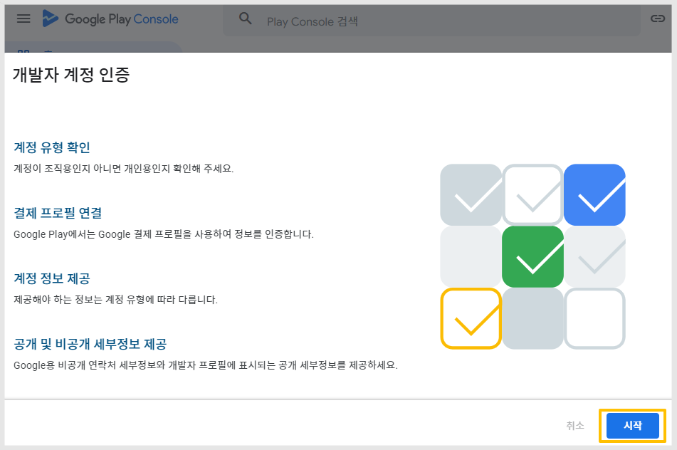

# 구글 개발자 계정 확인 기한 '개인' 계정 인증

***

구글 개발자 계정 확인 기한이 도래하면, 개발자는 구글의 요청대로 계정 인증을 완료해야 합니다.

해당 도움말은 개인 개발자 계정에서 인증을 하는 방법입니다.


#### 해당 케이스는 계정을 등록하여 사용하고 있는 분들 중, 계정 확인 기한을 선택하여 기한이 시작된 경우만 해당됩니다.

2024년 3월 이후에 계정을 생성하신 분들은 이미 계정 인증을 완료하여 가입을 했기 때문에 해당 되지 않구요.

24년 이전 오래 전 계정을 등록하신 분들만 해당 됩니다.


***

## 1.개발자 개인 계정 인증

구글 플레이 콘솔 접속

[https://play.google.com/console/developers](https://play.google.com/console/developers)

<figure><figcaption></figcaption></figure>

개발자 계정 인증 메시지를 확인할 수 있습니다.

\[시작하기] 버튼을 선택해주세요.

<figure><figcaption></figcaption></figure>

개발자 계정 인증에 필요한 단계가 표시됩니다.  \[시작] 선택

<figure><figcaption></figcaption></figure>

**계정 유형 : 개인 계정 선택** , 다음 선택

<figure><figcaption></figcaption></figure>

결제프로필 만들기 또는 선택

\*기존에 계정에 만들어놓은 결제프로필이 있다면 선택해주세요.

\*만들어놓은 계정이 없다면 새 결제 프로필 만들기를 선택해서 만들어주세요.

선택 후 - 계속 선택

<figure><figcaption></figcaption></figure>

결제프로필 확인 후 \[다음] 선택&#x20;

<figure><figcaption></figcaption></figure>

웹사이트 입력

웹사이트가 있을 경우 URL 링크를 입력해주시고, 없을 경우 운영하는 웹사이트가 없음에 체크해주세요.

개인은 웹사이트를 등록하지 않아도 괜찮습니다. \[다음] 선택

<figure><figcaption></figcaption></figure>

연락처 세부정보

1\)담당자 이름 입력

2\)연락처 이메일주소 입력 후 주소 인증을 선택해서 인증번호 입력해주세요.

3\)선호 언어 선택

4\)연락처(전화번호): 핸드폰번호 입력 후 전화번호 확인을 선택해서 인증번호 입력 해주세요

5\)연락처 입력 예시) +821012345678 &#x20;

\[다음] 선택

<figure><figcaption></figcaption></figure>

**공개 개발자 프로필 검토**

계정 인증을 할 경우 이제 개발자 정보가 플레이스토어 앱 정보에 노출이 됩니다.&#x20;

개발자 이름, 이메일주소 등이 모두 노출되기 때문에 노출되는 담당자 정보를 확인 후 저장 버튼 선택해주세요.

개발자 정보 노출은 선택이 아닌 필수 입니다.&#x20;

<mark style="color:blue;">플레이스토어 어플)  개발자 소개 노출 화면 캡쳐</mark>

<figure><figcaption></figcaption></figure>

***

## 2.본인 인증 확인

이어서 본인 인증을 진행해주셔야 합니다.

핸드폰 번호로 인증번호를 받은 뒤, 계정에 등록된 주소와 이름이 동일한지를 확인하기 위해 서류를 제출합니다.&#x20;

<figure><figcaption></figcaption></figure>

동의에 체크한 뒤 \[확인 절차 시작하기] 선택해주세요.   \

<figure><figcaption></figcaption></figure>

(1)법적이름 입력 \*실제 계정 소유자 분의 이름을 입력해주세요

(2)주민번호 앞 7자리 입력

(3)다음 버튼 선택

#### 2)주소 입력 

<figure><figcaption></figcaption></figure>

(4)도/시 선택

(5)시/군/구 선택

(6)상세주소: 나머지 주소를 입력합니다.

(7)우편번호 입력

(8)\[업로드] 선택하여, 위의 안내된 서류 중 하나를 등록 제출해주세요.


\*중요\*

구글에서 제시하는 허용되는 서류 내에서만 제출해야 합니다.

주민등록증, 여권, 운전면허증 등의 서류는 허용하지 않습니다.

이름과 주소지가 나오는 명세서 등의 서류를 준비하여 제출해주세요.

이 서류를 제출해야 하기 때문에 계정을 만들때 실제 본인이 거주하는 주소지로 입력해주셔야 합니다


(9)다음 선택

<figure><figcaption></figcaption></figure>

(10)확인 선택

#### 3)전화번호 입력하기 

<figure><figcaption></figcaption></figure>

(11)이동통신사 선택, 연락처 입력 대한민국이라면 +821011112222 번호로 입력해주세요.

(12)제출 선택

<figure><figcaption></figcaption></figure>

13\) 핸드폰 문자로 코드 번호가 전송되면 번호입력 후 \[확인] 버튼을 선택해주세요.

<figure><figcaption></figcaption></figure>

(14) 확인 선택합니다.

모든 정보 제출이 완료되었구요. 구글에서 제출된 정보를 검토 한 뒤 승인을 하게 됩니다.

***

## 3.본인인증 완료&#x20;

<figure><figcaption></figcaption></figure>

인증이 모두 완료되면, 신원 확인 중이라는 메시지가 뜹니다.&#x20;

**본인 인증 완료**&#x20;

<figure><figcaption></figcaption></figure>

인증에 문제가 없으면 1\~2일 후 완료 메일이 전송됩니다. 해당 계정 테스트에서도 1일 뒤 메일을 받았습니다.

본인 인증이 완료되면 이제 콘솔에서는 인증 관련 메시지가 사라지고 정책상 문제없이 계정 이용이 가능합니다.


기한 내에 계정 인증을 하지 않으면 어떻게 되나요?

개발자 계정 및 계정에 등록된 앱이 모두 삭제됩니다.&#x20;

삭제가 되면 구글 측에 이의제기를 할 수 있으나, 이의제기 승인 여부 확답이 어렵고 소통도 굉장히 오래 걸립니다.

따라서 불이익을 받지 않도록 구글 개발자 계정 사용자분들은 기한 내 계정 인증을 꼭 완료해주세요.&#x20;


