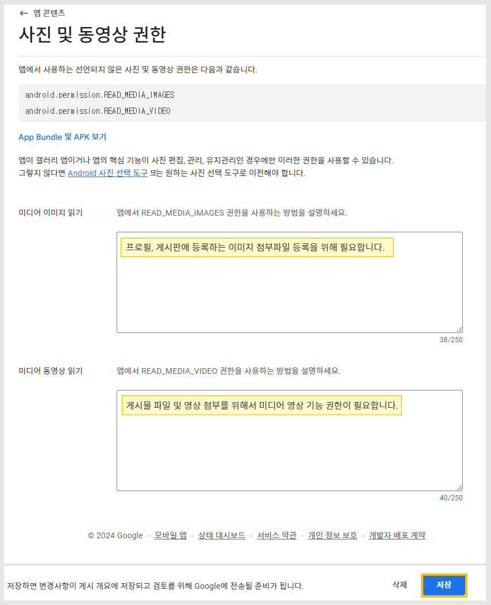

# 플레이스토어 앱 등록 매뉴얼

<figure><figcaption></figcaption></figure>

**구글 플레이스토어에 앱 출시하기**&#x20;

<mark style="color:red;">플레이스토어 앱 등록을 위해서는, 먼저 구글 개발자 계정을 만들어주셔야 합니다.</mark>

**구글 개발자 콘솔사이트:** [**https://play.google.com/console/developers**](https://play.google.com/console/developers)

해당 사이트에서 계정을 등록한 뒤, 이용료 25$ 를 결제해주세요.(한번 결제시 평생 이용)

결제가 완료 된 후 구글플레이스토어 개발자 콘솔 화면으로 들어와서 어플리케이션을 추가하시면 됩니다.

\*일반 구글 메일 계정이 있다고 해서, 해당 계정이 구글 개발자 계정이 되는 것이 아닙니다.

&#x20;구글 콘솔에서 25달러 등록 수수료를 결제한 계정이 개발자 계정이 됩니다.

구글 개발자계정 등록방법은 도움말 매뉴얼을 참고해주세요.

 [**구글 개발자 계정 등록방법 매뉴얼 보러가기**](google-developer.md)

플레이스토어 출시는 스윙투앱 유료버전앱만 가능합니다.

<mark style="color:red;">**\*무료앱은 스토어 출시가 불가합니다. 유료앱이용권 구매 후 출시 가능!**</mark>

<figure><figcaption></figcaption></figure>

## <mark style="color:blue;">**구글 플레이 콘솔 접속**</mark>&#x20;

&#x20;[https://play.google.com/console/developers](https://play.google.com/console/developers)

<mark style="color:blue;">**\[앱 만들기]**</mark> 버튼을 선택합니다.

1\)앱이름 (플레이스토어 출시되는 이름)

2\)기본언어: 한국어 선택 (특정 국가에 배포되어야 한다면 해당 언어로 선택합니다. 예)미국)

3\)앱 또는 게임 선택: 앱으로 선택해주세요.

4\)유료 또는 무료 선택 (앱을 유료로 판매할 경우 ‘유료’ 선택, 무료 선택시 이후에 유료로 변경할 수 없습니다)

5\)개발자 프로그램 정책 체크

6\)미국 수출법규 체크

7\)\[앱 만들기] 버튼 선택합니다.

<figure><figcaption></figcaption></figure>

## **STEP1. 대시보드: 앱 설정**

대시보드 선택 – \[앱 설정] 메뉴를 보시면 입력해야 할 정보가 단계별 메뉴가 순서대로 기재되어 있어요.

하나씩 선택해서 입력을 완료해주시면 됩니다.

**​**

### <mark style="color:blue;">**1.개인정보처리방침 설정**</mark>

앱에 제공하는 개인정보처리방침 링크를 입력합니다.

웹사이트를 걸어서 제작한 웹앱(웹뷰, 푸시)은 해당 사이트에서 제공하는 개인정보처리방침 링크를 입력해주시구요.

스윙투앱 일반프로토타입(슬라이드,푸터, 탑 등)으로 제작한 분들은 스윙투앱에서 제공하는 이용약관 URL을 입력할 수 있습니다.

**스윙투앱 사이트의** [**\[서비스이용약관\]**](http://www.swing2app.co.kr/view/app\_setting)**을 수정하여 해당 링크를 넣어주세요**&#x20;

(스윙투앱으로 제작한 앱에서만 적용 가능합니다)

<mark style="color:red;">**★ 중요**</mark>

**개인정보 처리방침 URL 항목은 해당 매뉴얼을 꼭!! 참고해주세요**

☞[ 플레이스토어 개인정보처리방침 URL을 넣는 방법 보러가기](playstore-policyurl.md)

### <mark style="color:blue;">**2.앱 액세스 권한**</mark>

\-앱 내에 로그인 기능이 없다면(회원가입 포함) **“특수한 액세스 권한 없이 모든 기능 이용 가능”**에 체크하면 완료!

\-앱 내에 회원가입, 로그인 메뉴가 있다면 **“전체 또는 일부 기능이 제한됨”으로 체크한 뒤, \[+새 안내 추가]**를 선택합니다.

<mark style="color:green;">\*\*웹사이트를 연결한 웹앱 – 푸시앱, 웹뷰앱 역시 해당 웹사이트에서 로그인 기능을 제공하고 있다면 동일하게 “전체 또는 일부 기능이 제한됨” 체크해주세요.</mark>

전체 또는 일부 기능이 제한됨”으로 체크할 경우 아래 경로를 확인해주세요

**\[ + 새 안내 추가] 선택시 로그인 정보 입력창이 뜹니다.**

해당 정보는 모두 앱에서 로그인 가능한 정보를 입력해주세요\~!

1\)이름: 구글에서 제시한 시나리오 “대한민국 사용자 대상” 이라고 입력해주세요.

단, 영문 앱이나 다른나라를 대상으로 한다면 해당 국가에 맞게 수정해서 입력합니다.

2\)사용자 이름/ 전화번호: 제출하는 계정의 사용자 이름과 전화번호를 입력합니다.

전화번호는 로그인(회원가입)에 필요한 정보가 아니라면 입력할 필요 없습니다.

3\)비밀번호: 로그인에 필요한 계정 -비밀번호를 입력합니다.

4\)다른 안내: 로그인에 필요한 정보를 입력해주세요.

예시) 아이디, 비밀번호 입력

입력 후 \[저장] 버튼을 누르면 완료됩니다.

​

### <mark style="color:blue;">**3.광고**</mark>

앱 내에 광고가 있다면 “예, 앱에 광고가 있습니다” 체크

광고가 없다면 ” 아니요, 앱에 광고가 없습니다” 체크 후 저장

​

### <mark style="color:blue;">**4.콘텐츠 등급**</mark>

\[콘텐츠 등급] 선택

**1) 이메일주소, 2)카테고리를 선택해주세요.**

일반적으로 3번째 “다른 모든 앱 유형”을 선택해주시면 됩니다.&#x20;

앱이 커뮤니티 앱이라면 2번째 “소셜 또는 커뮤니케이션”을 선택합니다.

**3)\[다음] 버튼을 선택합니다.**

해당 카테고리에 맞는 설문지 입력 항목이 생성됩니다.

**4)설문지 질문을 확인하여 예, 아니요에 체크한 뒤**&#x20;

**5)\[저장] 및 \[다음] 버튼을 선택합니다.**

\*설문지 질문은 앱에서 제공하고 있는 내용을 그대로 반영해주셔야 합니다.

예시) 앱에서 성적인 소재 노출이 있을 경우 “예” 체크, 술이나 약물 컨텐츠 포함되어 있을 경우”예” 체크 해야 합니다.

웹앱(푸시, 웹뷰앱)은 웹브라우저 검색 앱에 “예”로 체크해주세요. 일반 프로토타입 앱은 “아니요”에 체크해주세요.

**6)\[제출]** 버튼을 선택해주세요.

설문지를 완료하면 내 앱에 맞는 등급이 산출됩니다.

### <mark style="color:blue;">**5.타겟층 및 콘텐츠**</mark>

앱 대상 연령을 체크해주세요.

일반적으로 “만18세 이상”으로 체크해주시면됩니다.

\*주의\* 앱 연령을 13세 이하로 선택할 경우 어린이 보호 정책에 따라 가족정책 문서를 추가 제출해야 해요.

따라서 특별한 경우를 제외하고는 앱 연령은 만 18세 이상으로 체크한 뒤 \[다음] 버튼 선택해주세요.

<figure><figcaption></figcaption></figure>

어린이 관심을 유도함 질문에는 “아니요” 에 체크한 뒤 \[다음] 버튼을 선택합니다.

만약 제출하고자 하는 앱이 어린이의 관심을 유도할 만한 컨텐츠가 있거나 좀 헷갈린다 싶으시면 “예”에 체크해주셔야 합니다.

**​**

\[저장] 완료

### <mark style="color:blue;">**6.뉴스 앱**</mark>

**뉴스앱은 제출하는 앱이 뉴스앱인지 체크하는 항목이에요.**

\[시작] 버튼을 눌러주세요.

제출하는 앱이 뉴스앱이 아니면 “아니요”에 체크하고, 저장 버튼을 눌러주세요.

**제출하는 앱이 뉴스앱이라면 “예”에 체크하고 뉴스앱을 증명하는 내용을 작성해야 하는데요.**

사업자등록증, 웹도메인등록확인서를 사전고지 증빙서류로 제출하겠다고 입력하시면 됩니다.

\*구글 플레이스토어 사전고지 문서 제출방법은 아래 링크로 확인해주세요!

**☞** [**구글 플레이 사전고지 문서 제출방법 보러가기**](playstore-priornotice.md)

### <mark style="color:blue;">**7.코로나 관련 앱 체크(21.08.16 추가메뉴)**</mark>

코로나19 접촉자 추적 앱 검사 결과 공유앱 항목이 추가 되었습니다.

제출하고자 하는 앱이 코로나 관련 앱인지 체크하는 항목이구요.

**“공개된 코로나19 접촉자 추적 앱 또는 이력 앱이 아님”**에 체크하고 \[저장] 버튼을 선택합니다.

<mark style="color:red;">\*코로나 관련 앱은 구글 정책상 출시가 불가합니다.\_보건복지부, 질병예방본부와 같은 인증받은 국가기관에서만 본 앱을 출시할 수 있습니다.</mark>

### <mark style="color:blue;">**8.데이터 보안 (21.11 추가 메뉴)**</mark>

데이터 보안은 앱에서 어떤 데이터를 수집 및 공유하는지, 사용자 데이터 유형이 무엇인지 항목을 제출하는 메뉴입니다.

예시) 개인정보: 이름, 연락처, 주소, 생년월일 / 위치 정보/ 금융정보 수집 등 앱 마다 수집하는 데이터 항목을 체크

따라서 앱에서 제공하는 사용자의 데이터 수집 정보를 플레이스토어에 모두 제출하여 심사시 문제가 없도록 해야 합니다.

해당 항목 매뉴얼은 내용이 많아 별도 매뉴얼로 준비했습니다.&#x20;

데이터 보안 정책 입력 방법은 아래 매뉴얼로 확인해주세요.&#x20;



### <mark style="color:blue;">**9.정부앱 체크 (22.12 추가 메뉴)**</mark>

<figure><figcaption></figcaption></figure>

제출하는 앱이 정부에서 개발했거나, 정부에서 대신하여 개발한 앱인지를 체크하는 항목입니다.

“아니요”로 체크하고, \[저장] 버튼을 선택합니다.

만약 정부와 관련된 앱이라면 “예”에 체크합니다.

<figure><figcaption></figcaption></figure>

“예” 체크시 어떤 정부 기관인지 체크하게 됩니다.

그리고 증빙할 수 있는 서류를 반드시 함께 제출해주셔야 합니다.

### <mark style="color:blue;">**10.금융기능 (23.08 추가)**</mark>

<figure><figcaption></figcaption></figure>

앱에서 제공하는 금융 기능을 선택하는 콘텐츠 항목입니다.&#x20;

\[시작] 버튼을 선택합니다.

<figure><figcaption></figcaption></figure>

"앱에서 금융 기능을 제공하지 않음"에 체크해주세요. (화면 가장 아래로 스크롤 하시면 있습니다)

\[다음] 버튼을 선택합니다.


앱에 금융 기능이 제공될 경우, 제공되는 기능에 맞게 체크해주셔야 합니다.

예를 들어 비트코인(암호화폐) 관련 앱이면, 해당 항목에 체크해주시구요.

앱에서모바일 결제를 진행하거나, 이체 서비스를 제공한다면 동일하게 모두 체크해주셔야 합니다.

이러한 금융 기능이 없는 앱만 "앱에서 금융 기능을 제공하지 않음"에 체크해주시면 됩니다.&#x20;


### <mark style="color:blue;">**11.**</mark><mark style="color:blue;">Photo and video permissions</mark> <mark style="color:blue;"></mark><mark style="color:blue;">**(24.09 추가)**</mark>

앱 컨텐츠 - 사진 및 영상 권한 선언 제출

앱에서 사진(이미지) 영상 기능 권한이 필요한 이유를 제출하는 것입니다.

<figure><figcaption></figcaption></figure>

1\)\[선언 시작] 선택

<figure><figcaption></figcaption></figure>

2\)미디어 이미지 읽기: 앱에서 미디어 이미지 권한을 사용하는 방법을 설명하세요.

<mark style="background-color:yellow;">**“프로필 사진, 게시판에 등록하는 이미지 첨부파일 등록을 위해 필요합니다.”**</mark> 내용으로 입력합니다.

3\)미디어 동영상 읽기: 앱에서 미디어 비디오 권한을 사용하는 방법을 설명하세요.

<mark style="background-color:yellow;">**“게시물 파일 및 영상 등록을 위해서 미디어 영상 접근 권한이 필요합니다.”**</mark> 내용으로 입력합니다.

4\)입력이 완료되면 \[저장] 선택합니다.

### <mark style="color:blue;">**앱 콘텐츠 입력 완료!**</mark>

앱 콘텐츠 항목이 모두 초록색 불이 들어오고 상단에 ‘완료됨’으로 표시되면 완료된 것입니다.

<mark style="color:purple;">**——대시보드로 이동해주세요.**</mark>

단계별 입력이 완료되면, 완료로 체크됩니다.

<figure><figcaption></figcaption></figure>

##  STEP2. 스토어 설정 단계

**앱 콘텐츠 단계 입력이 끝났으면, 왼쪽 메뉴의 앱정보 – 스토어 설정으로 이동합니다.**

### <mark style="color:blue;">**1.앱 카테고리 선택 및 연락처 세부정보 제공**</mark>

1\)앱 선택

2\)카테고리 선택

3\)이메일 주소 입력

4\)외부마케팅 여부 체크

5\)\[저장] 버튼을 선택합니다.

<mark style="color:red;">\* 필수 입력 항목이며, 그외 항목 입력은 선택사항입니다.</mark>

앱 카테고리 선택 및 연락처 세부정보 제공 입력도 완료되었구요.

**다음은 \[스토어 등록정보 설정]을 선택해주세요.**

### <mark style="color:blue;">**2.기본 스토어 등록정보 설정**</mark>

1\) 앱 이름 입력 (플레이스토어에 표시되는 앱 이름)

2\) 간단한 설명 (앱소개 내용으로 80자 이내로 작성)

<mark style="color:red;">\*주의: 단어 반복, 키워드 형식 나열은 안되요. 예시) 강아지, 개, 고양이, 애완견, 애완묘… # 해시태그 입력 금지</mark>

3\) 자세한 설명 (앱소개 내용으로 보다 상세히 기재하며 4000자 이내로 작성)

<mark style="color:red;">\*주의: 단어 반복, 키워드 형식 나열은 안되요. 예시) 강아지, 개, 고양이, 애완견, 애완묘… # 해시태그 입력 금지</mark>

​

4\) 앱 아이콘 이미지 등록 (플레이스토어에 표시되는 앱 아이콘 이미지, 512px\*512px )

5\)그래픽 이미지 (출시된 앱을 공유했을 때 표시되는 섬네일 이미지 1024px\*500px)

\*그래픽 이미지는 어떻게 보여지나요?

 **그래픽 이미지의 용도?**

<figure><figcaption></figcaption></figure>

**그래픽이미지 노출 위치: 플레이스토어 스크린샷 이미지 앞에 미리보기 동영상 표지 이미지로 사용 및 노출이 됩니다.**

프로모션 동영상 URL을 제출하였을 경우 맨 앞에 영상이 보여지는데, 그래픽 이미지가 영상의 표지 이미지로 사용이 됩니다.

그리고 게임 앱의 경우 미리보기 동영상 및 스크린샷을 포함하여 추천 게임 그룹을 크게 표시할 때 그래픽 이미지를 사용합니다.

프로모션 동영상 URL을 제출하지 않을 경우 표시될 영상이 없기 때문에 그래픽 이미지는 어디서도 노출이 되지 않습니다.

**6,7,8) 스크린샷 이미지 등록**

6,7,8 항목 모두 스크린샷 이미지를 등록하는 항목이에요. 동일한 이미지로 등록해주시면 됩니다.

<mark style="color:red;">\*스크린샷은 앱 실행화면을 캡쳐한 이미지로 등록애주셔야 합니다. 앱과 관계 없는 이미지는 안되요\~!</mark>

이미지 사이즈는 가로 기준 최소 320px\~최대 3840px 사이로 제작해주셔야 합니다.

가로 세로 비율은 16:9 입니다. (가로모드 스크린샷 적용시)

9\) **\[저장]** 버튼을 누르면 스토어 정보 입력이 완료됩니다.

**플레이스토어에 입력해야 하는 내용은 모두 완료되었구요.**

**마지막으로 앱(APK파일)을 업로드해주시면 됩니다.**

<figure><figcaption></figcaption></figure>

## STEP3. 프로덕션 – 앱 등록하기

**— 다시 대시보드로 이동해주시구요. 구글플레이에 앱 게시를 선택합니다.**

### <mark style="color:blue;">**1.국가/지역 선택**</mark>

파란색 글자로 된 <mark style="color:blue;">**국가/지역 추가**</mark> 를 선택합니다.

어떤 국가에 출시를 할지 선택을 하는데요. 전체 국가를 선택해주시면 되구요.

만약 특정 국가에만 출시한다면 해당 국가를 검색해서 선택해주세요.

<mark style="color:blue;">**\[국가/지역 추가]**</mark> 버튼을 선택해주세요.

### <mark style="color:blue;">**2.프로덕션 – AAB파일 등록**</mark>

다음으로 프로덕션 화면에서 \[출시] 를 선택합니다.

<mark style="color:blue;">**\[새 버전 만들기]**</mark> 버튼을 선택합니다.

\*상단의 \[새 버전 만들기] 버튼을 선택해도 되구요. 본문 가운데 있는 버튼을 선택해도 상관없습니다.

<figure><figcaption></figcaption></figure>

App Bundle \[서명 키 선택] → \[Google에서 생성한 키 사용]에 체크합니다.

\*반영 시간이 소요될 수 있으니 조금만 기다려주세요. 기다리면 App Bundle 업로드 창이 활성화 됩니다.



업로드 버튼을 선택한 뒤, 스윙투앱에서 제작완료한 AAB 파일을 해당 화면으로 업로드 해주세요.

파일 업로드가 완료되면, **화면 하단의 **<mark style="color:green;">**\[저장]**</mark>**버튼 선택 → **<mark style="color:green;">**\[버전검토]**</mark>**버튼을 선택합니다.**

**AAB파일을 가져오는 방법은 아래에서 확인 가능합니다.**&#x20;


#### <mark style="color:blue;">**\*AAB파일은 어디서 다운받나요??**</mark>

AAB파일은 스윙투앱에서 앱제작 요청 후 이메일로 발송된 AAB파일을 이곳에 첨부하면 되구요.

[**스윙투앱 홈페이지 → 앱운영→ 버전관리→앱제작이력**](http://www.swing2app.co.kr/view/app\_work\_history) **페이지**에서 AAB파일을 직접 다운받을 수 있습니다.

\*AAB파일은 유료버전앱에서만 다운 가능하며 무료버전앱에서는 제공되지 않습니다.&#x20;

\*AAB파일은 유료앱 이용권 등의 상품 구매 후, 앱제작을 한번 더 해주셔야 새로 제작되는 버전부터 AAB파일이 생성됩니다.

<mark style="color:blue;">이용권 구매 후 꼭! 앱제작하기(업데이트)를 해주세요.</mark>


앱제작이 완료된 후 [**앱운영→ 버전관리→앱제작이력**](http://www.swing2app.co.kr/view/app\_work\_history) 에서 AAB파일을 받을 수 있습니다. (이용권 구매 후 앱제작 한번 더 해주세요)

\[AAB파일 받기] 버튼을 선택하면 사용자의 PC로 파일이 다운되요.

다운된 AAB파일을 위의 구글 플레이 – 프로덕션 – App Bundle 파일로 업로드 해주시면 됩니다.&#x20;

<mark style="color:red;">\*인터넷 브라우저 Chrome 으로 이용해주세요.</mark>

<figure><figcaption></figcaption></figure>

&#x20;앱 파일 등록 후 하단 \[임시보관함에 저장] 버튼 선택 후 - \[다음] 버튼 선택해주세요.

<figure><figcaption></figcaption></figure>

\[저장] 버튼 선택

<figure><figcaption></figcaption></figure>

\[게시 개요로 이동] 버튼 선택

<figure><figcaption></figcaption></figure>

**게시개요 화면 이동 \*게시개요로 넘어와서 전송을 해주셔야 완료가 됩니다.**

\[검토를 위해 변경사항 전송] 선택

\[검토를 위해 변경사항 전송]을 선택하면 완료됩니다.

<figure><figcaption></figcaption></figure>

화면이 자동으로 대시보드 화면으로 넘어오구요.

<mark style="color:green;">**업데이트 상태: 검토 중**</mark>으로 표시되면 정상적으로 제출이 완료된 것입니다.&#x20;


#### <mark style="color:orange;">**중요안내**</mark>

플레이스토어 앱 등록 시스템 업데이트로 기존 앱 등록 파일인  APK파일에서 →  AAB파일로 변경되었습니다.

AAB파일은 스윙투앱에서 21년 8월 9일 이후에 제작된 앱부터 생성이 됩니다.

따라서 21.08.09 이전에 제작된 앱은 앱제작V2로 이동하셔서 앱제작하기 버튼 선택하여 새 버전으로 앱제작 다시 해주세요.

새로 제작된 앱부터 AAB파일을 받을 수 있습니다.

만약 파일을 올리는데 번들 취약 등의 메시지가 뜬다면, 앱 최초 버전이 업데이트 이전 버전이라 그럴 수 있습니다.

스윙투앱 문의게시판으로 문의 남겨주시면 새 버전으로 제작해드립니다.&#x20;



#### <mark style="color:blue;">**TIP. AAB 파일 드래그하여 등록하기**</mark>

구글 플레이 콘솔 화면과 / 스윙투앱 사이트 2개 화면을 열어놓구요.

스윙투앱 사이트에서 받은 AAB파일을 마우스로 끌어서(드래그하여) 플레이 콘솔 화면의 앱 파일로 등록할 수 있어요.

따로 파일을 저장하여 불러오는 것보다 보다 편하게 작업 하실 수 있겠죠?^^


<mark style="color:red;">**★ 잠깐!**</mark>

해당 경고 메시지가 뜨는 분들도 있을 거에요.

해당 내용은 앱출시와는 관계가 없기 때문에 무시하셔도 됩니다.&#x20;

**\* 플레이스토어 등록은 유료버전으로 전환된 앱만 등록가능합니다.**&#x20;

***

## STEP4. 앱 출시 완료 (심사기간 7일 이내)

**\*출시는 바로 되는 것이 아니라, 구글 심사를 거친 뒤 승인이 되는 것이라서 기다려주셔야 해요\~!**

**플레이스토어 심사 기간은 7일 정도 소요됩니다.**

심사에서 문제가 없으면 해당 심사 기간 후 출시됩니다

심사가 통과되어 정상적으로 승인이 완료되면, 해당 앱의 상태는 **‘출시됨’**으로 변경됩니다.

만약 심사가 거절될 경우, 거절 사유가 사용자의 구글 개발자 메일로 발송되오니 메일을 꼭 확인해주세요!

​

<mark style="color:blue;">**1)앱 출시 후 앱 이름 검색 노출이 바로 안될 수 있습니다.**</mark>

**플레이스토어에 앱이 정상 출시되어도 앱 이름으로 검색시 스토어에 바로 노출이 되지 않습니다.** \*중요!\*

\*2019년 9월 구글 알고리즘 변경으로 출시된 앱의 활성화 정도(앱설치수)를 파악한 뒤, 검색 노출을 전환하고 있습니다.

앱이 정상 출시되었으면 문제가 있는 것이 아니기 때문에 앱 출시후에는 출시 링크로 들어가서 앱 설치를 많이 받아주시고, 리뷰, 평점 등도 올려서 관리해주시기 바랍니다.

앱 출시가 되었는데 앱을 이용하는 활성화 수치가 적을 경우 그만큼 앱 노출이 늦어집니다.

설치 및 활성화를 진행했는데도 2주일 이상 앱이름으로 검색이 잘 되지 않는다면 구글 개발자 고객센터로 문의주시면 도움을 받을 수 있습니다.

\*앱 검색에 어려움이 있으실 경우 구글 개발자 지원팀(고객센터)로 문의 부탁드립니다.

[https://support.google.com/googleplay/android-developer/answer/7218994?hl=ko](https://support.google.com/googleplay/android-developer/answer/7218994?hl=ko)

<mark style="color:red;">★앱 검색이 안되는데 플레이스토어에서 어떻게 앱을 다운 받나요?</mark>

\=앱 출시 후 플레이스토어 출시링크(URL)가 생성됩니다.

해당 URL로 접속을 하면 바로 플레이스토어 앱다운페이지로 이동을합니다.

따라서 앱 이름 검색전까지는 다른 사용자들에게 출시 링크를 공유하여 플레이스토어에서 직접 앱을 다운받도록 유도할 수 있습니다.

#### <mark style="color:blue;">**2)플레이스토어 앱 업로드 대행 가능**</mark>

매뉴얼을 보고 직접 진행 하는게 어렵다면, 스윙투앱으로 업로드 신청주시면 플레이스토어 업로드 대행해드립니다.

**\*\*스윙투앱 사용자분들만 해당 됩니다. (스윙투앱으로 제작한 앱만 업로드 가능)**

플레이스토어 업로드티켓(20,000원/1회 비용) 구매 후 업로드 신청 남겨주시면, 사용자분의 앱을 플레이스토어에 등록 및 출시해드립니다.

플레이스토어 업로드 신청방법은 아래 매뉴얼을 참고해주세요.

[\[플레이스토어 업로드 신청방법\]](https://documentation.swing2app.co.kr/manual/appmanage/version/playstore-upload)

&#x20;

#### <mark style="color:blue;">3)플레이스토어 심사 거절 사례</mark>

앱 제작 및 스토어 등록 전, 플레이스토어 심사에서 자주 거절되는 거절사례를 확인해주세요.

거절 사유를 확인하여 미리 조치하면, 앱 심사에서 문제 없이 출시가 될 수 있습니다.

[\[플레이스토어 자주 거절되는 심사 사례 보러가기\]](reject.md)

**★ 플레이스토어 앱 업데이트를 해야 할 경우는 아래 링크를 확인해주세요!**

**☞** [**\[플레이스토어 앱 업데이트 보러가기\]**](https://documentation.swing2app.co.kr/knowledgebase/playstore/palystore-update)
