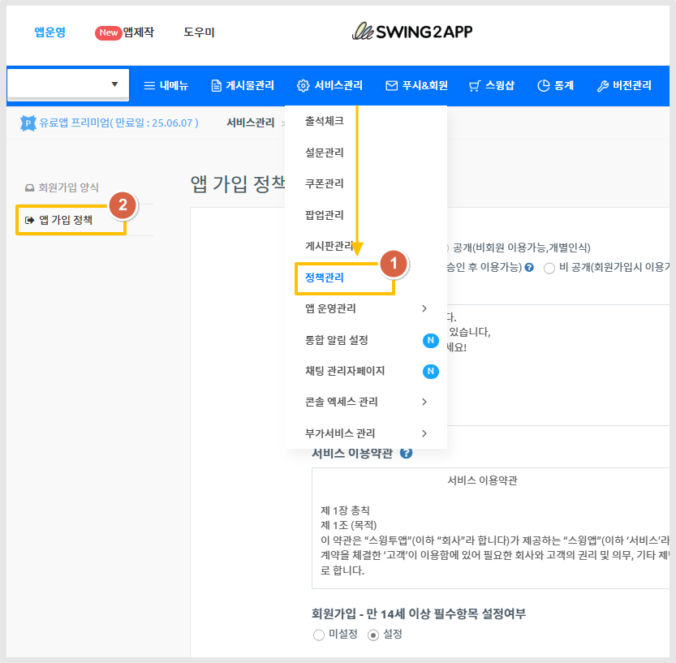
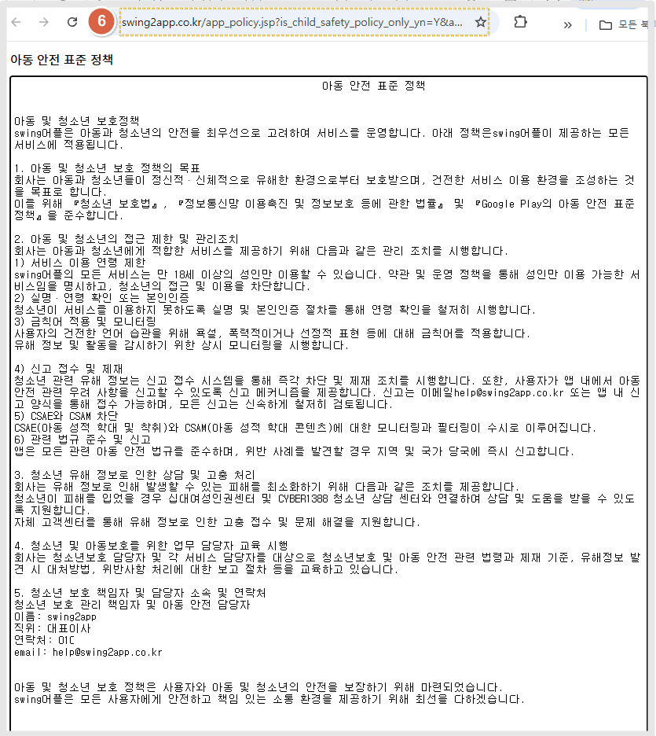
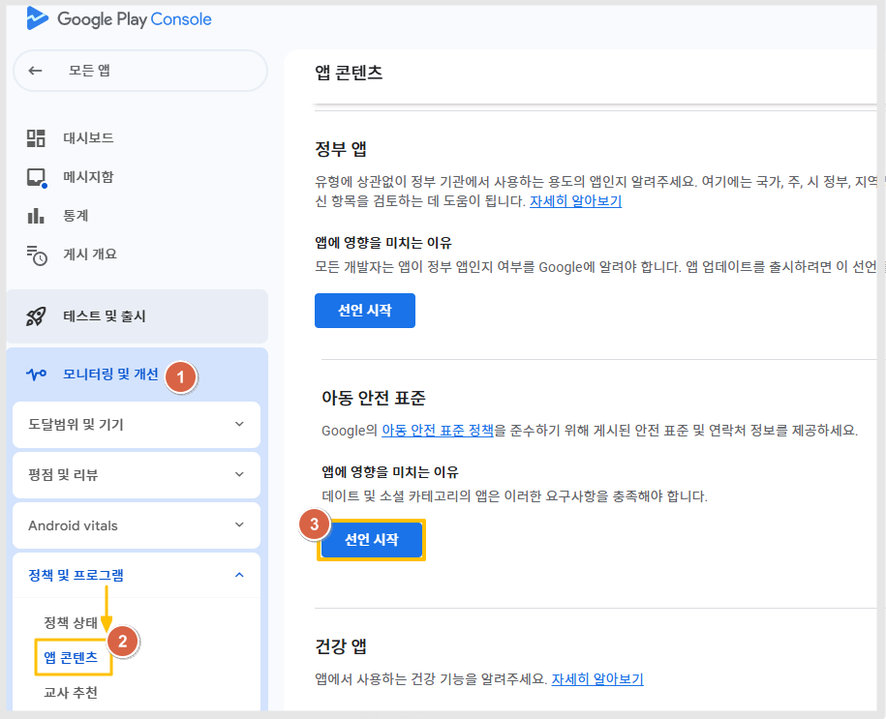
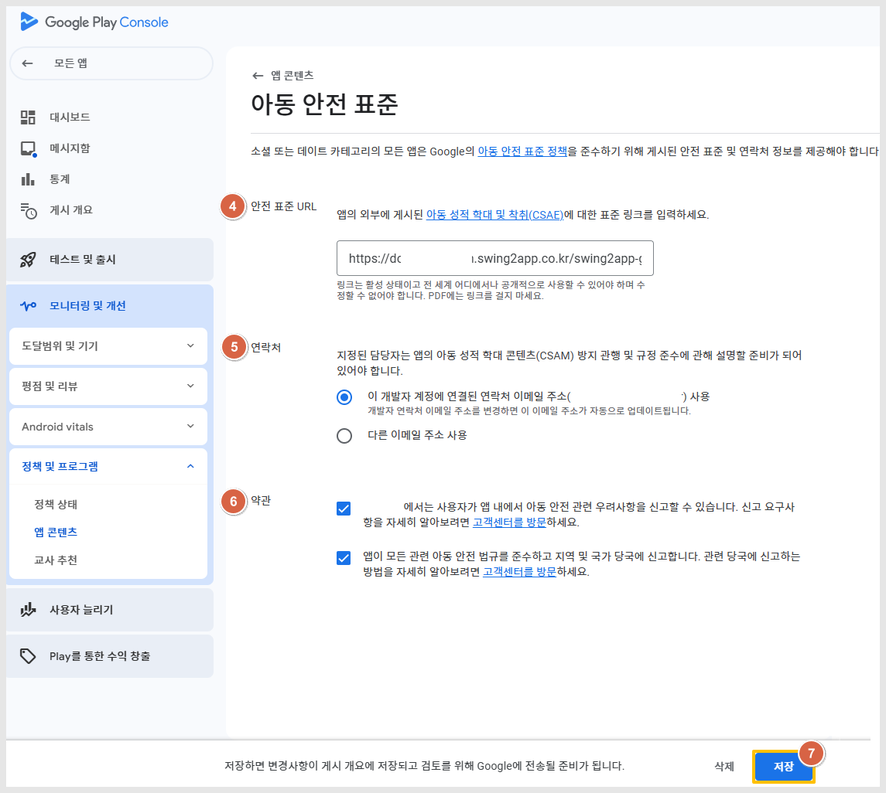

# 아동 안전 표준 정책

**정책 간단 정리**


플레이스토어에 소셜, 데이트 앱으로 제출된 앱은

아동 안전 표준 정책에 체크하고 정책 내용이 기재된 URL링크를 제출해야 합니다.

개인정보 처리방침, 이용 약관 처럼 아동 안전 정책에 대한 약관을 추가 제출해야 합니다.&#x20;

소셜,데이트 앱이 아닌 다른 카테고리 앱은 해당 사항 없습니다.


***

## **1.스윙투앱에서 아동 안전 표준 정책 URL 가져오는 방법**

**스윙투앱 앱운영 화면**

<figure><figcaption></figcaption></figure>

1\) [서비스 관리- 정책관리](https://www.swing2app.co.kr/view/app_setting) 선택

2\) 왼쪽 카테고리에서 \[앱 가입 정책] 선택\

<figure><figcaption></figcaption></figure>

3\) **아동 안전 표준 정책** 추가되었습니다.

기본 세팅은 "미 설정"으로 되어 있고요.&#x20;

내가 제작한 앱의 카테고리가 소셜, 데이트에 해당된다면 "설정"에 체크를 해주세요.&#x20;

4\) 정책 설정하기 버튼 선택

\*저장 버튼과 동일하며, 해당 버튼을 눌러야 내용 저장이 됩니다.&#x20;

5\) 아동 안전 표준 정책 URL 보기 선택

\

<figure><figcaption></figcaption></figure>

페이지 새로 이동하며, 해당 페이지가 아동 안전 표준 정책 URL이 됩니다.

상단 인터넷 주소창의 URL을 복사해서 플레이스토어에 제출하면 됩니다.&#x20;

***

\

## **2.플레이스토어 어디에, 어떻게 제출하면 되나요?**

<figure><figcaption></figcaption></figure>

[**구글 플레이 콘솔**](https://play.google.com/console/developers) 접속 - 앱 선택

1\)모니터링 및 개선 선택

2정책 및 프로그램 : 앱 콘테츠 선택&#x20;

3\)아동 안전 표준 항목을 확인할 수 있습니다. \[선언 시작] 버튼 선택해 주세요.&#x20;

<figure><figcaption></figcaption></figure>

4\) 안전 표준 URL&#x20;

**\*입력창에 스윙투앱에서 제공하는 URL복사해서 붙여 넣어주세요.**

5\) 연락처 메일 주소 체크

6\) 약관 : 2개 설명 모두 체크해 주세요.&#x20;

7\) 저장 버튼 선택하면 완료됩니다.&#x20;


**아동 안전 표준 정책은 모든 앱 개발자가 조치해야 하는 내용 아닙니다.**&#x20;

앱이 **소셜, 데이트** 카테고리에 해당되는 앱만 대상입니다.&#x20;

따라서 그 외 다른 카테고리 앱들은 조치하지 않아도 이용에 전혀 문제가 없습니다.&#x20;


