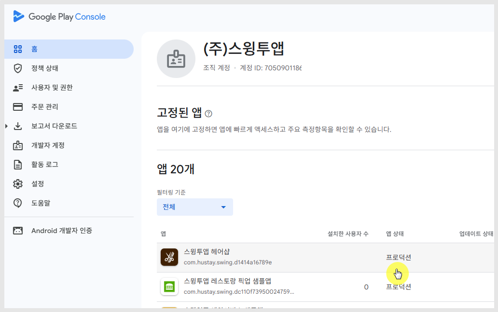
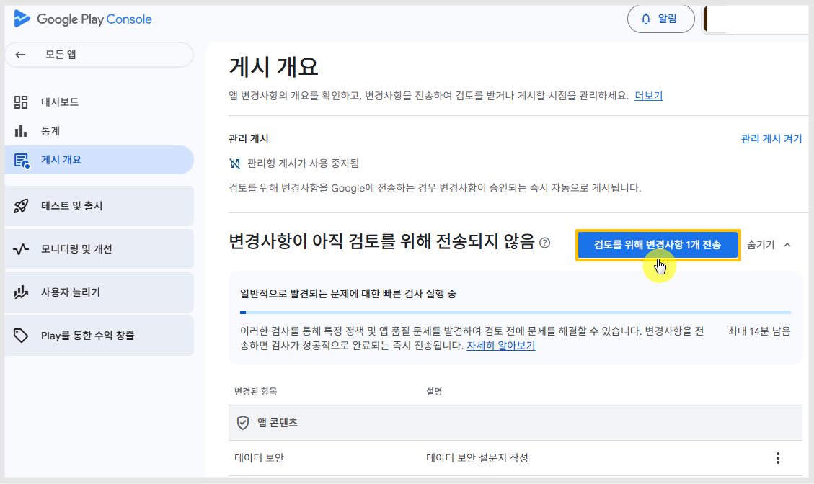

# '데이터 보안 양식 계정 삭제 링크 오류' 해결방법

***

## 1.구글 플레이 정책 위반 내용

구글 플레이 정책 위반: 데이터 보안 양식의 계정 삭제 링크가 잘못됨

<figure><figcaption></figcaption></figure>

정책 메일의 핵심 내용은 아래와 같습니다.

-데이터 보안 양식에서 입력한 계정 삭제 URL이 유효하지 않음

-해당 페이지에서

👉 개발자 / 회사 정보 확인 불가

👉 실제 계정 삭제 방법 확인 불가

즉, 단순히 URL이 열리는 것만으로는 부족하고 정책 기준에 맞는 “계정 삭제 안내 페이지”여야 합니다.

***

## 2.왜 이런 정책 위반이 발생했나요?

#### **1. 형식만 맞춘 ‘가짜 삭제 페이지’**

많은 경우 아래처럼 구성된 페이지가 문제입니다.

* “계정 삭제는 고객센터로 문의하세요”
* 또는 단순 개인정보처리방침 페이지 링크 사용

👉 구글 기준에서는 실제 삭제 방법이 명확하지 않으면 불합격

​

#### **2. 앱/개발자 정보 미표기**

구글 정책 핵심 포인트 삭제 페이지에는 반드시 앱 이름, 개발자 또는 회사명 이 포함되어야 합니다.

하지만 대부분 페이지는

👉 “일반 정책 페이지”라서 이 정보가 없음이 문제가 됩니다.

​

#### **3. 링크는 존재하지만 기능이 없음**

다음도 매우 흔한 문제입니다.

* 삭제 버튼 없음
* 신청 방법 없음
* 이메일 안내 없음

👉 즉, “삭제 가능”만 있고 실행 방법이 없음

​

#### **4. 로그인 없이 접근 불가**

삭제 링크가 회원가입/ 로그인해야만 보이는 경우

→ 구글은 이를 유효하지 않은 링크로 판단

👉로그인 없이 누구나 접근 및 볼 수 있는 페이지여야 합니다.

***

## **3.실제 플레이콘솔 조치방법**

위의 정책 위반 메일을 받으신 개발자분들은 아래 경로로 플레이콘솔에서 수정 후 업데이트 제출해주세요.

<figure><figcaption></figcaption></figure>

[플레이 콘솔](https://play.google.com/console/u/0/developers) 접속 - 정책위반 경고 받은 앱 선택

​

<figure><figcaption></figcaption></figure>

모니터링 및 개선: 정책 및 프로그램 - 앱 콘텐츠 - '데이터 보안' 선언 수정 선택

​

<figure><figcaption></figcaption></figure>

데이터 보안 \[다음] 버튼 클릭

​

<figure><figcaption></figcaption></figure>

데이터 수집 및 보안 항목에서 아래로 내려보시면

"사용자가 계정 및 관련 데이터의 삭제를 요청하는데 사용할 수 있는 링크 추가" 탭 있습니다.

여기에 링크 URL이 들어가 있는데요.

해당 링크를 점검하셔야 합니다.

​

\*스윙투앱에서 제공하는 개인정보 처리방침 링크를 입력하신 분들은 아래 내용만 체크하고 넘어가주세요.

<mark style="color:$success;">**상호명(개발자이름), 앱 이름이 정확히 기재되어 있는지 체크**</mark>

만약 정보가 다르게 입력되어 있다면, 앱 가입 정책 페이지에서 수정하실 수 있습니다.



<figure><figcaption></figcaption></figure>

그 외에 사용자가 직접 운영중인 개인정보 처리방침 링크 제출한 분들은 아래 내용 모두 체크해주세요.

* URL 정상 동작하는지, 페이지 정상적으로 로드 되는지 체크
* 스토어 등록정보에 표시되는 앱 또는 개발자 이름 기재
* 사용자가 계정 삭제를 요청하기 위해 취해야 할 단계를 눈에 띄게 표시
* 삭제되거나 보관되는 데이터 유형 및 추가 보관 기간을 지정

<figure><figcaption></figcaption></figure>

​데이터 보안 답변 항목은 그대로 유지하고 \[다음] 클릭

<figure><figcaption></figcaption></figure>

​\[저장] 탭하고, 게시개요 이동 메시지 \[개요로 이동] 선택

<figure><figcaption></figcaption></figure>

게시개요 화면에서 \[검토를 위해 변경사항 00개 전송] 버튼 선택해주세요.

그럼, 심사가 다시 들어가고 이상이 없으면 정책 해결 메시지 뜨면서 업데이트 승인 완료됩니다.

***

구글 플레이 정책은 점점 더 강화되고 있으며 특히 데이터 보안(Data Safety) 항목은 필수 검증 대상입니다.

이번 이슈는 단순 오류가 아니라 👉 앱 운영 신뢰도와 직결되는 정책입니다.

✔ 아직 적용하지 않으셨다면지금 바로 계정 삭제 페이지를 점검해보세요.

| 
직접 조치가 어려운 경우, 스윙투앱 고객사분들께서는 플레이스토어 업로드 신청만 진행해주시면 됩니다.​

업로드 신청을 주시면 담당팀에서

👉 문제 원인 확인

👉 정책 기준에 맞는 수정

👉 업데이트 및 재심사 대응까지

전 과정을 대신 처리해드립니다.

​

또한 스윙투앱 고객사가 아니더라도 해당 문제로 어려움을 겪고 계시다면 언제든지 문의 주세요.

필요 시 대행 업데이트 및 정책 대응까지 지원해드립니다. 

스윙투앱 Swing2App <a href="http://www.swing2app.co.kr/">http://www.swing2app.co.kr</a>

<a href="https://direct.lc.chat/12036120/">실시간 채팅 상담 링크</a> (운영시간: 평일오전10시~오후5시, 점심12시~1시제외) Contact 이메일 help@swing2app.co.kr | <a href="http://www.swing2app.co.kr/view/service_qa">문의게시판</a> 
 |
| -------------------------------------------------------------------------------------------------------------------------------------------------------------------------------------------------------------------------------------------------------------------------------------------------------------------------------------------------------------------------------------------------------------------------------------------------------------------------------------------------------------------------------------------------------------------------------------------- |


### \[플레이스토어 업로드 신청방법]&#x20;

1\)앱제작 화면으로 이동 후 앱 업데이트를 먼저해주세요.&#x20;

앱 업데이트 가이드: [https://documentation.swing2app.co.kr/manual/v3/update](https://documentation.swing2app.co.kr/manual/v3/update)&#x20;

(이미 앱을 업데이트 하셨다면, 티켓 구매 후 업로드 신청주세요)&#x20;

2\)플레이스토어 업로드티켓을 구매해주세요 (플레이스토어 업로드티켓 20,000원)&#x20;

[http://www.swing2app.co.kr/view/order\_info\_action?product\_id=4 ](http://www.swing2app.co.kr/view/order_info_action?product_id=4)

(티켓이 있다면 바로 3번으로 이동하여, 업로드 신청주세요)

3\)앱운영 – 버전관리 - 앱제작 이력 이동 후 \[플레이스토어 업로드 신청] 버튼 눌러서 업로드 신청주시면 됩니다.

[https://www.swing2app.co.kr/view/app\_work\_history](https://www.swing2app.co.kr/view/app_work_history)


