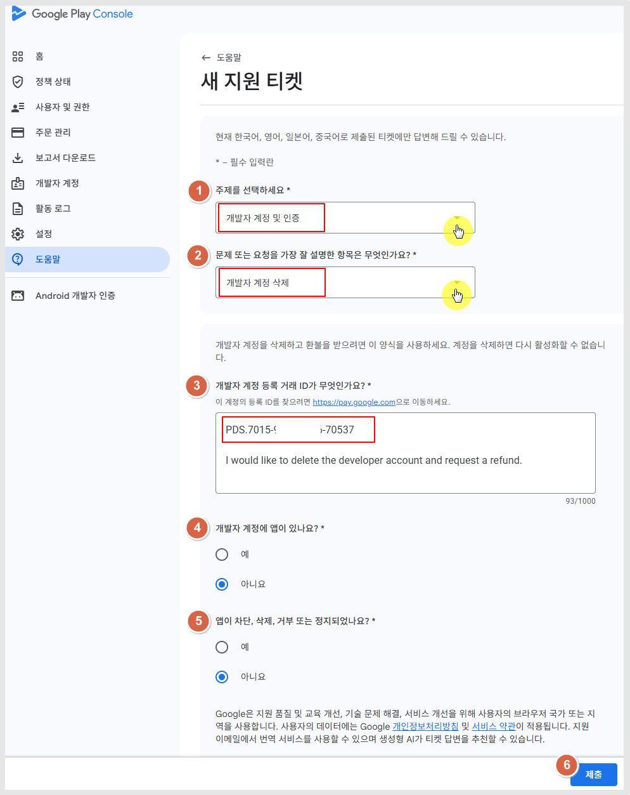
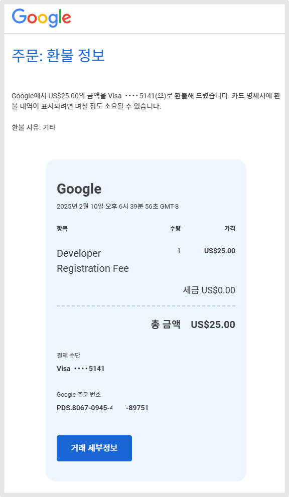
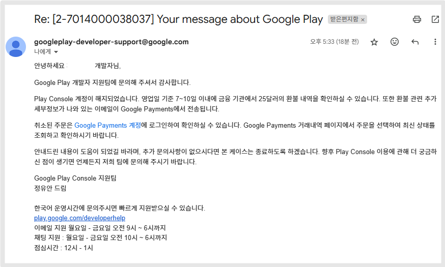

# 구글 플레이 개발자 계정 환불

***

구글 플레이 개발자 계정 비용 환불이 필요하다면, 아래 구글 콘솔 고객센터로 접속하여 지원팀 티켓입력하여신청할 수 있습니다.

현재 한국어, 영어, 중국어, 일본어로 작성된 이메일에만 응답 가능합니다.

또한, 환불 여부는 구글 정책팀에서 결정하기 때문에 신청한다고 모두 다 승인이 되는 것은 아닙니다.

이점 유의하여 신청해주세요!


**환불 주의사항**

1.계정 환불은 **계정 내에 등록된 앱이 없는 경우 신청할 수 있습니다.**&#x20;

<mark style="color:$warning;">**이미 앱이 출시되었거나, 심사 거절, 사용중지 이력이 있는경우는  환불 신청이불가합니다.**</mark> &#x20;

2.**계정 인증은 완료되어 있어야 합니다.**&#x20;

개인 개발자 계정은 본인 신원 확인 인증 완료가 되어 있어야 하며, 조직 개발자 계정은 조직 인증 및 웹사이트 인증 모두 완료되어 있어야 합니다.

3.**계정이 해지되었을 경우 환불 신청이 불가합니다.**&#x20;

정상 상태에서만 신청 가능합니다.&#x20;


***

## 1.도움말 - 지원팀 티켓 만들기

1.구글 플레이 콘솔 접속(개발자 계정 로그인) [https://play.google.com/console/developers](https://play.google.com/console/developers)

<figure><figcaption></figcaption></figure>

대시보드 왼쪽 메뉴 "도움말" 선택

2.**\[+지원 티켓 만들기]** 선택

<figure><figcaption></figcaption></figure>

3.새 지원 티켓 화면에서 주제를 선택해서 내용을 제출합니다.

<figure><figcaption></figcaption></figure>

**1)주제 선택: '개발자 계정 및 인증' 선택**

**2)설명 항목: '개발자 계정 삭제' 선택**

**3)거래 ID 입력**

거래 ID는 PDS.로 시작하는 값으로, 받으신 메일의 주문완료 영수증에 기재되어 있습니다.

혹은 [구글 거래내역](https://pay.google.com/gp/w/home/activity?sctid=1495422863104705)  에서 확인 가능합니다.&#x20;

<mark style="color:$primary;">**\*거래 ID 확인 하는 방법**</mark>

<figure><figcaption></figcaption></figure>

구글 개발자 계정 로그인 후 - 받으신 메일함에 보시면 구매 영수증을 확인할 수 있습니다.

영수증에 구글 주문번호로 확인 가능합니다. <mark style="color:purple;">메일 제목 "Google: 감사합니다" 확인해주세요.</mark>



**4)개발자 계정에는 앱이 없어야 합니다. "아니요" 선택**

**5)앱이 차단, 삭제, 거부, 정지된 상태가 아니어야 합니다. "아니요" 선택**

**6)제출 버튼 선택**

***

## 2.구글정책팀이메일 답신&#x20;

<figure><figcaption></figcaption></figure>

제출된 티켓 접수가 완료 되었다는 메일을 받게 됩니다.

***

## 3.환불 완료

<figure><figcaption></figcaption></figure>

<figure><figcaption></figcaption></figure>

환불 완료가 될 경우 결제된 카드 취소 처리가 되는데요.

메일은 1일\~2일 정도 소요되었습니다. (주말 및 공휴일은 더 지연됩니다)

​

실제 카드사 매출 취소는 해외 결제라서 바로 되지는 않구요.

7일\~14일 정도 소요됩니다.

​

그리고 이렇게 취소된 계정은 환불만 된게 아니라, 해지가 됩니다. 따라서 다시 이용이 불가한 점 유념해주세요.

즉, <mark style="color:$danger;">**환불이 완료된 계정 :메일주소로 다시 구글 개발자 계정을 생성할 수 없습니다.**</mark>



