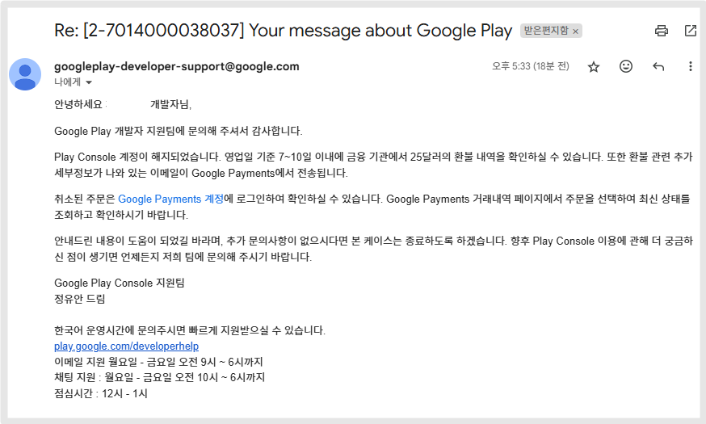

# 구글 플레이 개발자 계정 환불

***

구글 플레이 개발자 계정 비용 환불이 필요하다면, 아래 구글 콘솔 고객센터로 접속하여 양식 기재 후 신청할 수 있습니다.

현재 한국어, 영어, 중국어, 일본어로 작성된 이메일에만 응답 가능합니다.

또한, 환불 여부는 구글 정책팀에서 결정하기 때문에 신청한다고 모두 다 승인이 되는 것은 아닙니다.

이점 유의하여 신청해주세요!


**환불 주의사항**

1.계정 환불은 계정 내에 등록된 앱이 없는 경우 신청할 수 있습니다.&#x20;

이미 앱이 출시되었거나, 심사 거절, 사용중지 이력이 있는경우는  환불 신청이불가합니다. &#x20;

2.계정 인증은 완료되어 있어야 합니다.&#x20;

개인 개발자 계정은 본인 신원 확인 인증 완료가 되어 있어야 하며, 조직 개발자 계정은 조직 인증 및 웹사이트 인증 모두 완료되어 있어야 합니다.

3.계정이 해지되었을 경우 환불 신청이 불가합니다.&#x20;

정상 상태에서만 신청 가능합니다.&#x20;


***

#### [계정 환불 고객센터 바로가기](refund.md#undefined)

#### [https://support.google.com/googleplay/android-developer/contact/dev\_registration?extra.IssueType=cancel\&sjid=14379898998631747419-AP](https://support.google.com/googleplay/android-developer/contact/dev_registration?extra.IssueType=cancel\&sjid=14379898998631747419-AP)

## 1.양식 작성하기

<figure><figcaption></figcaption></figure>

1\)이름, 2)성, 3)이메일주소는

계정으로 로그인시 자동으로 입력되어 보여지니 따로 입력할 필요 없습니다.

4\)내 위치 : 대한민국 선택

5\)개발자 이름

<mark style="color:orange;">\*개발자 이름은 플레이콘솔 메인 홈 화면에서 확인 가능합니다.</mark>

6\)개발자 계정 ID

<mark style="color:orange;">\*계정 ID 역시 플레이콘솔 메인 홈 화면에서 확인 가능합니다.</mark>

<figure><figcaption>
플레이콘솔 -홈화면에서 개발자이름, 개발자 계정ID 확인 가능
</figcaption></figure>



<figure><figcaption></figcaption></figure>

7\)어플리케이션 패키지 이름

<mark style="color:orange;">\*패키지 이름(아이디)는 제작된 앱에 등록된 아이디이며, 앱 등록을 하면 홈화면에서 앱 이름 밑에 확인이 가능합니다.</mark>

<mark style="color:orange;">아직 앱 등록을 하지 않았다면, 스윙투앱 사용자분들은 아래 첨부된 이미지를 통해서 확인 가능합니다.</mark>

8\)개발자 계정 등록에 사용된 거래 ID 입력

<mark style="color:orange;">\*거래 ID는 거래내역 화면에서 확인 가능합니다. 혹은 결제 후 받은 영수증 메일을 보시면 확인 가능합니다.</mark>

<mark style="color:orange;">\* 아래 첨부된 이미지를 확인해주세요.</mark>

9\)항목 선택 "계정을 취소하고 환불받고 싶음" 을 선택해주세요.

10\)무엇을 도와드릴까요? 입력 항목에 자세한 설명을 기재해주세요.

어떤 이유로 환불을 요청하는지 내용을 기재합니다.

11\)제출 버튼 선택하면 완료됩니다.

***

## 2.경로 안내 - 첨부 이미지

**7)어플리케이션 패키지 이름 확인 하는 방법**

<figure><figcaption></figcaption></figure>

[앱운영-서비스관리-앱 운영관리-앱 고급관리](https://www.swing2app.co.kr/view/app_advanced_management_by_android)로 이동합니다.

안드로이드 화면에서 '패키지 아이디' 항목 탭을 복사해서, 붙여넣기 해주세요.

그럼에도, 확인이 어렵다면 스윙투앱 고객센터로 문의주세요.

앱 이름 알려주시면 고객센터에서 즉시 확인해드리겠습니다.

**8)거래 ID 확인 하는 방법**

<figure><figcaption></figcaption></figure>

구글 개발자 계정 로그인 후 - 받으신 메일함에 보시면 구매 영수증을 확인할 수 있습니다.

영수증에 구글 주문번호로 확인 가능합니다

<mark style="color:blue;">메일 제목 "Google: 감사합니다"</mark> 확인해주세요.

***

## 3.이메일 전송 완료&#x20;

<figure><figcaption></figcaption></figure>

환불 접수 완료

***

## 4.환불 완료

<figure><figcaption></figcaption></figure>

<figure><figcaption></figcaption></figure>

환불 완료가 될 경우 결제된 카드 취소 처리가 되는데요.

메일은 1일\~2일 정도 소요되었습니다. (주말 및 공휴일은 더 지연됩니다)

​

실제 카드사 매출 취소는 해외 결제라서 바로 되지는 않구요.

7일\~14일 정도 소요됩니다.

​

그리고 이렇게 취소된 계정은 환불만 된게 아니라, 해지가 됩니다. 따라서 다시 이용이 불가한 점 유념해주세요.

즉, 환불이 완료된 계정 :메일주소로 다시 구글 개발자 계정을 생성할 수 없습니다.



